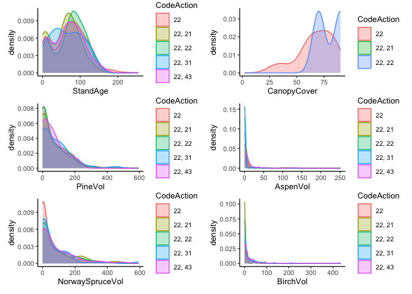
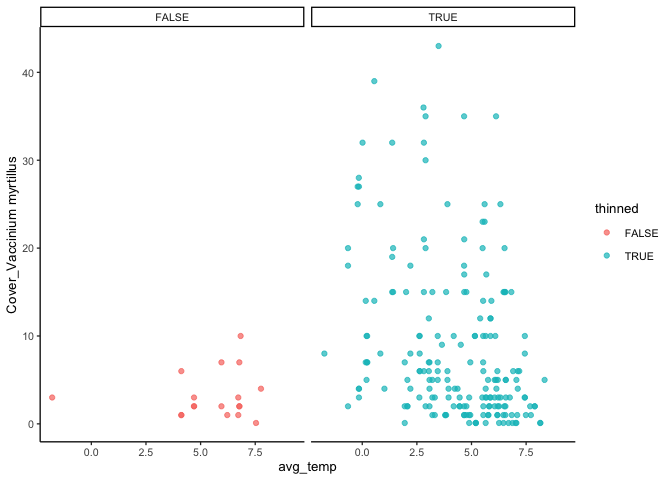
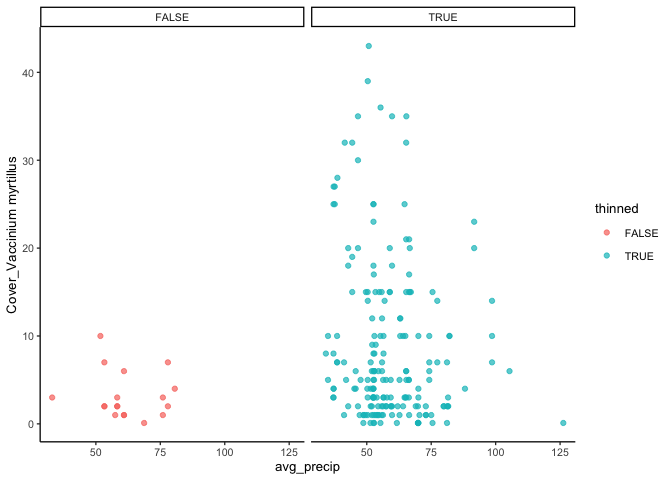

Find treatment groups
================
eleanorjackson
19 May, 2023

We need to identify treatment and control groups from the Swedish NFI
data. For example, thinned vs non-thinned stands. Ideally identify
stands with similar management histories/thinning histories, but vary in
whether they have been recently thinned at a particular stage.

The [Swedish NFI
handbook](https://www.slu.se/globalassets/ew/org/centrb/rt/dokument/faltinst/nfi_fieldwork_instructions_eng.pdf)
has details about how the data was collected.

``` r
library("tidyverse")
library("here")
```

``` r
read_delim(here::here("data", "raw", "nfi_plots_sp.txt")) -> plot_data

read_delim(here::here("data", "raw", "nfi_f_mactions.txt")) -> management_data

read_delim(here::here("data", "raw", "nfi_climat.txt")) -> climate_data
```

## Check what the different IDs mean

Tord has told us that `UniqueID` is the unique id for each plot x year
sampling event. `PlotNr` looks like it could be a unique plot id. We can
check this by seeing if there are approx 3 years per plot (each plot
should have been sampled approximatley 3 times).

``` r
plot_data %>% 
  summarise(n_years = n_distinct(Year), .by = "PlotNr")
```

    ## # A tibble: 14 × 2
    ##    PlotNr n_years
    ##     <dbl>   <int>
    ##  1    112      28
    ##  2    312      28
    ##  3    412      28
    ##  4    212      28
    ##  5    110      29
    ##  6    310      29
    ##  7    410      29
    ##  8    210      29
    ##  9    108      28
    ## 10    208      28
    ## 11    308      28
    ## 12    408      28
    ## 13    103      28
    ## 14    303      28

Ok, there are 29 or 28 entries per `PlotNr` so that can’t be a unique
plot ID, let’s try `ID`

``` r
plot_data %>% 
  summarise(n_years = n_distinct(Year), .by = "ID")
```

    ## # A tibble: 2,936 × 2
    ##         ID n_years
    ##      <dbl>   <int>
    ##  1 8.32e16       3
    ##  2 8.32e16       3
    ##  3 8.32e16       3
    ##  4 8.32e16       3
    ##  5 8.32e16       3
    ##  6 8.32e16       3
    ##  7 8.32e16       3
    ##  8 8.32e16       3
    ##  9 8.32e16       3
    ## 10 8.32e16       3
    ## # ℹ 2,926 more rows

Yep, that looks better. 3 years per `ID`. Maybe we could use years to
split the data up into test and train.

Let’s check that we only have 1 year for each of the `uniqueID` values.

``` r
plot_data %>% 
  summarise(n_years = n_distinct(Year), .by = "uniqueID")
```

    ## # A tibble: 20,189 × 2
    ##    uniqueID                             n_years
    ##    <chr>                                  <int>
    ##  1 98038783-C8A5-4662-BA6A-E02FEBAD36FD       1
    ##  2 CE021632-D82F-496E-B9EA-0830FBB3057B       1
    ##  3 C97234A5-ACBD-40EB-B1CC-CD2D8AAA3CF3       1
    ##  4 6D4B49EF-080C-4D72-BAA2-14E236ED9974       1
    ##  5 B5F0BD22-C7C4-401E-9CDF-2713B347E902       1
    ##  6 3542F0F9-327C-464D-B840-5359940CCB88       1
    ##  7 6AF20BB4-ABE0-4A0A-BCBE-5AACD439E13D       1
    ##  8 6850C4EB-6D19-4094-BA71-6348A97027D9       1
    ##  9 35405075-7E4A-4C4D-8070-B9202B4DACF2       1
    ## 10 058CF39D-729D-4965-97D9-D2365A37F23E       1
    ## # ℹ 20,179 more rows

Sweet, all good!

## Compare plots with similar management histories

We want our control and treatment groups to be as similar as possible
except in what the treatment actually is. I might just go really broad
for now and use ‘land classes’ to pick plots that are relatively
similar.

International land use classes:

1.  Forest
2.  Other wooded land
3.  Bare impediment

For snapshot sampling we can use the first year from the permanent plots
and all of the temporary plots (which are only sampled once). Lets
filter for that too.

``` r
# filter data for only land class 1 and 1st year of data
plot_data %>% 
  filter(InternationalCodeLandUse == 1) %>% 
  group_by(ID) %>% 
  slice_min(Year) %>%
  ungroup() %>% 
  rename(UniqueID = uniqueID) -> filtered_plots
```

We need to find plots with similar management histories. Let’s bring in
the management data.

``` r
# filter management data for only 1st survey year
# and join to plot data by the plot x yr variable
management_data %>% 
  group_by(ID) %>% 
  slice_min(Year) %>%
  ungroup() %>%
  mutate(UniqueID = gsub("}", "", UniqueID)) %>% 
  mutate(UniqueID = gsub("\\{", "", UniqueID)) %>% 
  left_join(filtered_plots) -> plt_man_data
```

    ## Joining with `by = join_by(UniqueID, ID, Year, Trakt)`

Ok, so the `TimeAction` variable gives us information about when the
management action happened. It’s in an awkward format so let’s fix that.

``` r
plt_man_data %>% 
  mutate(TimeAction = str_remove(TimeAction, "\xc5r/s\xe4song ")) %>%
  mutate(MedYrAgo = case_when(TimeAction == "0" ~ 0,
                              TimeAction == "1" ~ 1,
                              TimeAction == "2" ~ 2,
                              TimeAction == "3-5" ~ 4,
                              TimeAction == "6-10" ~ 8,
                              TimeAction == "11-25" ~ 18,
                              TimeAction == "26+" ~ 26)) -> man_data_time
```

There might be common patterns of management, e.g. they might often do
some sapling clearing in the first year followed by thinning in the 10th
year.

If we order the actions by when they happened for each plot (using the
`MedYrAgo` variable we created above), and concatenate into one column
we can look for common patterns.

``` r
man_data_time %>% 
  group_by(ID) %>% 
  arrange(MedYrAgo, .by_group = TRUE) %>%
  summarise(CodeAction = str_c(CodeAction, collapse = ", "), 
            .groups = "drop") ->  man_hists

man_hists %>%   
  summarise(n = n(), .by = CodeAction) %>% 
  arrange(-n) 
```

    ## # A tibble: 1,065 × 2
    ##    CodeAction     n
    ##    <chr>      <int>
    ##  1 22           325
    ##  2 <NA>         271
    ##  3 43           180
    ##  4 31           164
    ##  5 21           126
    ##  6 22, 22        78
    ##  7 11            76
    ##  8 33            44
    ##  9 31, 22        36
    ## 10 43, 22        33
    ## # ℹ 1,055 more rows

We’re looking for plots with a similar history but differences in their
more recent management. 22 seems quite common and I can see some
patterns of 22 followed by: 22 again (78 plots), 43 (24 plots), 21 (21
plots) and 31 (20 plots). 31 and 43 could be good candidates too.

``` r
filtered_plots %>% 
  inner_join(man_hists) %>% 
  filter(grepl("^22", CodeAction)) %>% 
  filter(CodeAction == "22" |
           CodeAction == "22, 22" |
           CodeAction == "22, 43" |
           CodeAction == "22, 21" |
           CodeAction == "22, 31") %>% 
  ggplot(aes(x = `Cover_Vaccinium myrtillus`, colour = CodeAction, fill = CodeAction)) +
  geom_density(alpha = 0.3)
```

    ## Joining with `by = join_by(ID)`

    ## Warning: Removed 124 rows containing non-finite values (`stat_density()`).

<!-- -->

Let’s make a plotting function and try this out for a few different
variables.

``` r
plot_man_hist <- function(data, plot_var) {
  data %>% 
  filter(grepl("^22", CodeAction)) %>% 
  filter(CodeAction == "22" |
           CodeAction == "22, 22" |
           CodeAction == "22, 43" |
           CodeAction == "22, 21" |
           CodeAction == "22, 31") -> filtered_dat 
  ggplot(filtered_dat, aes(x = .data[[plot_var]], colour = CodeAction, fill = CodeAction)) +
  geom_density(alpha = 0.3)
}

filtered_plots %>% 
  inner_join(man_hists) -> plots_hist_data
```

    ## Joining with `by = join_by(ID)`

``` r
var_list <- list("StandAge", "CanopyCover", "PineVol", "AspenVol",
                 "NorwaySpruceVol", "BirchVol")

plot_list <- lapply(var_list, plot_man_hist, data = plots_hist_data)

patchwork::wrap_plots(plot_list) + 
  patchwork::plot_layout(ncol = 2)
```

    ## Warning: Removed 847 rows containing non-finite values (`stat_density()`).

    ## Warning: Groups with fewer than two data points have been dropped.

    ## Warning in max(ids, na.rm = TRUE): no non-missing arguments to max; returning
    ## -Inf

<!-- -->

## Compare 22 (“other thinning”) to non-thinned plots

Let’s try to group plots into thinned and non-thinned.

``` r
paste0(c(20:23, 10:13, 30:33, 40, 43:46)) %>% 
  str_c(collapse = "|") -> all_thin

# get list of plots that have the 22 management action and no others
man_hists %>% 
  filter(CodeAction == "22") %>%  
  pull(ID) -> plots_22
```

If thinning is recorded for a plot at any time point I’m classing it as
thinned.

``` r
filtered_plots %>% 
  filter(ID %in% plots_22) -> thin_plots_22

man_hists %>% 
  filter(
      str_detect(CodeAction, all_thin, negate = TRUE)
  ) -> no_thin_plots
  
filtered_plots %>% 
  mutate(thinned = case_when(
    ID %in% plots_22 ~ TRUE,
    ID %in% no_thin_plots$ID ~ FALSE,
    .default = NA)) %>% 
  drop_na(thinned) -> thin_no_thin
```

I’m assuming that NAs mean we don’t have management data for these plots
rather than not having any management happen to them. I think that’s
right… Have dropped them here but it takes nrows down from 6,730 to 587.
That’s a lot of missing data!?

There are 290 thinned plots (action 22 only) and 50 plots which have not
been thinned at all.

Compare a few variables in plots with and without thinning.

``` r
plot_man_thin <- function(data, plot_var) {
  thin_no_thin %>% 
  ggplot(aes(x = .data[[plot_var]], colour = thinned, fill = thinned)) +
  geom_density(alpha = 0.3)
}

var_list_2 <- list("StandAge", "StandHeight", "CanopyCover", "PineVol", 
                 "NorwaySpruceVol", "BirchVol", "Cover_Vaccinium vitis-idaea", 
                 "Cover_Vaccinium myrtillus")

plot_list_2 <- lapply(var_list_2, plot_man_thin, data = thin_no_thin)

patchwork::wrap_plots(plot_list_2) + 
  patchwork::plot_layout(guides = 'collect')
```

    ## Warning: Removed 566 rows containing non-finite values (`stat_density()`).

    ## Warning: Removed 28 rows containing non-finite values (`stat_density()`).

    ## Warning: Removed 92 rows containing non-finite values (`stat_density()`).

<!-- -->

## Climate data

Climate data is by month so I’ll take an average temp and precipitation
per plot per year.

``` r
climate_data %>% 
  group_by(ID, year) %>% 
  summarise(avg_temp = mean(Temperature),
            avg_precip = mean(Precipitation)) %>% 
  ungroup() %>% 
  rename(Year = year) %>% 
  inner_join(thin_no_thin, by = c("ID", "Year")) -> thin_no_thin_cl
```

    ## `summarise()` has grouped output by 'ID'. You can override using the `.groups`
    ## argument.

First looking at temperature

``` r
ggplot(thin_no_thin_cl, aes(x = avg_temp, y = `Cover_Vaccinium myrtillus`, 
                            colour = thinned)) +
  geom_point(alpha = 0.7) +
  facet_grid(~thinned)
```

    ## Warning: Removed 37 rows containing missing values (`geom_point()`).

<!-- -->

Now precipitation

``` r
ggplot(thin_no_thin_cl, aes(x = avg_precip, y = `Cover_Vaccinium myrtillus`, 
                            colour = thinned)) +
  geom_point(alpha = 0.7) +
  facet_grid(~thinned)
```

    ## Warning: Removed 37 rows containing missing values (`geom_point()`).

<!-- -->

It feels like the no-thin sample size is too small to see any patterns..
