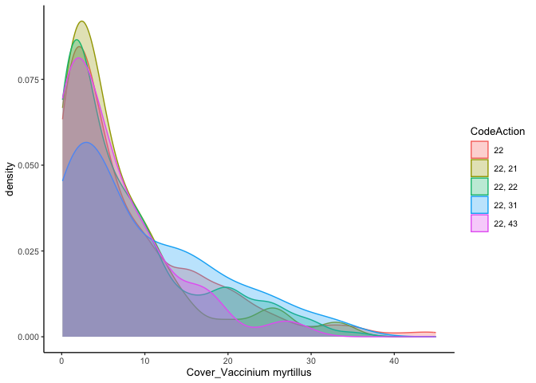

Find treatment groups
================
eleanorjackson
16 May, 2023

We need to identify treatment and control groups from the Swedish NFI
data. For example, thinned vs non-thinned stands. Ideally identify
stands with similar management histories/thinning histories, but vary in
whether they have been recently thinned at a particular stage.

The [Swedish NFI
handbook](https://www.slu.se/globalassets/ew/org/centrb/rt/dokument/faltinst/nfi_fieldwork_instructions_eng.pdf)
has details about how the data was collected.

``` r
library("tidyverse")
library("here")
```

``` r
read_delim(here::here("data", "raw", "nfi_plots_sp.txt")) -> plot_data

read_delim(here::here("data", "raw", "nfi_f_mactions.txt")) -> management_data

read_delim(here::here("data", "raw", "nfi_climat.txt")) -> climate_data
```

## Check what the different IDs mean

Tord has told us that `UniqueID` is the unique id for each plot x year
sampling event. `PlotNr` looks like it could be a unique plot id. We can
check this by seeing if there are approx 3 years per plot (each plot
should have been sampled approximatley 3 times).

``` r
plot_data %>% 
  summarise(n_years = n_distinct(Year), .by = "PlotNr")
```

    ## # A tibble: 14 × 2
    ##    PlotNr n_years
    ##     <dbl>   <int>
    ##  1    112      28
    ##  2    312      28
    ##  3    412      28
    ##  4    212      28
    ##  5    110      29
    ##  6    310      29
    ##  7    410      29
    ##  8    210      29
    ##  9    108      28
    ## 10    208      28
    ## 11    308      28
    ## 12    408      28
    ## 13    103      28
    ## 14    303      28

Ok, there are 29 or 28 entries per PlotNr so that can’t be a unique plot
ID, let’s try `ID`

``` r
plot_data %>% 
  summarise(n_years = n_distinct(Year), .by = "ID")
```

    ## # A tibble: 2,936 × 2
    ##         ID n_years
    ##      <dbl>   <int>
    ##  1 8.32e16       3
    ##  2 8.32e16       3
    ##  3 8.32e16       3
    ##  4 8.32e16       3
    ##  5 8.32e16       3
    ##  6 8.32e16       3
    ##  7 8.32e16       3
    ##  8 8.32e16       3
    ##  9 8.32e16       3
    ## 10 8.32e16       3
    ## # ℹ 2,926 more rows

Yep, that looks better. 3 years per ID. Maybe we could use years to
split the data up into test and train.

Let’s check that we only have 1 year for each of the `uniqueID` values.

``` r
plot_data %>% 
  summarise(n_years = n_distinct(Year), .by = "uniqueID")
```

    ## # A tibble: 20,189 × 2
    ##    uniqueID                             n_years
    ##    <chr>                                  <int>
    ##  1 98038783-C8A5-4662-BA6A-E02FEBAD36FD       1
    ##  2 CE021632-D82F-496E-B9EA-0830FBB3057B       1
    ##  3 C97234A5-ACBD-40EB-B1CC-CD2D8AAA3CF3       1
    ##  4 6D4B49EF-080C-4D72-BAA2-14E236ED9974       1
    ##  5 B5F0BD22-C7C4-401E-9CDF-2713B347E902       1
    ##  6 3542F0F9-327C-464D-B840-5359940CCB88       1
    ##  7 6AF20BB4-ABE0-4A0A-BCBE-5AACD439E13D       1
    ##  8 6850C4EB-6D19-4094-BA71-6348A97027D9       1
    ##  9 35405075-7E4A-4C4D-8070-B9202B4DACF2       1
    ## 10 058CF39D-729D-4965-97D9-D2365A37F23E       1
    ## # ℹ 20,179 more rows

Sweet, all good!

## Only look at similar plots

We want our control and treatment groups to be as similar as possible
except in what the treatment actually is. I might just go really broad
for now and use ‘land classes’ to pick plots that are relatively
similar.

International land use classes:

1.  Forest
2.  Other wooded land
3.  Bare impediment

We know we want permanent plots rather than temporary ones so we have
multiple years of data - lets filter for that too.

``` r
# filter data for only land class 1 and permanent plots

plot_data %>% 
  summarise(n_years = n_distinct(Year), .by = "ID") %>% 
  filter(n_years == 3) -> permanent_plots

plot_data %>% 
  filter(InternationalCodeLandUse == 1 & ID %in% permanent_plots$ID) %>% 
  rename(UniqueID = uniqueID) -> filtered_plots
```

``` r
# join with management data

management_data %>% 
  mutate(UniqueID = gsub("}", "", UniqueID)) %>% 
  mutate(UniqueID = gsub("\\{", "", UniqueID), fixed = TRUE) %>% 
  inner_join(filtered_plots) -> plt_man_data
```

    ## Joining with `by = join_by(UniqueID, ID, Year, Trakt)`

## Thinning

All management actions performed within the last 25 years are
registered.

Let’s try to group plots into thinned and non-thinned.

``` r
as.list(20:23) -> thinning
as.list(10:13) -> felling
as.list(30:33) -> cleaning
as.list(40, 43:46) -> fell_other

as.list(20:23, 10:13, 30:33, 40, 43:46) -> all_thin
```

If thinning is recorded for a plot at any time point I’m classing it as
thinned.

``` r
plt_man_data %>% 
  group_by(ID, CodeAction) %>% 
  summarise(.groups = "drop") %>% 
  filter(CodeAction %in% all_thin) -> thin_plots


plt_man_data %>% 
  group_by(ID, CodeAction) %>% 
  summarise(.groups = "drop") %>% 
  filter(!CodeAction %in% all_thin) -> no_thin_plots
  
plt_man_data %>% 
  mutate(thinned = case_when(
    ID %in% thin_plots$ID ~ TRUE,
    ID %in% no_thin_plots$ID ~ FALSE,
    .default = NA)) -> thin_no_thin
```

There are 1752 thinned plots and 2205 plots which have not been thinned.

Plot to compare Vaccinium myrtillus cover in plots with and without
thinning across all years.

``` r
thin_no_thin %>% 
  distinct(ID, Year, `Cover_Vaccinium myrtillus`, thinned) %>% 
  ggplot(aes(x = `Cover_Vaccinium myrtillus`, colour = thinned, fill = thinned)) +
  geom_density(alpha = 0.3)
```

    ## Warning: Removed 1347 rows containing non-finite values (`stat_density()`).

<!-- -->

Cover of Vaccinium myrtillus is similar in thinned and non thinned
plots, maybe the median a bit higher in non-thinned?
