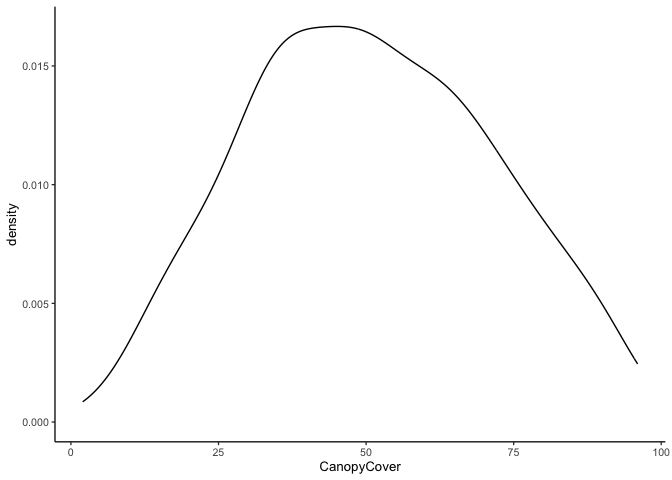
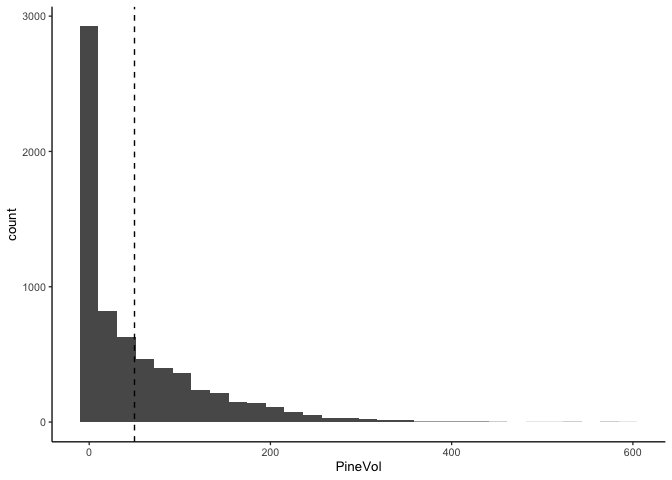
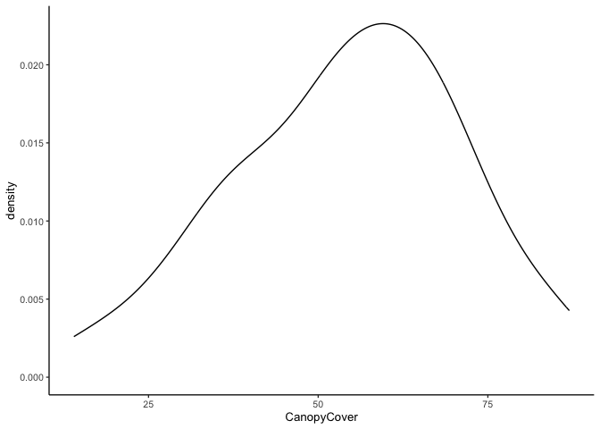

Exploring canopy cover
================
eleanorjackson
24 May, 2023

``` r
library("tidyverse")
library("here")
```

Since splitting plots into thinning/no-thinning groups doesn’t seem to
give us very good sample sizes, we are investigating using a continuous
variable for our treatment effects.

I’m going to take a quick look at canopy cover as one option.

``` r
read_delim(here::here("data", "raw", "nfi_plots_sp.txt")) -> plot_data
```

``` r
# filter data for only land class 1 and 1st year of data
plot_data %>% 
  filter(InternationalCodeLandUse == 1) %>% 
  group_by(ID) %>% 
  slice_min(Year) %>%
  ungroup() %>% 
  rename(UniqueID = uniqueID) -> filtered_plots
```

``` r
filtered_plots %>% 
  ggplot(aes(x = CanopyCover)) +
  geom_density()
```

    ## Warning: Removed 6454 rows containing non-finite values (`stat_density()`).

<!-- -->

## Pine dominated forests

We still want to compare forests that are fairly similar so let’s look
at pine-dominated forests only.

``` r
filtered_plots %>% 
  ggplot(aes(x = PineVol)) +
  geom_histogram() +
  geom_vline(xintercept = 50, linetype = 2)
```

    ## `stat_bin()` using `bins = 30`. Pick better value with `binwidth`.

<!-- -->

``` r
filtered_plots %>% 
  filter(PineVol > 50) %>% 
  n_distinct("ID")
```

    ## [1] 2396

I’m don’t know how volume of Pine is recorded / estimated? But let’s say
that plots with `PineVol` greater than 50 are Pine dominated forests.
That would give us a sample size of 2,396 plots to work with.

``` r
filtered_plots %>% 
  filter(PineVol > 50) %>% 
  ggplot(aes(x = CanopyCover)) +
  geom_density()
```

    ## Warning: Removed 2339 rows containing non-finite values (`stat_density()`).

<!-- -->

In Pine dominated forests the canopy cover distribution is shifted a
little to the left.
