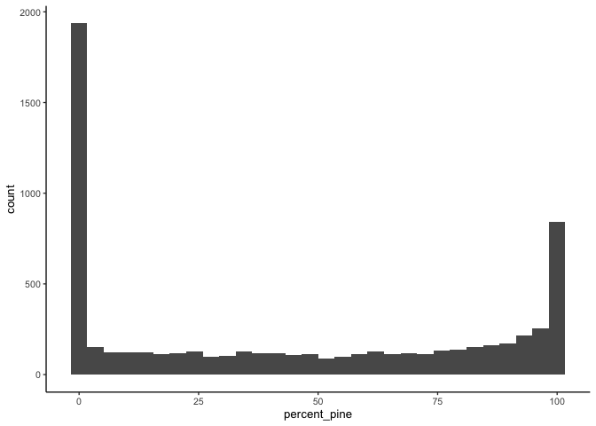
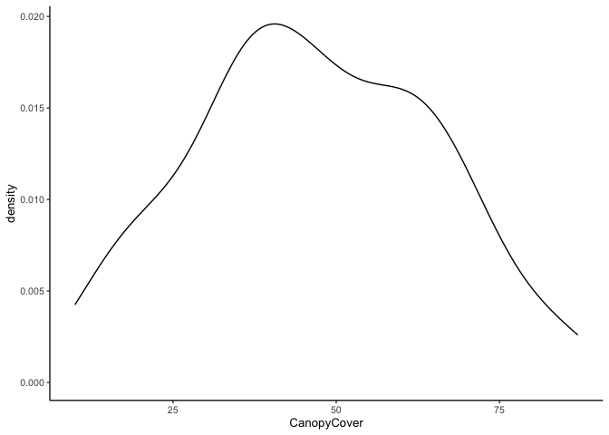
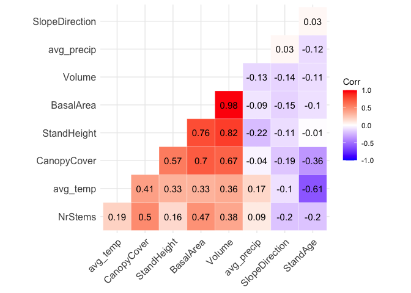
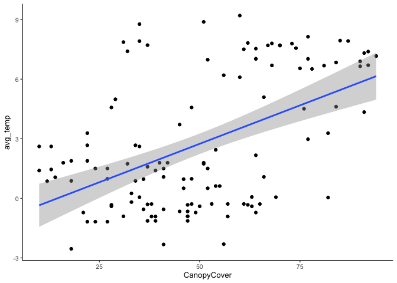
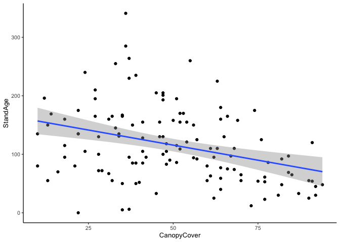
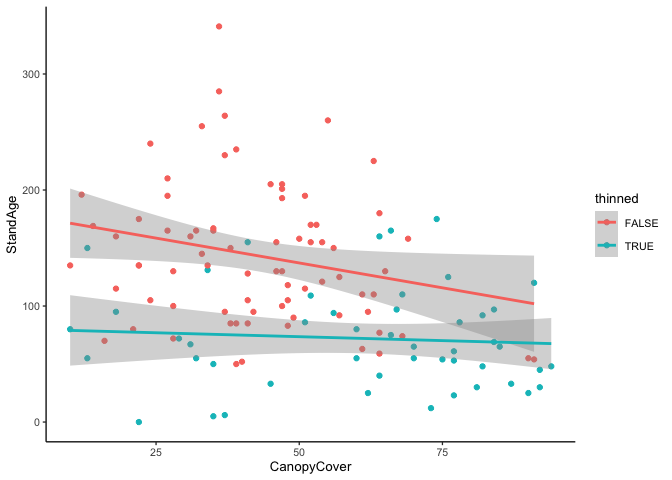
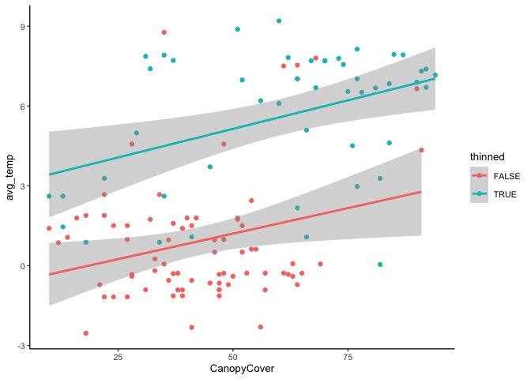

Exploring canopy cover
================
eleanorjackson
26 May, 2023

``` r
library("tidyverse")
library("here")
library("ggcorrplot")
```

Since splitting plots into thinning/no-thinning groups doesn’t seem to
give us very good sample sizes, we are investigating using a continuous
variable for our treatment effects.

I’m going to take a quick look at canopy cover as one option.

``` r
read_delim(here::here("data", "raw", "nfi_plots_sp.txt")) -> plot_data

read_delim(here::here("data", "raw", "nfi_f_mactions.txt")) -> management_data

read_delim(here::here("data", "raw", "nfi_climat.txt")) -> climate_data
```

``` r
# filter data for only land class 1 and 1st year of data
plot_data %>% 
  filter(InternationalCodeLandUse == 1) %>% 
  group_by(ID) %>% 
  slice_min(Year) %>%
  ungroup() %>% 
  rename(UniqueID = uniqueID) -> filtered_plots
```

``` r
filtered_plots %>% 
  ggplot(aes(x = CanopyCover)) +
  geom_density()
```

    ## Warning: Removed 6454 rows containing non-finite values (`stat_density()`).

<!-- -->

## Pine dominated forests

We still want to compare forests that are fairly similar so let’s look
at pine-dominated forests only.

``` r
filtered_plots %>% 
  ggplot(aes(x = PineVol)) +
  geom_histogram() 
```

    ## `stat_bin()` using `bins = 30`. Pick better value with `binwidth`.

<!-- -->

Calculate volume of pine as a percentage.

``` r
filtered_plots %>%
  rowwise() %>% 
  mutate(percent_pine = (PineVol / Volume)*100) -> pine_plots
  
pine_plots %>% 
  ggplot(aes(x = percent_pine)) +
  geom_histogram() 
```

    ## `stat_bin()` using `bins = 30`. Pick better value with `binwidth`.

    ## Warning: Removed 296 rows containing non-finite values (`stat_bin()`).

<!-- -->

``` r
pine_plots %>% 
  filter(percent_pine >= 50) %>% 
  n_distinct("ID")
```

    ## [1] 2845

Let’s say that plots with greater than 50% volume Pine are Pine
dominated forests. That would give us a sample size of 2,845 plots to
work with.

``` r
pine_plots %>% 
  filter(percent_pine > 50) %>% 
  ggplot(aes(x = CanopyCover)) +
  geom_density()
```

    ## Warning: Removed 2744 rows containing non-finite values (`stat_density()`).

<!-- -->

## Correlations

How does canopy cover correlate with other variables?

``` r
climate_data %>% 
  group_by(ID, year) %>% 
  summarise(avg_temp = mean(Temperature),
            avg_precip = mean(Precipitation)) %>% 
  ungroup() %>% 
  rename(Year = year) %>% 
  inner_join(pine_plots, by = c("ID", "Year")) -> pine_plots_cl
```

    ## `summarise()` has grouped output by 'ID'. You can override using the `.groups`
    ## argument.

``` r
pine_plots_cl %>% 
  drop_na(CanopyCover) %>% 
  select(CanopyCover, BasalArea, Volume, NrStems, SlopeDirection, StandAge, 
         StandHeight, avg_temp, avg_precip) %>% 
  mutate_if(is.numeric, round) %>% 
  cor(method = "spearman", use = "pairwise.complete.obs") -> cor_mat

ggcorrplot(cor_mat, hc.order = TRUE, type = "lower",
     outline.col = "white", lab = TRUE)
```

<!-- -->

Canopy cover correlates positively with `NrStems`, `StandHeight`,
`BasalArea` and `Volume`, which makes sense as they’re all measuring
similar things.

The correlations with `StandAge` and `avg_temp` might be worth looking
into a fit further.

``` r
pine_plots_cl %>% 
  ggplot(aes(x = CanopyCover, y = avg_temp)) +
  geom_point() +
  geom_smooth(method = "lm")
```

    ## `geom_smooth()` using formula = 'y ~ x'

<!-- -->

Looks like we almost have 2 clusters here, maybe surveys taken in the
same year/adjacent years?

``` r
pine_plots_cl %>% 
  ggplot(aes(x = CanopyCover, y = StandAge)) +
  geom_point() +
  geom_smooth(method = "lm")
```

    ## `geom_smooth()` using formula = 'y ~ x'

<!-- -->

This one seems counter-intuitive to me?

# thinning

``` r
# filter management data for only 1st survey year
# and join to plot data by the plot x yr variable
management_data %>% 
  group_by(ID) %>% 
  slice_min(Year) %>%
  ungroup() -> man_data
```

``` r
# get timing of management action
man_data %>% 
  mutate(TimeAction = str_remove(TimeAction, "\xc5r/s\xe4song ")) %>%
  mutate(MedYrAgo = case_when(TimeAction == "0" ~ 0,
                              TimeAction == "1" ~ 1,
                              TimeAction == "2" ~ 2,
                              TimeAction == "3-5" ~ 4,
                              TimeAction == "6-10" ~ 8,
                              TimeAction == "11-25" ~ 18,
                              TimeAction == "26+" ~ 26)) -> man_data_time
```

``` r
# order and concatenate 
man_data_time %>% 
  group_by(ID) %>% 
  arrange(MedYrAgo, .by_group = TRUE) %>%
  summarise(CodeAction = str_c(CodeAction, collapse = ", "), 
            .groups = "drop") ->  man_hists
```

``` r
paste0(c(20:23, 10:13, 30:33, 40, 43:46)) %>% 
  str_c(collapse = "|") -> all_thin
```

``` r
man_hists %>% 
  filter(
      str_detect(CodeAction, all_thin)
  ) -> thin_plots
  
pine_plots_cl %>% 
  mutate(thinned = case_when(
    ID %in% thin_plots$ID ~ TRUE,
    .default = FALSE)) %>% 
  drop_na(thinned) -> thin_pine
```

``` r
thin_pine %>% 
  ggplot(aes(x = CanopyCover, y = StandAge, colour = thinned)) +
  geom_point() +
  geom_smooth(method = "lm")
```

    ## `geom_smooth()` using formula = 'y ~ x'

<!-- -->

``` r
thin_pine %>% 
  ggplot(aes(x = CanopyCover, y = avg_temp, colour = thinned)) +
  geom_point() +
  geom_smooth(method = "lm")
```

    ## `geom_smooth()` using formula = 'y ~ x'

<!-- -->

Wow that’s cool, thinned plots are warmer!
