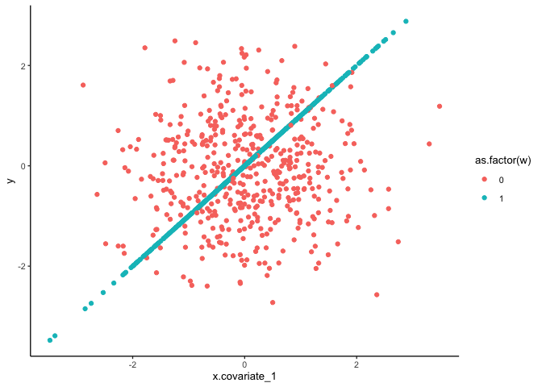
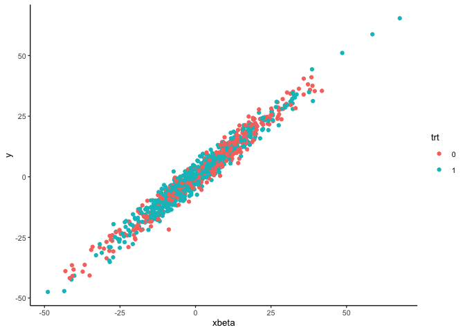
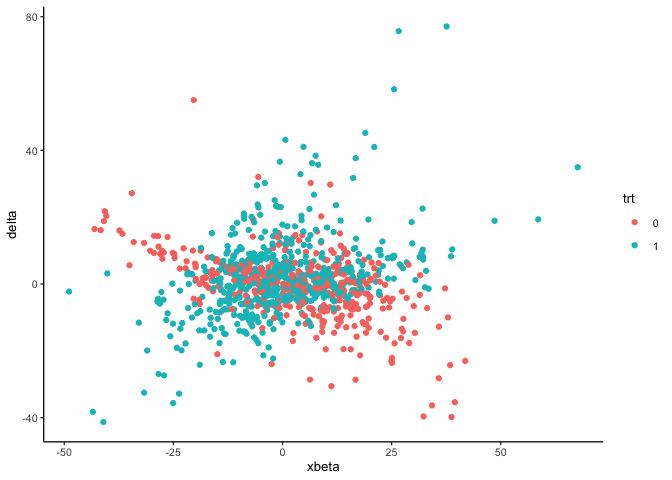
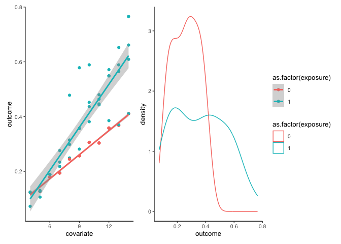
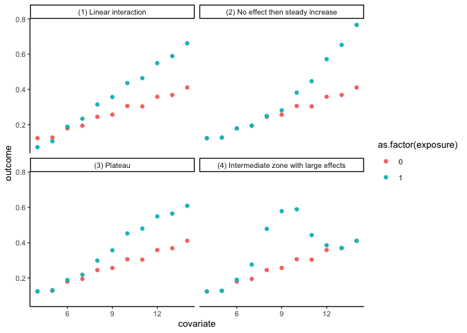
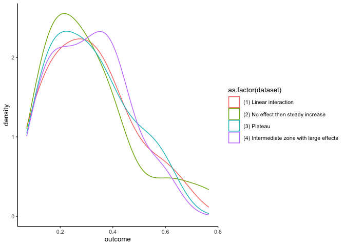

Causal quartets
================
eleanorjackson
10 July, 2023

*Try and make some nice intuitive figures that clearly show how ATEs
differ from ITEs. Or how the same ATE can give a very different
distribution and spread of ITEs.*

``` r
library("tidyverse")
library("patchwork")
```

## `rlearner` package

[xnie/rlearner](https://rdrr.io/github/xnie/rlearner/src/R/utils.R):
R-learner for Heterogeneous Treatment Effect Estimation

The `easy_toy_data_simulation` function generates a toy dataset of size
`n` that can be used to experiment with the learners and meta-learners.

output: a list containing the covariate matrix (`x.covariate_1` and
`x.covariate_2`), treatment vector `w`, outcome vector `y`, true
propensity vector `p`, true marginal outcome vector `m`, true control
potential outcome vector `mu0`, true treated potential outcome vector
`mu1`, and true treatment effect vector `tau`, in that order.

``` r
easy_toy_data_simulation = function(n) {
    x = stats::model.matrix(~.-1, data.frame("covariate_1" = rnorm(n), "covariate_2"= rnorm(n)))
    p = rep(0.5, n)
    w = as.numeric(rbinom(n,1,p)==1)
    tau = x %*% c(1, 1)
    m = x %*% c(0.5, -0.5)
    mu1 = m + tau/2
    mu0 = m - tau/2
    y = (m + tau/2*(2*w-1))[,1]
    list(x=x, w=w, y=y, p=p, m=m, mu0=mu0, mu1=mu1, tau=tau)
}
```

``` r
easy_toy_data_simulation(1000) %>% 
  as.data.frame() %>% 
  ggplot(aes(x = x.covariate_1, y = y, colour = as.factor(w))) + 
  geom_point()
```

<!-- -->

## Blog post

Code from a blog post about the `personalized` package:

<https://cran.r-project.org/web/packages/personalized/vignettes/efficiency_augmentation_personalized.html>

``` r
set.seed(1)
n.obs  <- 1000
n.vars <- 10
x <- matrix(rnorm(n.obs * n.vars, sd = 3), n.obs, n.vars)

# simulate non-randomized treatment
xbetat   <- 0.5 + 0.25 * x[,9] - 0.25 * x[,1]
trt.prob <- exp(xbetat) / (1 + exp(xbetat))
trt      <- rbinom(n.obs, 1, prob = trt.prob)

# simulate delta
delta <- (0.5 + x[,2] - 0.5 * x[,3] - 1 * x[,1] + 1 * x[,1] * x[,4] )

# simulate main effects g(X)
xbeta <- 2 * x[,1] + 3 * x[,4] - 0.25 * x[,2]^2 + 2 * x[,3] + 0.25 * x[,5] ^ 2
xbeta <- xbeta + delta * (2 * trt - 1)

# simulate continuous outcomes
y <- drop(xbeta) + rnorm(n.obs, sd = 3)

# make data frame
tibble(xbeta, y, trt = as.factor(trt), delta) -> sim_dat
```

``` r
sim_dat %>% 
  ggplot(aes(x = xbeta, y = y, colour = trt)) + 
  geom_point()
```

<!-- -->

``` r
sim_dat %>% 
  ggplot(aes(x = xbeta, y = delta, colour = trt)) + 
  geom_point()
```

<!-- -->

## `quartets` package

Contains the data from [Causal quartets: Different ways to attain the
same average treatment
effect](http://www.stat.columbia.edu/~gelman/research/unpublished/causal_quartets.pdf)

A dataframe with 88 rows and 5 variables:

- dataset: The data generating mechanism
- exposure: exposure
- covariate: a pre-exposure factor
- outcome: outcome
- .causal_effect: latent true causal effect

Is the `.causal_effect` the individual treatment effect? i.e. the
difference between the effects with and without the treatment? The
`covariate` is `x`, the thing you are using to try and predict the
outcome, So to see the ATE you’d take the average `.causal_effect` from
each group (`exposure` yes or no)?

``` r
quartets::heterogeneous_causal_quartet %>%  glimpse()
```

    ## Rows: 88
    ## Columns: 5
    ## $ dataset        <chr> "(1) Linear interaction", "(1) Linear interaction", "(1…
    ## $ exposure       <int> 0, 0, 0, 0, 0, 0, 0, 0, 0, 0, 0, 1, 1, 1, 1, 1, 1, 1, 1…
    ## $ covariate      <int> 4, 8, 12, 5, 9, 13, 6, 10, 14, 7, 11, 4, 5, 6, 7, 8, 9,…
    ## $ outcome        <dbl> 0.12326022, 0.24452144, 0.35821423, 0.12677208, 0.25665…
    ## $ .causal_effect <dbl> -5.075567e-02, 6.984887e-02, 1.904534e-01, -2.060454e-0…

``` r
quartets::heterogeneous_causal_quartet %>%
  ggplot(aes(x = covariate, y = outcome, colour = as.factor(exposure))) + 
  geom_point() +
  geom_smooth(method = lm) -> p1

quartets::heterogeneous_causal_quartet %>%
  ggplot(aes(x = outcome, colour = as.factor(exposure))) + 
  geom_density() -> p2

p1 + p2 + plot_layout(guides = "collect")
```

    ## `geom_smooth()` using formula = 'y ~ x'

<!-- -->

So say you ran an experiment and got this data. You’d think that
exposure to the treatment gave a better outcome.

But these are average treatment effects…

These 4 plots below have the same average effects but different
individual effects.

``` r
quartets::heterogeneous_causal_quartet %>%
  ggplot(aes(x = covariate, y = outcome, colour = as.factor(exposure))) + 
  geom_point() +
  facet_wrap(~dataset)
```

<!-- -->

``` r
quartets::heterogeneous_causal_quartet %>%
  ggplot(aes(x = outcome, colour = as.factor(dataset))) + 
  geom_density() 
```

<!-- -->
