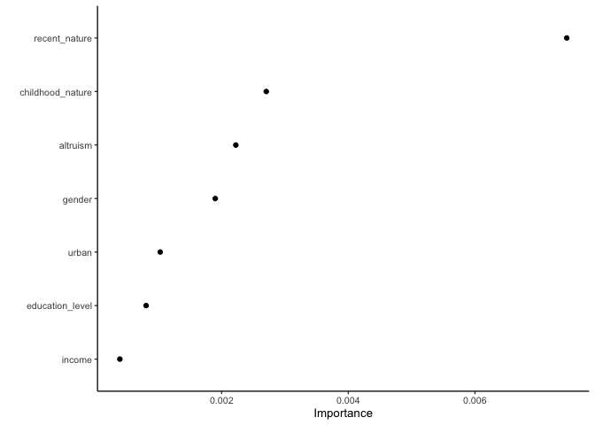

T-learner test run
================
eleanorjackson
24 August, 2023

Today I’m going to quickly re-build the s-learner I made
[here](2023-07-26_trial-s-learner.md) because it was rubbish and I
realised I had left out the `alturism` variable. Then I’ll have a go at
building a t-learner, and then compare them!

``` r
library("tidyverse")
library("tidymodels")
library("vip")
library("here")
library("janitor")
library("patchwork")

set.seed(123)
```

``` r
raw_data <- read_csv(here::here("data", "raw", "soga_gaston_data.csv"))
```

    ## Rows: 20000 Columns: 28
    ## ── Column specification ────────────────────────────────────────────────────────
    ## Delimiter: ","
    ## chr  (1): Gender
    ## dbl (27): Frequency of nature experiences_childhood, Frequency of nature exp...
    ## 
    ## ℹ Use `spec()` to retrieve the full column specification for this data.
    ## ℹ Specify the column types or set `show_col_types = FALSE` to quiet this message.

``` r
glimpse(raw_data)
```

    ## Rows: 20,000
    ## Columns: 28
    ## $ `Frequency of nature experiences_childhood`             <dbl> 6, 6, 6, 3, 6,…
    ## $ `Frequency of nature experiences_recent`                <dbl> 4, 1, 1, 1, 2,…
    ## $ `Probability of adopting pro-biodiversity behaviour#1`  <dbl> 1, 0, 1, 0, 1,…
    ## $ `Probability of adopting pro-biodiversity behaviour#2`  <dbl> 0, 0, 0, NA, 1…
    ## $ `Probability of adopting pro-biodiversity behaviour#3`  <dbl> 1, 0, 0, NA, 1…
    ## $ `Probability of adopting pro-biodiversity behaviour#4`  <dbl> NA, NA, 0, NA,…
    ## $ `Probability of adopting pro-biodiversity behaviour#5`  <dbl> NA, 0, 0, 1, 1…
    ## $ `Probability of adopting pro-biodiversity behaviour#6`  <dbl> 0, 0, 0, 0, 0,…
    ## $ `Probability of adopting pro-biodiversity behaviour#7`  <dbl> 1, 0, 0, 0, 0,…
    ## $ `Probability of adopting pro-biodiversity behaviour#8`  <dbl> 0, 0, 0, 0, 0,…
    ## $ `Probability of adopting pro-biodiversity behaviour#9`  <dbl> 0, 0, 0, 0, 1,…
    ## $ `Probability of adopting pro-biodiversity behaviour#10` <dbl> 0, 0, 0, 0, 0,…
    ## $ `Probability of adopting pro-biodiversity behaviour#11` <dbl> 0, 0, 0, 0, 0,…
    ## $ `Probability of adopting pro-biodiversity behaviour#12` <dbl> NA, 0, 1, NA, …
    ## $ `Probability of adopting pro-biodiversity behaviour#13` <dbl> NA, NA, 0, NA,…
    ## $ `Probability of adopting pro-biodiversity behaviour#14` <dbl> 1, NA, 1, NA, …
    ## $ `Probability of adopting pro-biodiversity behaviour#15` <dbl> NA, 0, 0, NA, …
    ## $ `Probability of adopting pro-biodiversity behaviour#16` <dbl> 0, 0, 0, 0, 0,…
    ## $ `Probability of adopting pro-biodiversity behaviour#17` <dbl> 0, 0, 0, 0, 0,…
    ## $ `Probability of adopting pro-biodiversity behaviour#18` <dbl> 0, 0, 0, 0, 1,…
    ## $ `Nature relatedness`                                    <dbl> 1, 1, 1, 1, 1,…
    ## $ `Recognition of the decline in local fauna and flora`   <dbl> 1, 1, 1, 1, 1,…
    ## $ `Altruistic value orientation`                          <dbl> 23, 26, 24, 24…
    ## $ Gender                                                  <chr> "male", "male"…
    ## $ Age                                                     <dbl> 31, 33, 54, 36…
    ## $ `Degree of urbanisation`                                <dbl> 5, 5, 4, 6, 3,…
    ## $ Income                                                  <dbl> 2, 4, 2, 6, 1,…
    ## $ `Education level`                                       <dbl> 2, 4, 2, 4, 3,…

## Refactoring the data

``` r
raw_data %>% 
  clean_names() %>%
  rename(childhood_nature = frequency_of_nature_experiences_childhood, 
         urban = degree_of_urbanisation,
         altruism = altruistic_value_orientation,
         pro_biodiversity = probability_of_adopting_pro_biodiversity_behaviour_number_3,
         recent_nature = frequency_of_nature_experiences_recent) %>% 
  select(-contains("probability")) %>% 
  mutate(recent_nature = case_when(recent_nature == 1 |
                                     recent_nature == 2 ~ 0,
                                   .default = 1) ) %>% 
  mutate(across(c(childhood_nature, urban, income, education_level),
                as.ordered)) %>% 
  mutate(across(c(recent_nature, pro_biodiversity, gender),
                as.factor)) %>% 
  
  drop_na() %>% 
  mutate(id = paste0("A", row_number(), sep = "")) %>% 
  select(id, pro_biodiversity, recent_nature, income, childhood_nature, 
         gender, education_level, urban, altruism) -> tidy_data
  
glimpse(tidy_data)  
```

    ## Rows: 16,484
    ## Columns: 9
    ## $ id               <chr> "A1", "A2", "A3", "A4", "A5", "A6", "A7", "A8", "A9",…
    ## $ pro_biodiversity <fct> 1, 0, 0, 1, 1, 1, 1, 0, 1, 0, 0, 0, 0, 0, 0, 0, 0, 0,…
    ## $ recent_nature    <fct> 1, 0, 0, 0, 1, 1, 0, 1, 0, 0, 0, 0, 1, 0, 1, 0, 0, 0,…
    ## $ income           <ord> 2, 4, 2, 1, 2, 5, 2, 1, 6, 1, 5, 3, 6, 4, 1, 3, 1, 4,…
    ## $ childhood_nature <ord> 6, 6, 6, 6, 6, 5, 6, 6, 4, 1, 2, 3, 3, 6, 5, 2, 3, 6,…
    ## $ gender           <fct> male, male, female, female, female, male, female, fem…
    ## $ education_level  <ord> 2, 4, 2, 3, 4, 4, 4, 4, 4, 2, 4, 4, 2, 4, 4, 5, 2, 3,…
    ## $ urban            <ord> 5, 5, 4, 3, 3, 5, 5, 5, 7, 5, 6, 6, 4, 7, 5, 5, 6, 3,…
    ## $ altruism         <dbl> 23, 26, 24, 34, 36, 31, 32, 27, 26, 27, 30, 28, 36, 2…

## S-learner

### train

``` r
data_split <- initial_split(tidy_data, prop = 1/3)
train_data_s <- training(data_split)
test_data_s <- testing(data_split)

rand_forest(
  mode = "classification",
  engine = "ranger"
) -> rf_def

rf_def %>% 
  fit(
    pro_biodiversity ~ recent_nature + 
      income + childhood_nature  + gender  + education_level + urban + altruism,
    data = train_data_s
  ) -> s_train_fit

s_train_fit
```

    ## parsnip model object
    ## 
    ## Ranger result
    ## 
    ## Call:
    ##  ranger::ranger(x = maybe_data_frame(x), y = y, num.threads = 1,      verbose = FALSE, seed = sample.int(10^5, 1), probability = TRUE) 
    ## 
    ## Type:                             Probability estimation 
    ## Number of trees:                  500 
    ## Sample size:                      5494 
    ## Number of independent variables:  7 
    ## Mtry:                             2 
    ## Target node size:                 10 
    ## Variable importance mode:         none 
    ## Splitrule:                        gini 
    ## OOB prediction error (Brier s.):  0.2450726

### test

``` r
predict(s_train_fit, test_data_s, type = "prob") %>% 
  bind_cols(test_data_s) -> s_result

glimpse(s_result)
```

    ## Rows: 10,990
    ## Columns: 11
    ## $ .pred_0          <dbl> 0.8275149, 0.4810429, 0.3865615, 0.5430348, 0.5961154…
    ## $ .pred_1          <dbl> 0.1724851, 0.5189571, 0.6134385, 0.4569652, 0.4038846…
    ## $ id               <chr> "A2", "A3", "A4", "A6", "A7", "A8", "A9", "A10", "A11…
    ## $ pro_biodiversity <fct> 0, 0, 1, 1, 1, 0, 1, 0, 0, 0, 0, 0, 1, 0, 1, 0, 1, 1,…
    ## $ recent_nature    <fct> 0, 0, 0, 1, 0, 1, 0, 0, 0, 0, 0, 1, 0, 1, 1, 1, 1, 0,…
    ## $ income           <ord> 4, 2, 1, 5, 2, 1, 6, 1, 5, 3, 4, 1, 3, 1, 1, 3, 3, 1,…
    ## $ childhood_nature <ord> 6, 6, 6, 5, 6, 6, 4, 1, 2, 3, 6, 5, 4, 6, 6, 1, 6, 4,…
    ## $ gender           <fct> male, female, female, male, female, female, female, f…
    ## $ education_level  <ord> 4, 2, 3, 4, 4, 4, 4, 2, 4, 4, 4, 4, 5, 2, 4, 4, 2, 4,…
    ## $ urban            <ord> 5, 4, 3, 5, 5, 5, 7, 5, 6, 6, 7, 5, 6, 5, 4, 5, 5, 5,…
    ## $ altruism         <dbl> 26, 24, 34, 31, 32, 27, 26, 27, 30, 28, 27, 29, 15, 2…

``` r
s_result %>% 
  roc_curve(pro_biodiversity, .pred_0) %>% 
  ggplot(aes(x = 1 - specificity, y = sensitivity)) + 
  geom_path(lwd = 1.5, alpha = 0.8) +
  geom_abline(lty = 3) + 
  coord_equal()
```

<!-- -->

### tune

``` r
rf_tune <- rand_forest(mtry = tune(), min_n = tune()) %>%
  set_engine("ranger", num.threads = 3) %>%
  set_mode("classification")

rf_tune
```

    ## Random Forest Model Specification (classification)
    ## 
    ## Main Arguments:
    ##   mtry = tune()
    ##   min_n = tune()
    ## 
    ## Engine-Specific Arguments:
    ##   num.threads = 3
    ## 
    ## Computational engine: ranger

``` r
finalize(mtry(), select(train_data_s, -id, - pro_biodiversity))
```

    ## # Randomly Selected Predictors (quantitative)
    ## Range: [1, 7]

``` r
tree_grid <- grid_regular(mtry(c(1, 6)),
                          min_n(),
                          levels = 5)
```

Run models with range of chosen hyperparameters

``` r
rf_recipe <- recipe(data = train_data_s,
                    formula = pro_biodiversity ~ recent_nature +
                      income + childhood_nature  + gender  + 
                      education_level + urban + altruism)

rf_workflow <- workflow() %>%
  add_recipe(rf_recipe) %>%
  add_model(rf_tune)

# create a set of cross-validation resamples to use for tuning
trees_folds <- vfold_cv(train_data_s, v = 25)

rf_tune_res <- 
  tune_grid(rf_workflow,
            resamples = trees_folds,
            grid = tree_grid,
            control = control_grid(save_pred = TRUE),
            metrics = metric_set(roc_auc))
```

``` r
rf_tune_res %>%
  collect_metrics() %>%
  filter(.metric == "roc_auc") %>%
  mutate(min_n = factor(min_n)) %>%
  ggplot(aes(mtry, mean, color = min_n)) +
  geom_line(alpha = 0.5, linewidth = 1.5) +
  geom_point() +
  labs(y = "AUC")
```

<!-- -->

Our best model has `min_n` of 30 and `mtry` of 1.

``` r
best_auc <- select_best(rf_tune_res, "roc_auc")

final_rf <- finalize_model(
  rf_tune,
  best_auc
)

final_rf
```

    ## Random Forest Model Specification (classification)
    ## 
    ## Main Arguments:
    ##   mtry = 1
    ##   min_n = 30
    ## 
    ## Engine-Specific Arguments:
    ##   num.threads = 3
    ## 
    ## Computational engine: ranger

Check out variable importance

``` r
final_rf %>%
  set_engine("ranger", importance = "permutation") %>%
  fit(pro_biodiversity ~ .,
    data = train_data_s %>% select(-id)
  ) %>%
  vip(geom = "point")
```

<!-- -->

Alturism is pretty high!

`last_fit` fits a final model on the entire training set and evaluates
on the testing set.

``` r
final_wf <- workflow() %>%
  add_recipe(rf_recipe) %>%
  add_model(final_rf)

final_res <- final_wf %>%
  last_fit(data_split)

final_res %>%
  collect_metrics()
```

    ## # A tibble: 2 × 4
    ##   .metric  .estimator .estimate .config             
    ##   <chr>    <chr>          <dbl> <chr>               
    ## 1 accuracy binary         0.574 Preprocessor1_Model1
    ## 2 roc_auc  binary         0.601 Preprocessor1_Model1

``` r
final_res$.predictions %>% 
  as.data.frame() %>% 
  roc_curve(pro_biodiversity, .pred_0) %>% 
  ggplot(aes(x = 1 - specificity, y = sensitivity)) + 
  geom_path(lwd = 1.5, alpha = 0.8) +
  geom_abline(lty = 3) + 
  coord_equal()
```

<!-- -->

OK still bad! Let’s build a t-learner!

## T-learner

1.  separate out the with/without treatment groups from the training
    data and train 2 models
2.  then use each of those models to predict the outcome for the full
    test dataset
3.  the ITE is prediction with treatment - prediction without treatment

``` r
train_1 <- train_data_s %>%
  filter(recent_nature == 1)

train_0 <- train_data_s %>%
  filter(recent_nature == 0)
```

### treatment == 1

Rather than fitting an initial model this time, I’ll go straight into
tuning hyperparameters.

``` r
rf_recipe <- recipe(data = train_1,
                    formula = pro_biodiversity ~
                      income + childhood_nature  + gender  + 
                      education_level + urban + altruism)

rf_workflow <- workflow() %>%
  add_recipe(rf_recipe) %>%
  add_model(rf_tune)

# create a set of cross-validation resamples to use for tuning
trees_folds <- vfold_cv(train_data_s, v = 25)

rf_tune_res_t1 <- 
  tune_grid(rf_workflow,
            resamples = trees_folds,
            grid = tree_grid,
            control = control_grid(save_pred = TRUE),
            metrics = metric_set(roc_auc))
```

``` r
best_auc_t1 <- select_best(rf_tune_res_t1, "roc_auc")

final_rf_t1 <- finalize_model(
  rf_tune,
  best_auc_t1
)

final_rf_t1
```

    ## Random Forest Model Specification (classification)
    ## 
    ## Main Arguments:
    ##   mtry = 1
    ##   min_n = 40
    ## 
    ## Engine-Specific Arguments:
    ##   num.threads = 3
    ## 
    ## Computational engine: ranger

Choose the model with the best hyperparameters and fit it on the test
data where treatment == 1

``` r
wf_t1 <- workflow() %>%
  add_recipe(rf_recipe) %>%
  add_model(final_rf_t1)

t1_fit <- fit(wf_t1, train_1)
```

### treatment == 0

Tune

``` r
rf_recipe <- recipe(data = train_0,
                    formula = pro_biodiversity ~ 
                      income + childhood_nature  + gender  + 
                      education_level + urban + altruism)

rf_workflow <- workflow() %>%
  add_recipe(rf_recipe) %>%
  add_model(rf_tune)

# create a set of cross-validation resamples to use for tuning
trees_folds <- vfold_cv(train_data_s, v = 25)

rf_tune_res_t0 <- 
  tune_grid(rf_workflow,
            resamples = trees_folds,
            grid = tree_grid,
            control = control_grid(save_pred = TRUE),
            metrics = metric_set(roc_auc))
```

``` r
best_auc_t0 <- select_best(rf_tune_res_t0, "roc_auc")

final_rf_t0 <- finalize_model(
  rf_tune,
  best_auc_t0
)

final_rf_t0
```

    ## Random Forest Model Specification (classification)
    ## 
    ## Main Arguments:
    ##   mtry = 1
    ##   min_n = 30
    ## 
    ## Engine-Specific Arguments:
    ##   num.threads = 3
    ## 
    ## Computational engine: ranger

Choose the model with the best hyperparameters and fit it on the test
data where treatment == 0

``` r
wf_t0 <- workflow() %>%
  add_recipe(rf_recipe) %>%
  add_model(final_rf_t0)

t0_fit <- fit(wf_t0, train_0)
```

## Fit t-learner

Now that we have 2 models, one trained on 0 data and one trained on 1
data. Next we need to make predictions for the test dataset using each
of the models.

I think to generate the ITEs from a t-learner we need to generate a 2
datasets from the test data: one where we force the treatment to = 1,
and one dataset where we force the treatment to = 0. Then, make
predictions using the relevant model. Then, we calculate ITEs as
prediction with treatment - prediction without treatment.

``` r
test_data_s %>% 
  mutate(recent_nature = factor(0)) -> test_0

test_data_s %>% 
  mutate(recent_nature = factor(1)) -> test_1

predict(t0_fit, test_0) %>% 
  cbind(test_data_s) %>% 
  mutate(.pred_class = 
           as.numeric(levels(.pred_class))[.pred_class]) %>% 
  rename(pred_0 = .pred_class) -> pred_0_t

predict(t1_fit, test_1) %>% 
  cbind(test_data_s) %>% 
  mutate(.pred_class = 
           as.numeric(levels(.pred_class))[.pred_class]) %>% 
  rename(pred_1 = .pred_class) -> pred_1_t

pred_0_t %>% 
  inner_join(pred_1_t) %>% 
  mutate(t_learner_ite = pred_1 - pred_0) %>% 
  mutate(t_learner_ite = as.factor(t_learner_ite)) -> tlearn_ites
```

    ## Joining with `by = join_by(id, pro_biodiversity, recent_nature, income,
    ## childhood_nature, gender, education_level, urban, altruism)`

## Get s-learner ITEs

Use s-learner model to predict for both 0 and 1 test datasets

``` r
s_fit <- fit(final_wf, train_data_s)

predict(s_fit, test_0) %>% 
  cbind(test_data_s) %>% 
  mutate(.pred_class = 
           as.numeric(levels(.pred_class))[.pred_class]) %>% 
  rename(pred_0 = .pred_class) -> pred_0_s

predict(s_fit, test_1) %>% 
  cbind(test_data_s) %>% 
  mutate(.pred_class = 
           as.numeric(levels(.pred_class))[.pred_class]) %>% 
  rename(pred_1 = .pred_class) -> pred_1_s

pred_0_s %>% 
  inner_join(pred_1_s) %>% 
  mutate(s_learner_ite = pred_1 - pred_0) %>% 
  mutate(s_learner_ite = as.factor(s_learner_ite)) -> slearn_ites
```

    ## Joining with `by = join_by(id, pro_biodiversity, recent_nature, income,
    ## childhood_nature, gender, education_level, urban, altruism)`

## Compare ITEs

Because this is a classification problem we can use a confusion matrix
to compare ITEs

``` r
slearn_ites %>% 
  inner_join(tlearn_ites, 
             by = c("id", "pro_biodiversity", "income", "childhood_nature", "gender",
                   "education_level", "urban", "altruism")) -> s_t_preds

conf_mat(
  data = s_t_preds,
  truth = s_learner_ite,
  estimate = t_learner_ite,
  dnn = c("t-learner", "s-learner"),
  case_weights = NULL
) -> cm

autoplot(cm, type = "heatmap")
```

<!-- -->

Diagonal is where they agree - both predict the same response.

S-learner looks like it is more conservative, often predicts 0 where
t-learner predicts 1.

Can we look at these differences across predictors?

``` r
s_t_preds %>% 
  mutate(t_learner_ite = 
           as.numeric(levels(t_learner_ite))[t_learner_ite]) %>% 
  group_by(childhood_nature) %>% 
  summarise(t_learner_ite_av = mean(t_learner_ite)) %>% 
  ggplot() +
  geom_col(aes(x = childhood_nature, y = t_learner_ite_av)) +
  ggtitle("t-learner") -> t_childhood_nature

s_t_preds %>% 
  mutate(s_learner_ite = 
           as.numeric(levels(s_learner_ite))[s_learner_ite]) %>% 
  group_by(childhood_nature) %>% 
  summarise(s_learner_ite_av = mean(s_learner_ite)) %>% 
  ggplot() +
  geom_col(aes(x = childhood_nature, y = s_learner_ite_av)) +
  ggtitle("s-learner") -> s_childhood_nature

t_childhood_nature + s_childhood_nature
```

<!-- -->

``` r
s_t_preds %>% 
  mutate(t_learner_ite = 
           as.numeric(levels(t_learner_ite))[t_learner_ite]) %>% 
  group_by(gender) %>% 
  summarise(t_learner_ite_av = mean(t_learner_ite)) %>% 
  ggplot() +
  geom_col(aes(x = gender, y = t_learner_ite_av)) +
  ggtitle("t-learner") -> t_gender

s_t_preds %>% 
  mutate(s_learner_ite = 
           as.numeric(levels(s_learner_ite))[s_learner_ite]) %>% 
  group_by(gender) %>% 
  summarise(s_learner_ite_av = mean(s_learner_ite)) %>% 
  ggplot() +
  geom_col(aes(x = gender, y = s_learner_ite_av)) +
  ggtitle("s-learner") -> s_gender

t_gender + s_gender
```

<!-- -->

``` r
s_t_preds %>% 
  mutate(t_learner_ite = 
           as.numeric(levels(t_learner_ite))[t_learner_ite]) %>% 
  group_by(urban) %>% 
  summarise(t_learner_ite_av = mean(t_learner_ite)) %>% 
  ggplot() +
  geom_col(aes(x = urban, y = t_learner_ite_av)) +
  ggtitle("t-learner") -> t_urban

s_t_preds %>% 
  mutate(s_learner_ite = 
           as.numeric(levels(s_learner_ite))[s_learner_ite]) %>% 
  group_by(urban) %>% 
  summarise(s_learner_ite_av = mean(s_learner_ite)) %>% 
  ggplot() +
  geom_col(aes(x = urban, y = s_learner_ite_av)) +
  ggtitle("s-learner") -> s_urban

t_urban + s_urban
```

<!-- -->

``` r
s_t_preds %>%
  mutate(t_learner_ite = 
           as.numeric(levels(t_learner_ite))[t_learner_ite]) %>% 
  ggplot(aes(x = pro_biodiversity, y = altruism, colour = t_learner_ite)) +
  geom_jitter(alpha = 0.5 ) +
  scale_color_gradient2() +
  ggtitle("t-learner") +
  theme(panel.background = element_rect(fill = "lightgrey")) -> t_urban

s_t_preds %>%
  mutate(s_learner_ite = 
           as.numeric(levels(s_learner_ite))[s_learner_ite]) %>% 
  ggplot(aes(x = pro_biodiversity, y = altruism, colour = s_learner_ite)) +
  geom_jitter(alpha = 0.5 ) +
  scale_color_gradient2() +
  ggtitle("t-learner")  +
  theme(panel.background = element_rect(fill = "lightgrey")) -> s_urban

t_urban + s_urban
```

<!-- -->
