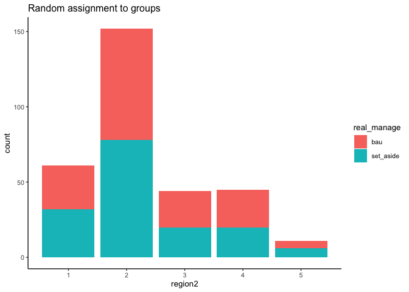

Trial approach with Mazziotta data
================
eleanorjackson
12 October, 2023

``` r
library("tidyverse")
library("here")
library("janitor")
library("rsample")

set.seed(123)
```

In this document I’m going to start coding up the main
[approach](https://docs.google.com/document/d/1chDZ_8jM--HWPw2ElIUY2otEej0tJ42KKE3TMrgGMpA/edit#heading=h.mh4gg5x4o2y5)
using data from [Mazziotta et
al. 2022](https://doi.org/10.1111/gcb.16364) whilst we’re waiting for
the full dataset.

``` r
read_csv(here("data", "raw", "mazziotta","NFI_Projections_CCMS_climate.csv")) %>% 
  clean_names() -> maz_dat

glimpse(maz_dat)
```

    ## Rows: 5,119,968
    ## Columns: 44
    ## $ description                                                             <chr> …
    ## $ period                                                                  <dbl> …
    ## $ area_factor                                                             <dbl> …
    ## $ biomass_data_biomass_total_pine_before                                  <dbl> …
    ## $ biomass_data_biomass_total_spruce_before                                <dbl> …
    ## $ biomass_data_biomass_total_birch_before                                 <dbl> …
    ## $ biomass_data_biomass_total_aspen_before                                 <dbl> …
    ## $ biomass_data_biomass_total_oak_before                                   <dbl> …
    ## $ biomass_data_biomass_total_beech_before                                 <dbl> …
    ## $ biomass_data_biomass_total_southern_broadleaf_before                    <dbl> …
    ## $ biomass_data_biomass_total_contorta_before                              <dbl> …
    ## $ biomass_data_biomass_total_other_broadleaf_before                       <dbl> …
    ## $ biomass_data_biomass_total_larch_before                                 <dbl> …
    ## $ forest_data_mean_age_excl_overstorey_before                             <dbl> …
    ## $ forest_data_stems_before                                                <dbl> …
    ## $ carbon_and_nitrogen_data_c_n_ratio_in_soil                              <dbl> …
    ## $ carbon_and_nitrogen_data_soil_carbon_stock                              <dbl> …
    ## $ carbon_and_nitrogen_data_total_carbon_living_trees_excl_stump_and_roots <dbl> …
    ## $ carbon_and_nitrogen_data_total_carbon_stumps_and_roots                  <dbl> …
    ## $ forest_domain_data_treatment_control_category                           <chr> …
    ## $ dead_wood_data_dead_standing_trees                                      <dbl> …
    ## $ dead_wood_data_downed_deadwood                                          <dbl> …
    ## $ site_data_county_code                                                   <chr> …
    ## $ site_data_peat                                                          <lgl> …
    ## $ site_data_soil_moisture                                                 <chr> …
    ## $ treatment_data_biomass_total_of_cut_trees_all_species                   <dbl> …
    ## $ treatment_unit_owner_type                                               <chr> …
    ## $ ar                                                                      <dbl> …
    ## $ trakt                                                                   <dbl> …
    ## $ palslag                                                                 <dbl> …
    ## $ soil_moist                                                              <dbl> …
    ## $ soil_moist_cont                                                         <dbl> …
    ## $ region                                                                  <dbl> …
    ## $ region2                                                                 <dbl> …
    ## $ id                                                                      <dbl> …
    ## $ tsum_cc                                                                 <dbl> …
    ## $ psum_cc                                                                 <dbl> …
    ## $ peat                                                                    <dbl> …
    ## $ policy                                                                  <chr> …
    ## $ climate                                                                 <chr> …
    ## $ policy_climate                                                          <chr> …
    ## $ production_vs_setaside                                                  <chr> …
    ## $ policy_climate_production_vs_setaside                                   <chr> …
    ## $ period_range                                                            <dbl> …

In this data there should be 29,892 unique plots. Where period is `0`,
the data are actually observed and the time periods (`1` to `18`) are
predictions from Heureka under three different climate scenarios and
four different climate change mitigation solutions (every combination of
each).

As part of the climate change mitigation solutions, they also predicted
the forest management that would be used for each plot
(`forest_domain_data_treatment_control_category`). For each NFI plot and
time step, a large number of management activities (such as thinning and
clear felling) are simulated, that in sequence constitute different
treatment schedules. Then the optimal treatment schedule for each plot
is selected based on an objective function and possible constraints.

For what we’re doing now I think we only need two management options per
plot.

``` r
summary(as.factor(maz_dat$forest_domain_data_treatment_control_category))
```

    ##                             BAU                BAU - NoThinning 
    ##                          505590                          777366 
    ##              BAU FocusBioenergy BAU_FocusBioenergy_StumpHarvest 
    ##                         1703483                          495064 
    ##           BAU_ProlongedRotation                             CCF 
    ##                          691752                           50559 
    ##     Lovgynnande trakthyggesbruk            SetAside (Unmanaged) 
    ##                          722266                          173888

Let’s filter the data to only include plots that have predictions for
both `SetAside (Unmanaged)` and `BAU - NoThinning`.

``` r
maz_dat %>% 
  filter(forest_domain_data_treatment_control_category == "SetAside (Unmanaged)" |
           forest_domain_data_treatment_control_category == "BAU - NoThinning") ->  maz_dat_bau_sa

maz_dat_bau_sa %>% 
  group_by(id) %>% 
  summarise(n = n_distinct(forest_domain_data_treatment_control_category),
            .groups = "drop") %>% 
  filter(n == 2) %>% 
  select(id) -> plot_list

maz_dat_bau_sa %>% 
  filter(id %in% plot_list$id) -> test_plots
```

We aim to predict individual-level treatment effects (ITE) using
meta-learner algorithms. We can evaluate the impact of various
**decisions** on predictive accuracy.

## Decision 1 - Assignment of NFI plots to a realised management regime

i.e., whether plot is treatment or control

- Option 1 = Random assignment
- Option 2 = Something more realistic, e.g. a spatial constraint

[Data
exists](http://www.diva-portal.org/smash/get/diva2:1563052/FULLTEXT01.pdf)
on the % of forests in different land use categories for each region of
Sweden (Northern, South-Northern, Mid and Southern). We could use these
to assign NFI plots to a management regime. The Mazziotta data has a
`region2` variable:

``` r
test_plots %>% 
  distinct(region2)
```

    ## # A tibble: 5 × 1
    ##   region2
    ##     <dbl>
    ## 1       2
    ## 2       1
    ## 3       5
    ## 4       4
    ## 5       3

But, there are 6 regions here (rather than 4 as in the land use data).
There is a map in the [Heureka
wiki](https://www.heurekaslu.se/wiki/Heureka_Wiki) which shows the
regions according to Swedish NFI definition.


This map defines the regions slightly differently to the [land use
data](http://www.diva-portal.org/smash/get/diva2:1563052/FULLTEXT01.pdf)
but I think we can say that

- 1 is Northern with 12% unmanaged set-asides
- 2 is South-Northern with 12.5% unmanaged set-asides
- 3 is Mid with 8.5% unmanaged set-asides
- 4 and 5 are Southern regions with 7% unmanaged set-asides

For each region we want we want the % of plots randomly selected for
set-aside to match the percentages above.

``` r
test_plots %>% 
    select(id, region2) %>% 
    distinct() -> id_list

assign_group_weighted <- function(region, proportion, data = id_list) {
  data %>% 
    filter(region2 == region) %>% 
    slice_sample(prop = proportion)
}

tibble(region = 1:5,
       proportion = c(0.12, 0.125, 0.085, 0.07, 0.07)) -> weights

pmap(weights, assign_group_weighted) %>% 
  bind_rows() -> set_aside_ids

semi_join(test_plots, set_aside_ids, by = c("id", "region2")) %>% 
  mutate(real_manage = "set_aside") -> set_aside_df

anti_join(test_plots, set_aside_ids, by = c("id", "region2")) %>% 
  mutate(real_manage = "bau") -> bau_df

bind_rows(bau_df, set_aside_df) -> assigned_data
```

``` r
assigned_data %>% 
  select(id, region2, real_manage) %>% 
  distinct() %>% 
  ggplot(aes(x = region2, fill = real_manage)) +
  geom_bar(stat = "count") +
  ggtitle("Assignment based on region")
```

<!-- -->

``` r
id_list %>% 
  slice_sample(prop = 0.5) %>% 
  mutate(real_manage = "set_aside") -> set_aside_ids_rand

semi_join(test_plots, set_aside_ids_rand, by = c("id", "region2")) %>% 
  mutate(real_manage = "set_aside") -> set_aside_df_rand

anti_join(test_plots, set_aside_df_rand, by = c("id", "region2")) %>% 
  mutate(real_manage = "bau") -> bau_df_rand

bind_rows(bau_df_rand, set_aside_df_rand) -> assigned_data_rand

assigned_data_rand %>% 
  select(id, region2, real_manage) %>% 
  distinct() %>% 
  ggplot(aes(x = region2, fill = real_manage)) +
  geom_bar(stat = "count") +
  ggtitle("Random assignment to groups")
```

<!-- -->
