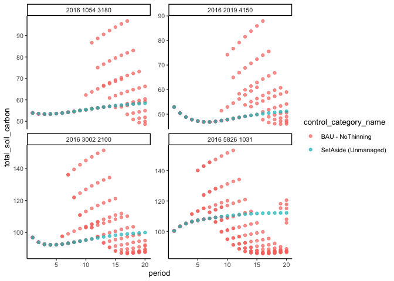

Explore Heureka data
================
eleanorjackson
24 October, 2023

We have the first chunk of data from Tord, which is one fifth of the
total data available. Lets have a look at it!

``` r
library("tidyverse")
library("here")
library("janitor")
```

``` r
tord_dat <- read.csv(
  here::here("data", "raw", "ForManSims_2016_RCP0_2.csv"), 
  sep = ";", skipNul = TRUE) %>% 
  clean_names()

glimpse(tord_dat)
```

    ## Rows: 10,089,979
    ## Columns: 82
    ## $ description                       <chr> "2016 1008 1180", "2016 1008 1180", …
    ## $ period                            <int> 0, 1, 1, 1, 1, 1, 1, 1, 1, 1, 1, 1, …
    ## $ alternative_no                    <int> 1, 1, 2, 3, 4, 5, 6, 7, 8, 9, 10, 11…
    ## $ represented_area                  <dbl> 6173.47, 6173.47, 6173.47, 6173.47, …
    ## $ control_category_name             <chr> "Initial state", "Int_Contorta", "In…
    ## $ forest_domain_name                <chr> "Pine dominated_North (Contorta poss…
    ## $ altitude                          <int> 319, 319, 319, 319, 319, 319, 319, 3…
    ## $ county                            <int> 1, 1, 1, 1, 1, 1, 1, 1, 1, 1, 1, 1, …
    ## $ ditch                             <int> 0, 0, 0, 0, 0, 0, 0, 0, 0, 0, 0, 0, …
    ## $ peat                              <int> 0, 0, 0, 0, 0, 0, 0, 0, 0, 0, 0, 0, …
    ## $ region                            <int> 1, 1, 1, 1, 1, 1, 1, 1, 1, 1, 1, 1, …
    ## $ soil_moist_code                   <int> 2, 2, 2, 2, 2, 2, 2, 2, 2, 2, 2, 2, …
    ## $ basal_area                        <dbl> 13.96747, 15.12984, 15.12984, 15.129…
    ## $ closure                           <dbl> 0.7, 0.7, 0.7, 0.7, 0.7, 0.7, 0.7, 0…
    ## $ hgv                               <dbl> 8.862998, 9.308556, 9.308556, 9.3085…
    ## $ age                               <dbl> 52.00000, 54.30708, 54.30708, 54.307…
    ## $ no_of_stems                       <dbl> 844.4849, 875.7844, 875.7844, 875.78…
    ## $ volume_excl_overstory             <dbl> 64.55562, 72.80995, 72.80995, 72.809…
    ## $ standing_volume                   <dbl> 64.55562, 72.80995, 72.80995, 72.809…
    ## $ volume_pine                       <dbl> 63.10601, 70.87830, 70.87830, 70.878…
    ## $ volume_spruce                     <dbl> 1.449612, 1.813222, 1.813222, 1.8132…
    ## $ volume_birch                      <dbl> 0.0000000, 0.1154486, 0.1154486, 0.1…
    ## $ volume_aspen                      <dbl> 0, 0, 0, 0, 0, 0, 0, 0, 0, 0, 0, 0, …
    ## $ volume_oak                        <dbl> 0, 0, 0, 0, 0, 0, 0, 0, 0, 0, 0, 0, …
    ## $ volume_beech                      <dbl> 0, 0, 0, 0, 0, 0, 0, 0, 0, 0, 0, 0, …
    ## $ volume_southern_broadleaf         <dbl> 0, 0, 0, 0, 0, 0, 0, 0, 0, 0, 0, 0, …
    ## $ volume_contorta                   <dbl> 0, 0, 0, 0, 0, 0, 0, 0, 0, 0, 0, 0, …
    ## $ volume_other_broadleaf            <dbl> 0.000000000, 0.002980047, 0.00298004…
    ## $ volume_larch                      <dbl> 0, 0, 0, 0, 0, 0, 0, 0, 0, 0, 0, 0, …
    ## $ basal_area_conifer                <dbl> 13.96747, 15.09221, 15.09221, 15.092…
    ## $ basal_area_deciduous              <dbl> 0.0000000, 0.0376378, 0.0376378, 0.0…
    ## $ dead_standing_trees_above20cm     <dbl> 0.00000000, 0.02330642, 0.02330642, …
    ## $ dead_standing_trees_coniferous    <dbl> 0.0000000, 0.1947597, 0.1947597, 0.1…
    ## $ dead_standing_trees_deciduous     <dbl> 0, 0, 0, 0, 0, 0, 0, 0, 0, 0, 0, 0, …
    ## $ downed_deadwood_above20cm         <dbl> 0.00000000, 0.01490082, 0.01490082, …
    ## $ downed_deadwood_coniferous        <dbl> 0.0000000, 0.1245185, 0.1245185, 0.1…
    ## $ downed_deadwood_deciduous         <dbl> 0, 0, 0, 0, 0, 0, 0, 0, 0, 0, 0, 0, …
    ## $ dw_volume_decayclass0             <dbl> 0, 0, 0, 0, 0, 0, 0, 0, 0, 0, 0, 0, …
    ## $ dw_volume_decayclass1             <dbl> 0.0000000, 0.3192782, 0.3192782, 0.3…
    ## $ dw_volume_decayclass2             <dbl> 0, 0, 0, 0, 0, 0, 0, 0, 0, 0, 0, 0, …
    ## $ dw_volume_decayclass3             <dbl> 0, 0, 0, 0, 0, 0, 0, 0, 0, 0, 0, 0, …
    ## $ dw_volume_decayclass4             <dbl> 0, 0, 0, 0, 0, 0, 0, 0, 0, 0, 0, 0, …
    ## $ dw_volume_birch_decayclass0       <dbl> 0, 0, 0, 0, 0, 0, 0, 0, 0, 0, 0, 0, …
    ## $ dw_volume_birch_decayclass1       <dbl> 0, 0, 0, 0, 0, 0, 0, 0, 0, 0, 0, 0, …
    ## $ dw_volume_birch_decayclass2       <dbl> 0, 0, 0, 0, 0, 0, 0, 0, 0, 0, 0, 0, …
    ## $ dw_volume_birch_decayclass3       <dbl> 0, 0, 0, 0, 0, 0, 0, 0, 0, 0, 0, 0, …
    ## $ dw_volume_birch_decayclass4       <dbl> 0, 0, 0, 0, 0, 0, 0, 0, 0, 0, 0, 0, …
    ## $ dw_volume_pine_decayclass0        <dbl> 0, 0, 0, 0, 0, 0, 0, 0, 0, 0, 0, 0, …
    ## $ dw_volume_pine_decayclass1        <dbl> 0.0000000, 0.3192782, 0.3192782, 0.3…
    ## $ dw_volume_pine_decayclass2        <dbl> 0, 0, 0, 0, 0, 0, 0, 0, 0, 0, 0, 0, …
    ## $ dw_volume_pine_decayclass3        <dbl> 0, 0, 0, 0, 0, 0, 0, 0, 0, 0, 0, 0, …
    ## $ dw_volume_pine_decayclass4        <dbl> 0, 0, 0, 0, 0, 0, 0, 0, 0, 0, 0, 0, …
    ## $ dw_volume_spruce_decayclass0      <dbl> 0, 0, 0, 0, 0, 0, 0, 0, 0, 0, 0, 0, …
    ## $ dw_volume_spruce_decayclass1      <dbl> 0, 0, 0, 0, 0, 0, 0, 0, 0, 0, 0, 0, …
    ## $ dw_volume_spruce_decayclass2      <dbl> 0, 0, 0, 0, 0, 0, 0, 0, 0, 0, 0, 0, …
    ## $ dw_volume_spruce_decayclass3      <dbl> 0, 0, 0, 0, 0, 0, 0, 0, 0, 0, 0, 0, …
    ## $ dw_volume_spruce_decayclass4      <dbl> 0, 0, 0, 0, 0, 0, 0, 0, 0, 0, 0, 0, …
    ## $ total_soil_carbon                 <dbl> 56.03458, 54.38918, 54.38918, 54.389…
    ## $ total_carbon_stumpsand_roots      <dbl> 7.165598, 7.969337, 7.969337, 7.9693…
    ## $ total_carbon_trees_above_ground   <dbl> 21.60664, 23.49943, 23.49943, 23.499…
    ## $ total_carbon_stock_incl_dead_wood <dbl> 84.80682, 85.91071, 85.91071, 85.910…
    ## $ is_montane                        <int> 0, 0, 0, 0, 0, 0, 0, 0, 0, 0, 0, 0, …
    ## $ root_rot_potential_volume         <chr> "0,01600349", "0,02606527", "0,02606…
    ## $ spruce_bark_beetle_index          <dbl> 0, 0, 0, 0, 0, 0, 0, 0, 0, 0, 0, 0, …
    ## $ stormindex_lagergren              <dbl> 0.01043981, 0.01142899, 0.01142899, …
    ## $ stormindex_valinger               <dbl> 0.008394576, 0.008956522, 0.00895652…
    ## $ lagre_sprucetrees                 <dbl> 0, 0, 0, 0, 0, 0, 0, 0, 0, 0, 0, 0, …
    ## $ large_pinetrees                   <dbl> 0, 0, 0, 0, 0, 0, 0, 0, 0, 0, 0, 0, …
    ## $ large_southern_broadleaves        <dbl> 0, 0, 0, 0, 0, 0, 0, 0, 0, 0, 0, 0, …
    ## $ large_other_broadleaves           <dbl> 0, 0, 0, 0, 0, 0, 0, 0, 0, 0, 0, 0, …
    ## $ sum_volume_cut_total              <dbl> 0, 0, 0, 0, 0, 0, 0, 0, 0, 0, 0, 0, …
    ## $ sum_timber_volume_total           <dbl> 0, 0, 0, 0, 0, 0, 0, 0, 0, 0, 0, 0, …
    ## $ sum_pulp_volume_total             <dbl> 0, 0, 0, 0, 0, 0, 0, 0, 0, 0, 0, 0, …
    ## $ sum_harvest_residues_total        <dbl> 0, 0, 0, 0, 0, 0, 0, 0, 0, 0, 0, 0, …
    ## $ sum_harvest_fuelwood_total        <dbl> 0, 0, 0, 0, 0, 0, 0, 0, 0, 0, 0, 0, …
    ## $ sum_harvest_m3fub_total           <dbl> 0, 0, 0, 0, 0, 0, 0, 0, 0, 0, 0, 0, …
    ## $ sum_harvest_stumps_total          <dbl> 0, 0, 0, 0, 0, 0, 0, 0, 0, 0, 0, 0, …
    ## $ dead_wood_volume                  <dbl> 0.0000000, 0.3192782, 0.3192782, 0.3…
    ## $ dead_wood_volume_pine             <dbl> 0.0000000, 0.3192782, 0.3192782, 0.3…
    ## $ dead_wood_volume_spruce           <dbl> 0, 0, 0, 0, 0, 0, 0, 0, 0, 0, 0, 0, …
    ## $ dead_wood_volume_birch            <dbl> 0, 0, 0, 0, 0, 0, 0, 0, 0, 0, 0, 0, …
    ## $ dead_wood_volume_other_broad_leaf <dbl> 0, 0, 0, 0, 0, 0, 0, 0, 0, 0, 0, 0, …

How big is our actual sample size? First let’s filter to only include
plots that have been managed for both ‘set aside’ and ‘BAU - no
thinning’.

``` r
tord_dat %>% 
  filter(control_category_name == "SetAside (Unmanaged)" |
           control_category_name == "BAU - NoThinning") ->  tord_dat_bau_sa

tord_dat_bau_sa %>% 
  group_by(description) %>% 
  summarise(n = n_distinct(control_category_name),
            .groups = "drop") %>% 
  filter(n == 2) %>% 
  select(description) -> plot_list

tord_dat_bau_sa %>% 
  filter(description %in% plot_list$description) -> plots_bau_sa
```

``` r
plots_bau_sa %>% 
  filter(region == 5 & period == 20) %>% 
  ggplot(aes(x = age, y = total_soil_carbon, colour = control_category_name)) +
  geom_jitter(alpha = 0.5)
```

<!-- -->

Becks says: “We can see that forest age is totally confounded with
treatment. Of course! Clearcutting + replanting (BAU) resets the age of
the forest. Unfortunately, this presents a challenge to implementing the
potential outcome framework. This is because the forests were different
ages to start with (NFI input data), and so they will have been clearcut
at different times, rendering different ages. Because age is such a
dominant predictor of soil carbon, it would need including in our RF
models. But age is confounded with treatment. To get around this
problem - we can choose stands that were a similar starting age. So that
way, forest ‘age’ or ‘time since treatment’ are: totally confounded with
treatment, and DO NOT VARY (so do not need specifying in the RF model).
Of course, this will sacrifice some sample size.”

Let’s take a look at the age of the forests in the NFI input data.

``` r
tord_dat %>% 
  filter(period == 0) %>% 
  ggplot(aes(x = age)) +
  geom_histogram(binwidth = 10)
```

<!-- -->

If we filter to a starting age of 40, how many plots do we get?

``` r
# get a list of plots with a starting age of 40
tord_dat %>% 
  filter(period == 0 & age == 40) %>% 
  select(description) %>% 
  distinct() -> plots_aged_40

# filter bau and set aside plots to only include plots with starting age of 40
plots_bau_sa %>% 
  filter(description %in% plots_aged_40$description) -> plots_bau_sa_40


n_distinct(plots_bau_sa_40$description)
```

    ## [1] 71

Lets see what soil carbon is doing for a subset of plots.

``` r
plots_bau_sa_40 %>% 
  filter(description == "2016 2019 4150" |
           description == "2016 1054 3180"|
           description == "2016 3002 2100"|
           description == "2016 5826 1031") %>% 
  ggplot(aes(x = period, y = total_soil_carbon, colour = control_category_name)) +
  geom_point(alpha = 0.7) +
  facet_wrap(~description, scales = "free_y")
```

<!-- -->

Why are there so many replicates for BAU management? Something to do
with the `alternative_no` variable?

``` r
plots_bau_sa_40 %>% 
  filter(description == "2016 2019 4150" |
           description == "2016 1054 3180"|
           description == "2016 3002 2100"|
           description == "2016 5826 1031") %>% 
  ggplot(aes(x = period, y = total_soil_carbon, 
             colour = as.factor(alternative_no))) +
  geom_point(alpha = 0.7) +
  geom_path() +
  facet_wrap(~description, scales = "free_y")
```

<!-- -->

Tord said *“For each of the 32,000 plots, different management
alternatives are simulated into the future (20(?) periods à 5 yrs). For
each plot, these are numbered.”*

It looks like the different management alternatives represented by
`alternative_no` represent BAU starting at different times. Ideally we
want to pick an `alternative_no` where management happens at the same
time period. Is there any structure to how `alternative_no` is numbered?

Try selecting the `alternative_no` which hits the highest peak
`total_soil_carbon` for each plot.

``` r
plots_bau_sa_40 %>% 
  filter(description == "2016 2019 4150" |
           description == "2016 1054 3180"|
           description == "2016 3002 2100"|
           description == "2016 5826 1031") %>% 
  group_by(description, alternative_no) %>% 
  summarise(max = max(total_soil_carbon)) %>% 
  slice_max(max, n = 1) %>% 
  inner_join(plots_bau_sa_40) %>% 
  ggplot(aes(x = period, y = total_soil_carbon, 
             colour = as.factor(alternative_no))) +
  geom_point(alpha = 0.7) +
  geom_path() +
  facet_wrap(~description, scales = "free_y")
```

    ## `summarise()` has grouped output by 'description'. You can override using the
    ## `.groups` argument.
    ## Joining with `by = join_by(description, alternative_no)`

<!-- -->
Now try selecting `alternative_no`s which hit their peak in the same
`period`.

``` r
plots_bau_sa_40 %>% 
  filter(description == "2016 2019 4150" |
           description == "2016 1054 3180"|
           description == "2016 3002 2100"|
           description == "2016 5826 1031") %>% 
  filter(period == 10) %>% 
  group_by(description, alternative_no, .drop = FALSE) %>% 
  summarise(max = max(total_soil_carbon)) %>% 
  slice_max(max, n = 1) %>% 
  inner_join(plots_bau_sa_40) %>% 
  ggplot(aes(x = period, y = total_soil_carbon, 
             colour = as.factor(alternative_no))) +
  geom_point(alpha = 0.7) +
  geom_path() +
  facet_wrap(~description, scales = "free_y")
```

    ## `summarise()` has grouped output by 'description'. You can override using the
    ## `.groups` argument.
    ## Joining with `by = join_by(description, alternative_no)`

<!-- -->

I guess this is the most useful for putting into the model?

## Peat

``` r
plots_bau_sa_40 %>% 
  filter(peat == 1) %>% 
  distinct(description)
```

    ##      description
    ## 1 2016 2552 2061
    ## 2 2016 3047 1150
    ## 3 2016 4642 1040
    ## 4 2016 5581 2030

There are just four plots in this subset where `peat == 1`.

``` r
plots_bau_sa_40 %>% 
  filter(peat == 1) %>% 
  ggplot(aes(x = period, y = total_soil_carbon, 
             colour = as.factor(alternative_no))) +
  geom_point(alpha = 0.7) +
  geom_path() +
  facet_wrap(~description, scales = "free_y")
```

<!-- -->

[Heureka wiki](https://www.heurekaslu.se/wiki/Carbon_sequestration):
**On ditched organic soils (peat), soil carbon decreases over time
(using emission factors), while the soil carbon stock in unditched
peatland remains constant (default 896 ton C/ha) over time.**

This makes sense with those figures. We probably don’t want to use plots
with peat soils.
