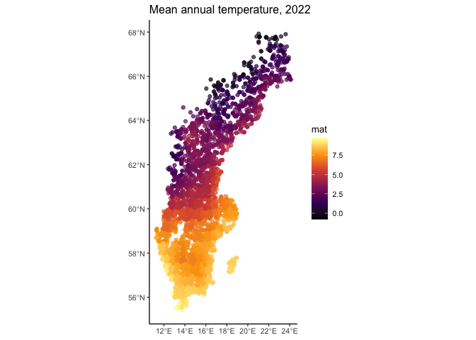

Get climatic variables for NFI plots
================
eleanorjackson
03 November, 2023

``` r
library("tidyverse")
library("here")
library("janitor")
library("tidymodels")
library("ncdf4")
library("sf")
```

Mean annual temperature and precipitation are going to be useful for
predicting soil carbon. But this data isn’t included in what we got from
Tord. [The Climatic Research
Unit](https://www.uea.ac.uk/groups-and-centres/climatic-research-unit)
has high-res global climate data available online
[here](https://crudata.uea.ac.uk/cru/data/hrg/).

I’ve just downloaded the most recent data for monthly average daily mean
temperature (degrees Celsius). They also have precipitation (millimetres
per month), but I’ll start with temp first.

The data is stored as a NetCDF file. I’m using this [this blog
post](https://pjbartlein.github.io/REarthSysSci/netCDF.html) to figure
out how to deal with that.

``` r
temp_nc <- nc_open(here::here("data", "raw", "cru_ts4.07.2021.2022.tmp.dat.nc"))

print(temp_nc)
```

    ## File /Users/eleanorjackson/Projects/tree/data/raw/cru_ts4.07.2021.2022.tmp.dat.nc (NC_FORMAT_CLASSIC):
    ## 
    ##      2 variables (excluding dimension variables):
    ##         float tmp[lon,lat,time]   
    ##             long_name: near-surface temperature
    ##             units: degrees Celsius
    ##             correlation_decay_distance: 1200
    ##             _FillValue: 9.96920996838687e+36
    ##             missing_value: 9.96920996838687e+36
    ##         int stn[lon,lat,time]   
    ##             description: number of stations contributing to each datum
    ##             _FillValue: -999
    ##             missing_value: -999
    ## 
    ##      3 dimensions:
    ##         lon  Size:720 
    ##             long_name: longitude
    ##             units: degrees_east
    ##         lat  Size:360 
    ##             long_name: latitude
    ##             units: degrees_north
    ##         time  Size:24   *** is unlimited *** 
    ##             long_name: time
    ##             units: days since 1900-1-1
    ##             calendar: gregorian
    ## 
    ##     8 global attributes:
    ##         Conventions: CF-1.4
    ##         title: CRU TS4.07 Mean Temperature
    ##         institution: Data held at British Atmospheric Data Centre, RAL, UK.
    ##         source: Run ID = 2304141047. Data generated from:tmp.2304141039.dtb
    ##         history: Fri 14 Apr 11:30:51 BST 2023 : User f098 : Program makegridsauto.for called by update.for
    ##         references: Information on the data is available at http://badc.nerc.ac.uk/data/cru/
    ##         comment: Access to these data is available to any registered CEDA user.
    ##         contact: support@ceda.ac.uk

``` r
# get the variables out
lon <- ncvar_get(temp_nc,"lon")
lat <- ncvar_get(temp_nc,"lat")
tmp_array <- ncvar_get(temp_nc, "tmp")

# replace missing values with NA
fill_value <- ncatt_get(temp_nc, "tmp", attname = "_FillValue")

tmp_array <- tmp_array %>% 
  na_if(fill_value$value) 
```

``` r
ncatt_get(temp_nc, "time", "units")
```

    ## $hasatt
    ## [1] TRUE
    ## 
    ## $value
    ## [1] "days since 1900-1-1"

``` r
date <- ncvar_get(temp_nc,"time") %>% 
  as.Date(origin = "1900-1-1")

date
```

    ##  [1] "2021-01-16" "2021-02-15" "2021-03-16" "2021-04-16" "2021-05-16"
    ##  [6] "2021-06-16" "2021-07-16" "2021-08-16" "2021-09-16" "2021-10-16"
    ## [11] "2021-11-16" "2021-12-16" "2022-01-16" "2022-02-15" "2022-03-16"
    ## [16] "2022-04-16" "2022-05-16" "2022-06-16" "2022-07-16" "2022-08-16"
    ## [21] "2022-09-16" "2022-10-16" "2022-11-16" "2022-12-16"

Ok, looks like we’ve got monthly average temperature for 2021 and 2022.

``` r
dim(tmp_array)
```

    ## [1] 720 360  24

The data is in a weird 3D raster format, with the third dimension being
the date. We should be able to visualise the data at a single time point
by selecting one “slice”.

``` r
image(lon, lat, tmp_array[ , , 1], col = viridis_pal(option = "B")(10))
```

<!-- -->

We need to reshape the data into a 2D data frame.

``` r
make_2d <- function(data_slice, lon, lat) {
  lonlat <- as.matrix(expand.grid(lon, lat))
  data_vec <- as.vector(data_slice)
  cbind(lonlat, data_vec) %>% 
    data.frame() 
}

data_list <- apply(X = tmp_array, MARGIN = 3, FUN = make_2d, 
      lon = lon, lat = lat)

names(data_list) <- date

flat_data <- bind_rows(data_list, .id = "date") %>% 
  rename("tmp" = "data_vec",
         "lon" = "Var1",
         "lat" = "Var2") %>% 
    drop_na()

glimpse(flat_data)
```

    ## Rows: 1,618,080
    ## Columns: 4
    ## $ date <chr> "2021-01-16", "2021-01-16", "2021-01-16", "2021-01-16", "2021-01-…
    ## $ lon  <dbl> -68.25, -67.75, -67.25, -70.75, -70.25, -69.75, -69.25, -68.75, -…
    ## $ lat  <dbl> -55.75, -55.75, -55.75, -55.25, -55.25, -55.25, -55.25, -55.25, -…
    ## $ tmp  <dbl> 8.800000, 9.000000, 8.600000, 8.800000, 9.200000, 8.400001, 8.700…

Get MAT (mean annual temperature).

``` r
mat_data <- flat_data %>% 
  mutate(year = substr(date, 1, 4)) %>% 
  group_by(lon, lat, year) %>% 
  summarise(mat = mean(tmp), .groups = "drop")

glimpse(mat_data)
```

    ## Rows: 134,840
    ## Columns: 4
    ## $ lon  <dbl> -179.75, -179.75, -179.75, -179.75, -179.75, -179.75, -179.75, -1…
    ## $ lat  <dbl> -16.25, -16.25, 65.25, 65.25, 65.75, 65.75, 66.25, 66.25, 66.75, …
    ## $ year <chr> "2021", "2022", "2021", "2022", "2021", "2022", "2021", "2022", "…
    ## $ mat  <dbl> 26.516667, 26.483334, -7.633333, -5.566667, -8.233334, -6.175000,…

Now we somehow need to match MAT to the NFI plots.

``` r
nfi_coords <- readxl::read_excel(
  here::here("data", "raw", "NFI plot coords NFI 2016-2020.xlsx"), 
  col_types = c("numeric", "text", "text", "numeric", "numeric", "numeric", 
                "numeric", "numeric", "numeric", "numeric", "numeric", 
                "numeric", "numeric")) %>% 
  select(-"...1") %>% 
  clean_names()
```

    ## New names:
    ## • `` -> `...1`

``` r
nfi_data <- readRDS(
  here::here("data", "derived", "ForManSims_RCP0_same_time.rds")
  ) %>% 
  filter(control_category_name == "Initial state") %>%
  mutate(description = str_replace_all(description, " ", "")) %>% 
  inner_join(nfi_coords)
```

    ## Joining with `by = join_by(description)`

Let’s try `st_join()` with `st_nearest_feature`, It should match each
plot to the nearest point in the climate data.

``` r
# convert coordinates to sf objects

nfi_data_sf <- st_as_sf(x = nfi_data,                         
           coords = c("ost_wgs84", "nord_wgs84"),
           crs = "WGS84")

# will just use 2022 for now
mat_data_sf <- mat_data %>% 
  filter(year == "2022") %>% 
  st_as_sf(coords = c("lon", "lat"),
           crs = "WGS84")

nfi_mat <- st_join(
  nfi_data_sf,
  mat_data_sf,
  join = st_nearest_feature)
```

``` r
ggplot() + 
  geom_sf(data = nfi_mat, 
          aes(colour = mat), 
          alpha = 0.7) +
  scale_colour_viridis_c(option = "B") +
  ggtitle("Mean annual temperature, 2022")
```

<!-- -->

Nice!

TO DO: precipitation and maybe get annual means for all years of period
zero NFI plots.
