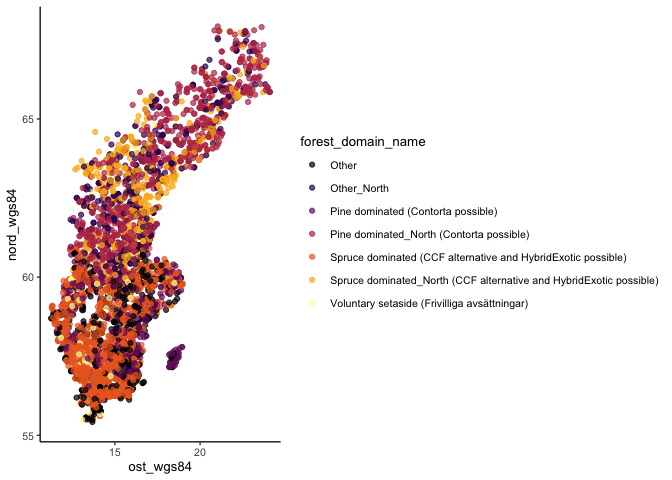

Buid random forests
================
eleanorjackson
14 November, 2023

**EL to build good RF models using all data? - both t and s. So we get
an idea of what the predictors are (see previous study review), and the
documentation of how soil carbon was measured. Avoid collider variables.
Check ITE accuracy.**

[{causalToolbox}](https://github.com/forestry-labs/causalToolbox)
package and [associated paper](https://arxiv.org/pdf/1706.03461.pdf).
<https://arxiv.org/pdf/1811.02833.pdf>

``` r
library("tidyverse")
library("here")
library("causalToolbox")
library("tidymodels")
```

``` r
data <-
  readRDS(here::here("data", "derived", "ForManSims_RCP0_same_time_clim.rds")) 
```

## Assign plots to a realised management regime

Random assignment where set aside is not treated (0) and BAU is treated
(1).

``` r
data %>% 
    select(description) %>% 
    distinct() -> id_list

id_list %>% 
  slice_sample(prop = 0.5) -> treat_ids

data %>%
  mutate(tr =
           case_when(description %in% treat_ids$description ~ 1,
                     .default = 0)) -> data_assigned

#select features 
data_assigned %>% 
  filter(period == 0) %>% 
  select(description, altitude, mat, map, region, 
         basal_area_conifer, basal_area_deciduous) -> features

data_assigned %>% 
  select(description, tr, control_category_name, total_soil_carbon) %>% 
  pivot_wider(id_cols = c(description, tr), names_from = control_category_name, values_from = total_soil_carbon) %>% 
  mutate(soil_carbon_obs = case_when(tr == 0 ~ `SetAside (Unmanaged)`,
                                tr == 1 ~ `BAU - NoThinning`)) %>% 
  rename(soil_carbon_initial = `Initial state`,
         soil_carbon_0 = `SetAside (Unmanaged)`, 
         soil_carbon_1 = `BAU - NoThinning`) %>% 
  left_join(features) -> data_obs
```

    ## Joining with `by = join_by(description)`

## test/train split

``` r
data_split <- initial_split(data_obs, prop = 1/3)
train_data <- training(data_split)
test_data <- testing(data_split)
```

## S-learner

*S_RF is an implementation of the S-Learner combined with Random Forests
[(Breiman 2001)](https://doi.org/10.1023/A:1010933404324).*

``` r
# create the hte object 
s_learn <- S_RF(feat = select(train_data, altitude, mat, map, region, basal_area_conifer, basal_area_deciduous, soil_carbon_initial), 
     tr = train_data$tr, yobs = train_data$soil_carbon_obs, nthread = 2)

# estimate the CATE
cate_s_learn <- EstimateCate(s_learn, 
                             select(test_data, altitude, mat, map, region, basal_area_conifer, basal_area_deciduous, soil_carbon_initial))

test_data %>% 
  mutate(cate_s_learn = cate_s_learn,
         cate_real = soil_carbon_1 - soil_carbon_0) %>% 
  ggplot() +
  geom_point(aes(x = cate_s_learn, y = cate_real))
```

<!-- -->

## T-learner

*T_RF is an implementation of the T-learner combined with Random Forest
[(Breiman 2001)](https://doi.org/10.1023/A:1010933404324) for both
response functions.*

``` r
# create the hte object 
t_learn <- T_RF(feat = select(train_data, altitude, mat, map, region, basal_area_conifer, basal_area_deciduous, soil_carbon_initial), 
     tr = train_data$tr, yobs = train_data$soil_carbon_obs, nthread = 2)

# estimate the CATE
cate_t_learn <- EstimateCate(t_learn, 
                             select(test_data, altitude, mat, map, region, basal_area_conifer, basal_area_deciduous, soil_carbon_initial))

test_data %>% 
  mutate(cate_t_learn = cate_t_learn,
         cate_real = soil_carbon_1 - soil_carbon_0) %>% 
  ggplot() +
  geom_point(aes(x = cate_t_learn, y = cate_real))
```

<!-- -->

## X-learner

*X_RF is an implementation of the X-learner with Random Forests
[(Breiman 2001)](https://doi.org/10.1023/A:1010933404324) in the first
and second stage.*

``` r
# create the hte object 
x_learn <- X_RF(feat = select(train_data, altitude, mat, map, region, basal_area_conifer, basal_area_deciduous, soil_carbon_initial), 
     tr = train_data$tr, yobs = train_data$soil_carbon_obs, nthread = 2)

# estimate the CATE
cate_x_learn <- EstimateCate(x_learn, 
                             select(test_data, altitude, mat, map, region, basal_area_conifer, basal_area_deciduous, soil_carbon_initial))

test_data %>% 
  mutate(cate_t_learn = cate_x_learn,
         cate_real = soil_carbon_1 - soil_carbon_0) %>% 
  ggplot() +
  geom_point(aes(x = cate_x_learn, y = cate_real))
```

<!-- -->
