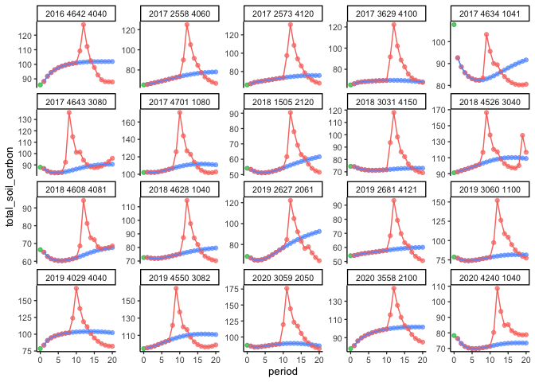
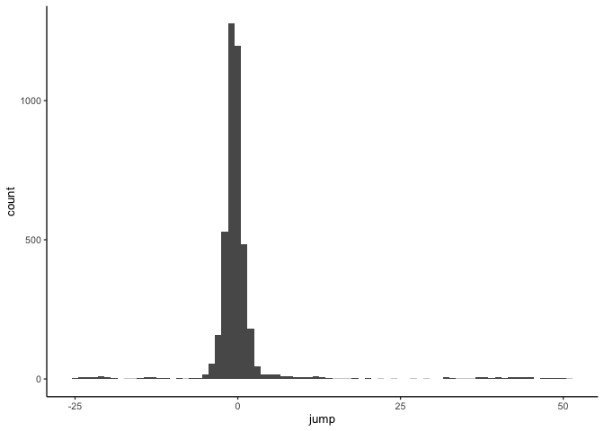
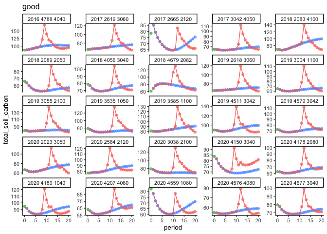
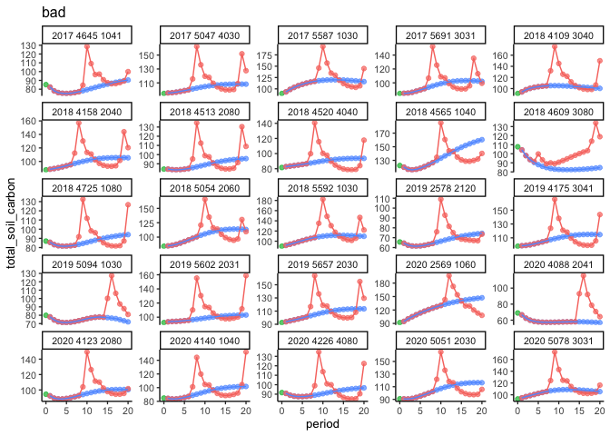

Identify plots which have been thinned twice
================
eleanorjackson
01 December, 2023

We have a problem where plots are still included which have a second
round of thinning, causing soil carbon at period 20 to be much higher
than it should be.

``` r
library("tidyverse")
library("here")
```

``` r
data <-
  readRDS(here::here("data", "derived", "ForManSims_RCP0_same_time.rds")) 
```

``` r
sample_n_groups = function(tbl, size, replace = FALSE, weight = NULL) {
    # regroup when done
    grps = tbl %>% groups %>% lapply(as.character) %>% unlist
    # check length of groups non-zero
    keep = tbl %>% summarise() %>% ungroup() %>% sample_n(size, replace, weight)
    # keep only selected groups, regroup because joins change count.
    # regrouping may be unnecessary but joins do something funky to grouping variable
    tbl %>% right_join(keep, by=grps) %>% group_by_(.dots = grps)
}
```

``` r
data %>%
  group_by(description) %>% 
  sample_n_groups(size = 20) %>% 
  ggplot(aes(x = period, y = total_soil_carbon, 
             colour = as.factor(control_category_name))) +
  geom_point(alpha = 0.7) +
  geom_line() +
  facet_wrap(~description, scales = "free_y") +
  theme(legend.position = "none")
```

<!-- -->

``` r
data %>%
  filter(control_category_name == "BAU - NoThinning") %>% 
  filter(period == 20 |
           period == 19) %>% 
  pivot_wider(id_cols = description, 
              values_from = total_soil_carbon, 
              names_from = period) %>% 
  mutate(jump = `20` - `19`) %>% 
  ggplot() +
  geom_histogram(aes(x = jump), binwidth = 1)
```

<!-- -->

Let’s say that we only want the difference between point 19 and point 20
to be between -5 and 5.

``` r
data %>%
  filter(control_category_name == "BAU - NoThinning") %>% 
  filter(period == 20 |
           period == 19) %>% 
  pivot_wider(id_cols = description, 
              values_from = total_soil_carbon, 
              names_from = period) %>% 
  mutate(jump = `20` - `19`) %>% 
  filter(jump < 5 & jump > -5) %>% 
  select(description) -> small_jumps

data %>%
  filter(description %in% small_jumps$description) %>% 
  group_by(description) %>% 
  sample_n_groups(size = 25) %>% 
  ggplot(aes(x = period, y = total_soil_carbon, 
             colour = as.factor(control_category_name))) +
  geom_point(alpha = 0.7) +
  geom_line() +
  facet_wrap(~description, scales = "free_y") +
  theme(legend.position = "none") +
  ggtitle("good")
```

<!-- -->

``` r
data %>%
  filter(! description %in% small_jumps$description) %>% 
  group_by(description) %>% 
  sample_n_groups(size = 25) %>% 
  ggplot(aes(x = period, y = total_soil_carbon, 
             colour = as.factor(control_category_name))) +
  geom_point(alpha = 0.7) +
  geom_line() +
  facet_wrap(~description, scales = "free_y") +
  theme(legend.position = "none") +
  ggtitle("bad")
```

<!-- -->

There are 9,922 bad plots and 162,237 good plots.
