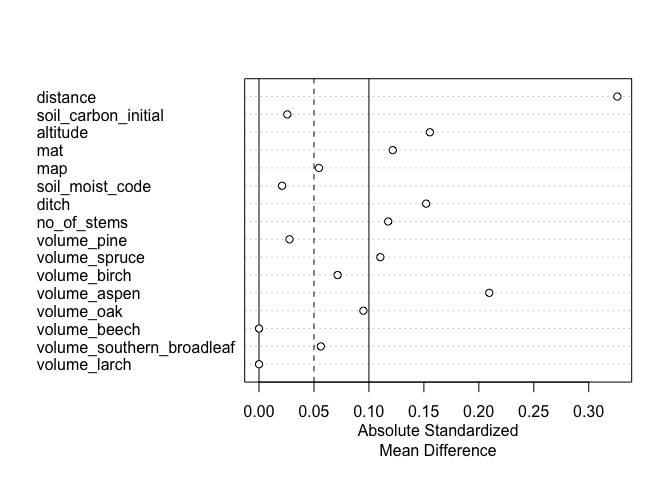
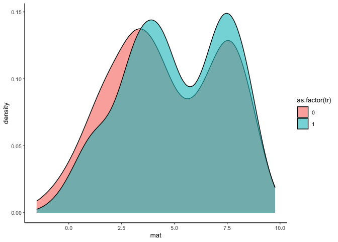
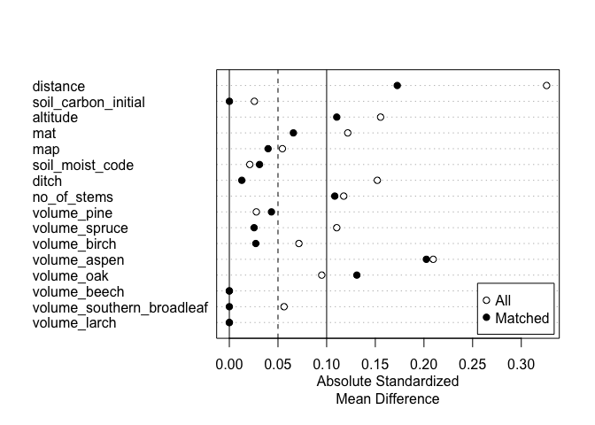
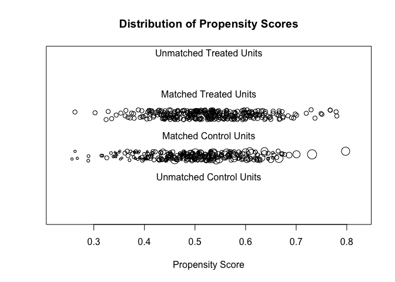
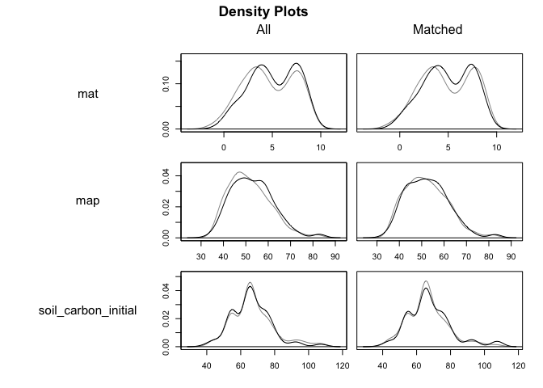

Matching
================
eleanorjackson
05 December, 2023

**‘We define “matching” broadly to be any method that aims to equate (or
“balance”) the distribution of covariates in the treated and control
groups.’ ([Stuart 2010](https://doi.org/10.1214%2F09-STS313))**

We want to test the effect that matching your training data might have
on predictions of the ITE.

In this notebook I’m going to explore what
{[MatchIt](https://kosukeimai.github.io/MatchIt/)} has to offer and
learn how to use it.

``` r
library("tidyverse")
library("here")
library("MatchIt")
library("tidymodels")
```

# Prep data

``` r
data <- 
  readRDS(here::here("data", "derived", "ForManSims_RCP0_same_time_clim.rds"))
```

## Select spruce dominated plots only

``` r
data %>% 
  filter(period == 0) %>% 
  mutate(prop_pine = volume_pine/ standing_volume) %>% 
  filter(prop_pine >= 0.5) %>% 
  select(description) -> spruce_dom_plots

data %>% 
  filter(description %in% spruce_dom_plots$description) -> data_spruce 
```

## Assign plots to a realised management regime

Random assignment where set aside is not treated (0) and BAU is treated
(1).

``` r
data_spruce %>% 
    select(description) %>% 
    distinct() -> id_list

id_list %>% 
  slice_sample(prop = 0.5) -> treat_ids

data_spruce %>%
  mutate(tr =
           case_when(description %in% treat_ids$description ~ 1,
                     .default = 0)) -> data_assigned
```

## Select features

``` r
data_assigned %>%
  filter(period == 0) %>%
  select(
    description,
    soil_moist_code,
    altitude, mat, map, ditch, no_of_stems, volume_pine, volume_spruce,
    volume_birch, volume_aspen, volume_oak, volume_beech, 
    volume_southern_broadleaf, volume_larch
  ) -> features

data_assigned %>% 
  select(description, tr, control_category_name, total_soil_carbon) %>% 
  pivot_wider(id_cols = c(description, tr), names_from = control_category_name, values_from = total_soil_carbon) %>% 
  mutate(soil_carbon_obs = case_when(tr == 0 ~ `SetAside (Unmanaged)`,
                                tr == 1 ~ `BAU - NoThinning`)) %>% 
  rename(soil_carbon_initial = `Initial state`,
         soil_carbon_0 = `SetAside (Unmanaged)`, 
         soil_carbon_1 = `BAU - NoThinning`) %>% 
  left_join(features) -> data_obs
```

    ## Joining with `by = join_by(description)`

## Test and train

``` r
data_split <- initial_split(data_obs, prop = 1/3)
train_data <- training(data_split)
test_data <- testing(data_split)
```

# Matching

Following [this
vignette](https://kosukeimai.github.io/MatchIt/articles/MatchIt.html).

## Check Initial Imbalance

Usually the method argument specifies the method of matching to be
performed. Here, we set it to NULL so we can assess balance prior to
matching.

``` r
out_initial <-
  matchit(
    tr ~ soil_carbon_initial + altitude + mat + map + soil_moist_code + ditch +
      no_of_stems + volume_pine + volume_spruce + volume_birch + volume_aspen + 
      volume_oak + volume_beech + volume_southern_broadleaf + volume_larch,
    data = train_data,
    method = NULL,
    distance = "glm"
  )

summary(out_initial)
```

    ## 
    ## Call:
    ## matchit(formula = tr ~ soil_carbon_initial + altitude + mat + 
    ##     map + soil_moist_code + ditch + no_of_stems + volume_pine + 
    ##     volume_spruce + volume_birch + volume_aspen + volume_oak + 
    ##     volume_beech + volume_southern_broadleaf + volume_larch, 
    ##     data = train_data, method = NULL, distance = "glm")
    ## 
    ## Summary of Balance for All Data:
    ##                           Means Treated Means Control Std. Mean Diff.
    ## distance                         0.5350        0.5084          0.3260
    ## soil_carbon_initial             67.9480       67.6145          0.0258
    ## altitude                       216.3861      237.8028         -0.1554
    ## mat                              5.0349        4.7296          0.1217
    ## map                             52.8582       52.3145          0.0545
    ## soil_moist_code                  2.0633        2.0727         -0.0210
    ## ditch                            0.0791        0.0381          0.1521
    ## no_of_stems                   1647.1393     1819.7094         -0.1175
    ## volume_pine                    113.2990      115.0263         -0.0277
    ## volume_spruce                   14.0990       11.8264          0.1104
    ## volume_birch                     7.7490        6.7290          0.0715
    ## volume_aspen                     0.0313        0.1183         -0.2095
    ## volume_oak                       0.0627        0.1189         -0.0950
    ## volume_beech                     0.0000        0.0000          0.0000
    ## volume_southern_broadleaf        0.0167        0.0000          0.0563
    ## volume_larch                     0.0000        0.0000          0.0000
    ##                           Var. Ratio eCDF Mean eCDF Max
    ## distance                      1.0521    0.0931   0.1752
    ## soil_carbon_initial           0.8875    0.0240   0.0641
    ## altitude                      0.8270    0.0357   0.0681
    ## mat                           0.9294    0.0316   0.1012
    ## map                           1.1260    0.0138   0.0519
    ## soil_moist_code               0.9980    0.0038   0.0112
    ## ditch                              .    0.0411   0.0411
    ## no_of_stems                   0.5424    0.0183   0.0578
    ## volume_pine                   1.0103    0.0159   0.0554
    ## volume_spruce                 1.1550    0.0486   0.1076
    ## volume_birch                  1.1965    0.0246   0.0595
    ## volume_aspen                  0.0523    0.0016   0.0038
    ## volume_oak                    0.1874    0.0029   0.0069
    ## volume_beech                       .    0.0000   0.0000
    ## volume_southern_broadleaf        N/A    0.0016   0.0032
    ## volume_larch                       .    0.0000   0.0000
    ## 
    ## Sample Sizes:
    ##           Control Treated
    ## All           289     316
    ## Matched       289     316
    ## Unmatched       0       0
    ## Discarded       0       0

``` r
plot(summary(out_initial))
```

<!-- -->

Smaller values for `Std. Mean Diff.` indicate better balance,
`eCDF Mean` and `eCDF Max` should be close to zero with `Var. Ratio`
close to one.

It looks like `volume_birch` is the most unbalanced.

``` r
ggplot(train_data) +
  geom_density(aes(x = volume_birch, 
                   fill = as.factor(tr), 
                   group = as.factor(tr)), 
               alpha = 0.6)
```

<!-- -->

Looks quite well matched to me.. but not perfect. Let’s see what
matching does.

## Matching

Now we set the `method` to the matching method we want. [There are
several](https://kosukeimai.github.io/MatchIt/articles/matching-methods.html#matching-methods)
to choose from…

*“The criteria on which a matching specification should be judged are
balance and remaining (effective) sample size after matching.”*

*“If the target of inference is the ATE, optimal or generalized full
matching, subclassification, or profile matching can be used.”*

*“For large datasets, neither optimal full matching nor profile matching
may be possible, in which case generalised full matching and
subclassification are faster solutions.”*

It seems like optimal pair matching would be best
(`method = "optimal"`), but if it’s too slow we could go for generalised
full matching (`method = "quick"`).

``` r
out_matched <-
  matchit(
    tr ~ soil_carbon_initial + altitude + mat + map + soil_moist_code + ditch +
      no_of_stems + volume_pine + volume_spruce + volume_birch + volume_aspen + 
      volume_oak + volume_beech + volume_southern_broadleaf + volume_larch,
    data = train_data,
    method = "optimal",
    distance = "glm"
  )
```

    ## Warning: Fewer control units than treated units; not all treated units will get
    ## a match.

``` r
print(out_matched)
```

    ## A matchit object
    ##  - method: 1:1 optimal pair matching
    ##  - distance: Propensity score
    ##              - estimated with logistic regression
    ##  - number of obs.: 605 (original), 578 (matched)
    ##  - target estimand: ATT
    ##  - covariates: soil_carbon_initial, altitude, mat, map, soil_moist_code, ditch, no_of_stems, volume_pine, volume_spruce, volume_birch, volume_aspen, volume_oak, volume_beech, volume_southern_broadleaf, volume_larch

``` r
summary(out_matched, un = FALSE)
```

    ## 
    ## Call:
    ## matchit(formula = tr ~ soil_carbon_initial + altitude + mat + 
    ##     map + soil_moist_code + ditch + no_of_stems + volume_pine + 
    ##     volume_spruce + volume_birch + volume_aspen + volume_oak + 
    ##     volume_beech + volume_southern_broadleaf + volume_larch, 
    ##     data = train_data, method = "optimal", distance = "glm")
    ## 
    ## Summary of Balance for Matched Data:
    ##                           Means Treated Means Control Std. Mean Diff.
    ## distance                         0.5225        0.5084          0.1726
    ## soil_carbon_initial             67.6135       67.6145         -0.0001
    ## altitude                       222.5952      237.8028         -0.1104
    ## mat                              4.8948        4.7296          0.0658
    ## map                             52.7115       52.3145          0.0398
    ## soil_moist_code                  2.0588        2.0727         -0.0310
    ## ditch                            0.0415        0.0381          0.0128
    ## no_of_stems                   1660.6937     1819.7094         -0.1083
    ## volume_pine                    112.3315      115.0263         -0.0433
    ## volume_spruce                   12.3506       11.8264          0.0255
    ## volume_birch                     7.1168        6.7290          0.0272
    ## volume_aspen                     0.0342        0.1183         -0.2025
    ## volume_oak                       0.0414        0.1189         -0.1310
    ## volume_beech                     0.0000        0.0000          0.0000
    ## volume_southern_broadleaf        0.0000        0.0000          0.0000
    ## volume_larch                     0.0000        0.0000          0.0000
    ##                           Var. Ratio eCDF Mean eCDF Max Std. Pair Dist.
    ## distance                      0.7566    0.0577   0.1349          0.1743
    ## soil_carbon_initial           0.9048    0.0135   0.0415          1.0166
    ## altitude                      0.8450    0.0237   0.0519          0.9404
    ## mat                           0.9319    0.0204   0.0761          1.0140
    ## map                           1.1144    0.0136   0.0484          1.0342
    ## soil_moist_code               1.0092    0.0035   0.0069          0.7288
    ## ditch                              .    0.0035   0.0035          0.1410
    ## no_of_stems                   0.5266    0.0172   0.0484          0.9904
    ## volume_pine                   1.0244    0.0194   0.0554          1.1268
    ## volume_spruce                 0.8759    0.0295   0.0900          0.8543
    ## volume_birch                  1.0914    0.0159   0.0519          0.7751
    ## volume_aspen                  0.0572    0.0014   0.0035          0.3673
    ## volume_oak                    0.0916    0.0031   0.0069          0.2708
    ## volume_beech                       .    0.0000   0.0000          0.0000
    ## volume_southern_broadleaf          .    0.0000   0.0000          0.0000
    ## volume_larch                       .    0.0000   0.0000          0.0000
    ## 
    ## Sample Sizes:
    ##           Control Treated
    ## All           289     316
    ## Matched       289     289
    ## Unmatched       0      27
    ## Discarded       0       0

``` r
plot(summary(out_matched))
```

<!-- -->

## Assessing the Quality of Matches

``` r
plot(out_matched, type = "jitter", interactive = FALSE)
```

<!-- -->

We don’t have any unmatched units, which is good.

``` r
plot(out_matched, type = "density", interactive = FALSE,
     which.xs = ~ volume_birch + ditch + map)
```

<!-- -->

I can’t see much difference, but I guess the treatment groups were
already quite well matched.

We can extract the matched data.

``` r
matched_data <- match.data(out_matched)

glimpse(matched_data)
```

    ## Rows: 578
    ## Columns: 23
    ## $ description               <chr> "201835961050", "201715193120", "20172697312…
    ## $ tr                        <dbl> 0, 1, 0, 1, 0, 0, 0, 0, 1, 0, 0, 1, 1, 0, 0,…
    ## $ soil_carbon_initial       <dbl> 54.13351, 54.21619, 54.48513, 107.56960, 55.…
    ## $ soil_carbon_0             <dbl> 68.74851, 49.10580, 58.11764, 110.06690, 59.…
    ## $ soil_carbon_1             <dbl> 62.40365, 46.08447, 49.64525, 102.28420, 51.…
    ## $ soil_carbon_obs           <dbl> 68.74851, 46.08447, 58.11764, 102.28420, 59.…
    ## $ soil_moist_code           <int> 2, 2, 2, 3, 1, 2, 3, 2, 2, 2, 2, 2, 2, 2, 2,…
    ## $ altitude                  <int> 607, 390, 177, 77, 284, 311, 270, 37, 12, 75…
    ## $ mat                       <dbl> 2.78333335, 0.77499994, 0.08333334, 6.608333…
    ## $ map                       <dbl> 42.52500, 49.76667, 43.66667, 45.48333, 57.7…
    ## $ ditch                     <int> 0, 0, 0, 0, 0, 0, 0, 0, 0, 0, 0, 0, 0, 0, 0,…
    ## $ no_of_stems               <dbl> 2801.1200, 763.9420, 2259.9950, 1527.8840, 9…
    ## $ volume_pine               <dbl> 44.75982, 51.64837, 117.70550, 102.51750, 72…
    ## $ volume_spruce             <dbl> 5.783790, 0.000000, 4.027051, 10.125820, 16.…
    ## $ volume_birch              <dbl> 18.286330, 0.000000, 0.000000, 23.104450, 0.…
    ## $ volume_aspen              <dbl> 0, 0, 0, 0, 0, 0, 0, 0, 0, 0, 0, 0, 0, 0, 0,…
    ## $ volume_oak                <dbl> 0.00000, 0.00000, 0.00000, 0.00000, 0.00000,…
    ## $ volume_beech              <dbl> 0, 0, 0, 0, 0, 0, 0, 0, 0, 0, 0, 0, 0, 0, 0,…
    ## $ volume_southern_broadleaf <dbl> 0, 0, 0, 0, 0, 0, 0, 0, 0, 0, 0, 0, 0, 0, 0,…
    ## $ volume_larch              <dbl> 0, 0, 0, 0, 0, 0, 0, 0, 0, 0, 0, 0, 0, 0, 0,…
    ## $ distance                  <dbl> 0.3995060, 0.4722327, 0.4776318, 0.5176498, …
    ## $ weights                   <dbl> 1, 1, 1, 1, 1, 1, 1, 1, 1, 1, 1, 1, 1, 1, 1,…
    ## $ subclass                  <fct> 1, 13, 112, 98, 213, 224, 235, 246, 226, 257…

`distance`, `weights` and `subclass` columns have been added to the
data. When we model the data, we’re supposed to include the matching
weights in the estimation.
