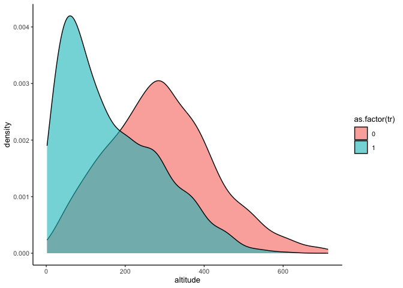
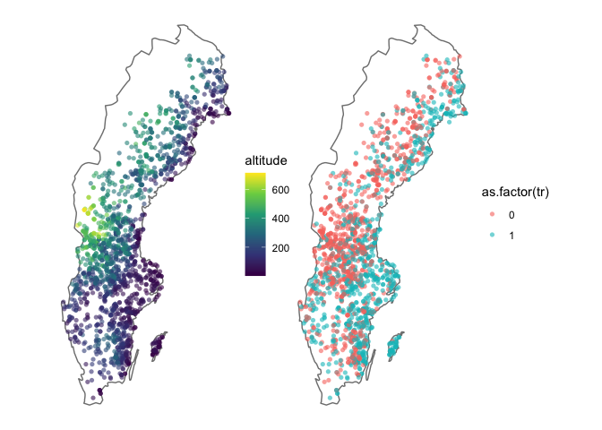

Correlated treatment assignment
================
eleanorjackson
11 December, 2023

In observational studies, treatment assignment is beyond the control of
the observer. Often non-random. E.g., Two-level treatments often have
confounding variation (e.g., unlogged stands located on steeper, higher,
less productive slopes than logged stands).

Here, I’m going to try and correlate treatment assignment with
slope/altitude.

``` r
library("tidyverse")
library("here")
library("maps")
library("patchwork")
```

``` r
data <- 
  readRDS(here::here("data", "derived", "ForManSims_RCP0_same_time_clim.rds"))
```

Select spruce dominated plots only.

``` r
data %>% 
  filter(period == 0) %>% 
  mutate(prop_pine = volume_pine/ standing_volume) %>% 
  filter(prop_pine >= 0.5) %>% 
  select(description) -> spruce_dom_plots

data %>% 
  filter(description %in% spruce_dom_plots$description) %>% 
  filter(period == 0) -> data_spruce 
```

I’m going to try using the `weight_by` argument in `slice_sample`. This
should mean that plots with higher altitudes are more likely to be
assigned to the non-treatment group.

``` r
data_spruce %>% 
    select(description, altitude) %>% 
    distinct() -> id_list

id_list %>% 
  slice_sample(prop = 0.5, 
               weight_by = altitude) %>% 
  select(description) -> no_treat_ids

data_spruce %>%
  mutate(tr =
           case_when(description %in% no_treat_ids$description ~ 0,
                     .default = 1)) -> data_assigned
```

``` r
ggplot(data_assigned) +
  geom_density(aes(x = altitude, 
                   group = as.factor(tr), 
                   fill = as.factor(tr)),
               alpha = 0.6)
```

<!-- -->

``` r
ggplot(data_assigned, aes(ost_wgs84, nord_wgs84, colour = altitude)) +
  borders("world", regions = "sweden") +
  geom_point(alpha = 0.6, shape = 16) +
  scale_color_viridis_c() +
  coord_quickmap() +
  theme_void() -> p1

ggplot(data_assigned, aes(ost_wgs84, nord_wgs84, colour = as.factor(tr))) +
  borders("world", regions = "sweden") +
  geom_point(alpha = 0.6, shape = 16) +
  coord_quickmap() +
  theme_void() -> p2

p1 + p2
```

<!-- -->

Looks like that worked pretty well!

I wonder if we can get slope from anywhere? Slope = amount of elevation
change divided by the amount of horizontal distance covered.

We only have point x,y values for the plots, is this the middle of the
plot or one of the corners? To calculate slope we’d need continuous
altitude/elevation data for Sweden (which we could probably find online)
and boundaries of the plots (which we could guess as a square around our
points).
