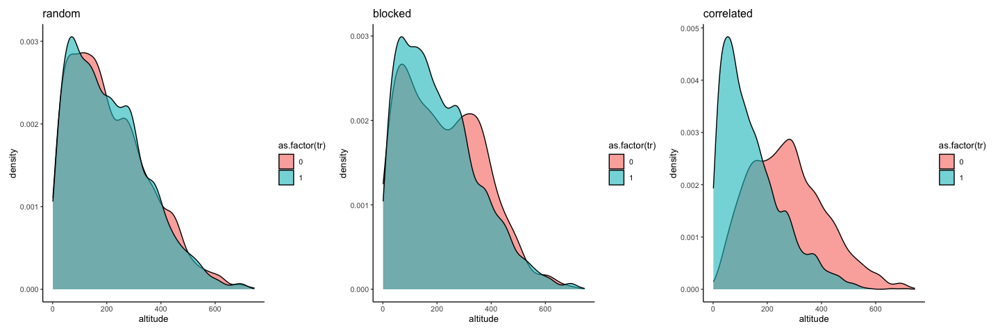
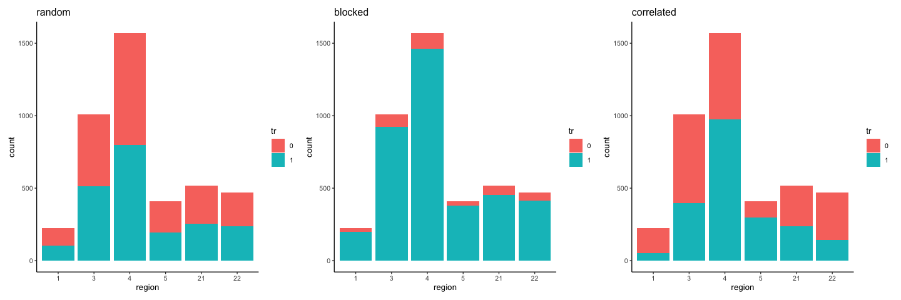
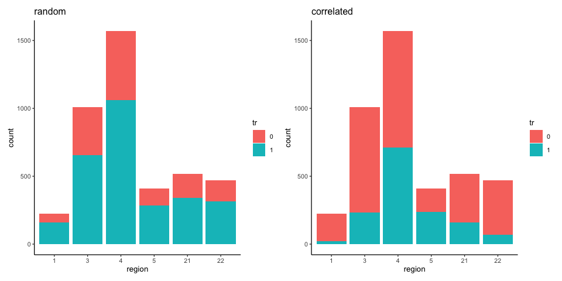

Testing the `assign_treatment` function
================
eleanorjackson
12 December, 2023

``` r
library("tidyverse")
library("patchwork")
library("here")
set.seed(123)
```

``` r
data <-
  readRDS(here::here("data", "derived", "ForManSims_RCP0_same_time_clim.rds"))
```

``` r
function_dir <- list.files(here::here("code", "functions"),
                           full.names = TRUE)

sapply(function_dir, source)
```

``` r
data_random <- 
  assign_treatment(df = data, assignment = "random")

data_blocked <-
  assign_treatment(df = data, assignment = "blocked")

data_correlated <-
  assign_treatment(df = data, assignment = "correlated")
```

``` r
plot_altitude <- function(df, name) {
  ggplot(data = df) +
   geom_density(aes(x = altitude, 
                   group = as.factor(tr), 
                   fill = as.factor(tr)),
               alpha = 0.6) +
    ggtitle(name)
}

plot_altitude(data_random, "random") + 
  plot_altitude(data_blocked, "blocked") +
  plot_altitude(data_correlated, "correlated") 
```

<!-- -->

``` r
plot_region <- function(df, name) {
  df %>% 
    select(description, region, tr) %>% 
    mutate(tr = as.factor(tr),
           region = as.factor(region)) %>% 
  distinct() %>% 
  ggplot(aes(x = region, fill = tr)) +
    geom_bar(stat = "count") +
    ggtitle(name)
}

plot_region(data_random, "random") + 
  plot_region(data_blocked, "blocked") +
  plot_region(data_correlated, "correlated") 
```

<!-- -->

Testing sample imbalance in treated vs non-treated with the
`proportion_not_treated` argument.

``` r
data_random_33 <- 
  assign_treatment(df = data, assignment = "random",
                   proportion_not_treated = 0.33)

data_correlated_66 <-
  assign_treatment(df = data, assignment = "correlated",
                   proportion_not_treated = 0.66)

plot_region(data_random_33, "random") + 
  plot_region(data_correlated_66, "correlated") 
```

<!-- -->
