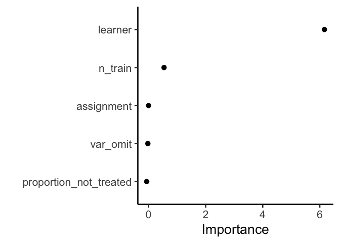
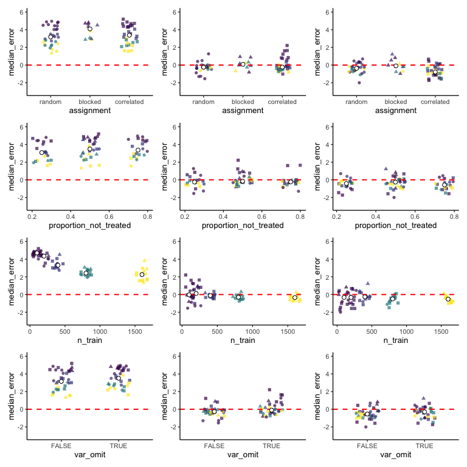

Fit the meta-meta model and explore preliminary results
================
eleanorjackson
08 January, 2024

``` r
library("tidyverse")
library("here")
library("tidymodels")
library("vip")

set.seed(123)
```

Import the median ITE prediction errors (generated by
[get-ite-predictions.R](/code/scripts/get-ite-predictions.R))

``` r
ml_results <- readRDS(here("data", "derived", "results.rds"))

glimpse(ml_results)
```

    ## Rows: 210
    ## Columns: 7
    ## $ test_id                <chr> "blocked_0.5_100_s_FALSE", "blocked_0.5_100_s_T…
    ## $ assignment             <fct> blocked, blocked, blocked, blocked, blocked, bl…
    ## $ proportion_not_treated <dbl> 0.5, 0.5, 0.5, 0.5, 0.5, 0.5, 0.5, 0.5, 0.5, 0.…
    ## $ n_train                <dbl> 100, 100, 100, 100, 100, 100, 1600, 1600, 1600,…
    ## $ learner                <fct> s, s, t, t, x, x, s, s, t, t, x, x, s, s, t, t,…
    ## $ var_omit               <lgl> FALSE, TRUE, FALSE, TRUE, FALSE, TRUE, FALSE, T…
    ## $ median_error           <dbl> 4.72733606, 4.81286908, -0.01257151, -0.8119947…

I’m just going to do a quick glm for curiosity’s sake.

``` r
glm(median_error ~ learner + 
      n_train + 
      proportion_not_treated +
      assignment +
      var_omit, 
    ml_results, family = gaussian) -> glm_out

summary(glm_out)
```

    ## 
    ## Call:
    ## glm(formula = median_error ~ learner + n_train + proportion_not_treated + 
    ##     assignment + var_omit, family = gaussian, data = ml_results)
    ## 
    ## Deviance Residuals: 
    ##      Min        1Q    Median        3Q       Max  
    ## -1.70816  -0.45986   0.04652   0.52597   1.83533  
    ## 
    ## Coefficients:
    ##                          Estimate Std. Error t value Pr(>|t|)    
    ## (Intercept)             3.527e+00  1.807e-01  19.522  < 2e-16 ***
    ## learnert               -3.491e+00  1.199e-01 -29.120  < 2e-16 ***
    ## learnerx               -3.847e+00  1.199e-01 -32.086  < 2e-16 ***
    ## n_train                -6.870e-04  8.972e-05  -7.657 7.72e-13 ***
    ## proportion_not_treated  1.836e-01  2.590e-01   0.709  0.47918    
    ## assignmentblocked       4.289e-01  1.495e-01   2.869  0.00456 ** 
    ## assignmentcorrelated    4.852e-02  1.057e-01   0.459  0.64680    
    ## var_omitTRUE            2.714e-01  9.789e-02   2.773  0.00607 ** 
    ## ---
    ## Signif. codes:  0 '***' 0.001 '**' 0.01 '*' 0.05 '.' 0.1 ' ' 1
    ## 
    ## (Dispersion parameter for gaussian family taken to be 0.5030609)
    ## 
    ##     Null deviance: 772.16  on 209  degrees of freedom
    ## Residual deviance: 101.62  on 202  degrees of freedom
    ## AIC: 461.52
    ## 
    ## Number of Fisher Scoring iterations: 2

## Fit random forest

### train test split

``` r
data_split <- initial_split(ml_results, prop = 1/3)
train_data <- training(data_split)
test_data <- testing(data_split)
```

### tune hyperparameters

``` r
rf_tune <- rand_forest(mtry = tune(), min_n = tune()) %>%
  set_engine("ranger", num.threads = 3) %>%
  set_mode("regression")

tree_grid <- grid_regular(mtry(c(1, 5)),
                          min_n(),
                          levels = 5)

rf_recipe <- recipe(median_error ~ 
                      assignment + proportion_not_treated + 
                      n_train + learner + var_omit,
    data = train_data)

rf_workflow <- workflow() %>%
  add_recipe(rf_recipe) %>%
  add_model(rf_tune)

# create a set of cross-validation resamples to use for tuning
trees_folds <- vfold_cv(train_data, v = 25)

rf_tune_res <- 
  tune_grid(rf_workflow,
            resamples = trees_folds,
            grid = tree_grid,
            control = control_grid(save_pred = TRUE),
            metrics = metric_set(rmse))

best_auc <- select_best(rf_tune_res, "rmse")

final_rf <- finalize_model(
  rf_tune,
  best_auc
)

final_rf
```

    ## Random Forest Model Specification (regression)
    ## 
    ## Main Arguments:
    ##   mtry = 3
    ##   min_n = 2
    ## 
    ## Engine-Specific Arguments:
    ##   num.threads = 3
    ## 
    ## Computational engine: ranger

### vip

``` r
final_rf %>%
  set_engine("ranger", importance = "permutation") %>%
  fit(median_error ~ .,
    data = ml_results %>% select(-test_id)
  ) %>%
  vip(geom = "point")
```

<!-- -->

### fit model

``` r
final_wf <- workflow() %>%
  add_recipe(rf_recipe) %>%
  add_model(final_rf)

final_res <- final_wf %>%
  last_fit(data_split)

final_res %>%
  collect_metrics()
```

    ## # A tibble: 2 × 4
    ##   .metric .estimator .estimate .config             
    ##   <chr>   <chr>          <dbl> <chr>               
    ## 1 rmse    standard       0.765 Preprocessor1_Model1
    ## 2 rsq     standard       0.866 Preprocessor1_Model1

``` r
# final_res %>%
#   collect_predictions()
```

## Visualise!

``` r
plot_panels <- function(meta_learner, x_var, data) {
  data %>% 
    filter(learner == meta_learner) %>% 
    ggplot(aes(y = .data$median_error, x = .data[[x_var]] )) +
    geom_jitter(width = 0.1, alpha = 0.5, size = 0.5) +
    ylim(-3, 6) +
    geom_hline(yintercept = 0, colour = "red", size = 0.1, linetype = 2) +
    theme_classic(base_size = 6)
}

keys <- expand.grid(
  meta_learner = c("s", "t", "x"),
  x_var = c("assignment", "proportion_not_treated", "n_train", "var_omit")
  ) %>% 
  mutate(x_var = as.character(x_var)) %>% 
  arrange(meta_learner)

purrr::pmap(list(meta_learner = keys$meta_learner,
          x_var = keys$x_var), plot_panels, data = ml_results) -> plot_list
```

    ## Warning: Using `size` aesthetic for lines was deprecated in ggplot2 3.4.0.
    ## ℹ Please use `linewidth` instead.
    ## This warning is displayed once every 8 hours.
    ## Call `lifecycle::last_lifecycle_warnings()` to see where this warning was
    ## generated.

``` r
patchwork::wrap_plots(plot_list)
```

<!-- -->

First row is s, then t, then x.
