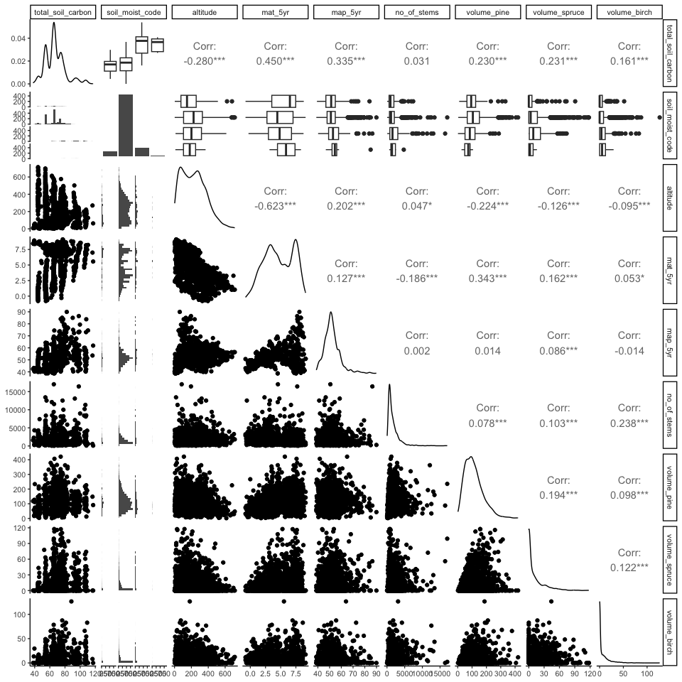
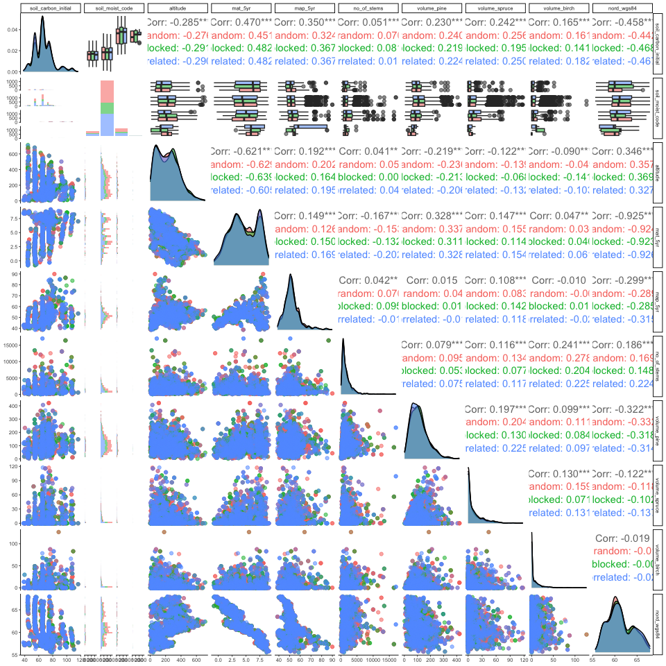

Exploring the ‘spatially blocked’ treatment assignment variable
================
eleanorjackson
15 January, 2024

X-learner isn’t doing as well as expected. Emma suggested it could be
because the “spatially blocking” treatment assignment could be inducing
more collinearity than the correlation with latitude.

``` r
library("tidyverse")
library("here")
library("GGally")

clean_data <-
  readRDS(here::here("data", "derived", "ForManSims_RCP0_same_time_clim.rds"))
```

``` r
feat_list <- c("total_soil_carbon", "altitude",
                   "mat_5yr", "map_5yr", "ditch", "no_of_stems", "volume_pine",
                   "volume_spruce", "volume_birch", "volume_aspen",
                   "volume_oak", "volume_beech", "soil_moist_code",
                   "volume_southern_broadleaf", "volume_larch")

feat_list_sm <- c("total_soil_carbon", "soil_moist_code", "altitude",
                   "mat_5yr", "map_5yr", "no_of_stems", "volume_pine",
                   "volume_spruce", "volume_birch")

clean_data %>% 
  filter(period == 0) %>%
  mutate(ditch = as.factor(ditch),
         soil_moist_code = as.ordered(soil_moist_code)) %>% 
  select(all_of(feat_list_sm)) %>% 
  ggpairs(progress = FALSE)
```

<!-- -->

``` r
out_tr_assignment <- 
  readRDS(here("data", "derived", "model_out.rds")) %>% 
  filter(var_omit == FALSE, 
         n_train == 1600, 
         proportion_not_treated == 0.50) %>% 
  unnest(df_out)

feat_list_sm_out <- c("soil_carbon_initial", "soil_moist_code", "altitude",
                   "mat_5yr", "map_5yr", "no_of_stems", "volume_pine",
                   "volume_spruce", "volume_birch", "nord_wgs84")

out_tr_assignment %>% 
  mutate(soil_moist_code = as.ordered(soil_moist_code)) %>% 
  ggpairs(progress = FALSE, 
          columns = feat_list_sm_out,
          mapping = aes(colour = assignment, alpha = 0.5)) +
  theme_classic(base_size = 7)
```

<!-- -->
