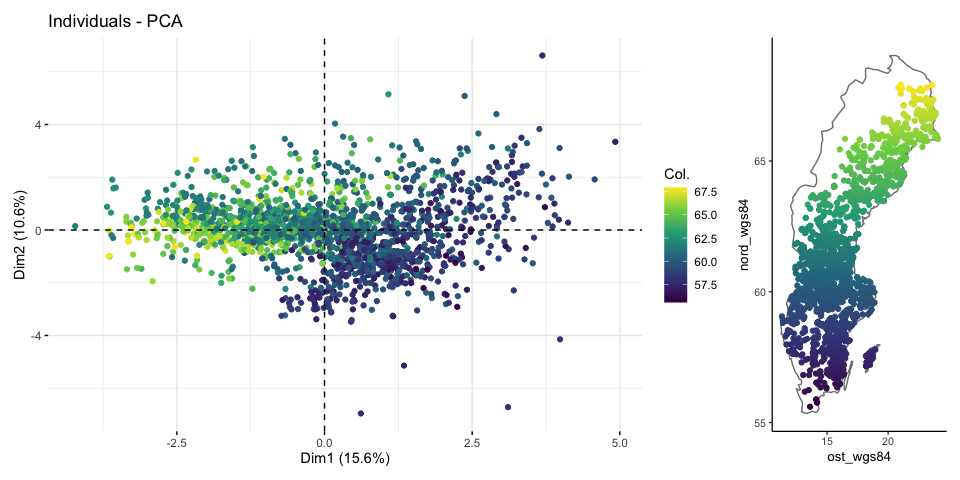

Find a region of covariate overlap
================
eleanorjackson
22 January, 2024

Find a geographical area of covariate overlap to use as testing data.
Currently using random 200 plots but ideally in the real world people
don’t predict outside of parameter space. Always remove these points
from the training data.

``` r
library("tidyverse")
library("here")
library("FactoMineR")
library("factoextra")
library("ggmap")
library("maps")

clean_data <-
  readRDS(here::here("data", "derived", "ForManSims_RCP0_same_time_clim.rds")) %>% 
  filter(period == 0)
```

## Normalise data

``` r
feat_list <- c("total_soil_carbon", "altitude",
                   "mat_5yr", "map_5yr", "ditch", "no_of_stems", "volume_pine",
                   "volume_spruce", "volume_birch", "volume_aspen",
                   "volume_oak", "volume_beech", "soil_moist_code",
                   "volume_southern_broadleaf", "volume_larch")

corr_matrix <- clean_data %>% 
  column_to_rownames(var = "description") %>%  
  select(all_of(feat_list)) %>% 
  scale() 
```

## Make PCA

``` r
# compute pca
data_pca <- princomp(corr_matrix)

# see results 
summary(data_pca)
```

    ## Importance of components:
    ##                           Comp.1    Comp.2    Comp.3     Comp.4     Comp.5
    ## Standard deviation     1.5309405 1.2635163 1.1438499 1.03193755 1.01891036
    ## Proportion of Variance 0.1563385 0.1064905 0.0872745 0.07103234 0.06925023
    ## Cumulative Proportion  0.1563385 0.2628290 0.3501035 0.42113586 0.49038609
    ##                            Comp.6     Comp.7     Comp.8     Comp.9    Comp.10
    ## Standard deviation     1.00556322 1.00127258 0.98757548 0.97786460 0.96589802
    ## Proportion of Variance 0.06744784 0.06687348 0.06505638 0.06378326 0.06223172
    ## Cumulative Proportion  0.55783393 0.62470741 0.68976379 0.75354705 0.81577877
    ##                           Comp.11   Comp.12    Comp.13    Comp.14    Comp.15
    ## Standard deviation     0.90590309 0.8713830 0.82160846 0.52127291 0.48482335
    ## Proportion of Variance 0.05474101 0.0506486 0.04502763 0.01812507 0.01567893
    ## Cumulative Proportion  0.87051978 0.9211684 0.96619601 0.98432107 1.00000000

## Plot

``` r
fviz_pca_var(data_pca)
```

<!-- -->

### Latitude

``` r
fviz_mca_ind(data_pca, 
             geom = "point", 
             col.ind = clean_data$nord_wgs84) + 
  scale_colour_viridis_c()
```

<!-- -->

``` r
ggplot(clean_data, aes(ost_wgs84, nord_wgs84, colour = nord_wgs84)) +
  borders("world", regions = "sweden") +
  geom_point() +
  scale_color_viridis_c() +
  coord_quickmap()
```

<!-- -->

### Longitude

``` r
fviz_mca_ind(data_pca, 
             geom = "point", 
             col.ind = clean_data$ost_wgs84)+ 
  scale_colour_viridis_c()
```

<!-- -->

``` r
ggplot(clean_data, aes(ost_wgs84, nord_wgs84, colour = ost_wgs84)) +
  borders("world", regions = "sweden") +
  geom_point() +
  scale_color_viridis_c() +
  coord_quickmap()
```

<!-- -->
