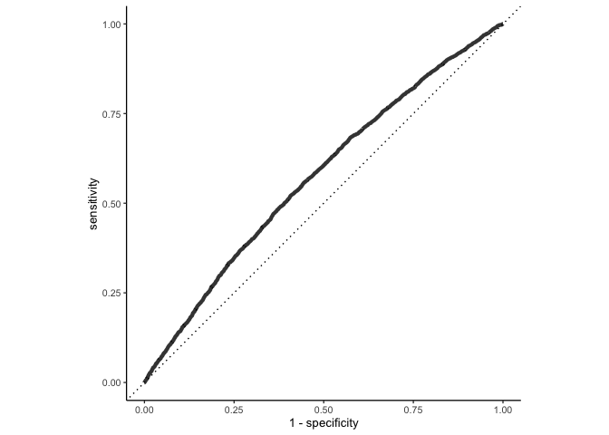
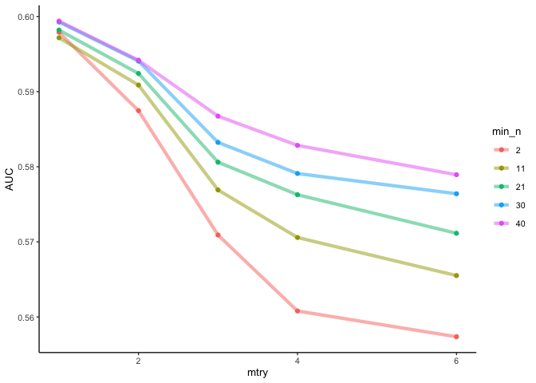
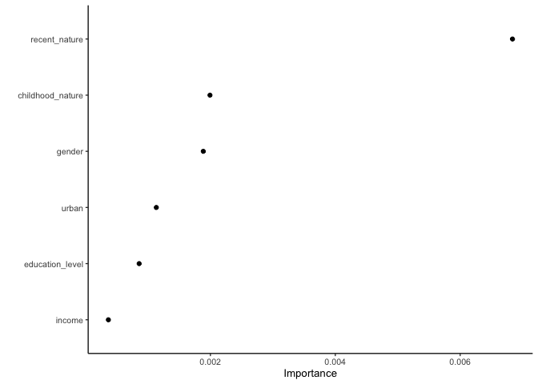
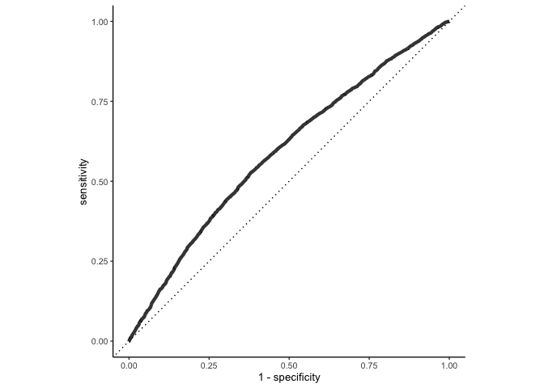

Baby’s first S-learner
================
eleanorjackson
27 July, 2023

Today I’m going to try and get myself more familiar with random forests
and S-learners by trying to analyse the data from [Soga & Gaston
(2023)](https://doi.org/10.1111/conl.12945) using these methods.

Becks has done this before so I can use her script as a guide.

``` r
library("tidyverse")
library("tidymodels")
library("here")
library("janitor")
library("patchwork")

set.seed(123)
```

``` r
raw_data <- read_csv(here::here("data", "raw", "soga_gaston_data.csv"))
```

    ## Rows: 20000 Columns: 28
    ## ── Column specification ────────────────────────────────────────────────────────
    ## Delimiter: ","
    ## chr  (1): Gender
    ## dbl (27): Frequency of nature experiences_childhood, Frequency of nature exp...
    ## 
    ## ℹ Use `spec()` to retrieve the full column specification for this data.
    ## ℹ Specify the column types or set `show_col_types = FALSE` to quiet this message.

``` r
glimpse(raw_data)
```

    ## Rows: 20,000
    ## Columns: 28
    ## $ `Frequency of nature experiences_childhood`             <dbl> 6, 6, 6, 3, 6,…
    ## $ `Frequency of nature experiences_recent`                <dbl> 4, 1, 1, 1, 2,…
    ## $ `Probability of adopting pro-biodiversity behaviour#1`  <dbl> 1, 0, 1, 0, 1,…
    ## $ `Probability of adopting pro-biodiversity behaviour#2`  <dbl> 0, 0, 0, NA, 1…
    ## $ `Probability of adopting pro-biodiversity behaviour#3`  <dbl> 1, 0, 0, NA, 1…
    ## $ `Probability of adopting pro-biodiversity behaviour#4`  <dbl> NA, NA, 0, NA,…
    ## $ `Probability of adopting pro-biodiversity behaviour#5`  <dbl> NA, 0, 0, 1, 1…
    ## $ `Probability of adopting pro-biodiversity behaviour#6`  <dbl> 0, 0, 0, 0, 0,…
    ## $ `Probability of adopting pro-biodiversity behaviour#7`  <dbl> 1, 0, 0, 0, 0,…
    ## $ `Probability of adopting pro-biodiversity behaviour#8`  <dbl> 0, 0, 0, 0, 0,…
    ## $ `Probability of adopting pro-biodiversity behaviour#9`  <dbl> 0, 0, 0, 0, 1,…
    ## $ `Probability of adopting pro-biodiversity behaviour#10` <dbl> 0, 0, 0, 0, 0,…
    ## $ `Probability of adopting pro-biodiversity behaviour#11` <dbl> 0, 0, 0, 0, 0,…
    ## $ `Probability of adopting pro-biodiversity behaviour#12` <dbl> NA, 0, 1, NA, …
    ## $ `Probability of adopting pro-biodiversity behaviour#13` <dbl> NA, NA, 0, NA,…
    ## $ `Probability of adopting pro-biodiversity behaviour#14` <dbl> 1, NA, 1, NA, …
    ## $ `Probability of adopting pro-biodiversity behaviour#15` <dbl> NA, 0, 0, NA, …
    ## $ `Probability of adopting pro-biodiversity behaviour#16` <dbl> 0, 0, 0, 0, 0,…
    ## $ `Probability of adopting pro-biodiversity behaviour#17` <dbl> 0, 0, 0, 0, 0,…
    ## $ `Probability of adopting pro-biodiversity behaviour#18` <dbl> 0, 0, 0, 0, 1,…
    ## $ `Nature relatedness`                                    <dbl> 1, 1, 1, 1, 1,…
    ## $ `Recognition of the decline in local fauna and flora`   <dbl> 1, 1, 1, 1, 1,…
    ## $ `Altruistic value orientation`                          <dbl> 23, 26, 24, 24…
    ## $ Gender                                                  <chr> "male", "male"…
    ## $ Age                                                     <dbl> 31, 33, 54, 36…
    ## $ `Degree of urbanisation`                                <dbl> 5, 5, 4, 6, 3,…
    ## $ Income                                                  <dbl> 2, 4, 2, 6, 1,…
    ## $ `Education level`                                       <dbl> 2, 4, 2, 4, 3,…

## Refactoring

The first thing that Becks does is re-factor the data. I think this is
because some of the variables are continuous (i.e. how often did the
person go out into nature) whereas we need a binary treatment effect
(e.g. did you go outside, yes or no?).

``` r
# 1. clean up the column names
# 2. remove probability columns 
# 3. make columns factors
# 4. make recent nature experiences into a binary treatment effect

raw_data %>% 
  clean_names() %>%
  rename(childhood_nature = frequency_of_nature_experiences_childhood, 
         urban = degree_of_urbanisation,
         altruism = altruistic_value_orientation,
         pro_biodiversity = probability_of_adopting_pro_biodiversity_behaviour_number_3,
         recent_nature = frequency_of_nature_experiences_recent) %>% 
  select(-contains("probability")) %>% 
  mutate(recent_nature = case_when(recent_nature == 1 |
                                     recent_nature == 2 ~ 0,
                                   .default = 1) ) %>% 
  mutate(across(- c(age, altruism), as.factor)) %>% 
  
  drop_na() %>% 
  mutate(id = paste0("A", row_number(), sep = "")) %>% 
  select(id, pro_biodiversity, recent_nature, income, childhood_nature, 
         gender, education_level, urban) -> tidy_data
  
glimpse(tidy_data)  
```

    ## Rows: 16,484
    ## Columns: 8
    ## $ id               <chr> "A1", "A2", "A3", "A4", "A5", "A6", "A7", "A8", "A9",…
    ## $ pro_biodiversity <fct> 1, 0, 0, 1, 1, 1, 1, 0, 1, 0, 0, 0, 0, 0, 0, 0, 0, 0,…
    ## $ recent_nature    <fct> 1, 0, 0, 0, 1, 1, 0, 1, 0, 0, 0, 0, 1, 0, 1, 0, 0, 0,…
    ## $ income           <fct> 2, 4, 2, 1, 2, 5, 2, 1, 6, 1, 5, 3, 6, 4, 1, 3, 1, 4,…
    ## $ childhood_nature <fct> 6, 6, 6, 6, 6, 5, 6, 6, 4, 1, 2, 3, 3, 6, 5, 2, 3, 6,…
    ## $ gender           <fct> male, male, female, female, female, male, female, fem…
    ## $ education_level  <fct> 2, 4, 2, 3, 4, 4, 4, 4, 4, 2, 4, 4, 2, 4, 4, 5, 2, 3,…
    ## $ urban            <fct> 5, 5, 4, 3, 3, 5, 5, 5, 7, 5, 6, 6, 4, 7, 5, 5, 6, 3,…

`pro_biodiversity` is our outcome and `recent_nature` is our treatment.

## S-learner

The S-learner is a single machine learning model. We will include the
treatment as a feature in the model that tries to predict the outcome Y.

Becks uses `ranger::ranger()`, but I think we can use
`parsnip::rand_forest()` and specify `set_engine("ranger")` to do the
same thing but get tidy output.

### train

Let’s use `initial_split` to select a random 3rd of the data to train
the model.

``` r
data_split <- initial_split(tidy_data, prop = 1/3)
train_data_s <- training(data_split)
test_data_s <- testing(data_split)

rand_forest(
  mode = "classification",
  engine = "ranger"
) -> rf_def

rf_def %>% 
  fit(
    pro_biodiversity ~ recent_nature + 
      income + childhood_nature  + gender  + education_level + urban,
    data = train_data_s
  ) -> s_train_fit

s_train_fit
```

    ## parsnip model object
    ## 
    ## Ranger result
    ## 
    ## Call:
    ##  ranger::ranger(x = maybe_data_frame(x), y = y, num.threads = 1,      verbose = FALSE, seed = sample.int(10^5, 1), probability = TRUE) 
    ## 
    ## Type:                             Probability estimation 
    ## Number of trees:                  500 
    ## Sample size:                      5494 
    ## Number of independent variables:  6 
    ## Mtry:                             2 
    ## Target node size:                 10 
    ## Variable importance mode:         none 
    ## Splitrule:                        gini 
    ## OOB prediction error (Brier s.):  0.2442779

### test

Run it on the test data to see if it’s any good

``` r
predict(s_train_fit, test_data_s, type = "prob") %>% 
  bind_cols(test_data_s) -> s_result

glimpse(s_result)
```

    ## Rows: 10,990
    ## Columns: 10
    ## $ .pred_0          <dbl> 0.6926084, 0.4632337, 0.5262304, 0.5083969, 0.6085289…
    ## $ .pred_1          <dbl> 0.3073916, 0.5367663, 0.4737696, 0.4916031, 0.3914711…
    ## $ id               <chr> "A2", "A3", "A4", "A6", "A7", "A8", "A9", "A10", "A11…
    ## $ pro_biodiversity <fct> 0, 0, 1, 1, 1, 0, 1, 0, 0, 0, 0, 0, 1, 0, 1, 0, 1, 1,…
    ## $ recent_nature    <fct> 0, 0, 0, 1, 0, 1, 0, 0, 0, 0, 0, 1, 0, 1, 1, 1, 1, 0,…
    ## $ income           <fct> 4, 2, 1, 5, 2, 1, 6, 1, 5, 3, 4, 1, 3, 1, 1, 3, 3, 1,…
    ## $ childhood_nature <fct> 6, 6, 6, 5, 6, 6, 4, 1, 2, 3, 6, 5, 4, 6, 6, 1, 6, 4,…
    ## $ gender           <fct> male, female, female, male, female, female, female, f…
    ## $ education_level  <fct> 4, 2, 3, 4, 4, 4, 4, 2, 4, 4, 4, 4, 5, 2, 4, 4, 2, 4,…
    ## $ urban            <fct> 5, 4, 3, 5, 5, 5, 7, 5, 6, 6, 7, 5, 6, 5, 4, 5, 5, 5,…

``` r
s_result %>% 
  roc_curve(pro_biodiversity, .pred_0) %>% 
  ggplot(aes(x = 1 - specificity, y = sensitivity)) + 
  geom_path(lwd = 1.5, alpha = 0.8) +
  geom_abline(lty = 3) + 
  coord_equal()
```

<!-- -->

The ROC curve (receiver operating characteristic curve) tells us how
good the model is.

Some notes from
[wikipedia](https://en.wikipedia.org/wiki/Receiver_operating_characteristic):

We have a binary classification problem, `pro_biodiversity` is either
`1` or `0`. There are four possible outcomes from a binary classifier.
If the outcome from a prediction is `1` and the actual value is also
`1`, then it is called a true positive; however if the actual value is
`0` then it is said to be a false positive. Conversely, a true negative
has occurred when both the prediction outcome and the actual value are
`0`, and false negative is when the prediction outcome is n while the
actual value is `1`.

The ROC uses the false positive rate and true positive rate as x and y
axes respectively. The best possible prediction method would yield a
point in the upper left corner of the ROC space, representing 100%
sensitivity (no false negatives) and 100% specificity (no false
positives). A random guess would give a point along the dotted diagonal
line.

So our current model is making predictions that are better than just
taking a random guess, but not much better… Perhaps this is because we
need to tune the hyper parameters?

## Tune hyperparameters

Let’s try again with the help of [this `tidymodels`
example](https://www.tidymodels.org/start/case-study/#second-model) and
[this blog post](https://juliasilge.com/blog/sf-trees-random-tuning/).

They use the `tune` package (which is part of `tidymodels`) to tune
hyperparameters.

We will try tuning `mtry` and `min_n`.

The `mtry` hyperparameter sets the number of predictor variables that
each node in the decision tree “sees” and can learn about, so it can
range from 1 to the total number of features present; when mtry = all
possible features, the model is the same as bagging decision trees. The
`min_n` hyperparameter sets the minimum n to split at any node.

First we define the model using `tune()` for the hyperparameters we want
to tune.

``` r
rf_tune <- rand_forest(mtry = tune(), min_n = tune()) %>%
  set_engine("ranger", num.threads = 3) %>%
  set_mode("classification")

rf_tune
```

    ## Random Forest Model Specification (classification)
    ## 
    ## Main Arguments:
    ##   mtry = tune()
    ##   min_n = tune()
    ## 
    ## Engine-Specific Arguments:
    ##   num.threads = 3
    ## 
    ## Computational engine: ranger

We can train many models using resampled data and see which models turn
out best. We need to create a regular grid of values to try using some
convenience functions for each hyperparameter.

`dials::grid_regular()` chooses sensible values to try for each
hyperparameter.

``` r
finalize(mtry(), select(train_data_s, -id, - pro_biodiversity))
```

    ## # Randomly Selected Predictors (quantitative)
    ## Range: [1, 6]

``` r
tree_grid <- grid_regular(mtry(c(1, 6)),
                          min_n(),
                          levels = 5)

glimpse(tree_grid)
```

    ## Rows: 25
    ## Columns: 2
    ## $ mtry  <int> 1, 2, 3, 4, 6, 1, 2, 3, 4, 6, 1, 2, 3, 4, 6, 1, 2, 3, 4, 6, 1, 2…
    ## $ min_n <int> 2, 2, 2, 2, 2, 11, 11, 11, 11, 11, 21, 21, 21, 21, 21, 30, 30, 3…

Those are the hyperparameters for the 25 models we’ll be running.

``` r
rf_recipe <- recipe(data = train_data_s,
                    formula = pro_biodiversity ~ recent_nature +
                      income + childhood_nature  + gender  + 
                      education_level + urban)

rf_workflow <- workflow() %>%
  add_recipe(rf_recipe) %>%
  add_model(rf_tune)

# create a set of cross-validation resamples to use for tuning
trees_folds <- vfold_cv(train_data_s, v = 25)

rf_tune_res <- 
  tune_grid(rf_workflow,
            resamples = trees_folds,
            grid = tree_grid,
            control = control_grid(save_pred = TRUE),
            metrics = metric_set(roc_auc))
```

How did it turn out?

`roc_auc()` is a metric that computes the area under the ROC curve.
Higher AUC = good

``` r
rf_tune_res %>%
  collect_metrics() %>%
  filter(.metric == "roc_auc") %>%
  mutate(min_n = factor(min_n)) %>%
  ggplot(aes(mtry, mean, color = min_n)) +
  geom_line(alpha = 0.5, linewidth = 1.5) +
  geom_point() +
  labs(y = "AUC")
```

<!-- -->

So it looks our best model has `min_n` of 40 and `mtry` of 1.

Let’s select the best model and take a look at it.

``` r
best_auc <- select_best(rf_tune_res, "roc_auc")

final_rf <- finalize_model(
  rf_tune,
  best_auc
)

final_rf
```

    ## Random Forest Model Specification (classification)
    ## 
    ## Main Arguments:
    ##   mtry = 1
    ##   min_n = 40
    ## 
    ## Engine-Specific Arguments:
    ##   num.threads = 3
    ## 
    ## Computational engine: ranger

We can take a look at variable importance usng `vip`.

``` r
library("vip")
```

    ## 
    ## Attaching package: 'vip'

    ## The following object is masked from 'package:utils':
    ## 
    ##     vi

``` r
final_rf %>%
  set_engine("ranger", importance = "permutation") %>%
  fit(pro_biodiversity ~ .,
    data = train_data_s %>% select(-id)
  ) %>%
  vip(geom = "point")
```

<!-- -->

`recent_nature` (our treatment effect) is the most important.

`last_fit` fits a final model on the entire training set and evaluates
on the testing set.

``` r
final_wf <- workflow() %>%
  add_recipe(rf_recipe) %>%
  add_model(final_rf)

final_res <- final_wf %>%
  last_fit(data_split)

final_res %>%
  collect_metrics()
```

    ## # A tibble: 2 × 4
    ##   .metric  .estimator .estimate .config             
    ##   <chr>    <chr>          <dbl> <chr>               
    ## 1 accuracy binary         0.575 Preprocessor1_Model1
    ## 2 roc_auc  binary         0.591 Preprocessor1_Model1

``` r
final_res$.predictions %>% 
  as.data.frame() %>% 
  roc_curve(pro_biodiversity, .pred_0) %>% 
  ggplot(aes(x = 1 - specificity, y = sensitivity)) + 
  geom_path(lwd = 1.5, alpha = 0.8) +
  geom_abline(lty = 3) + 
  coord_equal()
```

<!-- -->

Ah damn it’s still bad ahah! Looks kind of the same honestly.
