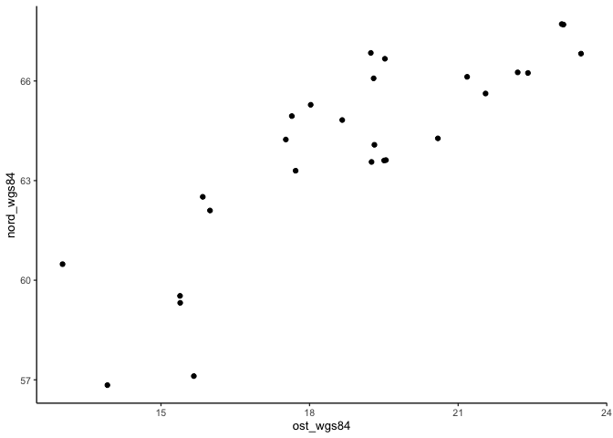
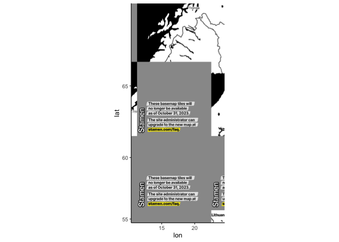
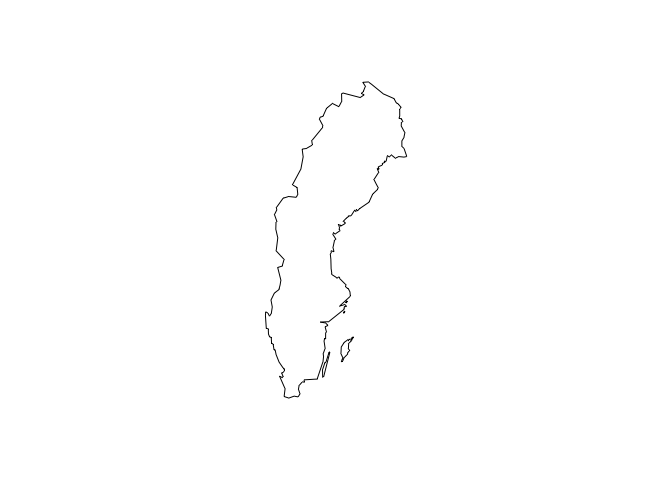
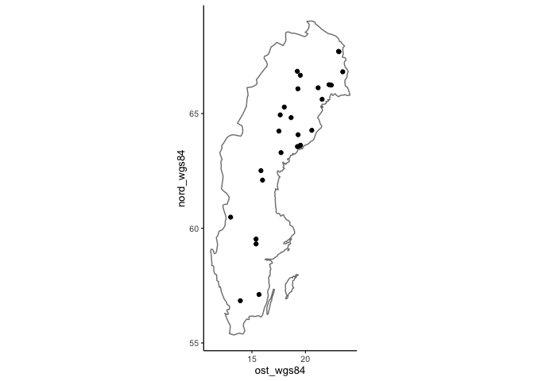

Explore the coordinates data
================
eleanorjackson
26 October, 2023

Tord sent over coordinates for each of the NFI plots. He said they have
an accuracy of 100-1000 m, which is what can be obtained without going
through a long application process. The are protected by law as the are
part of the Swedish Statistics infrastructure.

Let’s take a look.

``` r
library("tidyverse")
library("here")
library("janitor")
library("ggmap")
library("maps")
```

## Filter Tord’s Heureka data to useful plots

``` r
tord_dat <- read.csv(
  here::here("data", "raw", "ForManSims_2016_RCP0_2.csv"), 
  sep = ";", skipNul = TRUE) %>% 
  clean_names()
```

Filter to only include plots that have been managed for both ‘set aside’
and ‘BAU - no thinning’.

``` r
tord_dat %>% 
  filter(control_category_name == "SetAside (Unmanaged)" |
           control_category_name == "BAU - NoThinning") ->  tord_dat_bau_sa

tord_dat_bau_sa %>% 
  group_by(description) %>% 
  summarise(n = n_distinct(control_category_name),
            .groups = "drop") %>% 
  filter(n == 2) %>% 
  select(description) -> plot_list

tord_dat %>% 
  filter(description %in% plot_list$description) -> plots_bau_sa
```

Save this as a test dataset!

``` r
saveRDS(plots_bau_sa,
    file = here::here("data", "derived", "subset_ForManSims_2016_RCP0.rds"))
```

Filter to similarly aged plots.

``` r
# get a list of plots with a starting age of 40 (+/- 10 years)
tord_dat %>% 
  filter(period == 0 & age < 50 & age > 30) %>% 
  select(description) %>% 
  distinct() -> plots_aged_40

# filter bau and set aside plots to only include plots with starting age of 40
plots_bau_sa %>% 
  filter(description %in% plots_aged_40$description) -> plots_bau_sa_40

n_distinct(plots_bau_sa_40$description)
```

    ## [1] 1034

Remove peat soil plots.

``` r
plots_bau_sa_40 %>% 
  filter(peat == 0) -> plots_bau_sa_40_no_peat
```

Select `alternative_no`s which hit their peak in the same `period`.

``` r
plots_bau_sa_40_no_peat %>% 
  filter(period == 10) %>% 
  group_by(description, alternative_no, .drop = FALSE) %>% 
  summarise(max = max(total_soil_carbon)) %>% 
  slice_max(max, n = 1) %>% 
  ungroup() %>% 
  inner_join(plots_bau_sa_40_no_peat) -> test_plots
```

    ## `summarise()` has grouped output by 'description'. You can override using the
    ## `.groups` argument.
    ## Joining with `by = join_by(description, alternative_no)`

## Take a look at plot co-ordinates

``` r
coords <- readxl::read_excel(
  here::here("data", "raw", "NFI plot coords NFI 2016-2020.xlsx"), 
  col_types = c("numeric", "text", "text", "numeric", "numeric", "numeric", 
                "numeric", "numeric", "numeric", "numeric", "numeric", 
                "numeric", "numeric")) %>% 
  select(-"...1") %>% 
  clean_names()
```

    ## New names:
    ## • `` -> `...1`

### Plot the plots!

``` r
test_plots %>% 
  mutate(description = str_replace_all(description, " ", "")) %>% 
  dplyr::filter(period == 0) %>% 
  inner_join(coords) -> test_plots_coords
```

    ## Joining with `by = join_by(description)`

``` r
test_plots_coords %>% 
  ggplot(aes(y = nord_wgs84, x = ost_wgs84)) +
  geom_point()
```

<!-- -->

### Get a basemap

``` r
bbox <- make_bbox(c(11.0273686052, 23.9033785336),
                  c(55.3617373725, 69.1062472602))

swe_basemap <- ggmap::get_map(bbox, source = "stamen",
                              maptype = "toner", zoom = 5)
```

    ## ℹ Map tiles by Stamen Design, under CC BY 3.0. Data by OpenStreetMap, under ODbL.

``` r
swe_basemap %>%
  ggmap()
```

<!-- -->

Looks like Stamen aren’t hosting map tiles anymore :cry:

Let’s try the `maps` package.

``` r
map(database = "world", regions = "sweden")
```

<!-- -->

``` r
ggplot(test_plots_coords, aes(ost_wgs84, nord_wgs84)) +
  borders("world", regions = "sweden") +
  geom_point() +
  coord_quickmap()
```

<!-- -->

``` r
ggplot(test_plots_coords, aes(ost_wgs84, nord_wgs84, colour = total_soil_carbon)) +
  borders("world", regions = "sweden") +
  geom_point() +
  scale_color_viridis_c() +
  coord_quickmap()
```

<!-- -->

yay
