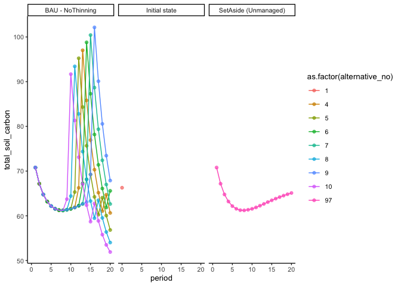
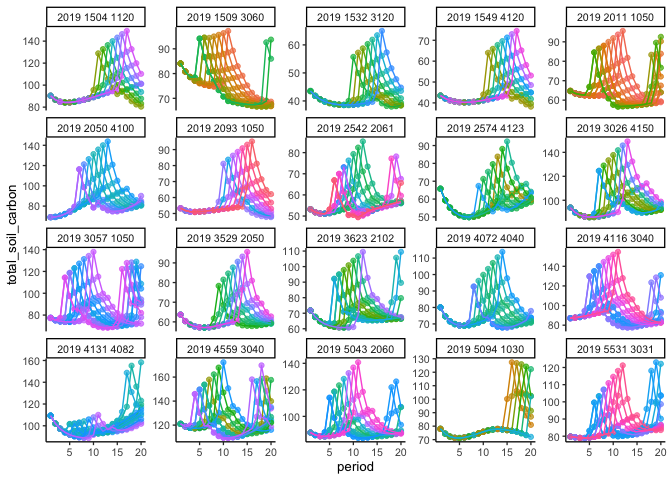
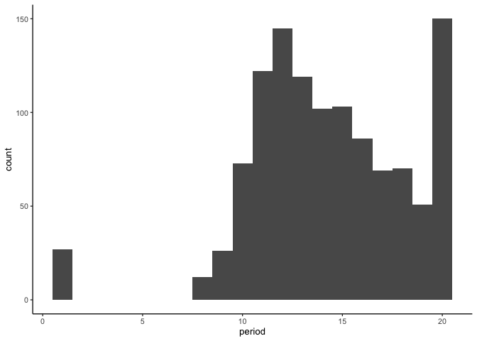
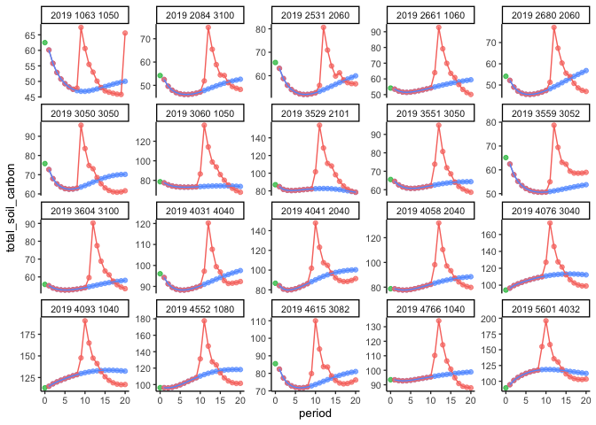

Filtering
================
eleanorjackson
10 November, 2023

``` r
library("tidyverse")
library("here")
library("janitor")
```

## Steps for filtering

1.  Remove peat plots
2.  Select plots with a starting age of 40 (+/- 10 years)
3.  Select plots which have had both “treatment” and “control” simulated
    (i.e. have rows for `BAU - NoThinning`, `Set Aside` and
    `Initial State`)
4.  Select plots which have had a `BAU - NoThinning` action happen at
    the same time period
5.  Select plots where BAU and set aside have the same soil carbon at
    period 1

## 1. Read in a subset of the data and remove peat plots.

``` r
data_2019 <-
  read.csv(here::here("data", "raw", "ForManSims_2019_RCP0.csv"),
           sep = ";", skipNul = TRUE) %>% 
  clean_names() %>% 
  filter(peat == 0)
```

## 2. Select plots with a starting age of 40 (+/- 10 years)

``` r
# get a list of plots with a starting age of 40 (+/- 10 years)
data_2019 %>%
  filter(period == 0 & age < 50 & age > 30) %>%
  select(description) %>%
  distinct() -> list_40

# filter all data to only include plots in list
data_2019 %>%
  filter(description %in% list_40$description) -> data_2019_40
```

## 3. Select plots which have had both “treatment” and “control” simulated

Example good plot:

``` r
data_2019_40 %>% 
  filter(description == "2019 1609 3060") %>% 
  ggplot(aes(x = period, y = total_soil_carbon, 
             colour = as.factor(alternative_no))) +
  geom_point(alpha = 0.7) +
  geom_line() +
  facet_wrap(~control_category_name) 
```

<!-- -->

``` r
data_2019_40 %>%
  group_by(description) %>%
  summarise(n = n_distinct(control_category_name),
            .groups = "drop") %>%
  filter(n == 3) %>%
  select(description) -> plot_list

data_2019_40 %>%
  filter(description %in% plot_list$description) -> plots_bau_sa
```

There are 1208 plots in the data, 1130 of those plots have rows
including each of the three `control_category_name`s.

## 4. Select `alternative_no`s which hit their peak in the same `period`

Using [a function I
found](https://github.com/tidyverse/dplyr/issues/361) to select n random
plots to visualise as groups.

``` r
sample_n_groups = function(tbl, size, replace = FALSE, weight = NULL) {
    # regroup when done
    grps = tbl %>% groups %>% lapply(as.character) %>% unlist
    # check length of groups non-zero
    keep = tbl %>% summarise() %>% ungroup() %>% sample_n(size, replace, weight)
    # keep only selected groups, regroup because joins change count.
    # regrouping may be unnecessary but joins do something funky to grouping variable
    tbl %>% right_join(keep, by=grps) %>% group_by_(.dots = grps)
}
```

``` r
plots_bau_sa %>%
  filter(control_category_name == "BAU - NoThinning") %>% 
  group_by(description) %>% 
  sample_n_groups(size = 20) %>% 
  ggplot(aes(x = period, y = total_soil_carbon, 
             colour = as.factor(alternative_no))) +
  geom_point(alpha = 0.7) +
  geom_line() +
  facet_wrap(~description, scales = "free_y") +
  theme(legend.position = "none")
```

    ## Warning: `group_by_()` was deprecated in dplyr 0.7.0.
    ## ℹ Please use `group_by()` instead.
    ## ℹ See vignette('programming') for more help
    ## Call `lifecycle::last_lifecycle_warnings()` to see where this warning was
    ## generated.

<!-- -->

Which `period` will give us the biggest sample size?

``` r
plots_bau_sa %>%
  filter(control_category_name == "BAU - NoThinning") %>% 
  group_by(description) %>%
  slice_max(total_soil_carbon) %>% 
  ggplot(aes(x = period)) +
  geom_histogram(binwidth = 1)
```

<!-- -->

Most plots peak around period 12 but also a spike at 20? The second
spike might be a second round of felling in some cases.

``` r
#Select alternative_no which hit their peak in period 12

plots_bau_sa %>%
  filter(control_category_name == "BAU - NoThinning") ->  plots_bau

plots_bau %>% 
  filter(period == 12) %>%
  group_by(description, alternative_no, .drop = FALSE) %>%
  summarise(total_soil_carbon_max = max(total_soil_carbon)) %>% 
  ungroup() %>% 
  group_by(description) %>% 
  slice_max(total_soil_carbon_max, n = 1, with_ties = FALSE) %>%
  ungroup() %>% 
  inner_join(plots_bau) -> plots_bau_12
```

    ## `summarise()` has grouped output by 'description'. You can override using the
    ## `.groups` argument.
    ## Joining with `by = join_by(description, alternative_no)`

``` r
plots_bau_sa %>%
  filter(control_category_name != "BAU - NoThinning") %>% 
  bind_rows(plots_bau_12) -> test_plots
```

## Select plots where BAU and set aside have the same soil carbon at period 1

``` r
test_plots %>%
  filter(period == 1) %>% 
  group_by(description) %>% 
  mutate(dupes = as.integer(n_distinct(total_soil_carbon) == 1)) %>% 
  filter(dupes == 1) %>% 
  select(description) -> list_same_start

test_plots %>%
  filter(description %in% list_same_start$description) -> test_plots
```

Check!

``` r
test_plots %>%
  group_by(description) %>% 
  sample_n_groups(size = 20) %>% 
  ggplot(aes(x = period, y = total_soil_carbon, 
             colour = as.factor(control_category_name))) +
  geom_point(alpha = 0.7) +
  geom_line() +
  facet_wrap(~description, scales = "free_y") +
  theme(legend.position = "none")
```

    ## Warning: `group_by_()` was deprecated in dplyr 0.7.0.
    ## ℹ Please use `group_by()` instead.
    ## ℹ See vignette('programming') for more help
    ## Call `lifecycle::last_lifecycle_warnings()` to see where this warning was
    ## generated.

<!-- -->

These look good!
