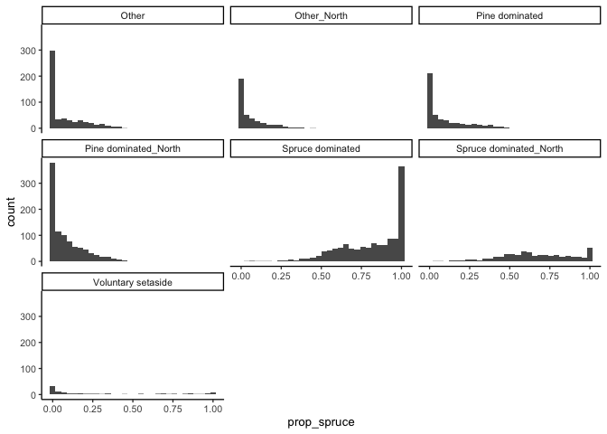
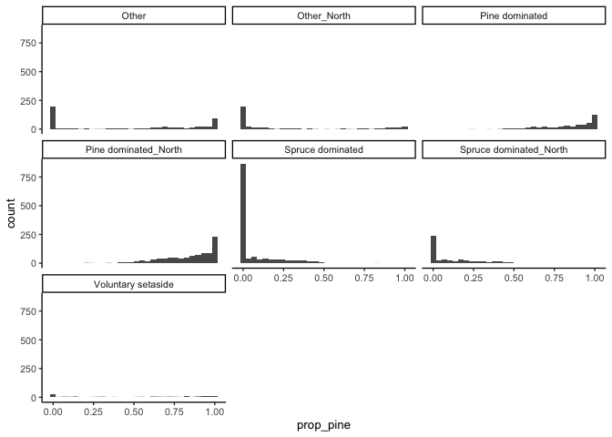
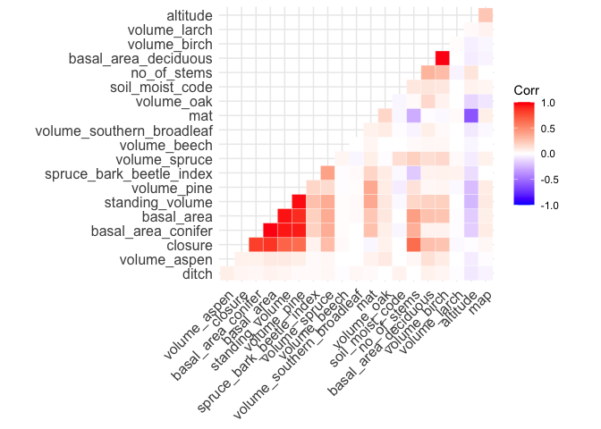
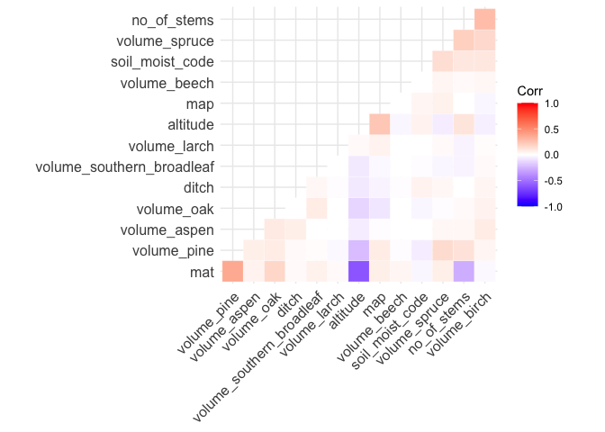
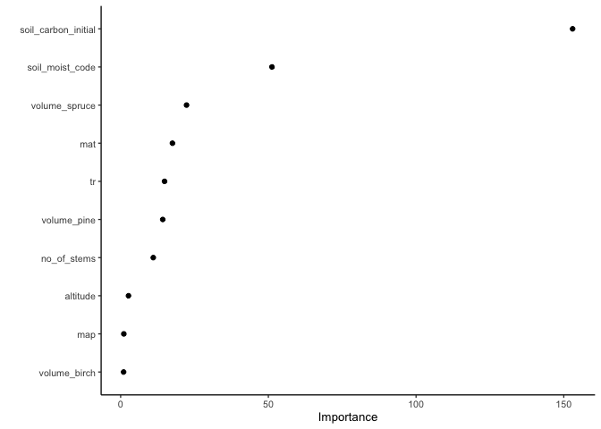
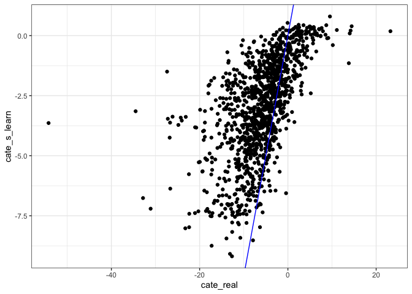
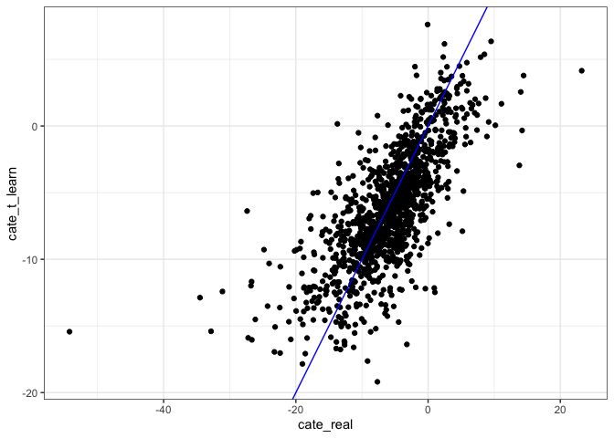
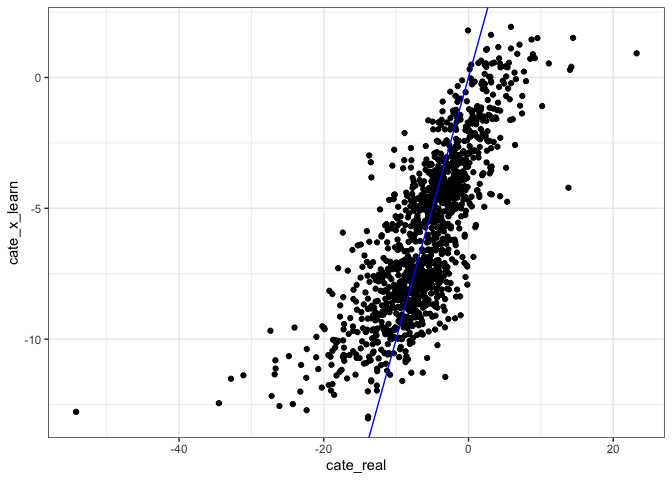
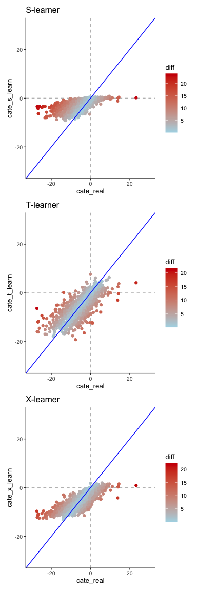

Build random forests
================
eleanorjackson
21 November, 2023

*El to narrow forest type (spruce or pine dom, whichever has bigger N),
also include other variables as predictors including soil moisture, and
play with e,g., basal area, stem density, take out region, code up the
tuning parameters to always pick the ‘best’. Remove plots which have
second round of cutting. And add the 1:1 line, true CATE (x) vs
predicted CATE (y).*

``` r
library("tidyverse")
library("here")
library("causalToolbox")
library("tidymodels")
library("ggcorrplot")
library("vip")
library("patchwork")
```

``` r
data <-
  readRDS(here::here("data", "derived", "ForManSims_RCP0_same_time_clim.rds")) 
```

``` r
summary(as.factor(data$forest_domain_name))
```

    ##                                                              Other 
    ##                                                               1644 
    ##                                                        Other_North 
    ##                                                               1149 
    ##                                 Pine dominated (Contorta possible) 
    ##                                                               1389 
    ##                           Pine dominated_North (Contorta possible) 
    ##                                                               2808 
    ##       Spruce dominated (CCF alternative and HybridExotic possible) 
    ##                                                               3807 
    ## Spruce dominated_North (CCF alternative and HybridExotic possible) 
    ##                                                               1485 
    ##                       Voluntary setaside (Frivilliga avsättningar) 
    ##                                                                315

``` r
data %>% 
  filter(period == 0) %>% 
  mutate(prop_spruce = volume_spruce/ standing_volume,
         forest_domain_name = gsub(" \\(.*", "", forest_domain_name)) %>%
  ggplot() +
  geom_histogram(aes(x = prop_spruce))+
  facet_wrap(~forest_domain_name)
```

    ## `stat_bin()` using `bins = 30`. Pick better value with `binwidth`.

<!-- -->

``` r
data %>% 
  filter(period == 0) %>% 
  mutate(prop_pine = volume_pine/ standing_volume,
         forest_domain_name = gsub(" \\(.*", "", forest_domain_name)) %>% 
  ggplot() +
  geom_histogram(aes(x = prop_pine))+
  facet_wrap(~forest_domain_name)
```

    ## `stat_bin()` using `bins = 30`. Pick better value with `binwidth`.

<!-- -->

``` r
data %>%
  filter(period == 0) %>%
  ggplot() +
  geom_point(aes(ost_wgs84, nord_wgs84, colour = forest_domain_name),
             alpha = 0.7) +
  scale_colour_viridis_d(option = "B")
```

<!-- -->

Most of the Spruce dominated plots seem to be in the South.

I don’t really know how plots were assigned into `forest_domain_name`
groups and I can’t find any info online, so I might just use all plots
where the volume of Spruce is \>50%?

``` r
data %>% 
  filter(period == 0) %>% 
  mutate(prop_pine = volume_pine/ standing_volume) %>% 
  filter(prop_pine >= 0.5) %>% 
  select(description) -> spruce_dom_plots

data %>% 
  filter(description %in% spruce_dom_plots$description) -> data_spruce 
```

## Assign plots to a realised management regime

Random assignment where set aside is not treated (0) and BAU is treated
(1).

``` r
data_spruce %>% 
    select(description) %>% 
    distinct() -> id_list

id_list %>% 
  slice_sample(prop = 0.5) -> treat_ids

data_spruce %>%
  mutate(tr =
           case_when(description %in% treat_ids$description ~ 1,
                     .default = 0)) -> data_assigned
```

## Find best predictors and tune hyperparameters

Will use {tidymodels} for this and build a RF s-learner.

I think that a lot of these vars will be correlated but just putting
them all in now to see what happens.

``` r
data_assigned %>% 
  filter(period == 0) %>% 
  select(altitude , mat , map , soil_moist_code , basal_area_conifer , 
      basal_area_deciduous, ditch , basal_area , closure ,
      no_of_stems , standing_volume , spruce_bark_beetle_index, volume_pine,
      volume_spruce, volume_birch, volume_aspen, volume_oak, volume_beech,
      volume_southern_broadleaf, volume_larch) %>% 
  cor(method = "spearman", use = "pairwise.complete.obs") -> cor_mat

ggcorrplot(cor_mat, hc.order = TRUE, type = "lower",
     outline.col = "white", lab = FALSE, insig = "blank")
```

<!-- -->

Let’s drop some of those highly correlated variables.

``` r
data_assigned %>% 
  filter(period == 0) %>% 
  select(altitude , mat , map , soil_moist_code, ditch,
      no_of_stems, volume_pine,
      volume_spruce, volume_birch, volume_aspen, volume_oak, volume_beech,
      volume_southern_broadleaf, volume_larch) %>% 
  cor(method = "spearman", use = "pairwise.complete.obs") -> cor_mat

ggcorrplot(cor_mat, hc.order = TRUE, type = "lower",
     outline.col = "white", lab = FALSE, insig = "blank")
```

<!-- -->

Think I’ll go with these!

``` r
#select features 
data_assigned %>%
  filter(period == 0) %>%
  select(
    description,
    soil_moist_code,
    altitude, mat, map, ditch, no_of_stems, volume_pine, volume_spruce,
    volume_birch, volume_aspen, volume_oak, volume_beech, 
    volume_southern_broadleaf, volume_larch
  ) -> features

data_assigned %>% 
  select(description, tr, control_category_name, total_soil_carbon) %>% 
  pivot_wider(id_cols = c(description, tr), names_from = control_category_name, values_from = total_soil_carbon) %>% 
  mutate(soil_carbon_obs = case_when(tr == 0 ~ `SetAside (Unmanaged)`,
                                tr == 1 ~ `BAU - NoThinning`)) %>% 
  rename(soil_carbon_initial = `Initial state`,
         soil_carbon_0 = `SetAside (Unmanaged)`, 
         soil_carbon_1 = `BAU - NoThinning`) %>% 
  left_join(features) -> data_obs
```

    ## Joining with `by = join_by(description)`

### test/train split

``` r
data_split <- initial_split(data_obs, prop = 1/3)
train_data <- training(data_split)
test_data <- testing(data_split)
```

``` r
rf_tune <- rand_forest(mtry = tune(), min_n = tune()) %>%
  set_engine("ranger", num.threads = 3) %>%
  set_mode("regression")

finalize(mtry(), select(train_data, -description, - soil_carbon_0, 
                        - soil_carbon_1, -soil_carbon_obs))
```

    ## # Randomly Selected Predictors (quantitative)
    ## Range: [1, 16]

``` r
tree_grid <- grid_regular(mtry(c(1, 6)),
                          min_n(),
                          levels = 5)

rf_recipe <- recipe(soil_carbon_obs ~ tr + 
    soil_carbon_initial + altitude + mat + map + ditch + no_of_stems + 
      volume_pine + volume_spruce + volume_birch + volume_aspen + 
      volume_oak + volume_beech + 
      volume_southern_broadleaf + volume_larch,
    data = train_data)

rf_workflow <- workflow() %>%
  add_recipe(rf_recipe) %>%
  add_model(rf_tune)

# create a set of cross-validation resamples to use for tuning
trees_folds <- vfold_cv(train_data, v = 25)

rf_tune_res <- 
  tune_grid(rf_workflow,
            resamples = trees_folds,
            grid = tree_grid,
            control = control_grid(save_pred = TRUE),
            metrics = metric_set(rmse))
```

Our best model has `min_n` (minimal node size) of 2 and `mtry` (number
of randomly selected predictors) of 6.

``` r
best_auc <- select_best(rf_tune_res, "rmse")

final_rf <- finalize_model(
  rf_tune,
  best_auc
)

final_rf
```

    ## Random Forest Model Specification (regression)
    ## 
    ## Main Arguments:
    ##   mtry = 6
    ##   min_n = 2
    ## 
    ## Engine-Specific Arguments:
    ##   num.threads = 3
    ## 
    ## Computational engine: ranger

``` r
final_rf %>%
  set_engine("ranger", importance = "permutation") %>%
  fit(soil_carbon_obs ~ .,
    data = train_data %>% select(-description, - soil_carbon_0, 
                                 - soil_carbon_1)
  ) %>%
  vip(geom = "point")
```

<!-- -->

# Fit meta learners!

[{causalToolbox}](https://github.com/forestry-labs/causalToolbox)
package and associated papers: <https://arxiv.org/pdf/1706.03461.pdf>
and <https://arxiv.org/pdf/1811.02833.pdf>

## S-learner

*S_RF is an implementation of the S-Learner combined with Random Forests
[(Breiman 2001)](https://doi.org/10.1023/A:1010933404324).*

``` r
# create the hte object 
s_learn <- S_RF(
  feat = select(train_data, soil_carbon_initial, altitude, 
                              mat, map, ditch, no_of_stems, volume_pine,
                              volume_spruce, volume_birch, volume_aspen,
                              volume_oak, volume_beech, 
                              volume_southern_broadleaf, volume_larch), 
  tr = train_data$tr, 
  yobs = train_data$soil_carbon_obs, 
  nthread = 2,
  mu.forestry = list(mtry = 6, nodesizeSpl = 2,
                     relevant.Variable = 1:ncol(select(train_data, 
                              soil_carbon_initial, altitude, 
                              mat, map, ditch, no_of_stems, volume_pine,
                              volume_spruce, volume_birch, volume_aspen,
                              volume_oak, volume_beech, 
                              volume_southern_broadleaf, volume_larch)), 
                     ntree = 1000, replace = TRUE,
                     sample.fraction = 0.9, nodesizeAvg = 3, 
                     nodesizeStrictSpl = 3, nodesizeStrictAvg = 1, 
                     splitratio = 1, middleSplit = FALSE, OOBhonest = TRUE)
  )

# estimate the CATE
cate_s_learn <- EstimateCate(s_learn, 
                             select(test_data, soil_carbon_initial, altitude, 
                              mat, map, ditch, no_of_stems, volume_pine,
                              volume_spruce, volume_birch, volume_aspen,
                              volume_oak, volume_beech, 
                              volume_southern_broadleaf, volume_larch))

test_data %>% 
  mutate(cate_s_learn = cate_s_learn,
         cate_real = soil_carbon_1 - soil_carbon_0) %>% 
  ggplot() +
  geom_point(aes(x = cate_real, y = cate_s_learn)) +
  geom_abline(intercept = 0, slope = 1, colour = "blue") +
  theme_bw()
```

<!-- -->

``` r
test_data %>% 
  mutate(cate_s_learn = cate_s_learn,
         cate_real = soil_carbon_1 - soil_carbon_0,
         diff = abs(cate_s_learn - cate_real)) %>% 
  filter(diff<25) %>%
  ggplot() +
  geom_hline(yintercept = 0, colour = "grey", linetype = 2) +
  geom_vline(xintercept = 0, colour = "grey", linetype = 2) +
  geom_point(aes(x = cate_real, y = cate_s_learn, colour = diff)) +
  geom_abline(intercept = 0, slope = 1, colour = "blue") +
  scale_color_gradient(low = "lightblue", high = "red3") +
  xlim(-30, 30) +
  ylim(-30, 30) +
  ggtitle("S-learner") -> s_plot
```

## T-learner

*T_RF is an implementation of the T-learner combined with Random Forest
[(Breiman 2001)](https://doi.org/10.1023/A:1010933404324) for both
response functions.*

``` r
# create the hte object 
t_learn <- T_RF(
  feat = select(train_data, soil_carbon_initial, altitude, 
                              mat, map, ditch, no_of_stems, volume_pine,
                              volume_spruce, volume_birch, volume_aspen,
                              volume_oak, volume_beech, 
                              volume_southern_broadleaf, volume_larch), 
  tr = train_data$tr, 
  yobs = train_data$soil_carbon_obs, 
  nthread = 2,
  mu0.forestry = list(mtry = 6, nodesizeSpl = 2,
                      relevant.Variable = 1:ncol(select(train_data, 
                              soil_carbon_initial, altitude, 
                              mat, map, ditch, no_of_stems, volume_pine,
                              volume_spruce, volume_birch, volume_aspen,
                              volume_oak, volume_beech, 
                              volume_southern_broadleaf, volume_larch)), 
                      ntree = 1000, replace = TRUE,
                      sample.fraction = 0.9, nodesizeAvg = 3,
                      nodesizeStrictSpl = 1, nodesizeStrictAvg = 1, 
                      splitratio = 1, middleSplit = FALSE,
                      OOBhonest = TRUE),
  mu1.forestry = list(mtry = 6, nodesizeSpl = 2,
                      relevant.Variable = 1:ncol(select(train_data, 
                              soil_carbon_initial, altitude, 
                              mat, map, ditch, no_of_stems, volume_pine,
                              volume_spruce, volume_birch, volume_aspen,
                              volume_oak, volume_beech, 
                              volume_southern_broadleaf, volume_larch)), 
                      ntree = 1000, replace = TRUE,
                      sample.fraction = 0.9, nodesizeAvg = 3,
                      nodesizeStrictSpl = 1, nodesizeStrictAvg = 1, 
                      splitratio = 1, middleSplit = FALSE,
                      OOBhonest = TRUE)
  )

# estimate the CATE
cate_t_learn <- EstimateCate(t_learn, 
                             select(test_data, soil_carbon_initial, altitude, 
                              mat, map, ditch, no_of_stems, volume_pine,
                              volume_spruce, volume_birch, volume_aspen,
                              volume_oak, volume_beech, 
                              volume_southern_broadleaf, volume_larch))

test_data %>% 
  mutate(cate_t_learn = cate_t_learn,
         cate_real = soil_carbon_1 - soil_carbon_0) %>% 
  ggplot() +
  geom_point(aes(x = cate_real, y = cate_t_learn)) +
  geom_abline(intercept = 0, slope = 1, colour = "blue") +
  theme_bw()
```

<!-- -->

``` r
test_data %>% 
  mutate(cate_t_learn = cate_t_learn,
         cate_real = soil_carbon_1 - soil_carbon_0,
         diff = abs(cate_t_learn - cate_real)) %>% 
  filter(diff < 25) %>%
  ggplot() +
  geom_hline(yintercept = 0, colour = "grey", linetype = 2) +
  geom_vline(xintercept = 0, colour = "grey", linetype = 2) +
  geom_point(aes(x = cate_real, y = cate_t_learn, colour = diff)) +
  geom_abline(intercept = 0, slope = 1, colour = "blue") +
  scale_color_gradient(low = "lightblue", high = "red3") +
  xlim(-30, 30) +
  ylim(-30, 30) +
  ggtitle("T-learner") -> t_plot
```

## X-learner

*X_RF is an implementation of the X-learner with Random Forests
[(Breiman 2001)](https://doi.org/10.1023/A:1010933404324) in the first
and second stage.*

``` r
# create the hte object 
x_learn <- X_RF(
  feat = select(train_data, soil_carbon_initial, altitude, 
                              mat, map, ditch, no_of_stems, volume_pine,
                              volume_spruce, volume_birch, volume_aspen,
                              volume_oak, volume_beech, 
                              volume_southern_broadleaf, volume_larch), 
  tr = train_data$tr, 
  yobs = train_data$soil_carbon_obs, 
  nthread = 2,
  mu.forestry = list(mtry = 6, nodesizeSpl = 2,
                     relevant.Variable = 1:ncol(select(train_data, 
                              soil_carbon_initial, altitude, 
                              mat, map, ditch, no_of_stems, volume_pine,
                              volume_spruce, volume_birch, volume_aspen,
                              volume_oak, volume_beech, 
                              volume_southern_broadleaf, volume_larch)), 
                     ntree = 1000, replace = TRUE,
                     sample.fraction = 0.8, nodesizeAvg = 1, 
                     nodesizeStrictSpl = 2, nodesizeStrictAvg = 1, 
                     splitratio = 1, middleSplit = TRUE, OOBhonest = TRUE),
  tau.forestry = list(mtry = 6, nodesizeSpl = 2,
                      relevant.Variable = 1:ncol(select(train_data,
                              soil_carbon_initial, altitude, 
                              mat, map, ditch, no_of_stems, volume_pine,
                              volume_spruce, volume_birch, volume_aspen,
                              volume_oak, volume_beech, 
                              volume_southern_broadleaf, volume_larch)), 
                           ntree = 1000, replace = TRUE,
                           sample.fraction = 0.7, nodesizeAvg = 6,
                           nodesizeStrictSpl = 3, nodesizeStrictAvg = 1, 
                           splitratio = 1, middleSplit = TRUE, OOBhonest = TRUE)
  )

# estimate the CATE
cate_x_learn <- EstimateCate(x_learn, 
                             select(test_data, soil_carbon_initial, altitude, 
                              mat, map, ditch, no_of_stems, volume_pine,
                              volume_spruce, volume_birch, volume_aspen,
                              volume_oak, volume_beech, 
                              volume_southern_broadleaf, volume_larch))

test_data %>% 
  mutate(cate_x_learn = cate_x_learn,
         cate_real = soil_carbon_1 - soil_carbon_0) %>% 
  ggplot() +
  geom_point(aes(x = cate_real, y = cate_x_learn)) +
  geom_abline(intercept = 0, slope = 1, colour = "blue") +
  theme_bw()
```

<!-- -->

``` r
test_data %>% 
  mutate(cate_x_learn = cate_x_learn,
         cate_real = soil_carbon_1 - soil_carbon_0,
         diff = abs(cate_x_learn - cate_real)) %>% 
  filter(diff<25) %>%
  ggplot() +
  geom_hline(yintercept = 0, colour = "grey", linetype = 2) +
  geom_vline(xintercept = 0, colour = "grey", linetype = 2) +
  geom_point(aes(x = cate_real, y = cate_x_learn, colour = diff)) +
  geom_abline(intercept = 0, slope = 1, colour = "blue") +
  scale_color_gradient(low = "lightblue", high = "red3") +
  xlim(-30, 30) +
  ylim(-30, 30) +
  ggtitle("X-learner") -> x_plot
```

Note that in the below plots I’ve filtered out the outliers (difference
of more than 30 from real ITE). We think that these might be plots which
have had a second round of thinning.

Also, I’ve just used the hyperparameters that were tuned based on a
simple random forest for all the models, which should be fine for the
s-leaner but maybe the RFs in the t and x learners need their own
tuning?

``` r
s_plot / t_plot / x_plot
```

    ## Warning: Removed 1 rows containing missing values (`geom_point()`).

    ## Warning: Removed 3 rows containing missing values (`geom_point()`).
    ## Removed 3 rows containing missing values (`geom_point()`).

<!-- -->
