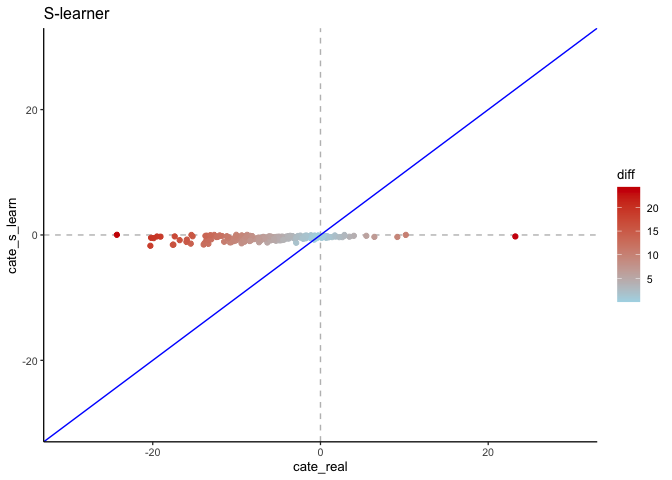
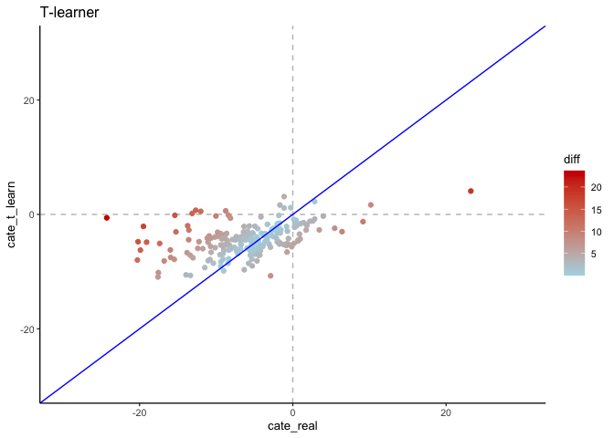

Generate data for figure
================
eleanorjackson
01 December, 2023

Generating a dataset to use in a figure for the perspective paper.

S and T learner predictions for a small subset of the data.

``` r
library("tidyverse")
library("here")
library("causalToolbox")
library("tidymodels")
library("vip")
library("patchwork")
```

``` r
data <-
  readRDS(here::here("data", "derived", "ForManSims_RCP0_same_time_clim.rds")) 
```

``` r
data %>% 
  filter(period == 0) %>% 
  mutate(prop_pine = volume_pine/ standing_volume) %>% 
  filter(prop_pine >= 0.5) %>% 
  select(description) -> spruce_dom_plots

data %>% 
  filter(description %in% spruce_dom_plots$description) -> data_spruce 
```

## Assign plots to a realised management regime

Random assignment where set aside is not treated (0) and BAU is treated
(1).

``` r
data_spruce %>% 
    select(description) %>% 
    distinct() -> id_list

id_list %>% 
  slice_sample(n = 300) -> sample_300

sample_300 %>% 
  slice_sample(prop = 0.5) -> treat_ids

data_spruce %>%
  filter(description %in% sample_300$description) %>% 
  mutate(tr =
           case_when(description %in% treat_ids$description ~ 1,
                     .default = 0)) -> data_assigned
```

## Select features

``` r
data_assigned %>%
  filter(period == 0) %>%
  select(
    description,
    soil_moist_code,
    altitude, mat, map, ditch, no_of_stems, volume_pine, volume_spruce,
    volume_birch, volume_aspen, volume_oak, volume_beech, 
    volume_southern_broadleaf, volume_larch
  ) -> features

data_assigned %>% 
  select(description, tr, control_category_name, total_soil_carbon) %>% 
  pivot_wider(id_cols = c(description, tr), names_from = control_category_name, values_from = total_soil_carbon) %>% 
  mutate(soil_carbon_obs = case_when(tr == 0 ~ `SetAside (Unmanaged)`,
                                tr == 1 ~ `BAU - NoThinning`)) %>% 
  rename(soil_carbon_initial = `Initial state`,
         soil_carbon_0 = `SetAside (Unmanaged)`, 
         soil_carbon_1 = `BAU - NoThinning`) %>% 
  left_join(features) -> data_obs
```

    ## Joining with `by = join_by(description)`

### test/train split

``` r
data_split <- initial_split(data_obs, prop = 1/3)
train_data <- training(data_split)
test_data <- testing(data_split)
```

## S-learner

``` r
# create the hte object 
s_learn <- S_RF(
  feat = select(train_data, soil_carbon_initial, altitude, 
                              mat, map, ditch, no_of_stems, volume_pine,
                              volume_spruce, volume_birch, volume_aspen,
                              volume_oak, volume_beech, 
                              volume_southern_broadleaf, volume_larch), 
  tr = train_data$tr, 
  yobs = train_data$soil_carbon_obs, 
  nthread = 2,
  mu.forestry = list(mtry = 6, nodesizeSpl = 2,
                     relevant.Variable = 1:ncol(select(train_data, 
                              soil_carbon_initial, altitude, 
                              mat, map, ditch, no_of_stems, volume_pine,
                              volume_spruce, volume_birch, volume_aspen,
                              volume_oak, volume_beech, 
                              volume_southern_broadleaf, volume_larch)), 
                     ntree = 1000, replace = TRUE,
                     sample.fraction = 0.9, nodesizeAvg = 3, 
                     nodesizeStrictSpl = 3, nodesizeStrictAvg = 1, 
                     splitratio = 1, middleSplit = FALSE, OOBhonest = TRUE)
  )

# estimate the CATE
cate_s_learn <- EstimateCate(s_learn, 
                             select(test_data, soil_carbon_initial, altitude, 
                              mat, map, ditch, no_of_stems, volume_pine,
                              volume_spruce, volume_birch, volume_aspen,
                              volume_oak, volume_beech, 
                              volume_southern_broadleaf, volume_larch))

test_data %>% 
  mutate(cate_s_learn = cate_s_learn,
         cate_real = soil_carbon_1 - soil_carbon_0,
         diff = abs(cate_s_learn - cate_real)) %>% 
  filter(diff<25) %>%
  ggplot() +
  geom_hline(yintercept = 0, colour = "grey", linetype = 2) +
  geom_vline(xintercept = 0, colour = "grey", linetype = 2) +
  geom_point(aes(x = cate_real, y = cate_s_learn, colour = diff)) +
  geom_abline(intercept = 0, slope = 1, colour = "blue") +
  scale_color_gradient(low = "lightblue", high = "red3") +
  xlim(-30, 30) +
  ylim(-30, 30) +
  ggtitle("S-learner") 
```

<!-- -->

## T-learner

``` r
# create the hte object 
t_learn <- T_RF(
  feat = select(train_data, soil_carbon_initial, altitude, 
                              mat, map, ditch, no_of_stems, volume_pine,
                              volume_spruce, volume_birch, volume_aspen,
                              volume_oak, volume_beech, 
                              volume_southern_broadleaf, volume_larch), 
  tr = train_data$tr, 
  yobs = train_data$soil_carbon_obs, 
  nthread = 2,
  mu0.forestry = list(mtry = 6, nodesizeSpl = 2,
                      relevant.Variable = 1:ncol(select(train_data, 
                              soil_carbon_initial, altitude, 
                              mat, map, ditch, no_of_stems, volume_pine,
                              volume_spruce, volume_birch, volume_aspen,
                              volume_oak, volume_beech, 
                              volume_southern_broadleaf, volume_larch)), 
                      ntree = 1000, replace = TRUE,
                      sample.fraction = 0.9, nodesizeAvg = 3,
                      nodesizeStrictSpl = 1, nodesizeStrictAvg = 1, 
                      splitratio = 1, middleSplit = FALSE,
                      OOBhonest = TRUE),
  mu1.forestry = list(mtry = 6, nodesizeSpl = 2,
                      relevant.Variable = 1:ncol(select(train_data, 
                              soil_carbon_initial, altitude, 
                              mat, map, ditch, no_of_stems, volume_pine,
                              volume_spruce, volume_birch, volume_aspen,
                              volume_oak, volume_beech, 
                              volume_southern_broadleaf, volume_larch)), 
                      ntree = 1000, replace = TRUE,
                      sample.fraction = 0.9, nodesizeAvg = 3,
                      nodesizeStrictSpl = 1, nodesizeStrictAvg = 1, 
                      splitratio = 1, middleSplit = FALSE,
                      OOBhonest = TRUE)
  )

# estimate the CATE
cate_t_learn <- EstimateCate(t_learn, 
                             select(test_data, soil_carbon_initial, altitude, 
                              mat, map, ditch, no_of_stems, volume_pine,
                              volume_spruce, volume_birch, volume_aspen,
                              volume_oak, volume_beech, 
                              volume_southern_broadleaf, volume_larch))

test_data %>% 
  mutate(cate_t_learn = cate_t_learn,
         cate_real = soil_carbon_1 - soil_carbon_0,
         diff = abs(cate_t_learn - cate_real)) %>% 
  filter(diff < 25) %>%
  ggplot() +
  geom_hline(yintercept = 0, colour = "grey", linetype = 2) +
  geom_vline(xintercept = 0, colour = "grey", linetype = 2) +
  geom_point(aes(x = cate_real, y = cate_t_learn, colour = diff)) +
  geom_abline(intercept = 0, slope = 1, colour = "blue") +
  scale_color_gradient(low = "lightblue", high = "red3") +
  xlim(-30, 30) +
  ylim(-30, 30) +
  ggtitle("T-learner")
```

<!-- -->

# Save

``` r
data %>% 
  select(description, ost_wgs84, nord_wgs84) %>% 
  distinct() %>% 
  drop_na() -> lat_lon

test_data %>% 
  mutate(cate_t_learn = cate_t_learn,
         cate_s_learn = cate_s_learn,
         cate_real = soil_carbon_1 - soil_carbon_0) %>%
  left_join(lat_lon) %>% 
  write_csv(here::here("data", "derived", "s_t_learn_200_out.csv"))
```

    ## Joining with `by = join_by(description)`
