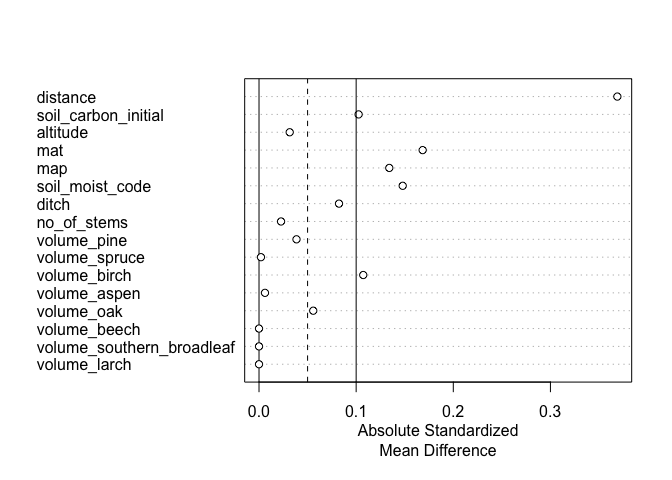
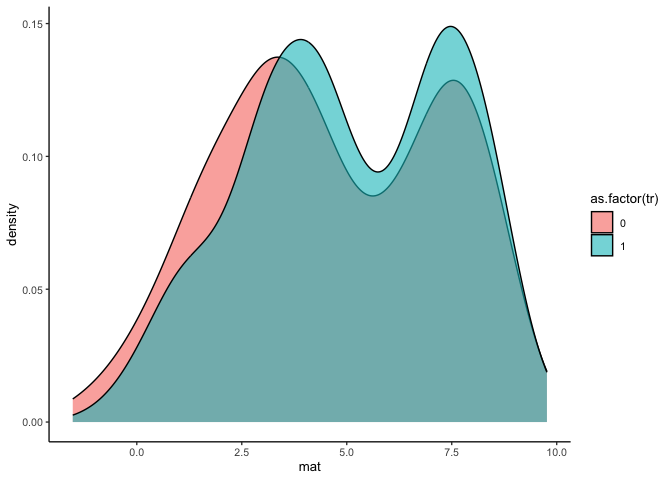
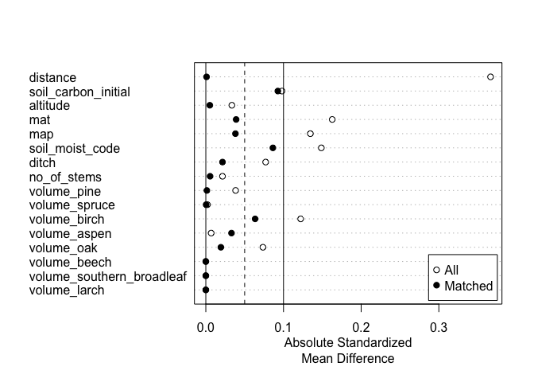
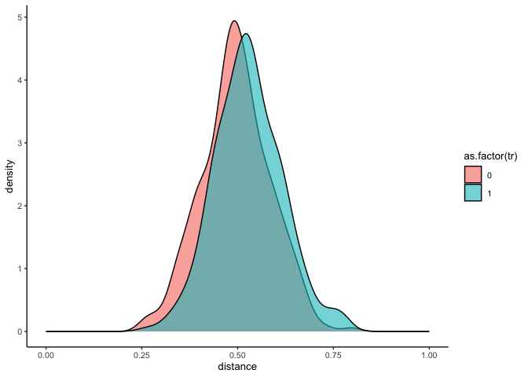

Matching
================
eleanorjackson
06 December, 2023

**‘We define “matching” broadly to be any method that aims to equate (or
“balance”) the distribution of covariates in the treated and control
groups.’ [(Stuart 2010)](https://doi.org/10.1214%2F09-STS313)**

We want to test the effect that matching your training data might have
on predictions of the ITE.

In this notebook I’m going to explore what
[{MatchIt}](https://kosukeimai.github.io/MatchIt/) has to offer and
learn how to use it.

``` r
library("tidyverse")
library("here")
library("MatchIt")
library("tidymodels")
set.seed(123)
```

# Prep data

``` r
data <- 
  readRDS(here::here("data", "derived", "ForManSims_RCP0_same_time_clim.rds"))
```

## Select spruce dominated plots only

``` r
data %>% 
  filter(period == 0) %>% 
  mutate(prop_pine = volume_pine/ standing_volume) %>% 
  filter(prop_pine >= 0.5) %>% 
  select(description) -> spruce_dom_plots

data %>% 
  filter(description %in% spruce_dom_plots$description) -> data_spruce 
```

## Assign plots to a realised management regime

Random assignment where set aside is not treated (0) and BAU is treated
(1).

``` r
data_spruce %>% 
    select(description) %>% 
    distinct() -> id_list

id_list %>% 
  slice_sample(prop = 0.5) -> treat_ids

data_spruce %>%
  mutate(tr =
           case_when(description %in% treat_ids$description ~ 1,
                     .default = 0)) -> data_assigned
```

## Select features

``` r
data_assigned %>%
  filter(period == 0) %>%
  select(
    description,
    soil_moist_code,
    altitude, mat, map, ditch, no_of_stems, volume_pine, volume_spruce,
    volume_birch, volume_aspen, volume_oak, volume_beech, 
    volume_southern_broadleaf, volume_larch
  ) -> features

data_assigned %>% 
  select(description, tr, control_category_name, total_soil_carbon) %>% 
  pivot_wider(id_cols = c(description, tr), names_from = control_category_name, values_from = total_soil_carbon) %>% 
  mutate(soil_carbon_obs = case_when(tr == 0 ~ `SetAside (Unmanaged)`,
                                tr == 1 ~ `BAU - NoThinning`)) %>% 
  rename(soil_carbon_initial = `Initial state`,
         soil_carbon_0 = `SetAside (Unmanaged)`, 
         soil_carbon_1 = `BAU - NoThinning`) %>% 
  left_join(features) -> data_obs
```

    ## Joining with `by = join_by(description)`

## Test and train

``` r
data_split <- initial_split(data_obs, prop = 1/3)
train_data <- training(data_split)
test_data <- testing(data_split)
```

# Matching

Following [this
vignette](https://kosukeimai.github.io/MatchIt/articles/MatchIt.html).

## Check Initial Imbalance

Usually the method argument specifies the method of matching to be
performed. Here, we set it to NULL so we can assess balance prior to
matching.

``` r
out_initial <-
  matchit(
    tr ~ soil_carbon_initial + altitude + mat + map + soil_moist_code + ditch +
      no_of_stems + volume_pine + volume_spruce + volume_birch + volume_aspen + 
      volume_oak + volume_beech + volume_southern_broadleaf + volume_larch,
    data = train_data,
    method = NULL,
    distance = "glm"
  )

summary(out_initial)
```

    ## 
    ## Call:
    ## matchit(formula = tr ~ soil_carbon_initial + altitude + mat + 
    ##     map + soil_moist_code + ditch + no_of_stems + volume_pine + 
    ##     volume_spruce + volume_birch + volume_aspen + volume_oak + 
    ##     volume_beech + volume_southern_broadleaf + volume_larch, 
    ##     data = train_data, method = NULL, distance = "glm")
    ## 
    ## Summary of Balance for All Data:
    ##                           Means Treated Means Control Std. Mean Diff.
    ## distance                         0.5283        0.4957          0.3689
    ## soil_carbon_initial             66.1303       67.3125         -0.1025
    ## altitude                       221.3419      226.0847         -0.0316
    ## mat                              5.0680        4.6551          0.1685
    ## map                             52.9970       51.7384          0.1341
    ## soil_moist_code                  1.9935        2.0576         -0.1479
    ## ditch                            0.0645        0.0847         -0.0823
    ## no_of_stems                   1514.0112     1543.6243         -0.0227
    ## volume_pine                    111.3951      113.8400         -0.0386
    ## volume_spruce                   11.4060       11.3704          0.0020
    ## volume_birch                     7.4279        5.8890          0.1073
    ## volume_aspen                     0.1060        0.1164         -0.0061
    ## volume_oak                       0.2401        0.1004          0.0558
    ## volume_beech                     0.0000        0.0000          0.0000
    ## volume_southern_broadleaf        0.0000        0.0000          0.0000
    ## volume_larch                     0.0000        0.0000          0.0000
    ##                           Var. Ratio eCDF Mean eCDF Max
    ## distance                      0.9755    0.1007   0.1777
    ## soil_carbon_initial           0.8420    0.0231   0.0615
    ## altitude                      1.2925    0.0300   0.0780
    ## mat                           0.8747    0.0445   0.1085
    ## map                           1.0148    0.0441   0.0851
    ## soil_moist_code               1.0213    0.0176   0.0382
    ## ditch                              .    0.0202   0.0202
    ## no_of_stems                   0.8080    0.0144   0.0483
    ## volume_pine                   0.9760    0.0142   0.0508
    ## volume_spruce                 1.1774    0.0205   0.0542
    ## volume_birch                  1.8379    0.0185   0.0498
    ## volume_aspen                  1.6824    0.0029   0.0069
    ## volume_oak                    6.5203    0.0035   0.0090
    ## volume_beech                       .    0.0000   0.0000
    ## volume_southern_broadleaf          .    0.0000   0.0000
    ## volume_larch                       .    0.0000   0.0000
    ## 
    ## Sample Sizes:
    ##           Control Treated
    ## All           295     310
    ## Matched       295     310
    ## Unmatched       0       0
    ## Discarded       0       0

``` r
plot(summary(out_initial))
```

<!-- -->

Smaller values for `Std. Mean Diff.` indicate better balance,
`eCDF Mean` and `eCDF Max` should be close to zero with `Var. Ratio`
close to one.

It looks like `mat` is the most unbalanced.

``` r
ggplot(train_data) +
  geom_density(aes(x = mat, 
                   fill = as.factor(tr), 
                   group = as.factor(tr)), 
               alpha = 0.6)
```

<!-- -->

Looks quite well matched to me.. but not perfect. Let’s see what
matching does.

## Matching

Now we set the `method` to the matching method we want. [There are
several](https://kosukeimai.github.io/MatchIt/articles/matching-methods.html#matching-methods)
to choose from…

*“The criteria on which a matching specification should be judged are
balance and remaining (effective) sample size after matching.”*

*“If the target of inference is the ATE, optimal or generalized full
matching, subclassification, or profile matching can be used.”*

*“For large datasets, neither optimal full matching nor profile matching
may be possible, in which case generalised full matching and
subclassification are faster solutions.”*

It seems like optimal full matching would be best
([`method = "full"`](https://kosukeimai.github.io/MatchIt/articles/matching-methods.html#optimal-full-matching-method-full)),
but if it’s too slow we could go for generalised full matching
([`method = "quick"`](https://kosukeimai.github.io/MatchIt/articles/matching-methods.html#generalized-full-matching-method-quick)).

``` r
out_matched <-
  matchit(
    tr ~ soil_carbon_initial + altitude + mat + map + soil_moist_code + ditch +
      no_of_stems + volume_pine + volume_spruce + volume_birch + volume_aspen + 
      volume_oak + volume_beech + volume_southern_broadleaf + volume_larch,
    data = train_data,
    method = "full",
    distance = "glm",
    estimand = "ATE"
  )

print(out_matched)
```

    ## A matchit object
    ##  - method: Optimal full matching
    ##  - distance: Propensity score
    ##              - estimated with logistic regression
    ##  - number of obs.: 605 (original), 605 (matched)
    ##  - target estimand: ATE
    ##  - covariates: soil_carbon_initial, altitude, mat, map, soil_moist_code, ditch, no_of_stems, volume_pine, volume_spruce, volume_birch, volume_aspen, volume_oak, volume_beech, volume_southern_broadleaf, volume_larch

``` r
summary(out_matched, un = FALSE)
```

    ## 
    ## Call:
    ## matchit(formula = tr ~ soil_carbon_initial + altitude + mat + 
    ##     map + soil_moist_code + ditch + no_of_stems + volume_pine + 
    ##     volume_spruce + volume_birch + volume_aspen + volume_oak + 
    ##     volume_beech + volume_southern_broadleaf + volume_larch, 
    ##     data = train_data, method = "full", distance = "glm", estimand = "ATE")
    ## 
    ## Summary of Balance for Matched Data:
    ##                           Means Treated Means Control Std. Mean Diff.
    ## distance                         0.5124        0.5125         -0.0010
    ## soil_carbon_initial             67.6904       66.5726          0.0927
    ## altitude                       221.4864      222.2147         -0.0052
    ## mat                              4.9453        4.8463          0.0390
    ## map                             52.5053       52.1487          0.0381
    ## soil_moist_code                  2.0560        2.0188          0.0863
    ## ditch                            0.0659        0.0715         -0.0215
    ## no_of_stems                   1550.2004     1542.6068          0.0055
    ## volume_pine                    110.6185      110.5327          0.0013
    ## volume_spruce                   11.5027       11.5097         -0.0004
    ## volume_birch                     7.3993        6.5997          0.0634
    ## volume_aspen                     0.1532        0.1033          0.0331
    ## volume_oak                       0.1593        0.1961         -0.0194
    ## volume_beech                     0.0000        0.0000          0.0000
    ## volume_southern_broadleaf        0.0000        0.0000          0.0000
    ## volume_larch                     0.0000        0.0000          0.0000
    ##                           Var. Ratio eCDF Mean eCDF Max Std. Pair Dist.
    ## distance                      0.9845    0.0030   0.0116          0.0150
    ## soil_carbon_initial           1.1939    0.0193   0.0650          0.9822
    ## altitude                      1.2522    0.0273   0.0702          1.2010
    ## mat                           0.8573    0.0289   0.0701          1.0271
    ## map                           0.9882    0.0170   0.0490          1.0403
    ## soil_moist_code               1.4630    0.0168   0.0472          0.7091
    ## ditch                              .    0.0056   0.0056          0.4231
    ## no_of_stems                   0.7696    0.0240   0.0644          0.9402
    ## volume_pine                   1.0925    0.0120   0.0428          1.1717
    ## volume_spruce                 1.0424    0.0177   0.0542          0.9454
    ## volume_birch                  1.3000    0.0142   0.0402          0.8451
    ## volume_aspen                  2.7552    0.0020   0.0050          0.1619
    ## volume_oak                    2.1184    0.0074   0.0170          0.1817
    ## volume_beech                       .    0.0000   0.0000          0.0000
    ## volume_southern_broadleaf          .    0.0000   0.0000          0.0000
    ## volume_larch                       .    0.0000   0.0000          0.0000
    ## 
    ## Sample Sizes:
    ##               Control Treated
    ## All            295.    310.  
    ## Matched (ESS)  232.03  245.66
    ## Matched        295.    310.  
    ## Unmatched        0.      0.  
    ## Discarded        0.      0.

``` r
plot(summary(out_matched))
```

<!-- -->

## Assessing the Quality of Matches

``` r
plot(out_matched, type = "jitter", interactive = FALSE)
```

<!-- -->

We don’t have any unmatched units, I think this is due to the kind of
matching we’re doing?

``` r
plot(out_matched, type = "density", interactive = FALSE,
     which.xs = ~ mat + map + soil_carbon_initial)
```

<!-- -->

I can’t see a big difference, but they have moved a little. I guess the
treatment groups were already quite well matched.

We can extract the matched data.

``` r
matched_data <- match.data(out_matched)

glimpse(matched_data)
```

    ## Rows: 605
    ## Columns: 23
    ## $ description               <chr> "201930274150", "201935774100", "20172516306…
    ## $ tr                        <dbl> 0, 1, 0, 1, 1, 1, 0, 0, 1, 0, 0, 0, 1, 0, 1,…
    ## $ soil_carbon_initial       <dbl> 65.21490, 65.13894, 65.06004, 74.34764, 66.1…
    ## $ soil_carbon_0             <dbl> 69.93696, 67.15486, 64.10593, 87.16634, 65.4…
    ## $ soil_carbon_1             <dbl> 60.85133, 61.99760, 59.62754, 71.15314, 59.2…
    ## $ soil_carbon_obs           <dbl> 69.93696, 61.99760, 64.10593, 71.15314, 59.2…
    ## $ soil_moist_code           <int> 2, 2, 2, 2, 2, 2, 2, 1, 2, 2, 2, 1, 2, 3, 2,…
    ## $ altitude                  <int> 224, 307, 268, 135, 142, 287, 291, 126, 99, …
    ## $ mat                       <dbl> 4.0333334, 4.5750001, 3.1500001, 4.5333335, …
    ## $ map                       <dbl> 62.10833, 60.75833, 50.50000, 57.50000, 46.7…
    ## $ ditch                     <int> 0, 0, 0, 0, 0, 0, 0, 0, 0, 0, 0, 0, 0, 0, 0,…
    ## $ no_of_stems               <dbl> 2858.2560, 1496.0530, 1846.1930, 1688.9700, …
    ## $ volume_pine               <dbl> 79.92663, 170.42520, 129.45330, 147.70820, 7…
    ## $ volume_spruce             <dbl> 13.321650, 0.000000, 5.956279, 47.802460, 20…
    ## $ volume_birch              <dbl> 0.000000, 0.000000, 0.000000, 0.000000, 36.7…
    ## $ volume_aspen              <dbl> 0, 0, 0, 0, 0, 0, 0, 0, 0, 0, 0, 0, 0, 0, 0,…
    ## $ volume_oak                <dbl> 0, 0, 0, 0, 0, 0, 0, 0, 0, 0, 0, 0, 0, 0, 0,…
    ## $ volume_beech              <dbl> 0, 0, 0, 0, 0, 0, 0, 0, 0, 0, 0, 0, 0, 0, 0,…
    ## $ volume_southern_broadleaf <dbl> 0, 0, 0, 0, 0, 0, 0, 0, 0, 0, 0, 0, 0, 0, 0,…
    ## $ volume_larch              <dbl> 0, 0, 0, 0, 0, 0, 0, 0, 0, 0, 0, 0, 0, 0, 0,…
    ## $ distance                  <dbl> 0.5361771, 0.5115933, 0.4407283, 0.4395186, …
    ## $ weights                   <dbl> 2.4380165, 0.7685950, 3.9008264, 0.5855962, …
    ## $ subclass                  <fct> 209, 1, 77, 77, 145, 164, 109, 17, 173, 160,…

`distance`, `weights` and `subclass` columns have been added to the
data. When we model the data, we need to include the matching weights in
the estimation - they can be used like propensity scores.

*“The primary output of full matching is a set of matching weights that
can be applied to the matched sample; in this way, full matching can be
seen as a robust alternative to propensity score weighting, robust in
the sense that the propensity score model does not need to be correct to
estimate the treatment effect without bias.”*

`distance` is the propensity score and `weights` is the probability of a
non-treated plot being treated or the probability of a treated plot not
being treated.

We do this because *“If \[a treated individual\] has a low probability
of treatment, that individual looks like the untreated. However, \[it\]
was treated. This must be interesting. We have a treated that looks like
the untreated, so we will give that entity a high weight.”* (Causal
Inference for the Brave and True,
[Source](https://www.franciscoyira.com/post/matching-in-r-3-propensity-score-iptw/))

To achieve common support we need to have treatment and control units
across the propensity score range, and to estimate the ATE, the
distributions of propensity scores for the treated and untreated units
should completely overlap.

``` r
ggplot(matched_data) +
  geom_density(aes(x = distance, 
                   group = as.factor(tr), 
                   fill = as.factor(tr)),
               alpha = 0.6) +
  xlim(0,1)
```

<!-- -->

Looks good, for every value of `distance` (propensity score), there are
both treated and untreated plots.

# Fit model

I was going to try and fit a t-learner using the weights/propensity
scores, but I can’t see how to include these in the models. Then I
realised… isn’t that what the X-learner does? The X-learner adjusts the
predicted treatment effects by the propensity scores to estimate CATEs.

So, I think I must be using the wrong kind of matching method. I guess
we want a method that removes plots that can’t be matched / don’t have
overlap.
