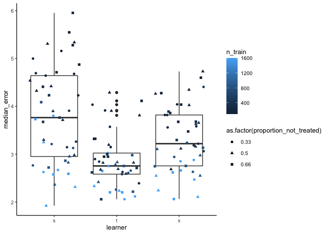
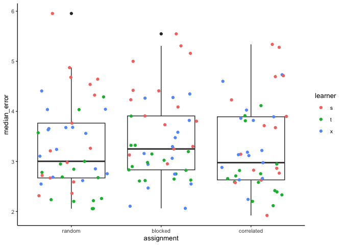

eleanorjackson
19 December, 2023

``` r
library("tidyverse")
library("here")

set.seed(123)

# get my functions
function_dir <- list.files(here::here("code", "functions"),
                           full.names = TRUE)

sapply(function_dir, source)
```

``` r
clean_data <-
  readRDS(here::here("data", "derived", "ForManSims_RCP0_same_time_clim.rds")) %>% 
  dplyr::filter(! description == "201846093080")
```

For some reason, this plot `2018 4609 3080` only has an entry at period
zero. Need to go back and find where this bug was introduced!

Generate a table of every combination of these 4 “design features”.

``` r
keys <- expand.grid(
  assignment = c("random", "blocked", "correlated"),
  proportion_not_treated = c(0.5, 0.33, 0.66), 
  learner = c("s", "t", "x"),
  n_train = c(100, 200, 400, 800, 1600)
  )

glimpse(keys)
```

    ## Rows: 135
    ## Columns: 4
    ## $ assignment             <fct> random, blocked, correlated, random, blocked, c…
    ## $ proportion_not_treated <dbl> 0.50, 0.50, 0.50, 0.33, 0.33, 0.33, 0.66, 0.66,…
    ## $ learner                <fct> s, s, s, s, s, s, s, s, s, t, t, t, t, t, t, t,…
    ## $ n_train                <dbl> 100, 100, 100, 100, 100, 100, 100, 100, 100, 10…

135 combinations!

``` r
purrr::map2(
  .f = assign_treatment,
  .x = as.vector(keys$assignment), 
  .y = as.vector(keys$proportion_not_treated),
  df = clean_data) -> assigned_data

keys %>% 
  mutate(df_assigned = assigned_data) -> keys_assigned
```

Test function with one set of variables first.

``` r
fit_metalearner(keys_assigned$df_assigned[[1]], keys_assigned$learner[[1]], keys_assigned$n_train[[1]])
```

    ## # A tibble: 214 × 25
    ##    description     tr soil_carbon_initial soil_carbon_0 soil_carbon_1
    ##    <chr>        <dbl>               <dbl>         <dbl>         <dbl>
    ##  1 201825214120     0                44.6          49.2          46.0
    ##  2 202025021060     0                54.2          77.5          59.9
    ##  3 201830561100     0                65.5          62.6          58.3
    ##  4 201730252100     0                65.1          61.6          63.7
    ##  5 201820451100     0                76.8         111.           87.3
    ##  6 202040134040     0                66.1          63.7          59.5
    ##  7 201845652040     0               108.          110.          105. 
    ##  8 201935174102     0                94.6          77.0          80.5
    ##  9 202036274050     0                55.7          57.7          50.4
    ## 10 202030564150     0                65.6          68.4          64.1
    ## # ℹ 204 more rows
    ## # ℹ 20 more variables: soil_carbon_obs <dbl>, soil_moist_code <int>,
    ## #   altitude <int>, mat <dbl>, map <dbl>, ditch <int>, no_of_stems <dbl>,
    ## #   volume_pine <dbl>, volume_spruce <dbl>, volume_birch <dbl>,
    ## #   volume_aspen <dbl>, volume_oak <dbl>, volume_beech <dbl>,
    ## #   volume_southern_broadleaf <dbl>, volume_larch <dbl>, cate_s_learn <dbl>,
    ## #   cate_real <dbl>, diff <dbl>, ost_wgs84 <dbl>, nord_wgs84 <dbl>

Run `fit_metalearner` function for every row.

``` r
pmap(list(df = keys_assigned$df_assigned,
          learner = keys_assigned$learner, 
          n_train = keys_assigned$n_train
          ), fit_metalearner) -> model_out

keys %>% 
  mutate(df_out = model_out) -> keys_out
```

Get median error for each row

``` r
keys_out %>% 
  unite(col = "test_id", remove = FALSE,
        assignment, proportion_not_treated, n_train, learner) %>% 
  unnest(df_out) %>% 
  group_by(test_id,
           assignment, proportion_not_treated, n_train, learner) %>% 
  summarise(median_error = median(abs(diff)),
            .groups = "drop") -> results
```

… and plot

``` r
ggplot(results, aes(x = learner, y = median_error)) +
  geom_boxplot() +
  geom_jitter(aes(colour = n_train, shape = as.factor(proportion_not_treated)))
```

<!-- -->

!!!

``` r
ggplot(results, aes(x = assignment, y = median_error)) +
  geom_boxplot() +
  geom_jitter(aes(colour = learner))
```

<!-- -->

Not much difference between different treatment assignment groups.

I think most of the variation in error is coming from the choice of
metalearner (`learner`) and the sample size (`n_train`)
