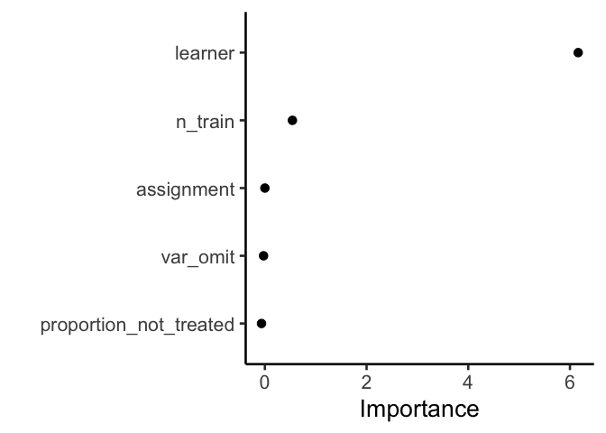
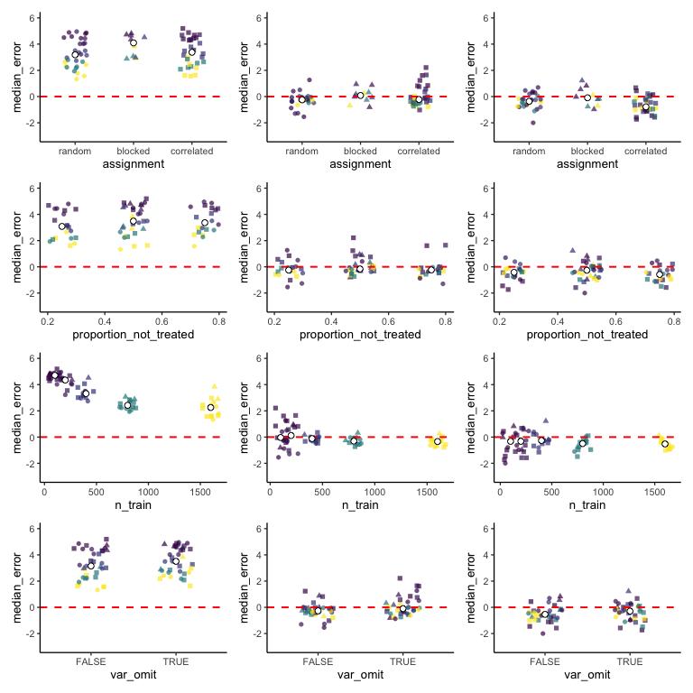
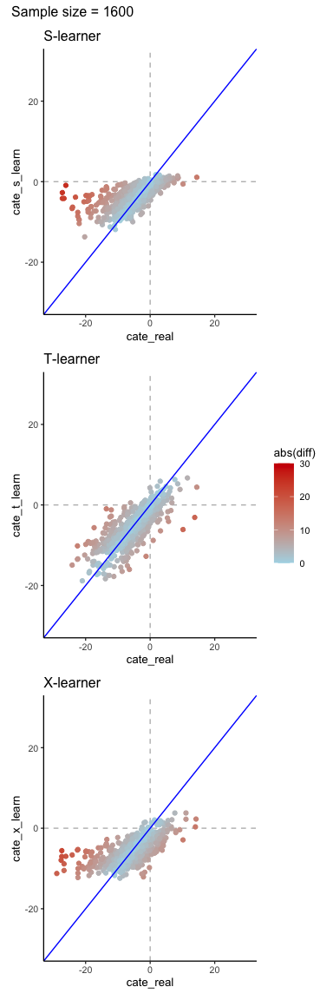
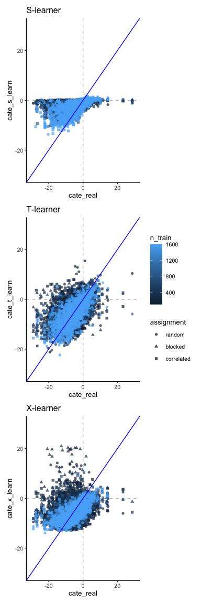
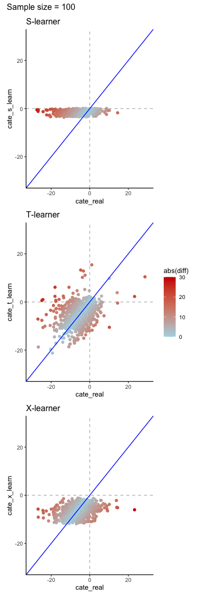
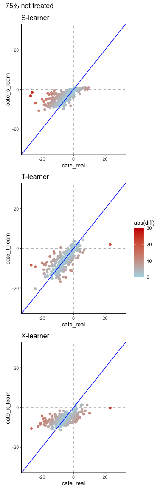
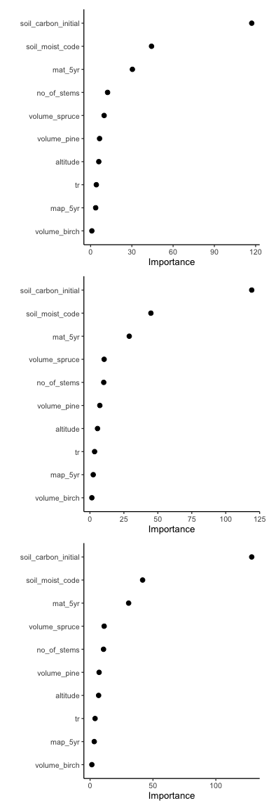

Fit the meta-meta model and explore preliminary results
================
eleanorjackson
15 January, 2024

``` r
library("tidyverse")
library("here")
library("tidymodels")
library("vip")
library("patchwork")

set.seed(123)
```

Import the median ITE prediction errors (generated by
[get-ite-predictions.R](/code/scripts/get-ite-predictions.R))

``` r
ml_results <- readRDS(here("data", "derived", "results.rds"))

ml_out <- readRDS(here("data", "derived", "model_out.rds"))

glimpse(ml_results)
```

    ## Rows: 210
    ## Columns: 7
    ## $ test_id                <chr> "blocked_0.5_100_s_FALSE", "blocked_0.5_100_s_T…
    ## $ assignment             <fct> blocked, blocked, blocked, blocked, blocked, bl…
    ## $ proportion_not_treated <dbl> 0.5, 0.5, 0.5, 0.5, 0.5, 0.5, 0.5, 0.5, 0.5, 0.…
    ## $ n_train                <dbl> 100, 100, 100, 100, 100, 100, 1600, 1600, 1600,…
    ## $ learner                <fct> s, s, t, t, x, x, s, s, t, t, x, x, s, s, t, t,…
    ## $ var_omit               <lgl> FALSE, TRUE, FALSE, TRUE, FALSE, TRUE, FALSE, T…
    ## $ median_error           <dbl> 4.72733606, 4.81286908, -0.01257151, -0.8119947…

I’m just going to do a quick glm for curiosity’s sake.

``` r
glm(median_error ~ learner * 
      n_train * 
      proportion_not_treated *
      assignment *
      var_omit, 
    ml_results, family = gaussian) -> glm_out

summary(glm_out)
```

    ## 
    ## Call:
    ## glm(formula = median_error ~ learner * n_train * proportion_not_treated * 
    ##     assignment * var_omit, family = gaussian, data = ml_results)
    ## 
    ## Deviance Residuals: 
    ##      Min        1Q    Median        3Q       Max  
    ## -1.52017  -0.34260   0.01991   0.33355   1.37833  
    ## 
    ## Coefficients: (12 not defined because of singularities)
    ##                                                                             Estimate
    ## (Intercept)                                                                4.499e+00
    ## learnert                                                                  -5.652e+00
    ## learnerx                                                                  -4.530e+00
    ## n_train                                                                   -2.021e-03
    ## proportion_not_treated                                                    -5.002e-01
    ## assignmentblocked                                                         -1.658e-03
    ## assignmentcorrelated                                                      -6.122e-01
    ## var_omitTRUE                                                              -7.538e-01
    ## learnert:n_train                                                           2.661e-03
    ## learnerx:n_train                                                           1.660e-03
    ## learnert:proportion_not_treated                                            1.567e+00
    ## learnerx:proportion_not_treated                                           -4.026e-01
    ## n_train:proportion_not_treated                                             2.543e-04
    ## learnert:assignmentblocked                                                 1.032e+00
    ## learnerx:assignmentblocked                                                 1.025e+00
    ## learnert:assignmentcorrelated                                              1.766e+00
    ## learnerx:assignmentcorrelated                                             -7.516e-01
    ## n_train:assignmentblocked                                                  8.571e-04
    ## n_train:assignmentcorrelated                                               5.552e-05
    ## proportion_not_treated:assignmentblocked                                          NA
    ## proportion_not_treated:assignmentcorrelated                                1.624e+00
    ## learnert:var_omitTRUE                                                      3.140e+00
    ## learnerx:var_omitTRUE                                                      6.509e-02
    ## n_train:var_omitTRUE                                                       9.665e-04
    ## proportion_not_treated:var_omitTRUE                                        1.724e+00
    ## assignmentblocked:var_omitTRUE                                             2.707e-01
    ## assignmentcorrelated:var_omitTRUE                                          1.173e+00
    ## learnert:n_train:proportion_not_treated                                   -9.252e-04
    ## learnerx:n_train:proportion_not_treated                                    4.994e-04
    ## learnert:n_train:assignmentblocked                                        -1.873e-03
    ## learnerx:n_train:assignmentblocked                                        -1.844e-03
    ## learnert:n_train:assignmentcorrelated                                     -9.523e-04
    ## learnerx:n_train:assignmentcorrelated                                      1.306e-03
    ## learnert:proportion_not_treated:assignmentblocked                                 NA
    ## learnerx:proportion_not_treated:assignmentblocked                                 NA
    ## learnert:proportion_not_treated:assignmentcorrelated                      -2.410e+00
    ## learnerx:proportion_not_treated:assignmentcorrelated                       7.399e-01
    ## n_train:proportion_not_treated:assignmentblocked                                  NA
    ## n_train:proportion_not_treated:assignmentcorrelated                        5.886e-05
    ## learnert:n_train:var_omitTRUE                                             -3.120e-03
    ## learnerx:n_train:var_omitTRUE                                              1.464e-04
    ## learnert:proportion_not_treated:var_omitTRUE                              -5.119e+00
    ## learnerx:proportion_not_treated:var_omitTRUE                               4.941e-01
    ## n_train:proportion_not_treated:var_omitTRUE                               -1.011e-03
    ## learnert:assignmentblocked:var_omitTRUE                                   -1.319e+00
    ## learnerx:assignmentblocked:var_omitTRUE                                   -1.295e+00
    ## learnert:assignmentcorrelated:var_omitTRUE                                -3.100e+00
    ## learnerx:assignmentcorrelated:var_omitTRUE                                 9.002e-02
    ## n_train:assignmentblocked:var_omitTRUE                                    -2.097e-04
    ## n_train:assignmentcorrelated:var_omitTRUE                                 -1.083e-03
    ## proportion_not_treated:assignmentblocked:var_omitTRUE                             NA
    ## proportion_not_treated:assignmentcorrelated:var_omitTRUE                  -2.549e+00
    ## learnert:n_train:proportion_not_treated:assignmentblocked                         NA
    ## learnerx:n_train:proportion_not_treated:assignmentblocked                         NA
    ## learnert:n_train:proportion_not_treated:assignmentcorrelated               1.176e-04
    ## learnerx:n_train:proportion_not_treated:assignmentcorrelated              -2.934e-03
    ## learnert:n_train:proportion_not_treated:var_omitTRUE                       4.126e-03
    ## learnerx:n_train:proportion_not_treated:var_omitTRUE                      -1.810e-03
    ## learnert:n_train:assignmentblocked:var_omitTRUE                            1.718e-03
    ## learnerx:n_train:assignmentblocked:var_omitTRUE                            1.639e-03
    ## learnert:n_train:assignmentcorrelated:var_omitTRUE                         2.737e-03
    ## learnerx:n_train:assignmentcorrelated:var_omitTRUE                        -2.502e-04
    ## learnert:proportion_not_treated:assignmentblocked:var_omitTRUE                    NA
    ## learnerx:proportion_not_treated:assignmentblocked:var_omitTRUE                    NA
    ## learnert:proportion_not_treated:assignmentcorrelated:var_omitTRUE          6.626e+00
    ## learnerx:proportion_not_treated:assignmentcorrelated:var_omitTRUE         -7.810e-01
    ## n_train:proportion_not_treated:assignmentblocked:var_omitTRUE                     NA
    ## n_train:proportion_not_treated:assignmentcorrelated:var_omitTRUE           1.660e-03
    ## learnert:n_train:proportion_not_treated:assignmentblocked:var_omitTRUE            NA
    ## learnerx:n_train:proportion_not_treated:assignmentblocked:var_omitTRUE            NA
    ## learnert:n_train:proportion_not_treated:assignmentcorrelated:var_omitTRUE -4.882e-03
    ## learnerx:n_train:proportion_not_treated:assignmentcorrelated:var_omitTRUE  1.807e-03
    ##                                                                           Std. Error
    ## (Intercept)                                                                6.330e-01
    ## learnert                                                                   8.952e-01
    ## learnerx                                                                   8.952e-01
    ## n_train                                                                    7.665e-04
    ## proportion_not_treated                                                     1.172e+00
    ## assignmentblocked                                                          4.785e-01
    ## assignmentcorrelated                                                       8.952e-01
    ## var_omitTRUE                                                               8.952e-01
    ## learnert:n_train                                                           1.084e-03
    ## learnerx:n_train                                                           1.084e-03
    ## learnert:proportion_not_treated                                            1.657e+00
    ## learnerx:proportion_not_treated                                            1.657e+00
    ## n_train:proportion_not_treated                                             1.419e-03
    ## learnert:assignmentblocked                                                 6.767e-01
    ## learnerx:assignmentblocked                                                 6.767e-01
    ## learnert:assignmentcorrelated                                              1.266e+00
    ## learnerx:assignmentcorrelated                                              1.266e+00
    ## n_train:assignmentblocked                                                  5.794e-04
    ## n_train:assignmentcorrelated                                               1.084e-03
    ## proportion_not_treated:assignmentblocked                                          NA
    ## proportion_not_treated:assignmentcorrelated                                1.657e+00
    ## learnert:var_omitTRUE                                                      1.266e+00
    ## learnerx:var_omitTRUE                                                      1.266e+00
    ## n_train:var_omitTRUE                                                       1.084e-03
    ## proportion_not_treated:var_omitTRUE                                        1.657e+00
    ## assignmentblocked:var_omitTRUE                                             6.767e-01
    ## assignmentcorrelated:var_omitTRUE                                          1.266e+00
    ## learnert:n_train:proportion_not_treated                                    2.007e-03
    ## learnerx:n_train:proportion_not_treated                                    2.007e-03
    ## learnert:n_train:assignmentblocked                                         8.194e-04
    ## learnerx:n_train:assignmentblocked                                         8.194e-04
    ## learnert:n_train:assignmentcorrelated                                      1.533e-03
    ## learnerx:n_train:assignmentcorrelated                                      1.533e-03
    ## learnert:proportion_not_treated:assignmentblocked                                 NA
    ## learnerx:proportion_not_treated:assignmentblocked                                 NA
    ## learnert:proportion_not_treated:assignmentcorrelated                       2.344e+00
    ## learnerx:proportion_not_treated:assignmentcorrelated                       2.344e+00
    ## n_train:proportion_not_treated:assignmentblocked                                  NA
    ## n_train:proportion_not_treated:assignmentcorrelated                        2.007e-03
    ## learnert:n_train:var_omitTRUE                                              1.533e-03
    ## learnerx:n_train:var_omitTRUE                                              1.533e-03
    ## learnert:proportion_not_treated:var_omitTRUE                               2.344e+00
    ## learnerx:proportion_not_treated:var_omitTRUE                               2.344e+00
    ## n_train:proportion_not_treated:var_omitTRUE                                2.007e-03
    ## learnert:assignmentblocked:var_omitTRUE                                    9.570e-01
    ## learnerx:assignmentblocked:var_omitTRUE                                    9.570e-01
    ## learnert:assignmentcorrelated:var_omitTRUE                                 1.790e+00
    ## learnerx:assignmentcorrelated:var_omitTRUE                                 1.790e+00
    ## n_train:assignmentblocked:var_omitTRUE                                     8.194e-04
    ## n_train:assignmentcorrelated:var_omitTRUE                                  1.533e-03
    ## proportion_not_treated:assignmentblocked:var_omitTRUE                             NA
    ## proportion_not_treated:assignmentcorrelated:var_omitTRUE                   2.344e+00
    ## learnert:n_train:proportion_not_treated:assignmentblocked                         NA
    ## learnerx:n_train:proportion_not_treated:assignmentblocked                         NA
    ## learnert:n_train:proportion_not_treated:assignmentcorrelated               2.838e-03
    ## learnerx:n_train:proportion_not_treated:assignmentcorrelated               2.838e-03
    ## learnert:n_train:proportion_not_treated:var_omitTRUE                       2.838e-03
    ## learnerx:n_train:proportion_not_treated:var_omitTRUE                       2.838e-03
    ## learnert:n_train:assignmentblocked:var_omitTRUE                            1.159e-03
    ## learnerx:n_train:assignmentblocked:var_omitTRUE                            1.159e-03
    ## learnert:n_train:assignmentcorrelated:var_omitTRUE                         2.168e-03
    ## learnerx:n_train:assignmentcorrelated:var_omitTRUE                         2.168e-03
    ## learnert:proportion_not_treated:assignmentblocked:var_omitTRUE                    NA
    ## learnerx:proportion_not_treated:assignmentblocked:var_omitTRUE                    NA
    ## learnert:proportion_not_treated:assignmentcorrelated:var_omitTRUE          3.315e+00
    ## learnerx:proportion_not_treated:assignmentcorrelated:var_omitTRUE          3.315e+00
    ## n_train:proportion_not_treated:assignmentblocked:var_omitTRUE                     NA
    ## n_train:proportion_not_treated:assignmentcorrelated:var_omitTRUE           2.838e-03
    ## learnert:n_train:proportion_not_treated:assignmentblocked:var_omitTRUE            NA
    ## learnerx:n_train:proportion_not_treated:assignmentblocked:var_omitTRUE            NA
    ## learnert:n_train:proportion_not_treated:assignmentcorrelated:var_omitTRUE  4.014e-03
    ## learnerx:n_train:proportion_not_treated:assignmentcorrelated:var_omitTRUE  4.014e-03
    ##                                                                           t value
    ## (Intercept)                                                                 7.108
    ## learnert                                                                   -6.314
    ## learnerx                                                                   -5.060
    ## n_train                                                                    -2.637
    ## proportion_not_treated                                                     -0.427
    ## assignmentblocked                                                          -0.003
    ## assignmentcorrelated                                                       -0.684
    ## var_omitTRUE                                                               -0.842
    ## learnert:n_train                                                            2.455
    ## learnerx:n_train                                                            1.531
    ## learnert:proportion_not_treated                                             0.946
    ## learnerx:proportion_not_treated                                            -0.243
    ## n_train:proportion_not_treated                                              0.179
    ## learnert:assignmentblocked                                                  1.525
    ## learnerx:assignmentblocked                                                  1.515
    ## learnert:assignmentcorrelated                                               1.395
    ## learnerx:assignmentcorrelated                                              -0.594
    ## n_train:assignmentblocked                                                   1.479
    ## n_train:assignmentcorrelated                                                0.051
    ## proportion_not_treated:assignmentblocked                                       NA
    ## proportion_not_treated:assignmentcorrelated                                 0.980
    ## learnert:var_omitTRUE                                                       2.480
    ## learnerx:var_omitTRUE                                                       0.051
    ## n_train:var_omitTRUE                                                        0.892
    ## proportion_not_treated:var_omitTRUE                                         1.040
    ## assignmentblocked:var_omitTRUE                                              0.400
    ## assignmentcorrelated:var_omitTRUE                                           0.927
    ## learnert:n_train:proportion_not_treated                                    -0.461
    ## learnerx:n_train:proportion_not_treated                                     0.249
    ## learnert:n_train:assignmentblocked                                         -2.286
    ## learnerx:n_train:assignmentblocked                                         -2.251
    ## learnert:n_train:assignmentcorrelated                                      -0.621
    ## learnerx:n_train:assignmentcorrelated                                       0.852
    ## learnert:proportion_not_treated:assignmentblocked                              NA
    ## learnerx:proportion_not_treated:assignmentblocked                              NA
    ## learnert:proportion_not_treated:assignmentcorrelated                       -1.028
    ## learnerx:proportion_not_treated:assignmentcorrelated                        0.316
    ## n_train:proportion_not_treated:assignmentblocked                               NA
    ## n_train:proportion_not_treated:assignmentcorrelated                         0.029
    ## learnert:n_train:var_omitTRUE                                              -2.036
    ## learnerx:n_train:var_omitTRUE                                               0.096
    ## learnert:proportion_not_treated:var_omitTRUE                               -2.184
    ## learnerx:proportion_not_treated:var_omitTRUE                                0.211
    ## n_train:proportion_not_treated:var_omitTRUE                                -0.504
    ## learnert:assignmentblocked:var_omitTRUE                                    -1.378
    ## learnerx:assignmentblocked:var_omitTRUE                                    -1.354
    ## learnert:assignmentcorrelated:var_omitTRUE                                 -1.731
    ## learnerx:assignmentcorrelated:var_omitTRUE                                  0.050
    ## n_train:assignmentblocked:var_omitTRUE                                     -0.256
    ## n_train:assignmentcorrelated:var_omitTRUE                                  -0.706
    ## proportion_not_treated:assignmentblocked:var_omitTRUE                          NA
    ## proportion_not_treated:assignmentcorrelated:var_omitTRUE                   -1.088
    ## learnert:n_train:proportion_not_treated:assignmentblocked                      NA
    ## learnerx:n_train:proportion_not_treated:assignmentblocked                      NA
    ## learnert:n_train:proportion_not_treated:assignmentcorrelated                0.041
    ## learnerx:n_train:proportion_not_treated:assignmentcorrelated               -1.034
    ## learnert:n_train:proportion_not_treated:var_omitTRUE                        1.454
    ## learnerx:n_train:proportion_not_treated:var_omitTRUE                       -0.638
    ## learnert:n_train:assignmentblocked:var_omitTRUE                             1.483
    ## learnerx:n_train:assignmentblocked:var_omitTRUE                             1.414
    ## learnert:n_train:assignmentcorrelated:var_omitTRUE                          1.262
    ## learnerx:n_train:assignmentcorrelated:var_omitTRUE                         -0.115
    ## learnert:proportion_not_treated:assignmentblocked:var_omitTRUE                 NA
    ## learnerx:proportion_not_treated:assignmentblocked:var_omitTRUE                 NA
    ## learnert:proportion_not_treated:assignmentcorrelated:var_omitTRUE           1.999
    ## learnerx:proportion_not_treated:assignmentcorrelated:var_omitTRUE          -0.236
    ## n_train:proportion_not_treated:assignmentblocked:var_omitTRUE                  NA
    ## n_train:proportion_not_treated:assignmentcorrelated:var_omitTRUE            0.585
    ## learnert:n_train:proportion_not_treated:assignmentblocked:var_omitTRUE         NA
    ## learnerx:n_train:proportion_not_treated:assignmentblocked:var_omitTRUE         NA
    ## learnert:n_train:proportion_not_treated:assignmentcorrelated:var_omitTRUE  -1.216
    ## learnerx:n_train:proportion_not_treated:assignmentcorrelated:var_omitTRUE   0.450
    ##                                                                           Pr(>|t|)
    ## (Intercept)                                                               4.44e-11
    ## learnert                                                                  2.92e-09
    ## learnerx                                                                  1.21e-06
    ## n_train                                                                    0.00925
    ## proportion_not_treated                                                     0.67016
    ## assignmentblocked                                                          0.99724
    ## assignmentcorrelated                                                       0.49512
    ## var_omitTRUE                                                               0.40108
    ## learnert:n_train                                                           0.01522
    ## learnerx:n_train                                                           0.12778
    ## learnert:proportion_not_treated                                            0.34584
    ## learnerx:proportion_not_treated                                            0.80842
    ## n_train:proportion_not_treated                                             0.85801
    ## learnert:assignmentblocked                                                 0.12930
    ## learnerx:assignmentblocked                                                 0.13184
    ## learnert:assignmentcorrelated                                              0.16512
    ## learnerx:assignmentcorrelated                                              0.55361
    ## n_train:assignmentblocked                                                  0.14116
    ## n_train:assignmentcorrelated                                               0.95922
    ## proportion_not_treated:assignmentblocked                                        NA
    ## proportion_not_treated:assignmentcorrelated                                0.32879
    ## learnert:var_omitTRUE                                                      0.01424
    ## learnerx:var_omitTRUE                                                      0.95906
    ## n_train:var_omitTRUE                                                       0.37398
    ## proportion_not_treated:var_omitTRUE                                        0.30000
    ## assignmentblocked:var_omitTRUE                                             0.68969
    ## assignmentcorrelated:var_omitTRUE                                          0.35563
    ## learnert:n_train:proportion_not_treated                                    0.64548
    ## learnerx:n_train:proportion_not_treated                                    0.80384
    ## learnert:n_train:assignmentblocked                                         0.02368
    ## learnerx:n_train:assignmentblocked                                         0.02586
    ## learnert:n_train:assignmentcorrelated                                      0.53539
    ## learnerx:n_train:assignmentcorrelated                                      0.39560
    ## learnert:proportion_not_treated:assignmentblocked                               NA
    ## learnerx:proportion_not_treated:assignmentblocked                               NA
    ## learnert:proportion_not_treated:assignmentcorrelated                       0.30551
    ## learnerx:proportion_not_treated:assignmentcorrelated                       0.75271
    ## n_train:proportion_not_treated:assignmentblocked                                NA
    ## n_train:proportion_not_treated:assignmentcorrelated                        0.97664
    ## learnert:n_train:var_omitTRUE                                              0.04355
    ## learnerx:n_train:var_omitTRUE                                              0.92403
    ## learnert:proportion_not_treated:var_omitTRUE                               0.03052
    ## learnerx:proportion_not_treated:var_omitTRUE                               0.83334
    ## n_train:proportion_not_treated:var_omitTRUE                                0.61505
    ## learnert:assignmentblocked:var_omitTRUE                                    0.17019
    ## learnerx:assignmentblocked:var_omitTRUE                                    0.17789
    ## learnert:assignmentcorrelated:var_omitTRUE                                 0.08544
    ## learnerx:assignmentcorrelated:var_omitTRUE                                 0.95996
    ## n_train:assignmentblocked:var_omitTRUE                                     0.79835
    ## n_train:assignmentcorrelated:var_omitTRUE                                  0.48101
    ## proportion_not_treated:assignmentblocked:var_omitTRUE                           NA
    ## proportion_not_treated:assignmentcorrelated:var_omitTRUE                   0.27854
    ## learnert:n_train:proportion_not_treated:assignmentblocked                       NA
    ## learnerx:n_train:proportion_not_treated:assignmentblocked                       NA
    ## learnert:n_train:proportion_not_treated:assignmentcorrelated               0.96700
    ## learnerx:n_train:proportion_not_treated:assignmentcorrelated               0.30295
    ## learnert:n_train:proportion_not_treated:var_omitTRUE                       0.14814
    ## learnerx:n_train:proportion_not_treated:var_omitTRUE                       0.52467
    ## learnert:n_train:assignmentblocked:var_omitTRUE                            0.14020
    ## learnerx:n_train:assignmentblocked:var_omitTRUE                            0.15929
    ## learnert:n_train:assignmentcorrelated:var_omitTRUE                         0.20880
    ## learnerx:n_train:assignmentcorrelated:var_omitTRUE                         0.90827
    ## learnert:proportion_not_treated:assignmentblocked:var_omitTRUE                  NA
    ## learnerx:proportion_not_treated:assignmentblocked:var_omitTRUE                  NA
    ## learnert:proportion_not_treated:assignmentcorrelated:var_omitTRUE          0.04744
    ## learnerx:proportion_not_treated:assignmentcorrelated:var_omitTRUE          0.81407
    ## n_train:proportion_not_treated:assignmentblocked:var_omitTRUE                   NA
    ## n_train:proportion_not_treated:assignmentcorrelated:var_omitTRUE           0.55955
    ## learnert:n_train:proportion_not_treated:assignmentblocked:var_omitTRUE          NA
    ## learnerx:n_train:proportion_not_treated:assignmentblocked:var_omitTRUE          NA
    ## learnert:n_train:proportion_not_treated:assignmentcorrelated:var_omitTRUE  0.22582
    ## learnerx:n_train:proportion_not_treated:assignmentcorrelated:var_omitTRUE  0.65323
    ##                                                                              
    ## (Intercept)                                                               ***
    ## learnert                                                                  ***
    ## learnerx                                                                  ***
    ## n_train                                                                   ** 
    ## proportion_not_treated                                                       
    ## assignmentblocked                                                            
    ## assignmentcorrelated                                                         
    ## var_omitTRUE                                                                 
    ## learnert:n_train                                                          *  
    ## learnerx:n_train                                                             
    ## learnert:proportion_not_treated                                              
    ## learnerx:proportion_not_treated                                              
    ## n_train:proportion_not_treated                                               
    ## learnert:assignmentblocked                                                   
    ## learnerx:assignmentblocked                                                   
    ## learnert:assignmentcorrelated                                                
    ## learnerx:assignmentcorrelated                                                
    ## n_train:assignmentblocked                                                    
    ## n_train:assignmentcorrelated                                                 
    ## proportion_not_treated:assignmentblocked                                     
    ## proportion_not_treated:assignmentcorrelated                                  
    ## learnert:var_omitTRUE                                                     *  
    ## learnerx:var_omitTRUE                                                        
    ## n_train:var_omitTRUE                                                         
    ## proportion_not_treated:var_omitTRUE                                          
    ## assignmentblocked:var_omitTRUE                                               
    ## assignmentcorrelated:var_omitTRUE                                            
    ## learnert:n_train:proportion_not_treated                                      
    ## learnerx:n_train:proportion_not_treated                                      
    ## learnert:n_train:assignmentblocked                                        *  
    ## learnerx:n_train:assignmentblocked                                        *  
    ## learnert:n_train:assignmentcorrelated                                        
    ## learnerx:n_train:assignmentcorrelated                                        
    ## learnert:proportion_not_treated:assignmentblocked                            
    ## learnerx:proportion_not_treated:assignmentblocked                            
    ## learnert:proportion_not_treated:assignmentcorrelated                         
    ## learnerx:proportion_not_treated:assignmentcorrelated                         
    ## n_train:proportion_not_treated:assignmentblocked                             
    ## n_train:proportion_not_treated:assignmentcorrelated                          
    ## learnert:n_train:var_omitTRUE                                             *  
    ## learnerx:n_train:var_omitTRUE                                                
    ## learnert:proportion_not_treated:var_omitTRUE                              *  
    ## learnerx:proportion_not_treated:var_omitTRUE                                 
    ## n_train:proportion_not_treated:var_omitTRUE                                  
    ## learnert:assignmentblocked:var_omitTRUE                                      
    ## learnerx:assignmentblocked:var_omitTRUE                                      
    ## learnert:assignmentcorrelated:var_omitTRUE                                .  
    ## learnerx:assignmentcorrelated:var_omitTRUE                                   
    ## n_train:assignmentblocked:var_omitTRUE                                       
    ## n_train:assignmentcorrelated:var_omitTRUE                                    
    ## proportion_not_treated:assignmentblocked:var_omitTRUE                        
    ## proportion_not_treated:assignmentcorrelated:var_omitTRUE                     
    ## learnert:n_train:proportion_not_treated:assignmentblocked                    
    ## learnerx:n_train:proportion_not_treated:assignmentblocked                    
    ## learnert:n_train:proportion_not_treated:assignmentcorrelated                 
    ## learnerx:n_train:proportion_not_treated:assignmentcorrelated                 
    ## learnert:n_train:proportion_not_treated:var_omitTRUE                         
    ## learnerx:n_train:proportion_not_treated:var_omitTRUE                         
    ## learnert:n_train:assignmentblocked:var_omitTRUE                              
    ## learnerx:n_train:assignmentblocked:var_omitTRUE                              
    ## learnert:n_train:assignmentcorrelated:var_omitTRUE                           
    ## learnerx:n_train:assignmentcorrelated:var_omitTRUE                           
    ## learnert:proportion_not_treated:assignmentblocked:var_omitTRUE               
    ## learnerx:proportion_not_treated:assignmentblocked:var_omitTRUE               
    ## learnert:proportion_not_treated:assignmentcorrelated:var_omitTRUE         *  
    ## learnerx:proportion_not_treated:assignmentcorrelated:var_omitTRUE            
    ## n_train:proportion_not_treated:assignmentblocked:var_omitTRUE                
    ## n_train:proportion_not_treated:assignmentcorrelated:var_omitTRUE             
    ## learnert:n_train:proportion_not_treated:assignmentblocked:var_omitTRUE       
    ## learnerx:n_train:proportion_not_treated:assignmentblocked:var_omitTRUE       
    ## learnert:n_train:proportion_not_treated:assignmentcorrelated:var_omitTRUE    
    ## learnerx:n_train:proportion_not_treated:assignmentcorrelated:var_omitTRUE    
    ## ---
    ## Signif. codes:  0 '***' 0.001 '**' 0.01 '*' 0.05 '.' 0.1 ' ' 1
    ## 
    ## (Dispersion parameter for gaussian family taken to be 0.3746326)
    ## 
    ##     Null deviance: 772.159  on 209  degrees of freedom
    ## Residual deviance:  56.195  on 150  degrees of freedom
    ## AIC: 441.12
    ## 
    ## Number of Fisher Scoring iterations: 2

## Fit random forest

### train test split

``` r
data_split <- initial_split(ml_results, prop = 1/3)
train_data <- training(data_split)
test_data <- testing(data_split)
```

### tune hyperparameters

``` r
rf_tune <- rand_forest(mtry = tune(), min_n = tune()) %>%
  set_engine("ranger", num.threads = 3) %>%
  set_mode("regression")

tree_grid <- grid_regular(mtry(c(1, 5)),
                          min_n(),
                          levels = 5)

rf_recipe <- recipe(median_error ~ 
                      assignment + proportion_not_treated + 
                      n_train + learner + var_omit,
    data = train_data)

rf_workflow <- workflow() %>%
  add_recipe(rf_recipe) %>%
  add_model(rf_tune)

# create a set of cross-validation resamples to use for tuning
trees_folds <- vfold_cv(train_data, v = 25)

rf_tune_res <- 
  tune_grid(rf_workflow,
            resamples = trees_folds,
            grid = tree_grid,
            control = control_grid(save_pred = TRUE),
            metrics = metric_set(rmse))

best_auc <- select_best(rf_tune_res, "rmse")

final_rf <- finalize_model(
  rf_tune,
  best_auc
)

final_rf
```

    ## Random Forest Model Specification (regression)
    ## 
    ## Main Arguments:
    ##   mtry = 3
    ##   min_n = 2
    ## 
    ## Engine-Specific Arguments:
    ##   num.threads = 3
    ## 
    ## Computational engine: ranger

### vip

``` r
final_rf %>%
  set_engine("ranger", importance = "permutation") %>%
  fit(median_error ~ .,
    data = ml_results %>% select(-test_id)
  ) %>%
  vip(geom = "point", aesthetics = list(size = 3)) +
  theme_classic(base_size = 20)
```

<!-- -->

### fit model

``` r
final_wf <- workflow() %>%
  add_recipe(rf_recipe) %>%
  add_model(final_rf)

final_res <- final_wf %>%
  last_fit(data_split)

final_res %>%
  collect_metrics()
```

    ## # A tibble: 2 × 4
    ##   .metric .estimator .estimate .config             
    ##   <chr>   <chr>          <dbl> <chr>               
    ## 1 rmse    standard       0.765 Preprocessor1_Model1
    ## 2 rsq     standard       0.866 Preprocessor1_Model1

``` r
# final_res %>%
#   collect_predictions()
```

## Visualise!

First col is s, then t, then x.

``` r
plot_panels <- function(meta_learner, x_var, jitter_width, data) {
  data %>% 
    filter(learner == meta_learner) %>% 
    ggplot(aes(y = .data$median_error, x = .data[[x_var]])) +
    geom_jitter(aes(colour = .data$n_train, shape = .data$assignment),
                width = jitter_width, height = 0, alpha = 0.7, size = 1.5) +
    geom_hline(yintercept = 0, colour = "red", linewidth = 0.7, linetype = 2) +
    stat_summary(fun = "median", fill = "white", colour = "black", 
                 size = 0.5, shape = 21, stroke = 0.5) +
    ylim(-3, 6) +
    scale_color_viridis_c() +
    theme_classic(base_size = 10) +
    guides(color = "none", shape = "none")
}

keys <- expand.grid(
  meta_learner = c("s", "t", "x"),
  x_var = c("assignment", "proportion_not_treated", "n_train", "var_omit")
  ) %>% 
  mutate(x_var = as.character(x_var)) %>% 
  mutate(jitter_width = case_when(x_var == "assignment" ~ 0.2,
                                  x_var == "proportion_not_treated" ~ 0.05,
                                  x_var == "n_train" ~ 80,
                                  x_var == "var_omit" ~ 0.2,
                                  .default = 0.5)) %>% 
  arrange(meta_learner)

purrr::pmap(list(meta_learner = keys$meta_learner,
          x_var = keys$x_var, jitter_width = keys$jitter_width), 
          plot_panels, data = ml_results) -> plot_list

patchwork::wrap_plots(plot_list, ncol = 3, byrow = FALSE)
```

<!-- -->

``` r
ml_out %>% 
  filter(learner == "s",
         assignment == "random", proportion_not_treated == 0.5,
         n_train == 1600, var_omit == FALSE) %>% 
  mutate(rep = 1:3) %>% 
  unnest(df_out) %>%
  ggplot() +
  geom_hline(yintercept = 0, colour = "grey", linetype = 2) +
  geom_vline(xintercept = 0, colour = "grey", linetype = 2) +
  geom_point(aes(x = cate_real, y = cate_s_learn, colour = abs(diff))) +
  geom_abline(intercept = 0, slope = 1, colour = "blue") +
  scale_color_gradient(low = "lightblue", high = "red3",
                       limits = c(0, 30)) +
  xlim(-30, 30) +
  ylim(-30, 30) +
  ggtitle("S-learner") -> p1

ml_out %>% 
  filter(learner == "t",
         assignment == "random", proportion_not_treated == 0.5,
         n_train == 1600, var_omit == FALSE) %>% 
  mutate(rep = 1:3) %>% 
  unnest(df_out) %>%
  ggplot() +
  geom_hline(yintercept = 0, colour = "grey", linetype = 2) +
  geom_vline(xintercept = 0, colour = "grey", linetype = 2) +
  geom_point(aes(x = cate_real, y = cate_t_learn, colour = abs(diff))) +
  geom_abline(intercept = 0, slope = 1, colour = "blue") +
  scale_color_gradient(low = "lightblue", high = "red3",
                       limits = c(0, 30)) +
  xlim(-30, 30) +
  ylim(-30, 30) +
  ggtitle("T-learner") -> p2


ml_out %>% 
  filter(learner == "x",
         assignment == "random", proportion_not_treated == 0.5,
         n_train == 1600, var_omit == FALSE) %>% 
  mutate(rep = 1:3) %>% 
  unnest(df_out) %>%
  ggplot() +
  geom_hline(yintercept = 0, colour = "grey", linetype = 2) +
  geom_vline(xintercept = 0, colour = "grey", linetype = 2) +
  geom_point(aes(x = cate_real, y = cate_x_learn, colour = abs(diff))) +
  geom_abline(intercept = 0, slope = 1, colour = "blue") +
  scale_color_gradient(low = "lightblue", high = "red3",
                       limits = c(0, 30)) +
  xlim(-30, 30) +
  ylim(-30, 30) +
  ggtitle("X-learner") -> p3

p1 / p2 / p3 +
  plot_layout(guides = "collect") +
  plot_annotation(title = "Sample size = 1600")
```

<!-- -->

``` r
ml_out %>% 
  filter(learner == "s",
         proportion_not_treated == 0.5,
         var_omit == FALSE) %>% 
  unnest(df_out) %>%
  ggplot() +
  geom_hline(yintercept = 0, colour = "grey", linetype = 2) +
  geom_vline(xintercept = 0, colour = "grey", linetype = 2) +
  geom_point(aes(x = cate_real, y = cate_s_learn, colour = n_train, shape = assignment), alpha = 0.7) +
  geom_abline(intercept = 0, slope = 1, colour = "blue") +
  xlim(-30, 30) +
  ylim(-30, 30) +
  ggtitle("S-learner") -> p1

ml_out %>% 
  filter(learner == "t",
         proportion_not_treated == 0.5,
         var_omit == FALSE) %>% 
  unnest(df_out) %>%
  ggplot() +
  geom_hline(yintercept = 0, colour = "grey", linetype = 2) +
  geom_vline(xintercept = 0, colour = "grey", linetype = 2) +
  geom_point(aes(x = cate_real, y = cate_t_learn, colour = n_train, shape = assignment), alpha = 0.7) +
  geom_abline(intercept = 0, slope = 1, colour = "blue") +
  xlim(-30, 30) +
  ylim(-30, 30) +
  ggtitle("T-learner") -> p2


ml_out %>% 
  filter(learner == "x",
         proportion_not_treated == 0.5,
         var_omit == FALSE) %>% 
  unnest(df_out) %>%
  ggplot() +
  geom_hline(yintercept = 0, colour = "grey", linetype = 2) +
  geom_vline(xintercept = 0, colour = "grey", linetype = 2) +
  geom_point(aes(x = cate_real, y = cate_x_learn, colour = n_train, shape = assignment), alpha = 0.7) +
  geom_abline(intercept = 0, slope = 1, colour = "blue") +
  xlim(-30, 30) +
  ylim(-30, 30) +
  ggtitle("X-learner") -> p3

p1 / p2 / p3 +
  plot_layout(guides = "collect")
```

<!-- -->

``` r
ml_out %>% 
  filter(learner == "s",
         assignment == "random", proportion_not_treated == 0.5,
         n_train == 100, var_omit == FALSE) %>% 
  mutate(rep = 1:3) %>% 
  unnest(df_out) %>%
  ggplot() +
  geom_hline(yintercept = 0, colour = "grey", linetype = 2) +
  geom_vline(xintercept = 0, colour = "grey", linetype = 2) +
  geom_point(aes(x = cate_real, y = cate_s_learn, colour = abs(diff))) +
  geom_abline(intercept = 0, slope = 1, colour = "blue") +
  scale_color_gradient(low = "lightblue", high = "red3",
                       limits = c(0, 30)) +
  xlim(-30, 30) +
  ylim(-30, 30) +
  ggtitle("S-learner") -> p4

ml_out %>% 
  filter(learner == "t",
         assignment == "random", proportion_not_treated == 0.5,
         n_train == 100, var_omit == FALSE) %>% 
  mutate(rep = 1:3) %>% 
  unnest(df_out) %>%
  ggplot() +
  geom_hline(yintercept = 0, colour = "grey", linetype = 2) +
  geom_vline(xintercept = 0, colour = "grey", linetype = 2) +
  geom_point(aes(x = cate_real, y = cate_t_learn, colour = abs(diff))) +
  geom_abline(intercept = 0, slope = 1, colour = "blue") +
  scale_color_gradient(low = "lightblue", high = "red3",
                       limits = c(0, 30)) +
  xlim(-30, 30) +
  ylim(-30, 30) +
  ggtitle("T-learner") -> p5


ml_out %>% 
  filter(learner == "x",
         assignment == "random", proportion_not_treated == 0.5,
         n_train == 100, var_omit == FALSE) %>% 
  mutate(rep = 1:3) %>% 
  unnest(df_out) %>%
  ggplot() +
  geom_hline(yintercept = 0, colour = "grey", linetype = 2) +
  geom_vline(xintercept = 0, colour = "grey", linetype = 2) +
  geom_point(aes(x = cate_real, y = cate_x_learn, colour = abs(diff))) +
  geom_abline(intercept = 0, slope = 1, colour = "blue") +
  scale_color_gradient(low = "lightblue", high = "red3",
                       limits = c(0, 30)) +
  xlim(-30, 30) +
  ylim(-30, 30) +
  ggtitle("X-learner") -> p6

p4 / p5 / p6 +
  plot_layout(guides = "collect") +
  plot_annotation(title = "Sample size = 100")
```

<!-- -->

``` r
ml_out %>% 
  filter(learner == "s",
         assignment == "random", proportion_not_treated == 0.75,
         n_train == 1600, var_omit == FALSE) %>% 
  mutate(rep = 1:3) %>% 
  unnest(df_out) %>%
  ggplot() +
  geom_hline(yintercept = 0, colour = "grey", linetype = 2) +
  geom_vline(xintercept = 0, colour = "grey", linetype = 2) +
  geom_point(aes(x = cate_real, y = cate_s_learn, colour = abs(diff))) +
  geom_abline(intercept = 0, slope = 1, colour = "blue") +
  scale_color_gradient(low = "lightblue", high = "red3",
                       limits = c(0, 30)) +
  xlim(-30, 30) +
  ylim(-30, 30) +
  ggtitle("S-learner") -> p7

ml_out %>% 
  filter(learner == "t",
         assignment == "random", proportion_not_treated == 0.75,
         n_train == 1600, var_omit == FALSE) %>% 
  mutate(rep = 1:3) %>% 
  unnest(df_out) %>%
  ggplot() +
  geom_hline(yintercept = 0, colour = "grey", linetype = 2) +
  geom_vline(xintercept = 0, colour = "grey", linetype = 2) +
  geom_point(aes(x = cate_real, y = cate_t_learn, colour = abs(diff))) +
  geom_abline(intercept = 0, slope = 1, colour = "blue") +
  scale_color_gradient(low = "lightblue", high = "red3",
                       limits = c(0, 30)) +
  xlim(-30, 30) +
  ylim(-30, 30) +
  ggtitle("T-learner") -> p8


ml_out %>% 
  filter(learner == "x",
         assignment == "random", proportion_not_treated == 0.75,
         n_train == 1600, var_omit == FALSE) %>% 
  mutate(rep = 1:3) %>% 
  unnest(df_out) %>%
  ggplot() +
  geom_hline(yintercept = 0, colour = "grey", linetype = 2) +
  geom_vline(xintercept = 0, colour = "grey", linetype = 2) +
  geom_point(aes(x = cate_real, y = cate_x_learn, colour = abs(diff))) +
  geom_abline(intercept = 0, slope = 1, colour = "blue") +
  scale_color_gradient(low = "lightblue", high = "red3",
                       limits = c(0, 30)) +
  xlim(-30, 30) +
  ylim(-30, 30) +
  ggtitle("X-learner") -> p9

p7 / p8 / p9 +
  plot_layout(guides = "collect") +
  plot_annotation(title = "75% not treated")
```

<!-- -->

# meta-learner vips

``` r
function_dir <- list.files(here::here("code", "functions"),
                           full.names = TRUE)

sapply(function_dir, source)
```

    ##         /Users/eleanorjackson/Projects/tree/code/functions/assign-treatment.R
    ## value   ?                                                                    
    ## visible FALSE                                                                
    ##         /Users/eleanorjackson/Projects/tree/code/functions/fit-metalearner.R
    ## value   ?                                                                   
    ## visible FALSE

``` r
clean_data <-
  readRDS(here::here("data", "derived", "ForManSims_RCP0_same_time_clim.rds"))

assigned_data <- assign_treatment(clean_data, "random")

features <- assigned_data |>
    dplyr::filter(period == 0) |>
    dplyr::select(
      description,
      soil_moist_code,
      altitude, mat_5yr, map_5yr, ditch, no_of_stems, volume_pine, volume_spruce,
      volume_birch, volume_aspen, volume_oak, volume_beech,
      volume_southern_broadleaf, volume_larch
   )

data_obs <- assigned_data |>
    dplyr::select(description, tr, control_category_name, total_soil_carbon) |>
    tidyr::pivot_wider(id_cols = c(description, tr),
                names_from = control_category_name,
                values_from = total_soil_carbon) |>
    dplyr::mutate(soil_carbon_obs =
                    dplyr::case_when(tr == 0 ~ `SetAside (Unmanaged)`,
                                       tr == 1 ~ `BAU - NoThinning`)) |>
    dplyr::rename(soil_carbon_initial = `Initial state`,
           soil_carbon_0 = `SetAside (Unmanaged)`,
           soil_carbon_1 = `BAU - NoThinning`) |>
    dplyr::left_join(features,
                     by = "description")
  
feat_list <- c("soil_carbon_initial", "altitude",
                   "mat_5yr", "map_5yr", "ditch", "no_of_stems", "volume_pine",
                   "volume_spruce", "volume_birch", "volume_aspen",
                   "volume_oak", "volume_beech", "soil_moist_code",
                   "volume_southern_broadleaf", "volume_larch")

  train_data_0 <- data_obs |>
    dplyr::filter(tr == 0) |>
    dplyr::slice_sample(n = 1600/2)

  train_data_1 <- data_obs |>
    dplyr::filter(tr == 1) |>
    dplyr::slice_sample(n = 1600/2)
  
train_data <- dplyr::bind_rows(train_data_0, train_data_1)
  
  test_data_0 <- data_obs |>
    dplyr::filter(! description %in% train_data$description) |>
    dplyr::filter(tr == 0) |>
    dplyr::slice_sample(n = 107)

  test_data_1 <- data_obs |>
    dplyr::filter(! description %in% train_data$description) |>
    dplyr::filter(tr == 1) |>
    dplyr::slice_sample(n = 107)

  test_data <- dplyr::bind_rows(test_data_0, test_data_1)
```

## S leaner vip

``` r
rf_tune <- rand_forest(mtry = tune(), min_n = tune()) %>%
  set_engine("ranger", num.threads = 3) %>%
  set_mode("regression")

tree_grid <- grid_regular(mtry(c(1, 5)),
                          min_n(),
                          levels = 5)

rf_recipe <- recipe(soil_carbon_obs ~ 
                      altitude +
                   mat_5yr + map_5yr + ditch + no_of_stems + volume_pine +
                   volume_spruce + volume_birch + volume_aspen +
                   volume_oak + volume_beech + soil_moist_code +
                   volume_southern_broadleaf + volume_larch,
    data = train_data)

rf_workflow <- workflow() %>%
  add_recipe(rf_recipe) %>%
  add_model(rf_tune)

# create a set of cross-validation resamples to use for tuning
trees_folds <- vfold_cv(train_data, v = 25)

rf_tune_res <- 
  tune_grid(rf_workflow,
            resamples = trees_folds,
            grid = tree_grid,
            control = control_grid(save_pred = TRUE),
            metrics = metric_set(rmse))

best_auc <- select_best(rf_tune_res, "rmse")

final_rf <- finalize_model(
  rf_tune,
  best_auc
)

final_rf %>%
  set_engine("ranger", importance = "permutation") %>%
  fit(soil_carbon_obs ~ .,
    data = test_data %>% select(-description,- soil_carbon_0, -soil_carbon_1)
  ) %>%
  vip(geom = "point", aesthetics = list(size = 2)) +
  theme_classic(base_size = 10) -> s_plot
```

## T zero vip

``` r
rf_t0_recipe <- recipe(soil_carbon_obs ~ 
                      altitude +
                   mat_5yr + map_5yr + ditch + no_of_stems + volume_pine +
                   volume_spruce + volume_birch + volume_aspen +
                   volume_oak + volume_beech + soil_moist_code +
                   volume_southern_broadleaf + volume_larch,
    data = train_data_0)

rf_t0_workflow <- workflow() %>%
  add_recipe(rf_recipe) %>%
  add_model(rf_tune)

rf_t0_tune_res <- 
  tune_grid(rf_workflow,
            resamples = trees_folds,
            grid = tree_grid,
            control = control_grid(save_pred = TRUE),
            metrics = metric_set(rmse))

best_auc_t0 <- select_best(rf_tune_res, "rmse")

final_rf_t0 <- finalize_model(
  rf_tune,
  best_auc_t0
)

final_rf_t0 %>%
  set_engine("ranger", importance = "permutation") %>%
  fit(soil_carbon_obs ~ .,
    data = test_data %>% select(-description,- soil_carbon_0, -soil_carbon_1)
  ) %>%
  vip(geom = "point", aesthetics = list(size = 2)) +
  theme_classic(base_size = 10) -> t0_plot
```

## T one vip

``` r
rf_t1_recipe <- recipe(soil_carbon_obs ~ 
                      altitude +
                   mat_5yr + map_5yr + ditch + no_of_stems + volume_pine +
                   volume_spruce + volume_birch + volume_aspen +
                   volume_oak + volume_beech + soil_moist_code +
                   volume_southern_broadleaf + volume_larch,
    data = train_data_1)

rf_t1_workflow <- workflow() %>%
  add_recipe(rf_recipe) %>%
  add_model(rf_tune)

rf_t1_tune_res <- 
  tune_grid(rf_workflow,
            resamples = trees_folds,
            grid = tree_grid,
            control = control_grid(save_pred = TRUE),
            metrics = metric_set(rmse))

best_auc_t1 <- select_best(rf_tune_res, "rmse")

final_rf_t1 <- finalize_model(
  rf_tune,
  best_auc_t1
)

final_rf_t1 %>%
  set_engine("ranger", importance = "permutation") %>%
  fit(soil_carbon_obs ~ .,
    data = test_data %>% select(-description,- soil_carbon_0, -soil_carbon_1)
  ) %>%
  vip(geom = "point", aesthetics = list(size = 2)) +
  theme_classic(base_size = 10) -> t1_plot
```

``` r
s_plot / t0_plot / t1_plot 
```

<!-- -->
