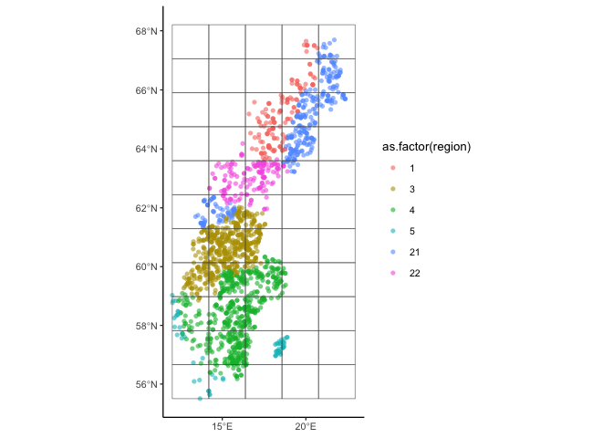

Find a region of covariate overlap
================
eleanorjackson
01 February, 2024

Find a geographical area of covariate overlap to use as testing data -
we want the area to be geographically distinct but environmentally
nested / nested in covariate space. Currently using random 200 plots but
ideally in the real world people wouldn’t predict outside of parameter
space.

``` r
library("tidyverse")
library("here")
library("FactoMineR")
library("factoextra")
library("ggmap")
library("maps")
library("sf")
library("patchwork")
library("GGally")

clean_data <-
  readRDS(here::here("data", "derived", "ForManSims_RCP0_same_time_clim.rds")) %>% 
  filter(period == 0)
```

## Normalise data

``` r
feat_list <- c("total_soil_carbon", "altitude",
                   "mat_5yr", "map_5yr", "ditch", "no_of_stems", "volume_pine",
                   "volume_spruce", "volume_birch", "volume_aspen",
                   "volume_oak", "volume_beech", "soil_moist_code",
                   "volume_southern_broadleaf", "volume_larch")

corr_matrix <- clean_data %>% 
  column_to_rownames(var = "description") %>%  
  select(all_of(feat_list)) %>% 
  scale() 
```

## Make PCA

``` r
# compute pca
data_pca <- princomp(corr_matrix)

# see results 
summary(data_pca)
```

    ## Importance of components:
    ##                           Comp.1    Comp.2    Comp.3     Comp.4     Comp.5
    ## Standard deviation     1.5309405 1.2635163 1.1438499 1.03193755 1.01891036
    ## Proportion of Variance 0.1563385 0.1064905 0.0872745 0.07103234 0.06925023
    ## Cumulative Proportion  0.1563385 0.2628290 0.3501035 0.42113586 0.49038609
    ##                            Comp.6     Comp.7     Comp.8     Comp.9    Comp.10
    ## Standard deviation     1.00556322 1.00127258 0.98757548 0.97786460 0.96589802
    ## Proportion of Variance 0.06744784 0.06687348 0.06505638 0.06378326 0.06223172
    ## Cumulative Proportion  0.55783393 0.62470741 0.68976379 0.75354705 0.81577877
    ##                           Comp.11   Comp.12    Comp.13    Comp.14    Comp.15
    ## Standard deviation     0.90590309 0.8713830 0.82160846 0.52127291 0.48482335
    ## Proportion of Variance 0.05474101 0.0506486 0.04502763 0.01812507 0.01567893
    ## Cumulative Proportion  0.87051978 0.9211684 0.96619601 0.98432107 1.00000000

## Plot

``` r
fviz_pca_var(data_pca)
```

<!-- -->

### Latitude

``` r
fviz_mca_ind(data_pca, 
             geom = "point", 
             col.ind = clean_data$nord_wgs84) + 
  scale_colour_viridis_c() +
  
  ggplot(clean_data, aes(ost_wgs84, nord_wgs84, colour = nord_wgs84)) +
  borders("world", regions = "sweden") +
  geom_point() +
  scale_color_viridis_c() +
  coord_quickmap() +
  theme(legend.position = "none")
```

<!-- -->

### Longitude

``` r
fviz_mca_ind(data_pca, 
             geom = "point", 
             col.ind = clean_data$ost_wgs84)+ 
  scale_colour_viridis_c() +
  
  ggplot(clean_data, aes(ost_wgs84, nord_wgs84, colour = ost_wgs84)) +
  borders("world", regions = "sweden") +
  geom_point() +
  scale_color_viridis_c() +
  coord_quickmap() +
  theme(legend.position = "none")
```

<!-- -->

Looks like somewhere in the middle of Sweden would be the most
homogeneous with the rest of the country.

### Region

``` r
fviz_mca_ind(data_pca, 
             geom = "point", alpha = 0.7,
             col.ind = as.factor(clean_data$region)) +
  
  ggplot(clean_data, aes(ost_wgs84, nord_wgs84, colour = as.factor(region))) +
  borders("world", regions = "sweden") +
  geom_point(alpha = 0.7) +
  coord_quickmap() +
  theme(legend.position = "none")
```

<!-- -->

## Create grid

``` r
# make data a sf object
data_sf <- st_as_sf(clean_data, 
                    coords = c("ost_wgs84", "nord_wgs84"),
                    crs = "WGS84")

# project the points
data_sf %>% 
  st_transform(crs = st_crs(3152)) -> data_projected

# make grid
fishnet <- st_make_grid(
  data_projected,
  cellsize = c(140000, 130000), # units are meters
  what = "polygons",
  square = TRUE,
  crs = st_crs(3152))

# plot
ggplot(data_projected) +
  geom_sf(aes(col = as.factor(region)), alpha = 0.6, shape = 16) +
  geom_sf(data = fishnet, fill  = NA)
```

<!-- -->

How many plots in each rectangle? We can have up to 200.

``` r
# convert polygons to sf object and add id column
fishnet %>%
    st_sf(crs = st_crs(3152)) %>%
    mutate(net_id = row_number()) -> fishnet_sf

# calculate which plots are in which squares
joined <- st_intersection(data_projected, fishnet_sf)

joined %>% 
  group_by(net_id) %>% 
  summarise(n()) %>% 
  slice_max(order_by = `n()`, n = 10)
```

    ## Simple feature collection with 10 features and 2 fields
    ## Geometry type: MULTIPOINT
    ## Dimension:     XY
    ## Bounding box:  xmin: -146816 ymin: -194639.3 xmax: 272068.4 ymax: 839540.4
    ## Projected CRS: ST74
    ## # A tibble: 10 × 3
    ##    net_id `n()`                                                         geometry
    ##     <int> <int>                                                 <MULTIPOINT [m]>
    ##  1     22   196 ((-146816 226164.4), (-146660.5 227307.6), (-146102.4 292343.1)…
    ##  2     17   161 ((-141863.8 142576.2), (-141561.8 131777.4), (-140227.6 151915.…
    ##  3      7   137 ((-144172.9 -132349.9), (-144066.7 -118666.1), (-142237.9 -1876…
    ##  4     27   119 ((-144901 327131.6), (-144166.1 327331.6), (-143442.2 327531.1)…
    ##  5     12   105 ((-146269.5 -38270.61), (-146165.2 -4965.939), (-145621.6 -3737…
    ##  6     39    94 ((134619.2 652854.4), (134660.1 621730.4), (134722 622954.8), (…
    ##  7     23    92 ((-6583.053 257567.2), (-6307.006 257430.2), (-5993.551 266802.…
    ##  8     18    86 ((-867.0408 125748.2), (-293.2138 112322.4), (1558.892 191834.8…
    ##  9     33    80 ((-1970.85 453374.6), (-891.3707 481705), (-366.5535 453052), (…
    ## 10     44    77 ((134959.8 825963.5), (145620.5 728442.9), (152286.2 806214.5),…

Let’s compare the top 4.

``` r
joined %>% 
  filter(net_id == 22 | net_id == 17 | net_id == 7 | net_id == 27) %>%  
  ggplot() +
  geom_sf(aes(col = as.factor(region)), alpha = 0.6, shape = 16) +
  facet_wrap(~net_id, nrow = 1)
```

<!-- -->

``` r
clean_data %>% 
  left_join(joined) -> data_nets

data_nets %>% 
  mutate(net_col = case_when(net_id == 22 ~ "net_22",
                            net_id == 17 ~ "net_17",
                             net_id == 7 ~ "net_7",
                             net_id == 27 ~ "net_27",
                              .default = "other")) -> nets_test

fviz_mca_ind(data_pca, 
             geom = "point", alpha = 0.6, shape = 16,
             col.ind = as.factor(nets_test$net_col), 
             palette = c("red", "blue", "forestgreen", "orange", "lightgrey")) 
```

<!-- -->

<!-- -->

It looks like `net_22` is the most nested within the covariate space.
When we remove these points what effect do they have on the distribution
of our covariates?

``` r
data_nets %>% 
  select(total_soil_carbon, altitude,
         mat_5yr, map_5yr, ditch, no_of_stems, volume_pine,
         volume_spruce, volume_birch, volume_aspen,
         volume_oak, volume_beech, soil_moist_code,
         volume_southern_broadleaf, volume_larch) %>% 
  mutate(ditch = as.ordered(ditch), 
         ditch = as.ordered(soil_moist_code)) %>% 
  ggpairs(progress = FALSE,
          mapping = aes(alpha = 0.5)) +
  theme_classic(base_size = 7) 
```

<!-- -->

``` r
data_nets %>% 
  mutate(net_col = case_when(net_id == 22 ~ "net_22",
                              .default = "other")) %>% 
  select(net_col, total_soil_carbon, altitude,
         mat_5yr, map_5yr, ditch, no_of_stems, volume_pine,
         volume_spruce, volume_birch, volume_aspen,
         volume_oak, volume_beech, soil_moist_code,
         volume_southern_broadleaf, volume_larch) %>% 
  mutate(ditch = as.ordered(ditch), 
         ditch = as.ordered(soil_moist_code)) %>% 
  ggpairs(progress = FALSE,
          mapping = aes(colour = as.factor(net_col), alpha = 0.5)) +
  theme_classic(base_size = 7)  
```

<!-- -->

In the above, pink is `net_22`. It looks good - pink is always within
the range of blue, although shifted a bit for altitude..

``` r
# make data a sf object
data_sf_net <- data_nets %>% 
  mutate(net_col = case_when(net_id == 22 ~ "net_22",
                              .default = "other")) %>% 
  st_as_sf(coords = c("ost_wgs84", "nord_wgs84"),
           crs = "WGS84")

# project the points
data_sf_net %>% 
  st_transform(crs = st_crs(3152)) -> data_projected_net

# plot
ggplot(data_projected_net) +
  geom_sf(aes(col = as.factor(net_col)), alpha = 0.6, shape = 16) 
```

<!-- -->
