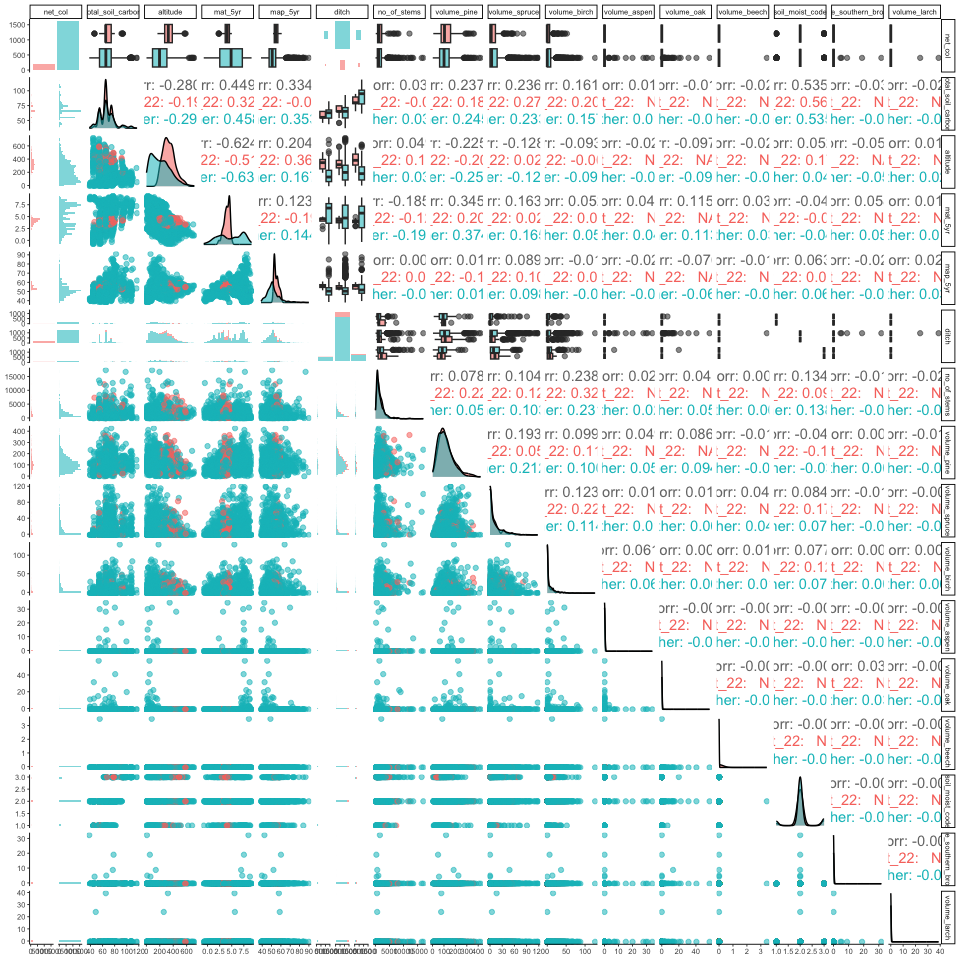
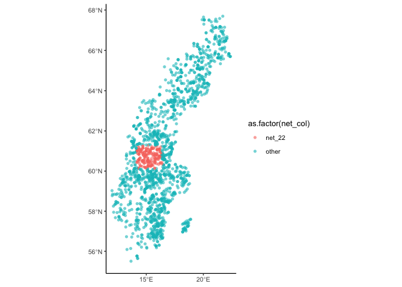

Find a region of covariate overlap
================
eleanorjackson
30 January, 2024

Find a geographical area of covariate overlap to use as testing data.
Currently using random 215 plots but ideally in the real world people
don’t predict outside of parameter space. Always remove these points
from the training data.

``` r
library("tidyverse")
library("here")
library("FactoMineR")
library("factoextra")
library("ggmap")
library("maps")
library("sf")
library("patchwork")
library("GGally")

clean_data <-
  readRDS(here::here("data", "derived", "ForManSims_RCP0_same_time_clim.rds")) %>% 
  filter(period == 0)
```

## Normalise data

``` r
feat_list <- c("total_soil_carbon", "altitude",
                   "mat_5yr", "map_5yr", "ditch", "no_of_stems", "volume_pine",
                   "volume_spruce", "volume_birch", "volume_aspen",
                   "volume_oak", "volume_beech", "soil_moist_code",
                   "volume_southern_broadleaf", "volume_larch")

corr_matrix <- clean_data %>% 
  column_to_rownames(var = "description") %>%  
  select(all_of(feat_list)) %>% 
  scale() 
```

## Make PCA

``` r
# compute pca
data_pca <- princomp(corr_matrix)

# see results 
summary(data_pca)
```

    ## Importance of components:
    ##                           Comp.1    Comp.2    Comp.3     Comp.4     Comp.5
    ## Standard deviation     1.5309405 1.2635163 1.1438499 1.03193755 1.01891036
    ## Proportion of Variance 0.1563385 0.1064905 0.0872745 0.07103234 0.06925023
    ## Cumulative Proportion  0.1563385 0.2628290 0.3501035 0.42113586 0.49038609
    ##                            Comp.6     Comp.7     Comp.8     Comp.9    Comp.10
    ## Standard deviation     1.00556322 1.00127258 0.98757548 0.97786460 0.96589802
    ## Proportion of Variance 0.06744784 0.06687348 0.06505638 0.06378326 0.06223172
    ## Cumulative Proportion  0.55783393 0.62470741 0.68976379 0.75354705 0.81577877
    ##                           Comp.11   Comp.12    Comp.13    Comp.14    Comp.15
    ## Standard deviation     0.90590309 0.8713830 0.82160846 0.52127291 0.48482335
    ## Proportion of Variance 0.05474101 0.0506486 0.04502763 0.01812507 0.01567893
    ## Cumulative Proportion  0.87051978 0.9211684 0.96619601 0.98432107 1.00000000

## Plot

``` r
fviz_pca_var(data_pca)
```

<!-- -->

### Latitude

``` r
fviz_mca_ind(data_pca, 
             geom = "point", 
             col.ind = clean_data$nord_wgs84) + 
  scale_colour_viridis_c() +
  
  ggplot(clean_data, aes(ost_wgs84, nord_wgs84, colour = nord_wgs84)) +
  borders("world", regions = "sweden") +
  geom_point() +
  scale_color_viridis_c() +
  coord_quickmap() +
  theme(legend.position = "none")
```

<!-- -->

### Longitude

``` r
fviz_mca_ind(data_pca, 
             geom = "point", 
             col.ind = clean_data$ost_wgs84)+ 
  scale_colour_viridis_c() +
  
  ggplot(clean_data, aes(ost_wgs84, nord_wgs84, colour = ost_wgs84)) +
  borders("world", regions = "sweden") +
  geom_point() +
  scale_color_viridis_c() +
  coord_quickmap() +
  theme(legend.position = "none")
```

<!-- -->

### Region

``` r
fviz_mca_ind(data_pca, 
             geom = "point", alpha = 0.7,
             col.ind = as.factor(clean_data$region)) +
  
  ggplot(clean_data, aes(ost_wgs84, nord_wgs84, colour = as.factor(region))) +
  borders("world", regions = "sweden") +
  geom_point(alpha = 0.7) +
  coord_quickmap() +
  theme(legend.position = "none")
```

<!-- -->

## Create grid

Going for something long and thin..

``` r
# make data a sf object
data_sf <- st_as_sf(clean_data, 
                    coords = c("ost_wgs84", "nord_wgs84"),
                    crs = "WGS84")

# project the points
data_sf %>% 
  st_transform(crs = st_crs(3152)) -> data_projected

# make grid
fishnet <- st_make_grid(
  data_projected,
  cellsize = c(40000, 1200000), # units are meters
  what = "polygons",
  square = TRUE,
  crs = st_crs(3152))

# plot
ggplot(data_projected) +
  geom_sf(aes(col=as.factor(region)), alpha = 0.6, shape = 16) +
  geom_sf(data = fishnet, fill  = NA)
```

<!-- -->

How many plots in each rectangle? We can have up to 215.

``` r
# convert polygons to sf object and add id column
fishnet %>%
    st_sf(crs = st_crs(3152)) %>%
    mutate(net_id = row_number()) -> fishnet_sf

# calculate which plots are in which squares
joined <- st_intersection(data_projected, fishnet_sf)
```

    ## Warning: attribute variables are assumed to be spatially constant throughout
    ## all geometries

``` r
joined %>% 
  group_by(net_id) %>% 
  summarise(n()) %>% 
  slice_max(order_by = `n()`, n = 10)
```

    ## Simple feature collection with 10 features and 2 fields
    ## Geometry type: MULTIPOINT
    ## Dimension:     XY
    ## Bounding box:  xmin: -166587.8 ymin: -311730.6 xmax: 232385.6 ymax: 870493.4
    ## Projected CRS: ST74
    ## # A tibble: 10 × 3
    ##    net_id `n()`                                                         geometry
    ##     <int> <int>                                                 <MULTIPOINT [m]>
    ##  1      6   278 ((-86915.86 251084.1), (-86906.36 470000.9), (-86899.16 507713.…
    ##  2      7   269 ((-46786.73 233312.6), (-46773.6 -86204.4), (-46681.69 -71331.7…
    ##  3      8   184 ((-6843.858 -43148.55), (-6823.834 383729.7), (-6583.053 257567…
    ##  4      4   164 ((-166587.8 337514), (-166571.9 338854.3), (-166405.4 337044.4)…
    ##  5      5   146 ((-124943.9 -9534.224), (-124491.8 295833.6), (-124428.4 297509…
    ##  6      9   140 ((33181.9 200392.3), (33312.16 251268.8), (34925.66 173698.3), …
    ##  7     11    93 ((113438.7 107826.4), (113714.8 587436.6), (113935.9 123407.6),…
    ##  8     10    92 ((73745.81 442563.3), (74270.85 570011.6), (74310.33 595749.7),…
    ##  9     12    74 ((153402.9 581711.6), (153492.5 -92646.56), (153638.9 817691), …
    ## 10     13    68 ((193306.6 771943.6), (193525.1 567498), (194083.5 642854.5), (…

Which plots cover the greatest range of latitudes?

``` r
joined %>%  
  group_by(net_id) %>% 
  summarise(range = max(nord_stord) - min(nord_stord)) %>% 
  slice_max(order_by = range, n = 10)
```

    ## Simple feature collection with 10 features and 2 fields
    ## Geometry type: MULTIPOINT
    ## Dimension:     XY
    ## Bounding box:  xmin: -206521.1 ymin: -327142.1 xmax: 193035 ymax: 833274.5
    ## Projected CRS: ST74
    ## # A tibble: 10 × 3
    ##    net_id   range                                                       geometry
    ##     <int>   <dbl>                                               <MULTIPOINT [m]>
    ##  1      8 1004902 ((-6843.858 -43148.55), (-6823.834 383729.7), (-6583.053 2575…
    ##  2     11  990608 ((113438.7 107826.4), (113714.8 587436.6), (113935.9 123407.6…
    ##  3     10  963678 ((73745.81 442563.3), (74270.85 570011.6), (74310.33 595749.7…
    ##  4     12  916807 ((153402.9 581711.6), (153492.5 -92646.56), (153638.9 817691)…
    ##  5      7  899674 ((-46786.73 233312.6), (-46773.6 -86204.4), (-46681.69 -71331…
    ##  6      4  843676 ((-166587.8 337514), (-166571.9 338854.3), (-166405.4 337044.…
    ##  7      5  823944 ((-124943.9 -9534.224), (-124491.8 295833.6), (-124428.4 2975…
    ##  8      6  788043 ((-86915.86 251084.1), (-86906.36 470000.9), (-86899.16 50771…
    ##  9      9  769575 ((33181.9 200392.3), (33312.16 251268.8), (34925.66 173698.3)…
    ## 10      3  699393 ((-206521.1 245249.2), (-205860.2 -189877.9), (-205581.8 2735…

Which plots cover the most regions?

``` r
joined %>%  
  group_by(net_id) %>% 
  summarise(n_distinct(region)) %>% 
  slice_max(order_by = `n_distinct(region)`, n = 10)
```

    ## Simple feature collection with 11 features and 2 fields
    ## Geometry type: MULTIPOINT
    ## Dimension:     XY
    ## Bounding box:  xmin: -244040.4 ymin: -327142.1 xmax: 193035 ymax: 833274.5
    ## Projected CRS: ST74
    ## # A tibble: 11 × 3
    ##    net_id `n_distinct(region)`                                          geometry
    ##     <int>                <int>                                  <MULTIPOINT [m]>
    ##  1      4                    5 ((-166587.8 337514), (-166571.9 338854.3), (-166…
    ##  2      5                    5 ((-124943.9 -9534.224), (-124491.8 295833.6), (-…
    ##  3     11                    5 ((113438.7 107826.4), (113714.8 587436.6), (1139…
    ##  4      3                    4 ((-206521.1 245249.2), (-205860.2 -189877.9), (-…
    ##  5      6                    4 ((-86915.86 251084.1), (-86906.36 470000.9), (-8…
    ##  6      8                    4 ((-6843.858 -43148.55), (-6823.834 383729.7), (-…
    ##  7      9                    4 ((33181.9 200392.3), (33312.16 251268.8), (34925…
    ##  8     10                    4 ((73745.81 442563.3), (74270.85 570011.6), (7431…
    ##  9     12                    4 ((153402.9 581711.6), (153492.5 -92646.56), (153…
    ## 10      2                    3 ((-244040.4 35242.7), (-243327.1 50186.1), (-242…
    ## 11      7                    3 ((-46786.73 233312.6), (-46773.6 -86204.4), (-46…

Let’s compare a few that look promising.

``` r
joined %>% 
  filter(net_id == 8 | net_id == 11 | net_id == 10 | net_id == 4) %>%  
  ggplot() +
  geom_sf(aes(col = as.factor(region)), alpha = 0.6, shape = 16) +
  facet_wrap(~net_id, nrow = 1)
```

<!-- -->

``` r
clean_data %>% 
  left_join(joined) -> data_nets

data_nets %>% 
  mutate(net_col = case_when(net_id == 8 ~ "net_8",
                            net_id == 4 ~ "net_4",
                             net_id == 10 ~ "net_10",
                             net_id == 11 ~ "net_11",
                              .default = "other")) -> nets_test

fviz_mca_ind(data_pca, 
             geom = "point", alpha = 0.6, shape = 16,
             col.ind = as.factor(nets_test$net_col), 
             palette = c("red", "blue", "forestgreen", "orange", "lightgrey")) 
```

<!-- -->

<!-- -->

`net_10` looks like it has the best overlap. When we remove these points
what effect do they have on the distribution of our covariates?

``` r
data_nets %>% 
  select(total_soil_carbon, altitude,
         mat_5yr, map_5yr, ditch, no_of_stems, volume_pine,
         volume_spruce, volume_birch, volume_aspen,
         volume_oak, volume_beech, soil_moist_code,
         volume_southern_broadleaf, volume_larch) %>% 
  mutate(ditch = as.ordered(ditch), 
         ditch = as.ordered(soil_moist_code)) %>% 
  ggpairs(progress = FALSE,
          mapping = aes(alpha = 0.5)) +
  theme_classic(base_size = 7) 
```

<!-- -->

``` r
data_nets %>% 
  mutate(net_col = case_when(net_id == 10 ~ "net_10",
                              .default = "other")) %>% 
  select(net_col, total_soil_carbon, altitude,
         mat_5yr, map_5yr, ditch, no_of_stems, volume_pine,
         volume_spruce, volume_birch, volume_aspen,
         volume_oak, volume_beech, soil_moist_code,
         volume_southern_broadleaf, volume_larch) %>% 
  mutate(ditch = as.ordered(ditch), 
         ditch = as.ordered(soil_moist_code)) %>% 
  ggpairs(progress = FALSE,
          mapping = aes(colour = as.factor(net_col), alpha = 0.5)) +
  theme_classic(base_size = 7)  
```

<!-- -->

In the above, pink is `net_10`. `net_10` misses a chunk in the middle
for `altitude` and `mat_5yr` but I think this is ok because we just want
overlap?

The overall distributions don’t seem to change when `net_10` plots are
removed.
