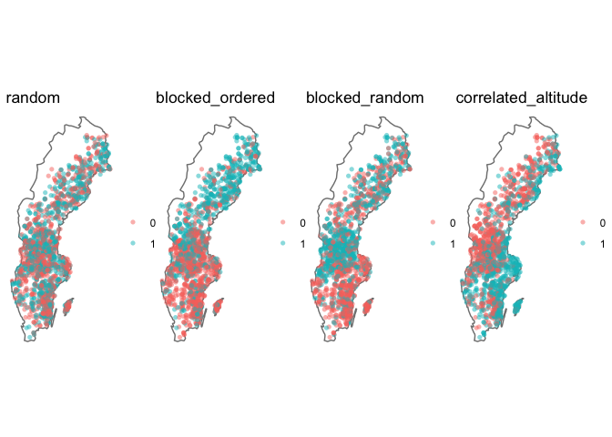
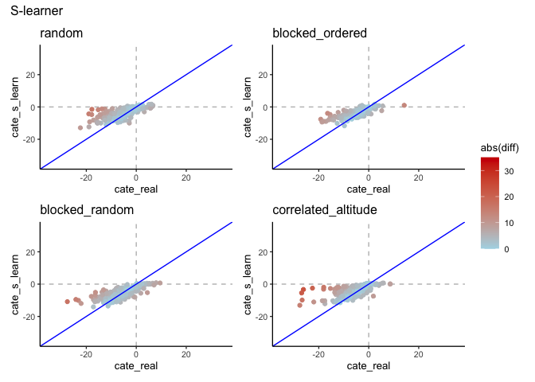
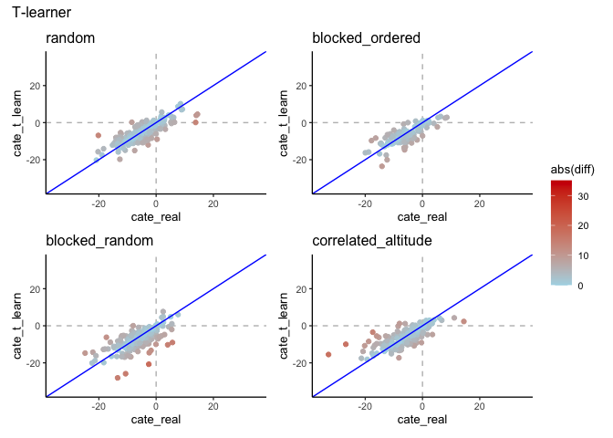
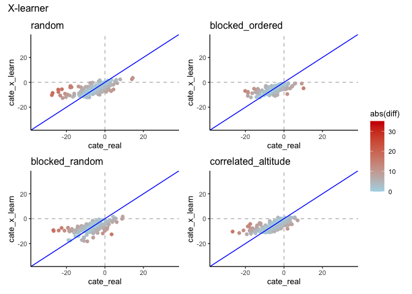

Tweaks for treatment assignment ~ region correlation
================
eleanorjackson
26 January, 2024

Treatment assignment correlated with region - needs to be bigger
percentages! Currently we are using: 12% 8.5%, 7%, 7%, 12.5%, 12.5% -
these percentages were based off of real data but they might be too
similar to see much difference between them and beacuse they are so
small we aren’t getting any non-treated plots when the sample size is
small.

I’ve updated the function `assign_treatment()` to use 20%, 40%, 60%,
80% - ordered or random with respect to latitude.

``` r
library("tidyverse")
library("here")
library("maps")
library("patchwork")
```

``` r
set.seed(123)

# get my functions
function_dir <- list.files(here::here("code", "functions"),
                           full.names = TRUE)

sapply(function_dir, source)
```

    ##         /Users/eleanorjackson/Projects/tree/code/functions/assign-treatment.R
    ## value   ?                                                                    
    ## visible FALSE                                                                
    ##         /Users/eleanorjackson/Projects/tree/code/functions/fit-metalearner.R
    ## value   ?                                                                   
    ## visible FALSE

``` r
clean_data <-
  readRDS(here::here("data", "derived", "ForManSims_RCP0_same_time_clim.rds")) 
```

``` r
keys <- expand.grid(
  assignment = c("random", "blocked_ordered", "blocked_random", "correlated_altitude")
  )

assigned_data <- purrr::map(.f = assign_treatment, 
                     .x = keys$assignment,  
                     df = clean_data)

keys %>% 
  mutate(df = assigned_data) -> keys_assigned
```

``` r
make_map <- function(df, name) {
  df %>% 
  filter(period == 0) %>%
  ggplot(aes(ost_wgs84, nord_wgs84, colour = as.factor(tr))) +
  borders("world", regions = "sweden") +
  geom_point(alpha = 0.5, shape = 16) +
  coord_quickmap() +
  theme_void() +
  theme(legend.title=element_blank()) +
  ggtitle(name)
}

plot_list <- map2(.x = keys_assigned$df,
     .y = keys_assigned$assignment,
     .f = make_map) 

wrap_plots(plot_list, nrow = 1)
```

<!-- -->

``` r
model_out_s <- purrr::map(.x = keys_assigned$df,
     .f = fit_metalearner,
     learner = "s",
     n_train = 1600,
     var_omit = FALSE)

keys_assigned %>% 
  mutate(out = model_out_s) -> keys_out_s

plot_real_pred_s <- function(out, assignment) {
  out %>% 
    ggplot() +
    geom_hline(yintercept = 0, colour = "grey", linetype = 2) +
    geom_vline(xintercept = 0, colour = "grey", linetype = 2) +
    geom_point(aes(x = cate_real, y = cate_s_learn, colour = abs(diff))) +
    geom_abline(intercept = 0, slope = 1, colour = "blue") +
    scale_color_gradient(low = "lightblue", high = "red3",
                         limits = c(0, 35)) +
    xlim(-35, 35) +
    ylim(-35, 35) +
    ggtitle(assignment)
}

plot_list_ite_s <- map2(.x = keys_out_s$out,
     .y = keys_out_s$assignment,
     .f = plot_real_pred_s) 

wrap_plots(plot_list_ite_s, nrow = 2) + 
  plot_layout(guides = "collect") +
  plot_annotation(title = "S-learner")
```

<!-- -->

<!-- -->

<!-- -->
