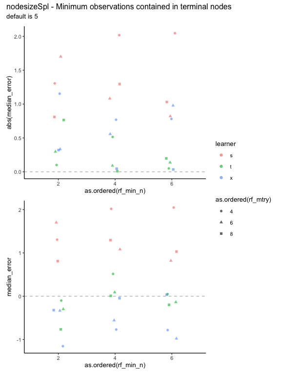

Testing hyperparameters
================
eleanorjackson
30 January, 2024

I’m currently using the same hyperparameters for all the RFs in the
meta-learners. There isn’t a way to tune them programmatically using the
causalToolbox package. What effect do they have on the results? Need to
run with different hyperparameters and see what happens.

``` r
library("tidyverse")
library("here")
library("patchwork")
```

``` r
set.seed(123)

# get my functions
function_dir <- list.files(here::here("code", "functions"),
                           full.names = TRUE)

sapply(function_dir, source)
```

    ##         /Users/eleanorjackson/Projects/tree/code/functions/assign-treatment.R
    ## value   ?                                                                    
    ## visible FALSE                                                                
    ##         /Users/eleanorjackson/Projects/tree/code/functions/fit-metalearner.R
    ## value   ?                                                                   
    ## visible FALSE

``` r
clean_data <-
  readRDS(here::here("data", "derived", "ForManSims_RCP0_same_time_clim.rds")) 
```

``` r
data_assigned <- assign_treatment(df = clean_data, assignment = "random")
```

``` r
keys <- expand.grid(
  learner = c("s", "t", "x"),
  n_train = 1600,
  var_omit = FALSE,
  rf_mtry = c(4, 6, 8),
  rf_min_n = c(2, 4, 6)
) %>% 
  arrange(learner)
  
purrr::pmap(list(
          learner = keys$learner,
          n_train = keys$n_train,
          var_omit = keys$var_omit,
          rf_mtry = keys$rf_mtry,
          rf_min_n = keys$rf_min_n
          ), fit_metalearner, df = data_assigned) -> model_out
```

``` r
plot_real_pred_s <- function(out, learner, rf_mtry, rf_min_n) {
  lookup <- c(cate_pred = "cate_s_learn", 
              cate_pred = "cate_t_learn", 
              cate_pred = "cate_x_learn")
  out %>% 
    rename(any_of(lookup)) %>% 
    ggplot() +
    geom_hline(yintercept = 0, colour = "grey", linetype = 2) +
    geom_vline(xintercept = 0, colour = "grey", linetype = 2) +
    geom_point(aes(x = cate_real, y = cate_pred, colour = abs(diff))) +
    geom_abline(intercept = 0, slope = 1, colour = "blue") +
    scale_color_gradient(low = "lightblue", high = "red3",
                         limits = c(0, 35)) +
    xlim(-35, 35) +
    ylim(-35, 35) +
    annotate("text", x = -20, y = 25, label = paste(round(median(out$diff), 1)), parse = TRUE, colour = "blue") +
    theme_classic(base_size = 15) +
    ggtitle(paste(learner, rf_mtry, rf_min_n, sep = ", "))
}

purrr::pmap(list(
          out = model_out,
          learner = keys$learner,
          rf_mtry = keys$rf_mtry,
          rf_min_n = keys$rf_min_n
          ), plot_real_pred_s) -> plot_list_s

wrap_plots(plot_list_s, nrow = 3) +
  plot_layout(guides = "collect") 
```

<!-- -->

``` r
median_errors <- keys %>% 
  mutate(df_out = model_out) %>% 
  unite(col = "test_id", remove = FALSE,
        learner, rf_mtry, rf_min_n) %>%
  unnest(df_out) %>%
  group_by(test_id, learner, rf_mtry, rf_min_n) %>%
  summarise(median_error = median(diff),
            .groups = "drop")

median_errors %>% 
  ggplot(aes(x = as.ordered(rf_mtry), y = abs(median_error),
             colour = learner, shape = as.ordered(rf_min_n))) +
  geom_hline(yintercept = 0, linetype = 2, colour = "grey") +
  geom_jitter(alpha = 0.6, width = 0.1, height = 0) +
  plot_layout(guides = "collect", ncol = 1) +
median_errors %>% 
  ggplot(aes(x = as.ordered(rf_mtry), y = median_error,
             colour = learner, shape = as.ordered(rf_min_n))) +
  geom_hline(yintercept = 0, linetype = 2, colour = "grey") +
  geom_jitter(alpha = 0.6, width = 0.1, height = 0) +
  plot_layout(guides = "collect", ncol = 1) +
  plot_annotation(
    title = "mtry - The number of variables randomly selected at each split point",
    subtitle = "default is one-third of the total number of features of the training data (5)")
```

<!-- -->

``` r
median_errors %>% 
  ggplot(aes(x = as.ordered(rf_min_n), y = abs(median_error), 
             colour = learner, shape = as.ordered(rf_mtry))) +
  geom_hline(yintercept = 0, linetype = 2, colour = "grey") +
  geom_jitter(alpha = 0.6, width = 0.1, height = 0) +
  plot_layout(guides = "collect", ncol = 1) +
median_errors %>% 
  ggplot(aes(x = as.ordered(rf_min_n), y = median_error, 
             colour = learner, shape = as.ordered(rf_mtry))) +
  geom_hline(yintercept = 0, linetype = 2, colour = "grey") +
  geom_jitter(alpha = 0.6, width = 0.1, height = 0) +
  plot_layout(guides = "collect", ncol = 1) +
  plot_annotation(
    title = "nodesizeSpl - Minimum observations contained in terminal nodes",
    subtitle = "default is 5")
```

<!-- -->
