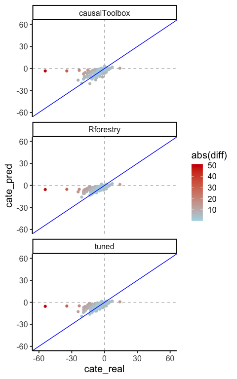

More hyperparameter testing
================
eleanorjackson
06 February, 2024

``` r
library("tidyverse")
library("here")
library("Rforestry")
library("causalToolbox")
library("tidymodels")
```

The important hyperparameters seem to be:

- `n_tree` is the number of trees in the forest. Usually the higher the
  number of trees the better to learn the data. The default value is
  1000 in `Rforestry`.
- `max_depth` represents the depth of each tree in the forest. The
  deeper the tree, the more splits it has and it captures more
  information about the data. For large values the model can overfit!
  The default value is 99 in `Rforestry`.
- `mtry` is the number of variables randomly selected at each split
  point. When this is too high, the model cannot learn enough about the
  data and underfits. The default value in `Rforestry` is one-third of
  the total number of features of the training data.

`Rforestry` is the package that the `causalToolbox` package uses under
the hood to fit the base learners.

[This
blog](https://medium.com/all-things-ai/in-depth-parameter-tuning-for-random-forest-d67bb7e920d)
post is useful - shows how model performance can change across a range
of different tree depths / n trees etc.

In in the Künzel *et al.* SI section 6 - it looks like they dealt with
hyperparameters by tuning one of each of the base learners (so, S and T1
and T0..) using [a simulated
dataset](https://arxiv.org/pdf/1707.02641.pdf) which was created to
compare different causal inference methods in a competition?

So, I’m thinking that our options at the moment are:

- Use the same hyperparameters that they chose (which I think are the
  defaults in their `causalToolbox` package)?
- We could try tuning each of our base learners like Künzel *et al.* did
  but using our own data set (a “good” one? i.e. random treatment
  assignment/decent sample size etc).
- Or, we stick to using some default hyperparameters (`Rforestry`
  defaults?) / rule of thumb in the literature

``` r
set.seed(123)

# get my functions
function_dir <- list.files(here::here("code", "functions"),
                           full.names = TRUE)

sapply(function_dir, source)
```

    ##         /Users/eleanorjackson/Projects/tree/code/functions/assign-treatment.R
    ## value   ?                                                                    
    ## visible FALSE                                                                
    ##         /Users/eleanorjackson/Projects/tree/code/functions/fit-metalearner.R
    ## value   ?                                                                   
    ## visible FALSE

``` r
clean_data <-
  readRDS(here::here("data", "derived", "ForManSims_RCP0_same_time_clim.rds")) 
```

``` r
data_assigned <- assign_treatment(df = clean_data, assignment = "random")
```

## get test and train

``` r
n_train <- 1600

features <- data_assigned |>
  dplyr::filter(period == 0) |>
  dplyr::select(
    description,
    soil_moist_code,
    altitude, mat_5yr, map_5yr, ditch, no_of_stems, volume_pine, volume_spruce,
    volume_birch, volume_aspen, volume_oak, volume_beech,
    volume_southern_broadleaf, volume_larch
  )

data_obs <- data_assigned |>
  dplyr::select(description, tr, control_category_name, total_soil_carbon) |>
  tidyr::pivot_wider(id_cols = c(description, tr),
                     names_from = control_category_name,
                     values_from = total_soil_carbon) |>
  dplyr::mutate(soil_carbon_obs =
                  dplyr::case_when(tr == 0 ~ `SetAside (Unmanaged)`,
                                   tr == 1 ~ `BAU - NoThinning`)) |>
  dplyr::rename(soil_carbon_initial = `Initial state`,
                soil_carbon_0 = `SetAside (Unmanaged)`,
                soil_carbon_1 = `BAU - NoThinning`) |>
  dplyr::left_join(features,
                   by = "description")

# sample train
train_data_0 <- data_obs |>
  dplyr::filter(tr == 0) |>
  dplyr::slice_sample(n = n_train/2)

train_data_1 <- data_obs |>
  dplyr::filter(tr == 1) |>
  dplyr::slice_sample(n = n_train/2)

train_data <- dplyr::bind_rows(train_data_0, train_data_1)

# sample test
test_data_0 <- data_obs |>
  dplyr::filter(! description %in% train_data$description) |>
  dplyr::filter(tr == 0) |>
  dplyr::slice_sample(n = 107)

test_data_1 <- data_obs |>
  dplyr::filter(! description %in% train_data$description) |>
  dplyr::filter(tr == 1) |>
  dplyr::slice_sample(n = 107)

test_data <- dplyr::bind_rows(test_data_0, test_data_1)

feat_list <- c("soil_carbon_initial", "altitude",
               "mat_5yr", "map_5yr", "ditch", "no_of_stems", "volume_pine",
               "volume_spruce", "volume_birch", "volume_aspen",
               "volume_oak", "volume_beech", "soil_moist_code",
               "volume_southern_broadleaf", "volume_larch")
```

## `causalToolbox` defaults

``` r
# create the hte object
cause_tool <- causalToolbox::S_RF(
  feat = dplyr::select(train_data, tidyselect::all_of(feat_list)),
  tr = train_data$tr,
  yobs = train_data$soil_carbon_obs,
  nthread = 2
)

# estimate the CATE
cause_tool_cate <- causalToolbox::EstimateCate(cause_tool,
                                            dplyr::select(test_data,
                                                          tidyselect::all_of(feat_list)))

cause_tool_out <- test_data |>
  dplyr::mutate(cate_pred = cause_tool_cate,
                cate_real = soil_carbon_1 - soil_carbon_0,
                diff = cate_pred - cate_real)
```

## `Rforestry` defaults

``` r
rforest <- Rforestry::forestry(
  x = dplyr::select(train_data, tidyselect::all_of(feat_list), tr),
  y = train_data$soil_carbon_obs,
)

# estimate the CATE
rforest_pred_0 <- predict(rforest,
                        dplyr::select(test_data_0,
                                      tidyselect::all_of(feat_list), tr)) %>% 
  cbind(test_data) %>% 
  rename(pred_0 = '.')

rforest_pred_1 <- predict(rforest,
                        dplyr::select(test_data_1,
                                      tidyselect::all_of(feat_list), tr)) %>% 
  cbind(test_data) %>% 
  rename(pred_1 = '.')

rforest_out <- rforest_pred_0 %>% 
  inner_join(rforest_pred_1) %>% 
  mutate(cate_pred = pred_1 - pred_0) %>% 
  dplyr::mutate(cate_real = soil_carbon_1 - soil_carbon_0,
                diff = cate_pred - cate_real)
```

    ## Joining with `by = join_by(description, tr, soil_carbon_initial, soil_carbon_0,
    ## soil_carbon_1, soil_carbon_obs, soil_moist_code, altitude, mat_5yr, map_5yr,
    ## ditch, no_of_stems, volume_pine, volume_spruce, volume_birch, volume_aspen,
    ## volume_oak, volume_beech, volume_southern_broadleaf, volume_larch)`

## tuned with `tidymodels`

``` r
# create model specification
tune_spec <- rand_forest(mtry = tune(), 
                         min_n = tune(), 
                         trees = tune(),
            mode = "regression") 

finalize(mtry(), 15, x = select(train_data, tidyselect::all_of(feat_list), tr))
```

    ## # Randomly Selected Predictors (quantitative)
    ## Range: [1, 16]

``` r
finalize(min_n(), select(train_data, tidyselect::all_of(feat_list), tr))
```

    ## Minimal Node Size (quantitative)
    ## Range: [2, 40]

``` r
finalize(trees(), select(train_data, tidyselect::all_of(feat_list), tr))
```

    ## # Trees (quantitative)
    ## Range: [1, 2000]

``` r
hp_grid <- grid_regular(mtry(c(1, 15)),
                        min_n(c(2, 40)),
                        trees(c(1, 1500)),
                        levels = 7)

folds <- vfold_cv(test_data)

rf_recipe <- recipe(
  data = select(train_data, tidyselect::all_of(feat_list), tr, soil_carbon_obs),
  formula = soil_carbon_obs ~ .
)
  
rf_wf <- workflow() %>%
  add_recipe(rf_recipe) %>%
  add_model(tune_spec)

tune_res <- 
  rf_wf %>% 
  tune_grid(
    resamples = folds,
    grid = hp_grid
    )
```

    ## → A | warning: A correlation computation is required, but `estimate` is constant and has 0 standard deviation, resulting in a divide by 0 error. `NA` will be returned.

    ## There were issues with some computations   A: x1There were issues with some computations   A: x2There were issues with some computations   A: x3There were issues with some computations   A: x4There were issues with some computations   A: x5There were issues with some computations   A: x6There were issues with some computations   A: x7There were issues with some computations   A: x8There were issues with some computations   A: x8

``` r
tune_res %>%
  collect_metrics() %>%
  ggplot(aes(trees, mean, colour = mtry)) +
  geom_point() +
  facet_wrap(~ .metric, scales = "free")
```

<!-- -->

``` r
tune_res %>%
  collect_metrics() %>%
  ggplot(aes(mtry, mean, colour = trees)) +
  geom_point() +
  facet_wrap(~ .metric, scales = "free")
```

<!-- -->

``` r
tune_res %>%
  collect_metrics() %>%
  ggplot(aes(min_n, mean, colour = mtry)) +
  geom_point() +
  facet_wrap(~ .metric, scales = "free")
```

<!-- -->

Very few `trees` is bad but once you hit ~ 200 you’re fine.

`mtry` - the number of predictors that will be randomly sampled at each
split when creating the tree models. Seems to level off around 4 or 5.

`min_n` - the minimum number of data points in a node that are required
for the node to be split further. I guess smaller is better?

``` r
tune_res %>%
  show_best()
```

    ## Warning: No value of `metric` was given; metric 'rmse' will be used.

    ## # A tibble: 5 × 9
    ##    mtry trees min_n .metric .estimator  mean     n std_err .config              
    ##   <int> <int> <int> <chr>   <chr>      <dbl> <int>   <dbl> <chr>                
    ## 1     8   250     2 rmse    standard    5.61    10   0.437 Preprocessor1_Model0…
    ## 2     8  1250     2 rmse    standard    5.63    10   0.404 Preprocessor1_Model2…
    ## 3     8   500     2 rmse    standard    5.63    10   0.406 Preprocessor1_Model1…
    ## 4     8  1500     2 rmse    standard    5.64    10   0.409 Preprocessor1_Model2…
    ## 5     8  1000     2 rmse    standard    5.66    10   0.417 Preprocessor1_Model2…

``` r
best_hp <- tune_res %>%
  select_best()
```

    ## Warning: No value of `metric` was given; metric 'rmse' will be used.

Best `mtry` is always 8 and `min_n` is 2 (the lowest values tested),
`trees` doesn’t seem to matter so much. For computational efficiency we
could select the lower values.

``` r
# train with the tuned hyperparameters
final_wf <- 
  rf_wf %>% 
  finalize_workflow(best_hp)

final_fit <- 
  final_wf %>%
  fit(
    select(train_data, tidyselect::all_of(feat_list), tr, soil_carbon_obs)
    ) 

# estimate the CATE
tune_pred_0 <- predict(final_fit,
                        dplyr::select(test_data_0,
                                      tidyselect::all_of(feat_list), tr)) %>% 
  cbind(test_data) %>% 
  rename(pred_0 = .pred)

tune_pred_1 <- predict(final_fit,
                        dplyr::select(test_data_1,
                                      tidyselect::all_of(feat_list), tr)) %>% 
  cbind(test_data) %>% 
  rename(pred_1 = .pred)

tune_out <- tune_pred_0 %>% 
  inner_join(tune_pred_1) %>% 
  mutate(cate_pred = pred_1 - pred_0) %>% 
  dplyr::mutate(cate_real = soil_carbon_1 - soil_carbon_0,
                diff = cate_pred - cate_real)
```

    ## Joining with `by = join_by(description, tr, soil_carbon_initial, soil_carbon_0,
    ## soil_carbon_1, soil_carbon_obs, soil_moist_code, altitude, mat_5yr, map_5yr,
    ## ditch, no_of_stems, volume_pine, volume_spruce, volume_birch, volume_aspen,
    ## volume_oak, volume_beech, volume_southern_broadleaf, volume_larch)`

## Compare

``` r
all_preds <- bind_rows(list(causalToolbox = cause_tool_out, 
                            Rforestry = rforest_out, 
                            tuned = tune_out), .id = "method") 

all_preds %>% 
  ggplot() +
    geom_hline(yintercept = 0, colour = "grey", linetype = 2) +
    geom_vline(xintercept = 0, colour = "grey", linetype = 2) +
    geom_point(aes(x = cate_real, y = cate_pred, colour = abs(diff))) +
    geom_abline(intercept = 0, slope = 1, colour = "blue") +
    scale_color_gradient(low = "lightblue", high = "red3") +
    xlim(-60, 60) +
    ylim(-60, 60) +
    theme_classic(base_size = 15) +
    facet_wrap(~ method, ncol = 1)
```

    ## Warning: Removed 4 rows containing missing values (`geom_point()`).

<!-- -->

Agh! What’s going on with the `causalToolbox` one? Why does it look so
different?
