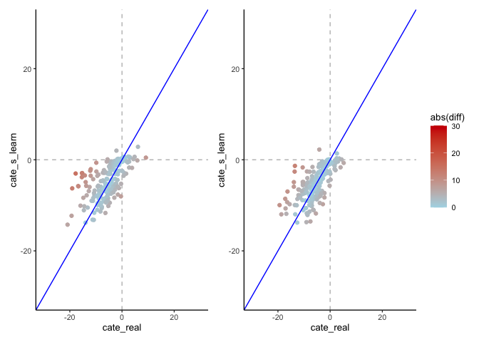

Trial new geographical test area argument in function
================
eleanorjackson
12 February, 2024

We found a geographical area containing plots with lots of covariate
overlap to use as testing data. Previously we were using random 200
plots but ideally people wouldn’t predict outside of parameter space.

I’ve implemented a new argument in the `fit_metalearner` function which
allows you to specify if you want to use a random sample of plots for
testing or use the geographically defined “square” of plots.

I’ve also modified the `assign_treatment` function to **not** assign a
treatment to the plots in the square. I now randomly assign treatments
for these plots in the `fit_metalearner` function so that we get an even
split of 0 and 1.

Will be testing these out below.

``` r
library("tidyverse")
library("here")
library("maps")
library("patchwork")
```

``` r
set.seed(123)

# get my functions
function_dir <- list.files(here::here("code", "functions"),
                           full.names = TRUE)

sapply(function_dir, source)
```

    ##         /Users/eleanorjackson/Projects/tree/code/functions/assign-treatment.R
    ## value   ?                                                                    
    ## visible FALSE                                                                
    ##         /Users/eleanorjackson/Projects/tree/code/functions/fit-metalearner.R
    ## value   ?                                                                   
    ## visible FALSE

``` r
data_clean <-
  readRDS(here::here(
    "data", "derived", "ForManSims_RCP0_same_time_clim_squ.rds"
    )) 
```

``` r
data_assigned <- assign_treatment(df = data_clean,
                 assignment = "random",
                 proportion_not_treated = 0.5)
```

``` r
model_out_squ <- fit_metalearner(
     df = data_assigned,
     learner = "s",
     n_train = 1400,
     var_omit = FALSE,
     random_test_plots = FALSE)

model_out_rand <- fit_metalearner(
     df = data_assigned,
     learner = "s",
     n_train = 1400,
     var_omit = FALSE,
     random_test_plots = TRUE)
```

``` r
plot_real_pred_s <- function(out) {
  out %>% 
    ggplot() +
    geom_hline(yintercept = 0, colour = "grey", linetype = 2) +
    geom_vline(xintercept = 0, colour = "grey", linetype = 2) +
    geom_point(aes(x = cate_real, y = cate_s_learn, colour = abs(diff))) +
    geom_abline(intercept = 0, slope = 1, colour = "blue") +
    scale_color_gradient(low = "lightblue", high = "red3",
                         limits = c(0, 30)) +
    xlim(-30, 30) +
    ylim(-30, 30)
}

plot_real_pred_s(model_out_rand) +
  plot_real_pred_s(model_out_squ) +
  plot_layout(guides = "collect")
```

<!-- -->

``` r
model_out_rand %>% 
  summarise(median_abs_error = median(abs(diff))) 
```

    ## # A tibble: 1 × 1
    ##   median_abs_error
    ##              <dbl>
    ## 1             2.40

``` r
model_out_squ %>% 
  summarise(median_abs_error = median(abs(diff))) 
```

    ## # A tibble: 1 × 1
    ##   median_abs_error
    ##              <dbl>
    ## 1             2.38
