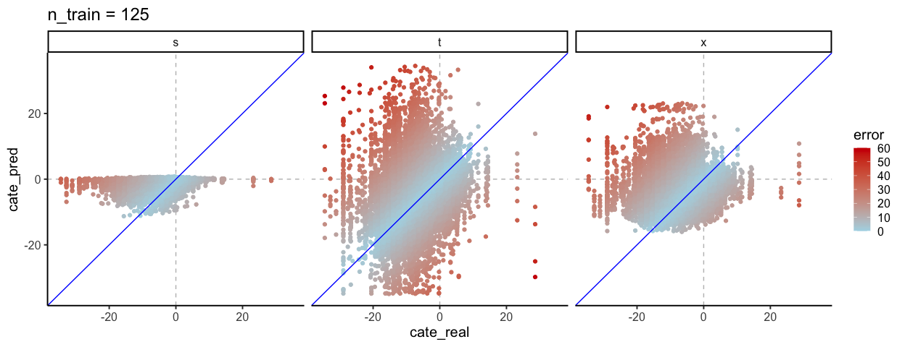
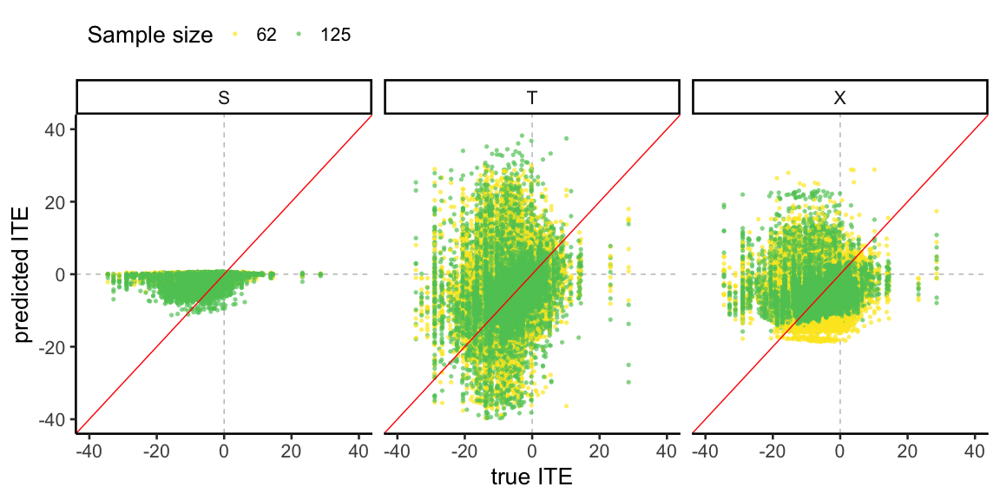
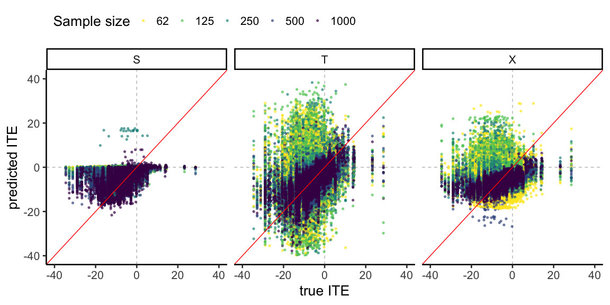
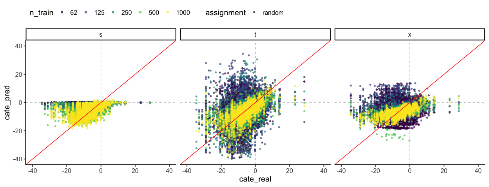

New layered vis
================
eleanorjackson
01 March, 2024

``` r
library("tidyverse")
library("here")
library("patchwork")
library("viridis")

set.seed(123)
```

``` r
models_out <- readRDS(here("data", "derived", "all_runs.rds")) %>% 
  filter(n_train != 31)
```

## Function to colour by error

``` r
plot_real_pred <- function(out, study_condition_val, study_condition) {
  
  out %>%  
    filter((!!as.name(study_condition)) == study_condition_val) -> out_subset
  
  out_subset %>% 
    unnest(df_out) %>% 
    mutate(error = abs(cate_pred - cate_real)) %>% 
    ggplot(aes(x = cate_real, y = cate_pred, colour = error)) +
    geom_hline(yintercept = 0, colour = "grey", linetype = 2) +
    geom_vline(xintercept = 0, colour = "grey", linetype = 2) +
    geom_point() +
    geom_abline(intercept = 0, slope = 1, colour = "blue") +
    scale_color_gradient(low = "lightblue", high = "red3",
                         limits = c(0, 60)) +
    xlim(-35, 35) +
    ylim(-35, 35) +
    theme_classic(base_size = 15) +
    ggtitle(paste(study_condition,  study_condition_val, sep = " = ")) +
    facet_wrap(~ learner) 
}
```

``` r
map(.x = c(62, 125, 250, 500, 1000), 
    .f = plot_real_pred, 
    study_condition = "n_train", 
    out = models_out)
```

    ## [[1]]

<!-- -->

    ## 
    ## [[2]]

<!-- -->

    ## 
    ## [[3]]

<!-- -->

    ## 
    ## [[4]]

<!-- -->

    ## 
    ## [[5]]

<!-- -->

## Function to layer and colour by the same “study condition”

``` r
plot_real_pred_layer <- function(out, study_condition_val, study_condition, pal) {
  
  out %>%  
    filter((!!as.name(study_condition)) %in% study_condition_val) -> out_subset
  
  out_subset %>% 
    unnest(df_out) %>% 
    ggplot(aes(x = cate_real, y = cate_pred, 
               colour = as.factor(!!as.name(study_condition)))) +
    geom_hline(yintercept = 0, colour = "grey", linetype = 2) +
    geom_vline(xintercept = 0, colour = "grey", linetype = 2) +
    geom_point(shape = 16, alpha = 0.7) +
    geom_abline(intercept = 0, slope = 1, colour = "red") +
    scale_colour_manual(values = pal, name = paste(study_condition)) +
    xlim(-40, 40) +
    ylim(-40, 40) +
    theme_classic(base_size = 15) +
    theme(legend.position = "top", legend.justification = "left") +
    facet_wrap(~ learner) 
  
}
```

``` r
map(
  .x = list(c(62), c(62, 125), c(62, 125, 250), 
            c(62, 125, 250, 500), c(62, 125, 250, 500, 1000)),
  .f = plot_real_pred_layer,
  pal = c(
    "1000" = viridis(5)[[1]],
    "500" = viridis(5)[[2]],
    "250" = viridis(5)[[3]],
    "125" = viridis(5)[[4]],
    "62" = viridis(5)[[5]]
  ),
  study_condition = "n_train",
  out = models_out
)
```

    ## [[1]]

<!-- -->

    ## 
    ## [[2]]

<!-- -->

    ## 
    ## [[3]]

<!-- -->

    ## 
    ## [[4]]

<!-- -->

    ## 
    ## [[5]]

<!-- -->

## Funciton to keep n_train coloured, with shape and layer by a different study condition

``` r
plot_real_pred_layer_shape <- function(out, study_condition_val, study_condition) {
  
  out %>%  
    filter((!!as.name(study_condition)) %in% study_condition_val) -> out_subset
  
  out_subset %>% 
    unnest(df_out) %>% 
    ggplot(aes(x = cate_real, y = cate_pred, colour = as.ordered(n_train), shape = !!as.name(study_condition))) +
    geom_hline(yintercept = 0, colour = "grey", linetype = 2) +
    geom_vline(xintercept = 0, colour = "grey", linetype = 2) +
    geom_point(alpha = 0.7) +
    geom_abline(intercept = 0, slope = 1, colour = "red") +
    scale_colour_viridis_d(name = "n_train") +
    xlim(-40, 40) +
    ylim(-40, 40) +
    theme_classic(base_size = 15) +
    theme(legend.position = "top", legend.justification = "left") +
    facet_wrap(~ learner) 
}
```

### Treatment assignment

``` r
map(
  .x = list(c("random"), 
            c("random", "correlated_region"), 
            c("random", "correlated_region", "correlated_altitude")), 
  .f = plot_real_pred_layer_shape,
  study_condition = "assignment",
  out = models_out
)
```

    ## [[1]]

<!-- -->

    ## 
    ## [[2]]

<!-- -->

    ## 
    ## [[3]]

<!-- -->

### Test data, in or out?

``` r
map(
  .x = list(c("centre"), 
            c("edge"),
            c("random")),
  .f = plot_real_pred,
  study_condition = "test_plot_location",
  out = models_out
)
```

    ## [[1]]

<!-- -->

    ## 
    ## [[2]]

<!-- -->

    ## 
    ## [[3]]

<!-- -->
