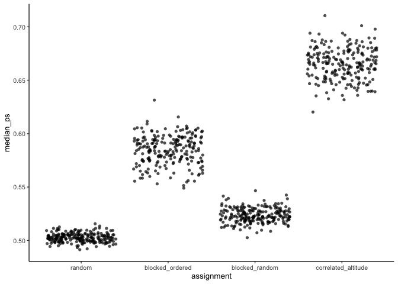

Propensity scores
================
eleanorjackson
22 February, 2024

``` r
library("tidyverse")
library("here")
```

Unbalanced assignment of treatments can cause bias because a difference
in the treatment outcome (such as the average treatment effect) between
treated and untreated groups may be caused by a factor that predicts
treatment rather than the treatment itself.

In our study we have imposed unbalanced treatment assignment and would
expect the propensity scores to reflect this.

We can estimate the propensity score by running a logit model where the
outcome variable is a binary variable indicating treatment status. For
the matching to give you a causal estimate in the end, you need to
include any covariate that is related to both the treatment assignment
and potential outcomes.

We need the propensity scores for the train data, so will have to either
build this into the `fit_metalearner()` function, or output the train
data.

For now I’ll just do a quick example.

``` r
function_dir <- list.files(here::here("code", "functions"),
                           full.names = TRUE)

sapply(function_dir, source)
```

    ##         /Users/eleanorjackson/Projects/tree/code/functions/assign-treatment.R
    ## value   ?                                                                    
    ## visible FALSE                                                                
    ##         /Users/eleanorjackson/Projects/tree/code/functions/fit-metalearner.R
    ## value   ?                                                                   
    ## visible FALSE

``` r
clean_data <-
  readRDS(here::here("data", "derived", "ForManSims_RCP0_same_time_clim_squ.rds"))

# create keys -------------------------------------------------------------

keys <- expand.grid(
  assignment = c("random", "blocked_ordered",
                 "blocked_random", "correlated_altitude"),
  prop_not_treated = c(0.3, 0.5, 0.7),
  learner = c("s", "t", "x"),
  n_train = c(250, 500, 750, 1000),
  var_omit = c(TRUE, FALSE),
  random_test_plots = c(TRUE, FALSE)
  ) %>%
  # add replicates
  slice(rep(1:n(), each = 3))


# assign treatments -------------------------------------------------------

purrr::map(
  .f = assign_treatment,
  .x = as.vector(keys$assignment),
  df = clean_data) -> assigned_data

keys %>%
  mutate(df_assigned = assigned_data) -> keys_assigned
```

``` r
make_obs <- function(df) {
  features <- df |>
    dplyr::filter(period == 0) |>
    dplyr::select(
      description,
      soil_moist_code,
      altitude, mat_5yr, map_5yr, ditch, no_of_stems, volume_pine, volume_spruce,
      volume_birch, volume_aspen, volume_oak, volume_beech,
      volume_southern_broadleaf, volume_larch
    )
  
  df |>
    dplyr::filter(in_square == FALSE) |>
    dplyr::select(description, tr, control_category_name, total_soil_carbon) |>
    tidyr::pivot_wider(id_cols = c(description, tr),
                names_from = control_category_name,
                values_from = total_soil_carbon) |>
    dplyr::mutate(soil_carbon_obs =
                    dplyr::case_when(tr == 0 ~ `SetAside (Unmanaged)`,
                                       tr == 1 ~ `BAU - NoThinning`)) |>
    dplyr::rename(soil_carbon_initial = `Initial state`,
           soil_carbon_0 = `SetAside (Unmanaged)`,
           soil_carbon_1 = `BAU - NoThinning`) |>
    dplyr::left_join(features,
                     by = "description")
}

df_obs <- map(
  pull(keys_assigned, df_assigned), 
  make_obs
  ) 

keys_assigned %>%
  mutate(df_obs = df_obs) -> keys_assigned

get_ps_train <- function(df) {
  mod <- glm(as.factor(tr) ~ 
              soil_carbon_initial + 
              as.ordered(soil_moist_code) +
              altitude + 
              mat_5yr + 
              map_5yr + 
              as.factor(ditch) + 
              no_of_stems + 
              volume_pine + 
              volume_spruce +
              volume_birch + 
              volume_aspen + 
              volume_oak + 
              volume_beech +
              volume_southern_broadleaf + 
              volume_larch,
            family = binomial(), 
            data = df)
  
   ps_out <- df %>% 
    mutate(propensity_score = predict(mod, type = "response")) %>% 
    filter(tr == 1) %>%
    summarise(mean_ps = mean(propensity_score),
              median_ps = median(propensity_score))
  
  df_out <- df %>% 
    mutate(propensity_score = predict(mod, type = "response"))
  
  cbind(ps_out, df_out) %>% 
    nest(.by = c(mean_ps, median_ps),
         .key = "ps_df")
}

ps_df_assigned <- map(
  pull(keys_assigned, df_obs), 
  get_ps_train
  ) %>% 
  bind_rows()

assigned_out_ps <- bind_cols(keys_assigned, ps_df_assigned)
```

``` r
assigned_out_ps %>% 
  filter(random_test_plots == TRUE) %>% 
  ggplot(aes(x = assignment, y = median_ps)) +
  geom_jitter(alpha = 0.7, shape = 16)
```

<!-- -->

Looks good - as expected. We’ve decided to drop the `blocked_random`
category.
