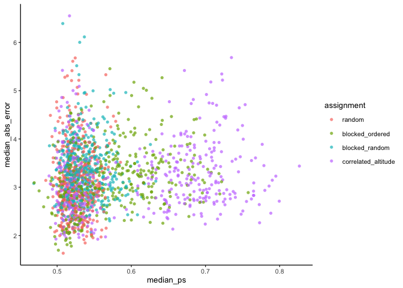
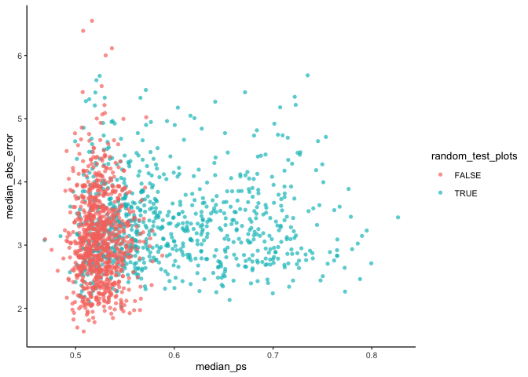
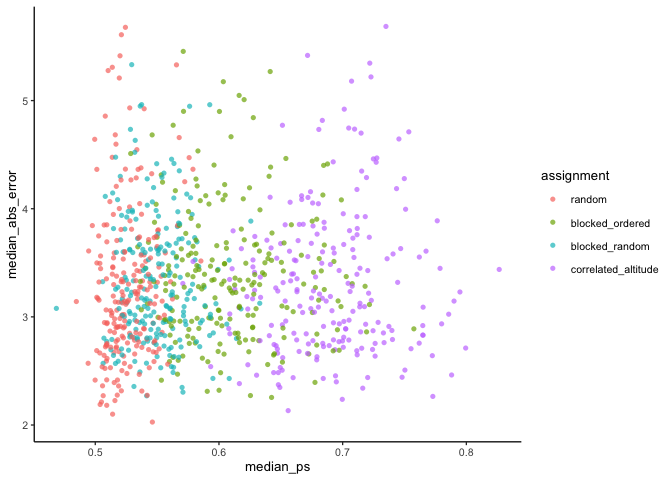
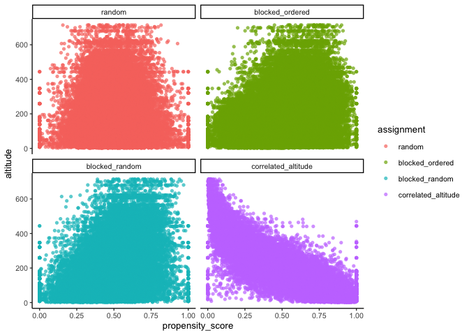
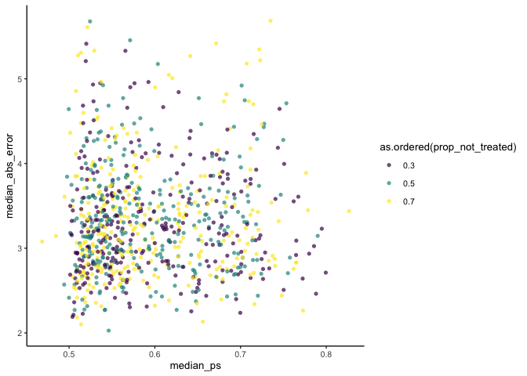

Propensity scores
================
eleanorjackson
20 February, 2024

``` r
library("tidyverse")
library("here")
```

Unbalanced assignment of treatments can cause bias because a difference
in the treatment outcome (such as the average treatment effect) between
treated and untreated groups may be caused by a factor that predicts
treatment rather than the treatment itself.

In our study we have imposed unbalanced treatment assignment

``` r
models_out <- readRDS(here("data", "derived", "models_out.rds"))
```

We can estimate the propensity score by running a logit model where the
outcome variable is a binary variable indicating treatment status. For
the matching to give you a causal estimate in the end, you need to
include any covariate that is related to both the treatment assignment
and potential outcomes.

``` r
test_ps <- glm(tr ~ 
              soil_carbon_initial + 
              soil_moist_code +
              altitude + 
              mat_5yr + 
              map_5yr + 
              ditch + 
              no_of_stems + 
              volume_pine + 
              volume_spruce +
              volume_birch + 
              volume_aspen + 
              volume_oak + 
              volume_beech +
              volume_southern_broadleaf + 
              volume_larch,
            family = binomial(), 
            data = models_out$df_out[[157]])

summary(test_ps)
```

    ## 
    ## Call:
    ## glm(formula = tr ~ soil_carbon_initial + soil_moist_code + altitude + 
    ##     mat_5yr + map_5yr + ditch + no_of_stems + volume_pine + volume_spruce + 
    ##     volume_birch + volume_aspen + volume_oak + volume_beech + 
    ##     volume_southern_broadleaf + volume_larch, family = binomial(), 
    ##     data = models_out$df_out[[157]])
    ## 
    ## Deviance Residuals: 
    ##     Min       1Q   Median       3Q      Max  
    ## -1.9497  -1.1003   0.0133   1.0776   1.8162  
    ## 
    ## Coefficients: (4 not defined because of singularities)
    ##                             Estimate Std. Error z value Pr(>|z|)   
    ## (Intercept)                3.168e-01  1.281e+00   0.247   0.8047   
    ## soil_carbon_initial       -5.754e-02  2.050e-02  -2.807   0.0050 **
    ## soil_moist_code            1.004e+00  4.887e-01   2.055   0.0398 * 
    ## altitude                   1.399e-03  1.519e-03   0.921   0.3571   
    ## mat_5yr                    1.329e-01  9.825e-02   1.352   0.1762   
    ## map_5yr                    2.049e-03  2.200e-02   0.093   0.9258   
    ## ditch                      7.642e-01  6.848e-01   1.116   0.2645   
    ## no_of_stems                1.361e-06  1.167e-04   0.012   0.9907   
    ## volume_pine                4.421e-03  2.710e-03   1.631   0.1029   
    ## volume_spruce             -7.656e-03  8.286e-03  -0.924   0.3555   
    ## volume_birch               2.618e-03  1.053e-02   0.249   0.8036   
    ## volume_aspen                      NA         NA      NA       NA   
    ## volume_oak                -2.114e-02  1.066e-01  -0.198   0.8427   
    ## volume_beech                      NA         NA      NA       NA   
    ## volume_southern_broadleaf         NA         NA      NA       NA   
    ## volume_larch                      NA         NA      NA       NA   
    ## ---
    ## Signif. codes:  0 '***' 0.001 '**' 0.01 '*' 0.05 '.' 0.1 ' ' 1
    ## 
    ## (Dispersion parameter for binomial family taken to be 1)
    ## 
    ##     Null deviance: 271.71  on 195  degrees of freedom
    ## Residual deviance: 256.39  on 184  degrees of freedom
    ## AIC: 280.39
    ## 
    ## Number of Fisher Scoring iterations: 4

``` r
models_out$df_out[[157]] %>% 
  mutate(propensity_score = predict(test_ps, type = "response")) %>% 
  filter(tr == 1) %>% 
  summarise(mean_ps = mean(propensity_score),
              median_ps = median(propensity_score))
```

    ## # A tibble: 1 × 2
    ##   mean_ps median_ps
    ##     <dbl>     <dbl>
    ## 1   0.539     0.560

Build a function to loop over every simulation run

``` r
get_ps <- function(df) {
  mod <- glm(as.factor(tr) ~ 
              soil_carbon_initial + 
              as.ordered(soil_moist_code) +
              altitude + 
              mat_5yr + 
              map_5yr + 
              as.factor(ditch) + 
              no_of_stems + 
              volume_pine + 
              volume_spruce +
              volume_birch + 
              volume_aspen + 
              volume_oak + 
              volume_beech +
              volume_southern_broadleaf + 
              volume_larch,
            family = binomial(), 
            data = df)
  
   ps_out <- df %>% 
    mutate(propensity_score = predict(mod, type = "response")) %>% 
    filter(tr == 1) %>%
    summarise(mean_ps = mean(propensity_score),
              median_ps = median(propensity_score))
  
  error_out <- df %>% 
    summarise(median_error = median(diff), 
              median_abs_error = median(abs(diff)))
  
  df_out <- df %>% 
    mutate(propensity_score = predict(mod, type = "response"))
  
  cbind(ps_out, error_out, df_out) %>% 
    nest(.by = c(mean_ps, median_ps, median_error, median_abs_error),
         .key = "ps_df")
}
```

``` r
ps_df <- map(
  pull(models_out, df_out), 
  get_ps
  ) %>% 
  bind_rows()

models_out_ps <- bind_cols(models_out, ps_df)
```

``` r
models_out_ps %>% 
  ggplot(aes(x = median_ps, y = median_abs_error,
             colour = assignment)) +
  geom_point(alpha = 0.7, shape = 16)
```

<!-- -->

What’s the cluster at 0.5?

``` r
models_out_ps %>% 
  ggplot(aes(x = median_ps, y = median_abs_error,
             colour = random_test_plots)) +
  geom_point(alpha = 0.7, shape = 16)
```

<!-- -->

That makes sense - I set the geographically constrained test data to
have balanced treatment assignment.

``` r
models_out_ps %>% 
  filter(random_test_plots == TRUE) %>% 
  ggplot(aes(x = median_ps, y = median_abs_error,
             colour = assignment)) +
  geom_point(alpha = 0.7, shape = 16)
```

<!-- -->

``` r
models_out_ps %>% 
  filter(random_test_plots == TRUE) %>% 
  unnest(ps_df) %>% 
  ggplot(aes(x = propensity_score, y = altitude,
             colour = assignment)) +
  geom_point(alpha = 0.7, shape = 16) +
  facet_wrap(~ assignment) 
```

<!-- -->

``` r
models_out_ps %>% 
  filter(random_test_plots == TRUE) %>% 
  ggplot(aes(x = median_ps, y = median_abs_error,
             colour = as.ordered(prop_not_treated))) +
  geom_point(alpha = 0.7, shape = 16)
```

<!-- -->
