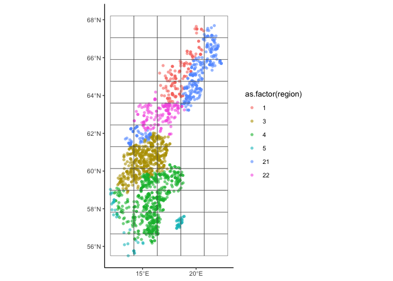
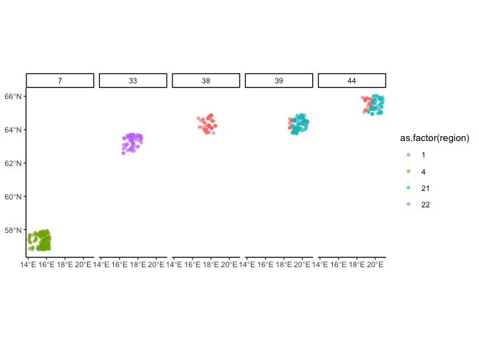
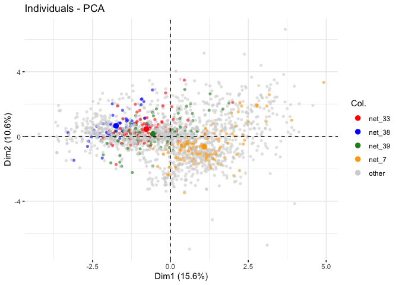
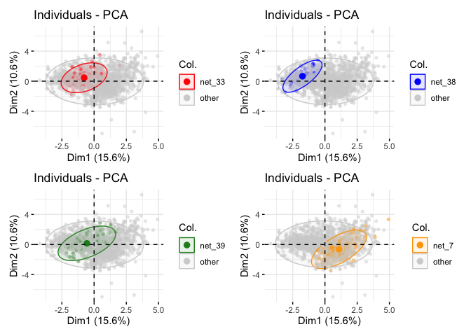
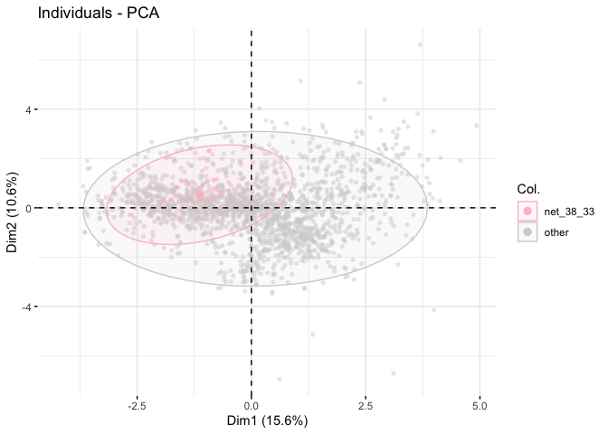
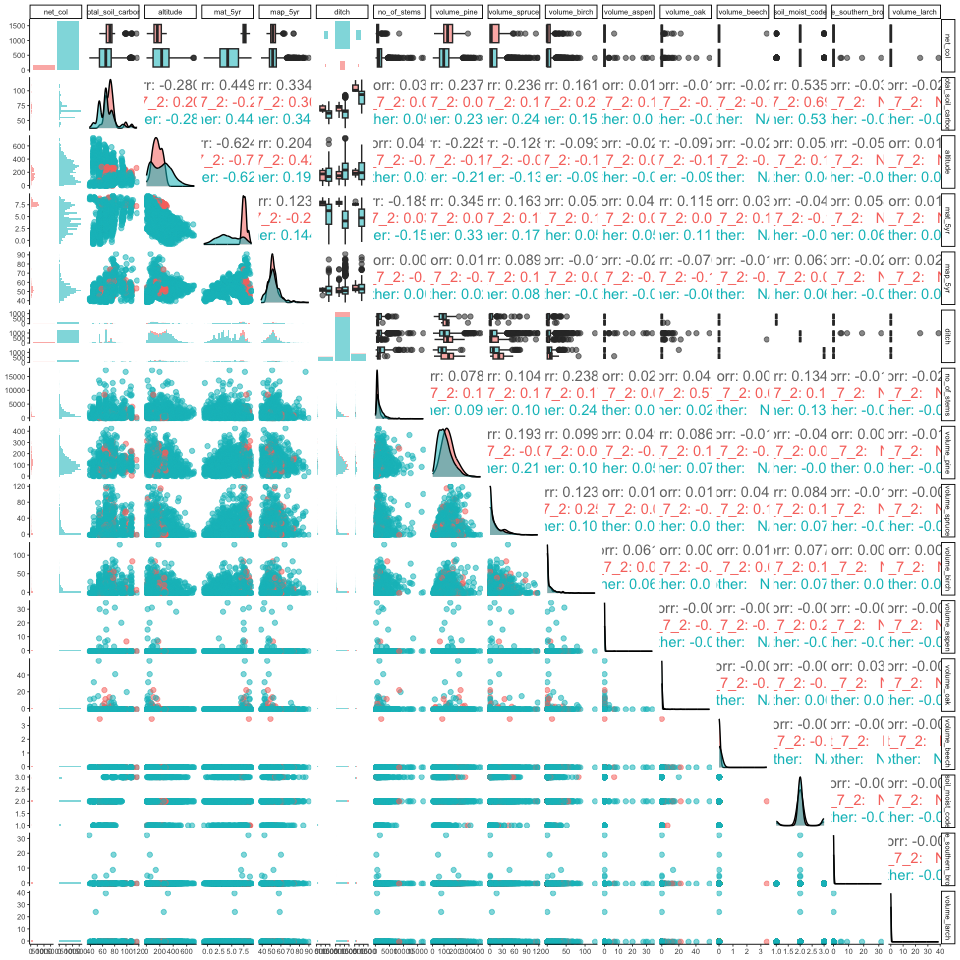
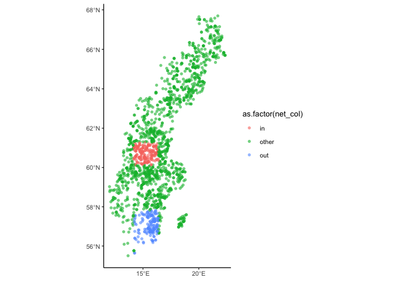
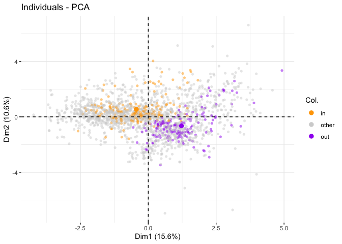
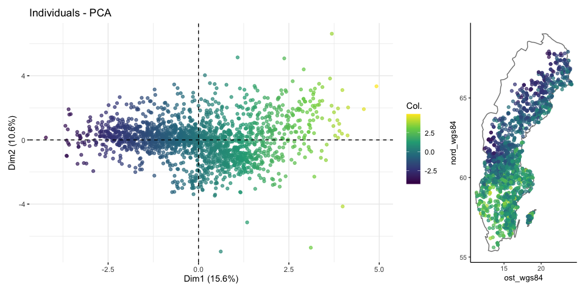

Find a region of covariate overlap
================
eleanorjackson
22 February, 2024

We have a geographical area of covariate overlap to use as testing
data - now we want an area of little/no overlap as a comparison.

``` r
library("tidyverse")
library("here")
library("FactoMineR")
library("factoextra")
library("ggmap")
library("maps")
library("sf")
library("patchwork")
library("GGally")

clean_data <-
  readRDS(here::here("data", "derived", "ForManSims_RCP0_same_time_clim_squ.rds")) %>% 
  filter(period == 0)
```

## Normalise data

``` r
feat_list <- c("total_soil_carbon", "altitude",
                   "mat_5yr", "map_5yr", "ditch", "no_of_stems", "volume_pine",
                   "volume_spruce", "volume_birch", "volume_aspen",
                   "volume_oak", "volume_beech", "soil_moist_code",
                   "volume_southern_broadleaf", "volume_larch")

corr_matrix <- clean_data %>% 
  column_to_rownames(var = "description") %>%  
  select(all_of(feat_list)) %>% 
  scale() 
```

### Region

``` r
# compute pca
data_pca <- princomp(corr_matrix)

fviz_mca_ind(data_pca, 
             geom = "point", alpha = 0.7,
             col.ind = as.factor(clean_data$region)) +
  
  ggplot(clean_data, aes(ost_wgs84, nord_wgs84, colour = as.factor(region))) +
  borders("world", regions = "sweden") +
  geom_point(alpha = 0.7) +
  coord_quickmap() +
  theme(legend.position = "none")
```

<!-- -->

Looks like somewhere in region 4 would be good.

## Create grid

``` r
# make data a sf object
data_sf <- st_as_sf(clean_data, 
                    coords = c("ost_wgs84", "nord_wgs84"),
                    crs = "WGS84")

# project the points
data_sf %>% 
  st_transform(crs = st_crs(3152)) -> data_projected

# make grid
fishnet <- st_make_grid(
  data_projected,
  cellsize = c(140000, 130000), # units are meters
  what = "polygons",
  square = TRUE,
  crs = st_crs(3152))

# plot
ggplot(data_projected) +
  geom_sf(aes(col = as.factor(region)), alpha = 0.6, shape = 16) +
  geom_sf(data = fishnet, fill  = NA)
```

<!-- -->

How many plots in each rectangle? We can have up to 200.

``` r
# convert polygons to sf object and add id column
fishnet %>%
    st_sf(crs = st_crs(3152)) %>%
    mutate(net_id = row_number()) -> fishnet_sf

# calculate which plots are in which squares
joined <- st_intersection(data_projected, fishnet_sf)

joined %>% 
  group_by(net_id) %>% 
  summarise(n()) %>% 
  slice_max(order_by = `n()`, n = 10)
```

    ## Simple feature collection with 10 features and 2 fields
    ## Geometry type: MULTIPOINT
    ## Dimension:     XY
    ## Bounding box:  xmin: -146816 ymin: -194639.3 xmax: 272068.4 ymax: 839540.4
    ## Projected CRS: ST74
    ## # A tibble: 10 × 3
    ##    net_id `n()`                                                         geometry
    ##     <int> <int>                                                 <MULTIPOINT [m]>
    ##  1     22   196 ((-146816 226164.4), (-146660.5 227307.6), (-146102.4 292343.1)…
    ##  2     17   161 ((-141863.8 142576.2), (-141561.8 131777.4), (-140227.6 151915.…
    ##  3      7   137 ((-144172.9 -132349.9), (-144066.7 -118666.1), (-142237.9 -1876…
    ##  4     27   119 ((-144901 327131.6), (-144166.1 327331.6), (-143442.2 327531.1)…
    ##  5     12   105 ((-146269.5 -38270.61), (-146165.2 -4965.939), (-145621.6 -3737…
    ##  6     39    94 ((134619.2 652854.4), (134660.1 621730.4), (134722 622954.8), (…
    ##  7     23    92 ((-6583.053 257567.2), (-6307.006 257430.2), (-5993.551 266802.…
    ##  8     18    86 ((-867.0408 125748.2), (-293.2138 112322.4), (1558.892 191834.8…
    ##  9     33    80 ((-1970.85 453374.6), (-891.3707 481705), (-366.5535 453052), (…
    ## 10     44    77 ((134959.8 825963.5), (145620.5 728442.9), (152286.2 806214.5),…

``` r
joined %>% 
  filter(net_id == 7 | net_id == 44| net_id == 38| net_id == 39| net_id == 33) %>%  
  ggplot() +
  geom_sf(aes(col = as.factor(region)), alpha = 0.6, shape = 16) +
  facet_wrap(~net_id, nrow = 1)
```

<!-- -->

``` r
clean_data %>% 
  left_join(joined) -> data_nets

data_nets %>% 
  mutate(net_col = case_when(net_id == 7 ~ "net_7",
                            net_id == 39 ~ "net_39",
                             net_id == 33 ~ "net_33",
                             net_id == 38 ~ "net_38",
                              .default = "other")) -> nets_test

fviz_mca_ind(data_pca, 
             geom = "point", alpha = 0.6, shape = 16,
             col.ind = as.factor(nets_test$net_col), 
             palette = c("red", "blue", "forestgreen", "orange", "lightgrey")) 
```

<!-- -->

<!-- -->

`net_7` gives us the biggest sample size but maybe it’s too close to the
middle?

`net_38` and `net_33` are more on the edge but too few points? We could
add them together to make a rectangle?

``` r
data_nets %>% 
  mutate(net_col = case_when(net_id == 38 ~ "net_38_33",
                             net_id == 33 ~ "net_38_33",
                              .default = "other")) -> nets_test_38_33

fviz_mca_ind(data_pca, 
             geom = "point", alpha = 0.5, shape = 16,
             col.ind = as.factor(nets_test_38_33$net_col), addEllipses = TRUE,
             palette = c("pink", "lightgrey"))
```

<!-- -->

what effect do they have on the distribution of our covariates?

``` r
data_nets %>% 
  mutate(net_col = case_when(net_id == 7 ~ "net_7_2",
                             net_id == 2 ~ "net_7_2",
                              .default = "other")) %>% 
  select(net_col, total_soil_carbon, altitude,
         mat_5yr, map_5yr, ditch, no_of_stems, volume_pine,
         volume_spruce, volume_birch, volume_aspen,
         volume_oak, volume_beech, soil_moist_code,
         volume_southern_broadleaf, volume_larch) %>% 
  mutate(ditch = as.ordered(ditch), 
         ditch = as.ordered(soil_moist_code)) %>% 
  ggpairs(progress = FALSE,
          mapping = aes(colour = as.factor(net_col), alpha = 0.5)) +
  theme_classic(base_size = 7)  
```

<!-- -->

In the above, pink is `net_7`. Still overlaps everywhere..

``` r
# make data a sf object
data_sf_net <- data_nets %>% 
  mutate(net_col = case_when(
                             net_id == 7 ~ "out",
                             net_id == 2 ~ "out",
                             in_square == TRUE ~ "in",
                              .default = "other")) %>% 
  st_as_sf(coords = c("ost_wgs84", "nord_wgs84"),
           crs = "WGS84")

# project the points
data_sf_net %>% 
  st_transform(crs = st_crs(3152)) -> data_projected_net

# plot
ggplot(data_projected_net) +
  geom_sf(aes(col = as.factor(net_col)), alpha = 0.6, shape = 16) 
```

<!-- -->

``` r
fviz_mca_ind(data_pca, 
             geom = "point", alpha = 0.5, shape = 16,
             col.ind = as.factor(data_sf_net$net_col), addEllipses = FALSE,
             palette = c("orange", "lightgrey", "purple"))
```

<!-- -->

``` r
data_sf_net %>% 
  group_by(net_col) %>% 
  summarise(n = n())
```

    ## Simple feature collection with 3 features and 2 fields
    ## Geometry type: MULTIPOINT
    ## Dimension:     XY
    ## Bounding box:  xmin: 11.3039 ymin: 55.60411 xmax: 24.0891 ymax: 67.92531
    ## Geodetic CRS:  WGS 84
    ## # A tibble: 3 × 3
    ##   net_col     n                                                         geometry
    ##   <chr>   <int>                                                 <MULTIPOINT [°]>
    ## 1 in        196 ((13.55027 60.57689), (13.55167 60.58722), (13.91882 60.41382),…
    ## 2 other    1448 ((21.0402 67.92531), (20.84201 67.79976), (21.03963 67.57266), …
    ## 3 out       162 ((13.9953 57.36895), (13.98344 57.49157), (14.03657 57.56134), …

I don’t feel like its really any more on the edge than the “in”
sample..?

Try colouring by PCA dim 1

``` r
# compute pca
data_pca <- princomp(corr_matrix)

fviz_mca_ind(data_pca, 
             geom = "point", alpha = 0.7,
             col.ind = data_pca$scores[,1]) +
  scale_color_viridis_c() +
  
ggplot(clean_data, aes(ost_wgs84, nord_wgs84, colour = data_pca$scores[,1])) +
  borders("world", regions = "sweden") +
  scale_color_viridis_c() +
  geom_point(alpha = 0.7) +
  coord_quickmap() +
  theme(legend.position = "none")
```

<!-- -->
