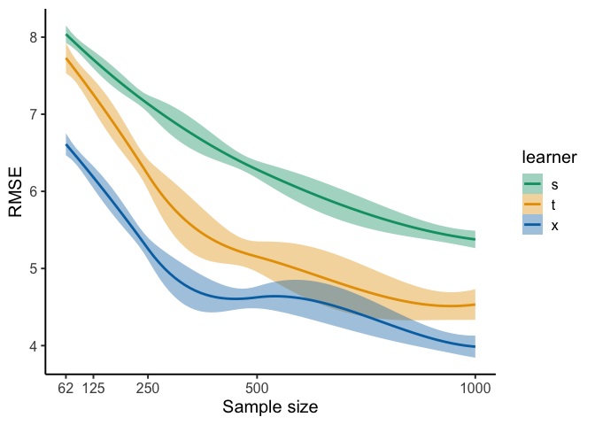

eleanorjackson
13 March, 2024

``` r
library("tidyverse")
library("here")
library("patchwork")
```

``` r
results <- readRDS(here("data", "derived", "results.rds")) %>% 
  filter(n_train != 31)
```

``` r
results %>% 
  ggplot(aes(x = n_train, y = rmse, colour = learner)) +
  geom_jitter(shape = 16, alpha = 0.6) +
  stat_summary(fun = median, geom = "line", linewidth = 1) +
  stat_summary(fun = median, size = 1, fill = "white", shape = 21, stroke = 1.5) +
  scale_colour_manual(values = c("#009E73", "#E69F00", "#0072B2")) +
  scale_x_continuous(breaks = c(0, 62, 125, 250, 500, 1000)) +
  xlab("Sample size") +
  ylab("RMSE") +
  theme_classic(base_size = 15) -> p1

results %>% 
  drop_na() %>% 
  ggplot(aes(x = n_train, y = rmse, 
             group = learner, colour = learner, fill = learner)) +
  geom_smooth(method = loess) +
  scale_colour_manual(values = c("#009E73", "#E69F00", "#0072B2")) +
  scale_fill_manual(values = c("#009E73", "#E69F00", "#0072B2")) +
  scale_x_continuous(breaks = c(0, 62, 125, 250, 500, 1000)) +
  xlab("Sample size") +
  ylab("RMSE") +
  theme_classic(base_size = 15) 
```

    ## `geom_smooth()` using formula = 'y ~ x'

<!-- -->

``` r
results %>% 
  ggplot(aes(x = prop_not_treated, y = rmse, colour = learner)) +
  geom_jitter(shape = 16, alpha = 0.6) +
  stat_summary(fun = median, geom = "line", linewidth = 1) +
  stat_summary(fun = median, size = 1, fill = "white", shape = 21, stroke = 1.5) +
  scale_colour_manual(values = c("#009E73", "#E69F00", "#0072B2")) +
  scale_x_continuous(breaks = c(0.3, 0.5, 0.7)) +
  xlab("Proportion not treated (treatment imbalance)") +
  ylab("RMSE") +
  theme_classic(base_size = 15) -> p2
```

``` r
results %>% 
  ggplot(aes(x = assignment, y = rmse, colour = learner, group = learner)) +
  geom_jitter(shape = 16, alpha = 0.6) +
  stat_summary(fun = median, geom = "line", linewidth = 1) +
  stat_summary(fun = median, size = 1, fill = "white", shape = 21, stroke = 1.5) +
  scale_colour_manual(values = c("#009E73", "#E69F00", "#0072B2")) +
  xlab("Treatment assignment") +
  ylab("RMSE") +
  theme_classic(base_size = 15) -> p3
```

``` r
results %>% 
  ggplot(aes(x = var_omit, y = rmse, colour = learner, group = learner)) +
  geom_jitter(shape = 16, alpha = 0.6) +
  stat_summary(fun = median, geom = "line", linewidth = 1) +
  stat_summary(fun = median, size = 1, fill = "white", shape = 21, stroke = 1.5) +
  scale_colour_manual(values = c("#009E73", "#E69F00", "#0072B2")) +
  xlab("Omission of important variable") +
  ylab("RMSE") +
  theme_classic(base_size = 15) -> p4
```

``` r
results %>% 
  ggplot(aes(x = test_plot_location, y = rmse, colour = learner, group = learner)) +
  geom_jitter(shape = 16, alpha = 0.6) +
  stat_summary(fun = median, geom = "line", linewidth = 1) +
  stat_summary(fun = median, size = 1, fill = "white", shape = 21, stroke = 1.5) +
  scale_colour_manual(values = c("#009E73", "#E69F00", "#0072B2")) +
  xlab("Location of test plots") +
  ylab("RMSE") +
  theme_classic(base_size = 15) -> p5
```

``` r
results %>% 
  ggplot(aes(x = prop_not_treated, y = median_ps, colour = assignment)) +
  geom_jitter() +
  ylab("Median propensity score") +
  xlab("Proportion not treated (treatment imbalance)") +
  theme_classic(base_size = 15) -> p6
```

``` r
p1 + p2+ p3 + 
  p4 + p5 + p6
```

<!-- -->
