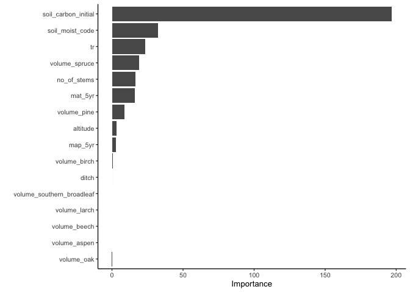
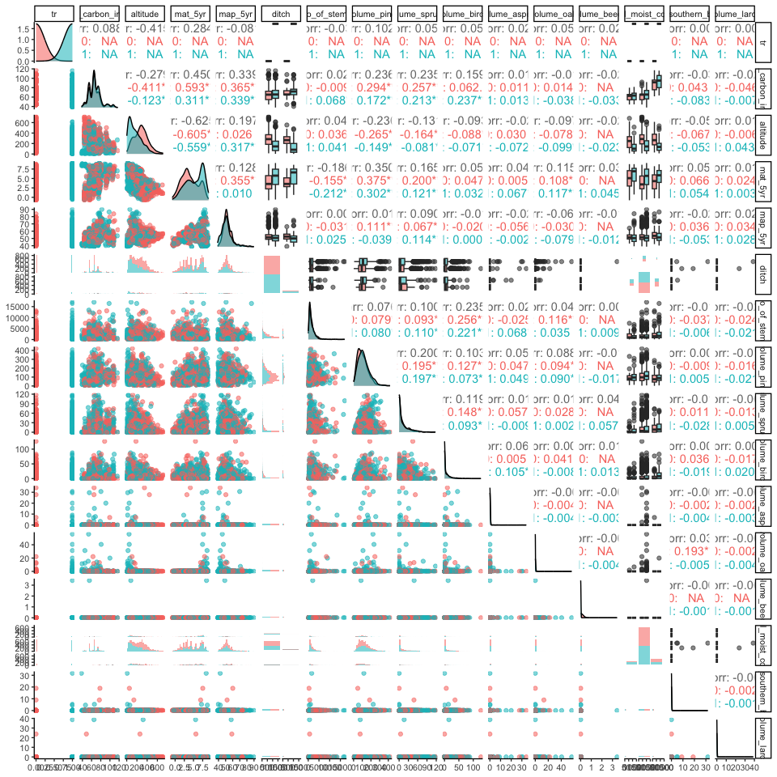
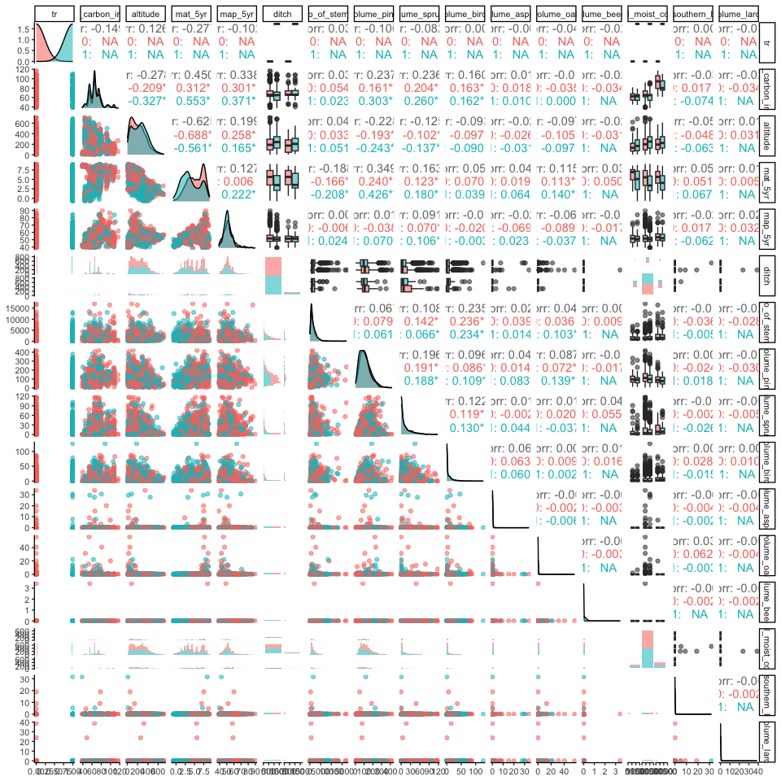
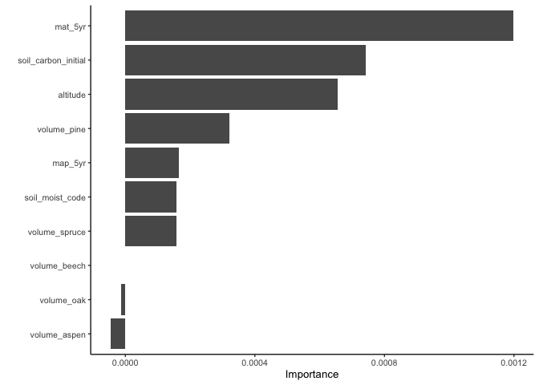
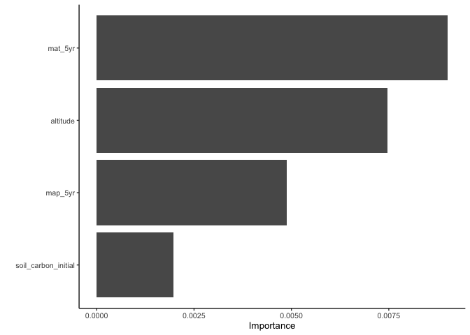

Confounders for the X-learner propensity score
================
eleanorjackson
08 March, 2024

The X-learner assesses the propensity score (probability of a plot being
treated or not) and uses this in making it’s predictions of cate.

Should we only use a subset of the features to predict the propensity
score within the X-learner? And if so, which features should we use?

<https://doi.org/10.1200/JCO.21.01957>: A confounder is by definition a
variable: (1) that affects the outcome of interest, (2) that differs
between the treated and untreated populations, and (3) that this
difference between the populations has led to bias (in the estimation)
of an association measure for the effect of interest.

``` r
library("tidyverse")
library("here")
library("tidymodels")
library("vip")
library("GGally")
```

Setp (1), which covariates affect the outcome of interest?

``` r
one_run <- readRDS(here("data", "derived", "all_runs.rds")) %>%
  filter(assignment == "random",
         prop_not_treated == 0.5,
         n_train == 1000,
         var_omit == FALSE,
         test_plot_location == "random") %>% 
  sample_n(1)


# test-train split --------------------------------------------------------

data_split <- initial_split(one_run$df_assigned[[1]], prop = 1/3)
train_data <- training(data_split)
test_data <- testing(data_split)


# tune hyperparameters ----------------------------------------------------

rf_tune <- rand_forest(mtry = tune(), min_n = tune()) %>%
  set_engine("ranger", num.threads = 3) %>%
  set_mode("regression")

tree_grid <- grid_regular(mtry(c(1, 15)),
                          min_n(),
                          levels = 5)

rf_recipe <- recipe(soil_carbon_obs ~
                      tr + soil_carbon_initial + altitude +
                      mat_5yr + map_5yr + ditch + no_of_stems + volume_pine +
                      volume_spruce + volume_birch + volume_aspen +
                      volume_oak + volume_beech + soil_moist_code +
                      volume_southern_broadleaf + volume_larch,
                    data = train_data)

rf_workflow <- workflow() %>%
  add_recipe(rf_recipe) %>%
  add_model(rf_tune)

# create a set of cross-validation resamples to use for tuning
trees_folds <- vfold_cv(train_data, v = 25)

rf_tune_res <-
  tune_grid(rf_workflow,
            resamples = trees_folds,
            grid = tree_grid,
            control = control_grid(save_pred = TRUE),
            metrics = metric_set(rmse))

best_auc <- select_best(rf_tune_res, "rmse")

final_rf <- finalize_model(
  rf_tune,
  best_auc
)


# variable importance -----------------------------------------------------

final_rf %>%
  set_engine("ranger", importance = "permutation") %>%
  fit(soil_carbon_obs ~
                      tr + soil_carbon_initial + altitude +
                      mat_5yr + map_5yr + ditch + no_of_stems + volume_pine +
                      volume_spruce + volume_birch + volume_aspen +
                      volume_oak + volume_beech + soil_moist_code +
                      volume_southern_broadleaf + volume_larch,
      data = one_run$df_assigned[[1]]
  ) %>%
  vip(num_features = 16)
```

<!-- -->

Step (2) which of those covariates differ between the treated and
untreated populations?

``` r
one_run_alt <- readRDS(here("data", "derived", "all_runs.rds")) %>%
  filter(assignment == "correlated_altitude",
         prop_not_treated == 0.3,
         n_train == 1000,
         var_omit == FALSE,
         test_plot_location == "random") %>% 
  sample_n(1)

one_run_alt$df_assigned[[1]] %>% 
  mutate(ditch = as.factor(ditch),
         soil_moist_code = as.ordered(soil_moist_code)) %>% 
  select(tr, soil_carbon_initial, altitude,
                      mat_5yr, map_5yr, ditch, no_of_stems, volume_pine,
                      volume_spruce, volume_birch, volume_aspen,
                      volume_oak, volume_beech, soil_moist_code,
                      volume_southern_broadleaf, volume_larch) %>% 
  ggpairs(progress = FALSE,
          mapping = aes(colour = as.factor(tr), alpha = 0.5))
```

<!-- -->

``` r
one_run_region <- readRDS(here("data", "derived", "all_runs.rds")) %>%
  filter(assignment == "correlated_region",
         prop_not_treated == 0.3,
         n_train == 1000,
         var_omit == FALSE,
         test_plot_location == "random") %>% 
  sample_n(1)

one_run_region$df_assigned[[1]] %>% 
  mutate(ditch = as.factor(ditch),
         soil_moist_code = as.ordered(soil_moist_code)) %>% 
  select(tr, soil_carbon_initial, altitude,
                      mat_5yr, map_5yr, ditch, no_of_stems, volume_pine,
                      volume_spruce, volume_birch, volume_aspen,
                      volume_oak, volume_beech, soil_moist_code,
                      volume_southern_broadleaf, volume_larch) %>% 
  ggpairs(progress = FALSE,
          mapping = aes(colour = as.factor(tr), alpha = 0.5))
```

<!-- -->

I think that we definitely want to use temperature, precipitation and
altitude.

What if we use an RF to predict treatment? That should tell us which
ones are important.

``` r
# tune hyperparameters ----------------------------------------------------

rf_tune <- rand_forest(mtry = tune(), min_n = tune()) %>%
  set_engine("ranger", num.threads = 3) %>%
  set_mode("regression")

tree_grid <- grid_regular(mtry(c(1, 14)),
                          min_n(),
                          levels = 5)

rf_recipe <- recipe(tr ~
                      soil_carbon_initial + altitude +
                      mat_5yr + map_5yr + ditch + no_of_stems + volume_pine +
                      volume_spruce + volume_birch + volume_aspen +
                      volume_oak + volume_beech + soil_moist_code +
                      volume_southern_broadleaf + volume_larch,
                    data = train_data)

rf_workflow <- workflow() %>%
  add_recipe(rf_recipe) %>%
  add_model(rf_tune)

# create a set of cross-validation resamples to use for tuning
trees_folds <- vfold_cv(train_data, v = 25)

rf_tune_res <-
  tune_grid(rf_workflow,
            resamples = trees_folds,
            grid = tree_grid,
            control = control_grid(save_pred = TRUE),
            metrics = metric_set(rmse))

best_auc <- select_best(rf_tune_res, "rmse")

final_rf <- finalize_model(
  rf_tune,
  best_auc
)


# variable importance -----------------------------------------------------

final_rf %>%
  set_engine("ranger", importance = "permutation") %>%
  fit(tr ~
                      soil_carbon_initial + altitude +
                      mat_5yr + map_5yr + ditch + no_of_stems + volume_pine +
                      volume_spruce + volume_birch + volume_aspen +
                      volume_oak + volume_beech + soil_moist_code +
                      volume_southern_broadleaf + volume_larch,
      data = one_run$df_assigned[[1]]
  ) %>%
  vip()
```

<!-- -->

Maybe we should include `soil_carbon_initial` too.

If we think that `soil_carbon_initial + altitude + mat_5yr + map_5yr`
are sufficient for predicting treatment, what happens if we test that?

``` r
# tune hyperparameters ----------------------------------------------------

rf_tune <- rand_forest(mtry = tune(), min_n = tune()) %>%
  set_engine("ranger", num.threads = 3) %>%
  set_mode("regression")

tree_grid <- grid_regular(mtry(c(1, 4)),
                          min_n(),
                          levels = 5)

rf_recipe <- recipe(tr ~
                      soil_carbon_initial + altitude +
                      mat_5yr + map_5yr,
                    data = train_data)

rf_workflow <- workflow() %>%
  add_recipe(rf_recipe) %>%
  add_model(rf_tune)

# create a set of cross-validation resamples to use for tuning
trees_folds <- vfold_cv(train_data, v = 25)

rf_tune_res <-
  tune_grid(rf_workflow,
            resamples = trees_folds,
            grid = tree_grid,
            control = control_grid(save_pred = TRUE),
            metrics = metric_set(rmse))

best_auc <- select_best(rf_tune_res, "rmse")

final_rf <- finalize_model(
  rf_tune,
  best_auc
)


# variable importance -----------------------------------------------------

final_rf %>%
  set_engine("ranger", importance = "permutation") %>%
  fit(tr ~
                      soil_carbon_initial + altitude +
                      mat_5yr + map_5yr,
      data = one_run$df_assigned[[1]]
  ) %>%
  vip()
```

<!-- -->

Random forest models can determine which predictors are important, so
maybe it doesn’t matter if we include all the covariates to predict
propensity score.
