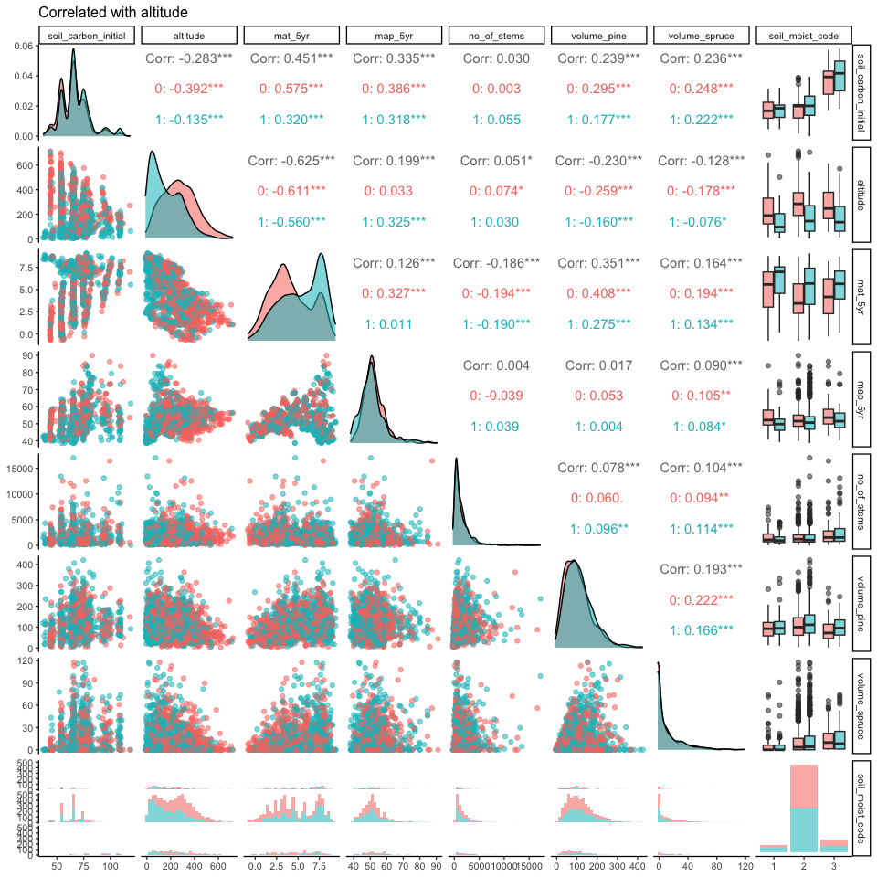
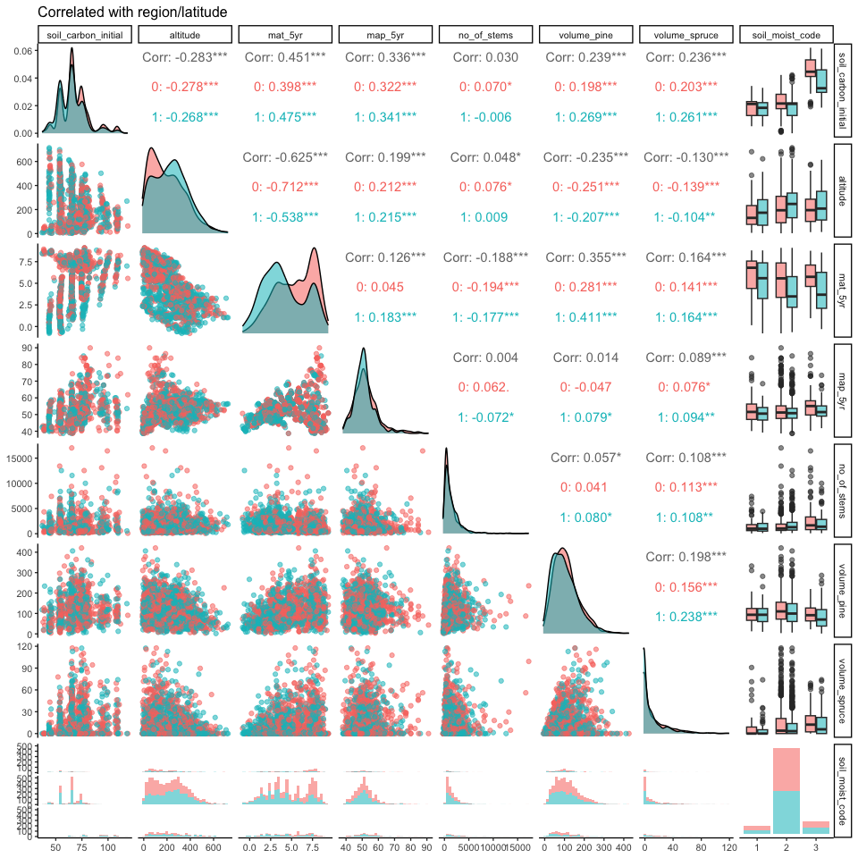
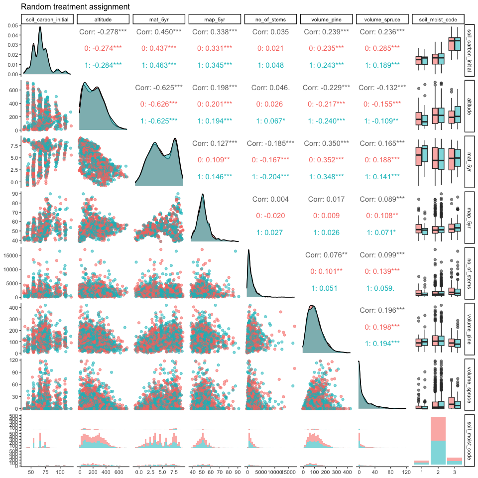

Exploring initial soil carbon…
================
eleanorjackson
18 March, 2024

We noticed that the distribution of initial soil carbon didn’t seem to
change between treated and untreated groups when we were biasing
treatment assignment.

``` r
library("tidyverse")
library("here")
library("tidymodels")
library("vip")
library("GGally")
library("ggmap")
library("patchwork")
```

``` r
clean_data <- readRDS(
  here::here("data", "derived", "ForManSims_RCP0_same_time_clim_squ.rds")
) %>% 
  filter(period == 0)

ggplot(clean_data) +
  geom_density(aes(x = total_soil_carbon))
```

<!-- -->

``` r
ggplot(clean_data) +
  geom_histogram(aes(x = total_soil_carbon)) +
  facet_wrap(~region)
```

    ## `stat_bin()` using `bins = 30`. Pick better value with `binwidth`.

<!-- -->

``` r
clean_data %>%
  ggplot(aes(ost_wgs84, nord_wgs84,
             colour = total_soil_carbon)) +
  borders("world", regions = "sweden") +
  geom_point(shape = 16, alpha = 0.7, size = 1) +
  scale_colour_viridis_c() +
  coord_quickmap() +
  theme_void(base_size = 10) +
  labs(colour = "Initial soil\ncarbon (ton C/ha)") +
  
  clean_data %>%
  ggplot(aes(ost_wgs84, nord_wgs84,
             colour = as.factor(region))) +
  borders("world", regions = "sweden") +
  geom_point(shape = 16, alpha = 0.7, size = 1) +
  coord_quickmap() +
  theme_void(base_size = 10) +
  labs(colour = "Region")
```

<!-- -->

## Treatment assignment correlated with altitude

``` r
one_run_alt <- readRDS(here("data", "derived", "all_runs.rds")) %>%
  filter(assignment == "correlated_altitude",
         prop_not_treated == 0.5,
         n_train == 1000,
         var_omit == FALSE,
         test_plot_location == "random") %>% 
  sample_n(1)

one_run_alt$df_assigned[[1]] %>% 
  mutate(ditch = as.factor(ditch),
         soil_moist_code = as.ordered(soil_moist_code)) %>% 
  select(tr, soil_carbon_initial, altitude,
                      mat_5yr, map_5yr, no_of_stems, volume_pine,
                      volume_spruce, soil_moist_code) %>% 
  ggpairs(columns = 2:9, progress = FALSE,
          mapping = aes(colour = as.factor(tr), alpha = 0.5)) +
  ggtitle("Correlated with altitude")
```

<!-- -->

``` r
ggplot(clean_data) + 
  geom_point(aes(y = total_soil_carbon, x = altitude))
```

<!-- -->

## Treatment assignment correlated with region

``` r
one_run_reg <- readRDS(here("data", "derived", "all_runs.rds")) %>%
  filter(assignment == "correlated_region",
         prop_not_treated == 0.5,
         n_train == 1000,
         var_omit == FALSE,
         test_plot_location == "random") %>% 
  sample_n(1)

one_run_reg$df_assigned[[1]] %>% 
  mutate(ditch = as.factor(ditch),
         soil_moist_code = as.ordered(soil_moist_code)) %>% 
  select(tr, soil_carbon_initial, altitude,
                      mat_5yr, map_5yr, no_of_stems, volume_pine,
                      volume_spruce, soil_moist_code) %>% 
  ggpairs(columns = 2:9, progress = FALSE,
          mapping = aes(colour = as.factor(tr), alpha = 0.5)) +
  ggtitle("Correlated with region/latitude")
```

<!-- -->

``` r
ggplot(clean_data) + 
  geom_point(aes(y = total_soil_carbon, x = nord_wgs84, colour = as.ordered(region)))
```

<!-- -->

## Treatment assignment random

``` r
one_run_rand <- readRDS(here("data", "derived", "all_runs.rds")) %>%
  filter(assignment == "random",
         prop_not_treated == 0.5,
         n_train == 1000,
         var_omit == FALSE,
         test_plot_location == "random") %>% 
  sample_n(1)

one_run_rand$df_assigned[[1]] %>% 
  mutate(ditch = as.factor(ditch),
         soil_moist_code = as.ordered(soil_moist_code)) %>% 
  select(tr, soil_carbon_initial, altitude,
                      mat_5yr, map_5yr, no_of_stems, volume_pine,
                      volume_spruce, soil_moist_code) %>% 
  ggpairs(columns = 2:9, progress = FALSE,
          mapping = aes(colour = as.factor(tr), alpha = 0.5)) +
  ggtitle("Random treatment assignment")
```

<!-- -->

``` r
ggplot(clean_data) + 
  geom_point(aes(y = total_soil_carbon, x = nord_wgs84, colour = soil_moist_code)) +
  scale_colour_viridis_c()
```

<!-- -->

``` r
ggplot(clean_data) + 
  geom_point(aes(y = total_soil_carbon, x = nord_wgs84, colour = forest_domain_name)) 
```

<!-- -->

``` r
one_run_alt$df_assigned[[1]] %>% 
  ggplot() + 
  geom_point(aes(y = soil_carbon_initial, x = altitude,
                 colour = as.factor(tr))) 
```

<!-- -->

``` r
one_run_alt$df_assigned[[1]] %>% 
  ggplot() + 
  geom_point(aes(y = soil_carbon_initial, x = altitude, colour = volume_pine,
                 shape = as.factor(tr))) +
  scale_colour_viridis_c()
```

<!-- -->
