Vis for March team meeting
================
eleanorjackson
13 March, 2024

``` r
library("tidyverse")
library("here")
```

``` r
models_out <- readRDS(here("data", "derived", "all_runs.rds")) %>% 
  filter(n_train != 31)
```

``` r
plot_real_pred <- function(out, study_condition_val, study_condition,
                           max_col) {
  
  out %>%  
    filter((!!as.name(study_condition)) == study_condition_val) -> out_subset
  
  out_subset %>% 
    unnest(df_out) %>% 
    mutate(error = abs(cate_pred - cate_real)) %>% 
    ggplot(aes(x = cate_real, y = cate_pred, colour = error)) +
    geom_hline(yintercept = 0, colour = "grey", linetype = 2) +
    geom_vline(xintercept = 0, colour = "grey", linetype = 2) +
    geom_point() +
    geom_abline(intercept = 0, slope = 1, colour = "blue") +
    scale_color_gradient(low = "lightblue", high = "red3",
                         limits = c(0, max_col)) +
    xlim(-35, 35) +
    ylim(-35, 35) +
    theme_classic(base_size = 15) +
    ggtitle(paste(study_condition,  study_condition_val, sep = " = ")) +
    facet_wrap(~ learner) 
}
```

## ntrain

``` r
models_out %>% 
  filter(assignment == "random",
         var_omit == FALSE,
         prop_not_treated == 0.5,
         test_plot_location == "random"
         ) -> n_train_df

map(.x = c(62, 125, 250, 500, 1000), 
    .f = plot_real_pred, 
    study_condition = "n_train", 
    out = n_train_df,
    max_col = 40)
```

    ## [[1]]

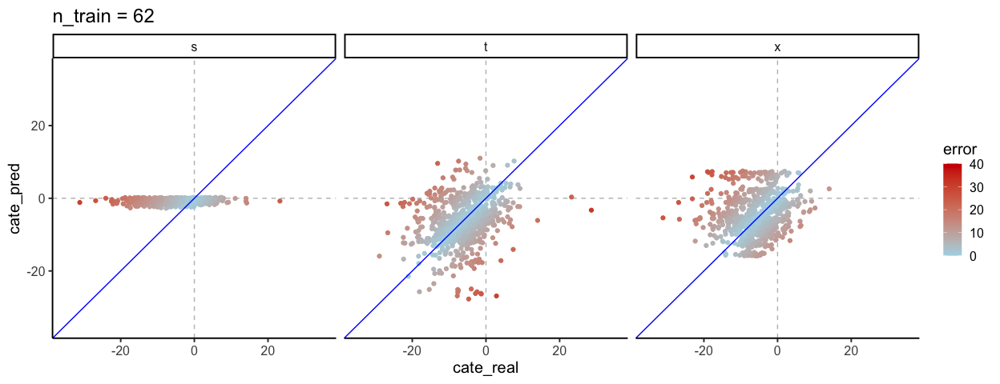<!-- -->

    ## 
    ## [[2]]

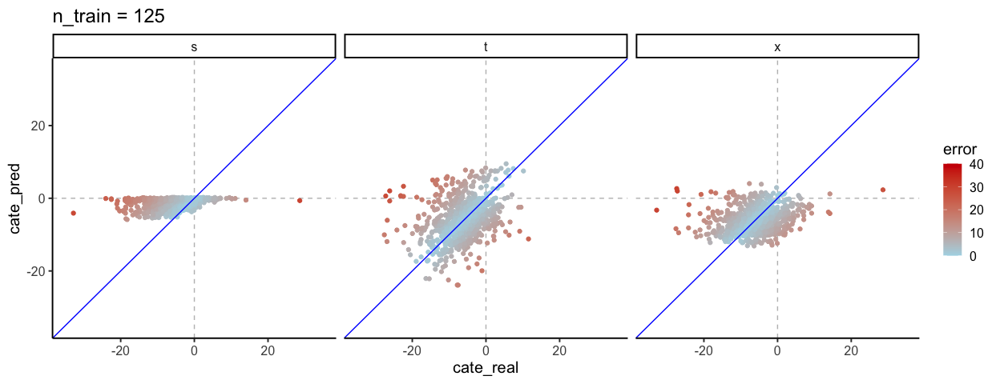<!-- -->

    ## 
    ## [[3]]

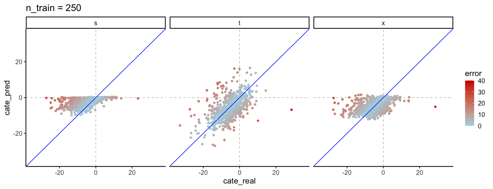<!-- -->

    ## 
    ## [[4]]

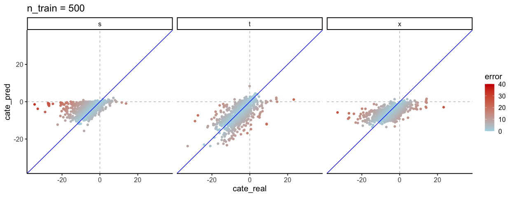<!-- -->

    ## 
    ## [[5]]

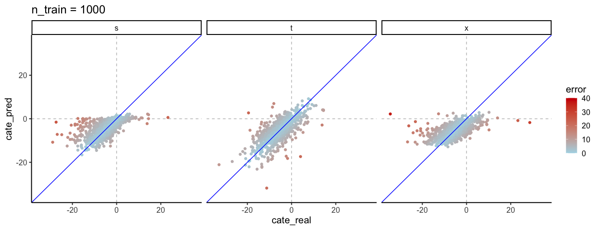<!-- -->

## prop treated

``` r
models_out %>% 
  filter(assignment == "random",
         var_omit == FALSE,
         n_train == 1000,
         test_plot_location == "random"
         ) -> prop_not_treat_df

map(.x = c(0.3, 0.5, 0.7), 
    .f = plot_real_pred, 
    study_condition = "prop_not_treated", 
    out = prop_not_treat_df,
    max_col = 40)
```

    ## [[1]]

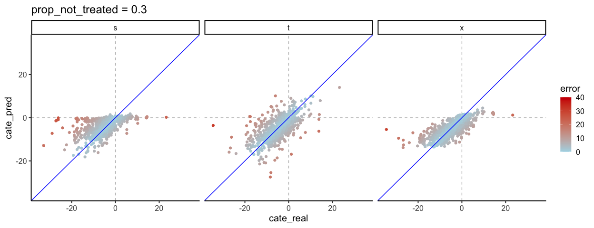<!-- -->

    ## 
    ## [[2]]

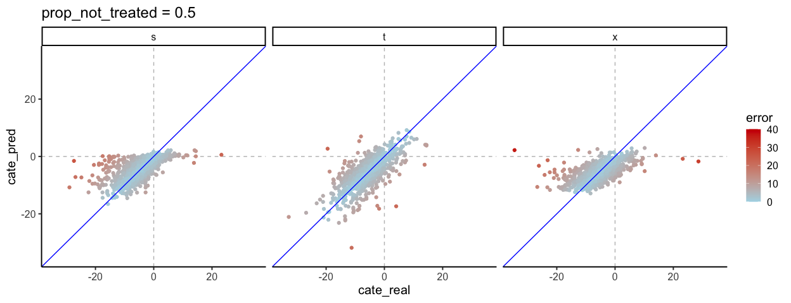<!-- -->

    ## 
    ## [[3]]

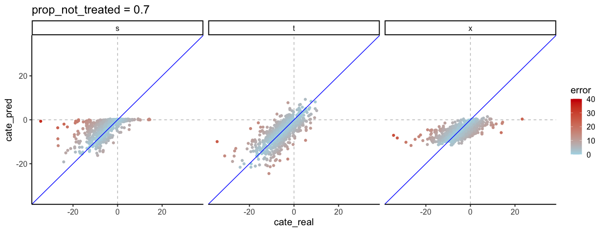<!-- -->

## treat assignment

``` r
models_out %>% 
  filter(prop_not_treated == 0.5,
         var_omit == FALSE,
         n_train == 1000,
         test_plot_location == "random"
         ) -> prop_not_treat_df

map(.x = c("random", "correlated_altitude", "correlated_region"), 
    .f = plot_real_pred, 
    study_condition = "assignment", 
    out = prop_not_treat_df,
    max_col = 40)
```

    ## [[1]]

<!-- -->

    ## 
    ## [[2]]

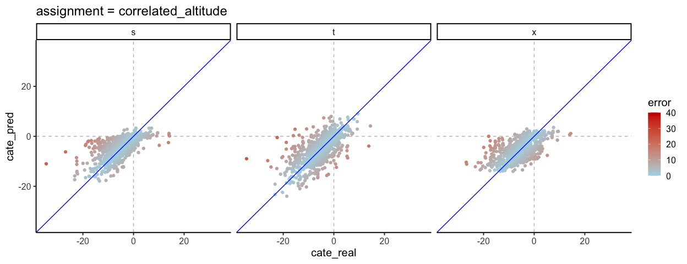<!-- -->

    ## 
    ## [[3]]

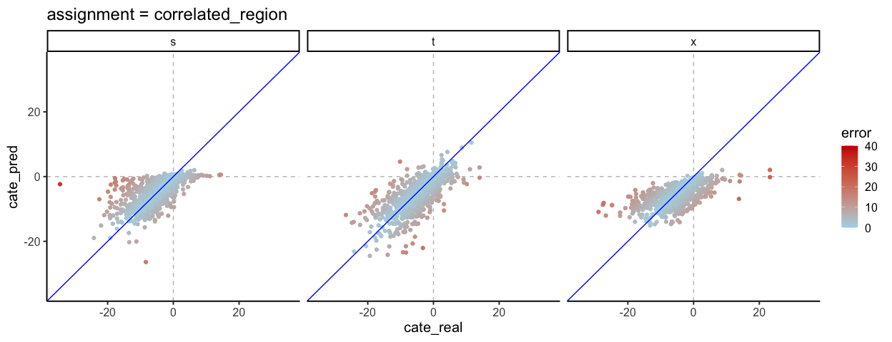<!-- -->

## var ommission

``` r
models_out %>% 
  filter(assignment == "random",
         prop_not_treated == 0.5,
         n_train == 1000,
         test_plot_location == "random"
         ) -> var_omit_df

map(.x = c(TRUE, FALSE), 
    .f = plot_real_pred, 
    study_condition = "var_omit", 
    out = var_omit_df,
    max_col = 40)
```

    ## [[1]]

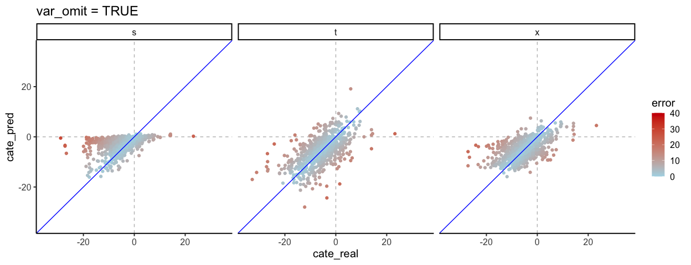<!-- -->

    ## 
    ## [[2]]

<!-- -->

## test plot location

``` r
models_out %>% 
  filter(assignment == "random",
         prop_not_treated == 0.5,
         n_train == 1000,
         var_omit == FALSE
         ) -> test_loc_df

map(.x = c("random", "edge", "centre"), 
    .f = plot_real_pred, 
    study_condition = "test_plot_location", 
    out = test_loc_df,
    max_col = 40)
```

    ## [[1]]

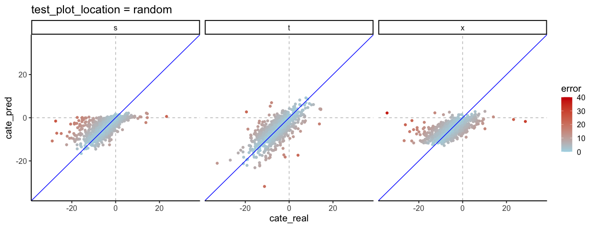<!-- -->

    ## 
    ## [[2]]

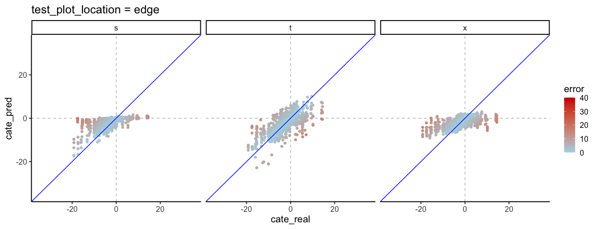<!-- -->

    ## 
    ## [[3]]

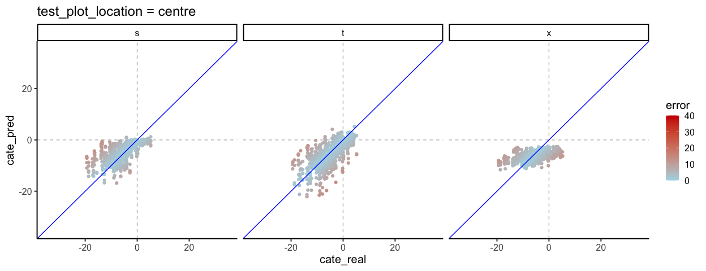<!-- -->
