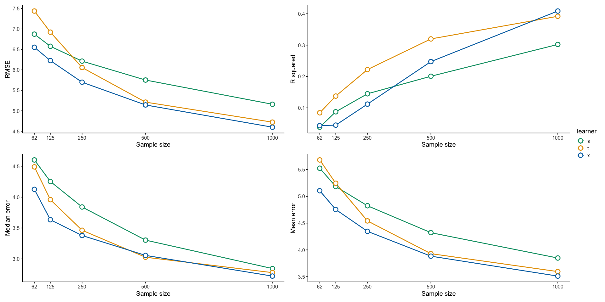

Comparing measures of predictive accuracy
================
eleanorjackson
18 March, 2024

``` r
library("tidyverse")
library("here")
library("patchwork")
```

``` r
results <- readRDS(here::here("data", "derived", "results.rds")) %>% 
  filter(n_train != 31) 
```

``` r
results %>% 
  ggplot(aes(x = n_train, y = rmse, colour = learner)) +
  stat_summary(fun = median, geom = "line", linewidth = 1) +
  stat_summary(fun = median, size = 1, fill = "white", shape = 21, stroke = 1.5) +
  scale_colour_manual(values = c("#009E73", "#E69F00", "#0072B2")) +
  scale_x_continuous(breaks = c(0, 62, 125, 250, 500, 1000)) +
  xlab("Sample size") +
  ylab("RMSE") +
  theme_classic(base_size = 15) +
  
  ggplot(results, aes(x = n_train, y = rsq, colour = learner)) +
  stat_summary(fun = median, geom = "line", linewidth = 1) +
  stat_summary(fun = median, size = 1, fill = "white", shape = 21, stroke = 1.5) +
  scale_colour_manual(values = c("#009E73", "#E69F00", "#0072B2")) +
  scale_x_continuous(breaks = c(0, 62, 125, 250, 500, 1000)) +
  xlab("Sample size") +
  ylab("R squared") +
  theme_classic(base_size = 15) +
  
  ggplot(results, aes(x = n_train, y = median_error, colour = learner)) +
  stat_summary(fun = median, geom = "line", linewidth = 1) +
  stat_summary(fun = median, size = 1, fill = "white", shape = 21, stroke = 1.5) +
  scale_colour_manual(values = c("#009E73", "#E69F00", "#0072B2")) +
  scale_x_continuous(breaks = c(0, 62, 125, 250, 500, 1000)) +
  xlab("Sample size") +
  ylab("Median error") +
  theme_classic(base_size = 15) +
  
  ggplot(results, aes(x = n_train, y = mean_error, colour = learner)) +
  stat_summary(fun = median, geom = "line", linewidth = 1) +
  stat_summary(fun = median, size = 1, fill = "white", shape = 21, stroke = 1.5) +
  scale_colour_manual(values = c("#009E73", "#E69F00", "#0072B2")) +
  scale_x_continuous(breaks = c(0, 62, 125, 250, 500, 1000)) +
  xlab("Sample size") +
  ylab("Mean error") +
  theme_classic(base_size = 15) +
  
  plot_layout(guides = "collect")
```

<!-- -->

RMSE: A metric that tells us how far apart the predicted values are from
the observed values in a dataset, on average. The lower the RMSE, the
better a model fits a dataset.

R2: A metric that tells us the proportion of the variance in the
response variable of a regression model that can be explained by the
predictor variables. This value ranges from 0 to 1. The higher the R2
value, the better a model fits a dataset.
