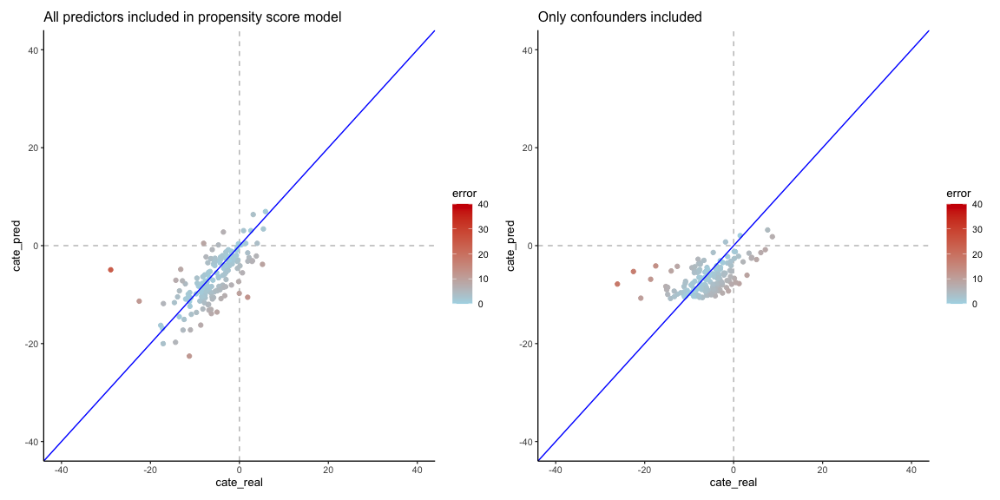

Testing restricting confounders for x-learner propensity score model
================
eleanorjackson
25 March, 2024

``` r
library("tidyverse")
library("here")
library("causalToolbox")
library("patchwork")

function_dir <- list.files(here::here("code", "functions"),
                           full.names = TRUE)

sapply(function_dir, source)
```

    ##         /Users/eleanorjackson/Projects/tree/code/functions/assign-treatment.R
    ## value   ?                                                                    
    ## visible FALSE                                                                
    ##         /Users/eleanorjackson/Projects/tree/code/functions/fit-metalearner.R
    ## value   NULL                                                                
    ## visible FALSE                                                               
    ##         /Users/eleanorjackson/Projects/tree/code/functions/sample-data.R
    ## value   ?                                                               
    ## visible FALSE

``` r
one_run <- readRDS(here("data", "derived", "all_runs.rds")) %>%
  filter(assignment == "random",
         prop_not_treated == 0.5,
         n_train == 1000,
         var_omit == FALSE,
         test_plot_location == "random") %>% 
  sample_n(1)
```

``` r
train_plot_list <- pull(one_run$df_train[[1]], description)

  # sample random test
test_data_0 <- one_run$df_assigned[[1]] |>
    dplyr::filter(! description %in% train_plot_list) |>
    dplyr::filter(tr == 0) |>
    dplyr::slice_sample(n = 81)

test_data_1 <- one_run$df_assigned[[1]] |>
    dplyr::filter(! description %in% train_plot_list) |>
    dplyr::filter(tr == 1) |>
    dplyr::slice_sample(n = 81)
  
test_data_random <- dplyr::bind_rows(test_data_0, test_data_1)
```

``` r
feat_list <- c(    "soil_moist_code", "mat_5yr", "soil_carbon_initial",
                   "map_5yr", "altitude", "no_of_stems", "ditch",
                   "volume_pine", "volume_spruce", "volume_birch", 
                   "volume_aspen", "volume_oak", "volume_beech", 
                   "volume_southern_broadleaf", "volume_larch")

df_train_test <- one_run$df_train[[1]]

x_learn <- causalToolbox::X_RF(
      feat = dplyr::select(df_train_test,
                           tidyselect::all_of(feat_list)),
      tr = df_train_test$tr,
      yobs = df_train_test$soil_carbon_obs,
      nthread = 2,
      e.forestry = list(relevant.Variable = 1:3,
                        ntree = 500, replace = TRUE, sample.fraction = 0.5,
                        mtry = 3, nodesizeSpl = 11, nodesizeAvg = 33,
                        nodesizeStrictSpl = 2, nodesizeStrictAvg = 1, splitratio = 1,
                        middleSplit = FALSE, OOBhonest = TRUE))
```

Error thrown is from `testing_data_checker` function in the `Rforestry`
package when we try to use `causalToolbox::EstimateCate`. Let’s try
changing the error to a warning.

``` r
custom_testing_data_checker <- function(object, newdata, hasNas) {
  if(ncol(newdata) != object@processed_dta$numColumns) {
    warning(paste0("newdata has ", ncol(newdata), " but the forest was trained with ",
                object@processed_dta$numColumns, " columns.")
    )
  }
  if(!is.null(object@processed_dta$featNames)) {
    if(!all(names(newdata) == object@processed_dta$featNames)) {
      warning("newdata columns have been reordered so that they match the training feature matrix")
      matchingPositions <- match(object@processed_dta$featNames, names(newdata))
      newdata <- newdata[, matchingPositions]
    }
  }

  # If linear is true we can't predict observations with some features missing.
  if(object@linear && any(is.na(newdata))) {
      stop("linear does not support missing data")
  }
  return(newdata)
}
```

``` r
environment(custom_testing_data_checker) <- asNamespace('Rforestry')
assignInNamespace("testing_data_checker", custom_testing_data_checker, ns = "Rforestry")
```

``` r
cate_x_learn <- causalToolbox::EstimateCate(x_learn,
                                                dplyr::select(test_data_random,
                                                              tidyselect::all_of(feat_list)))
```

    ## Warning in testing_data_checker(object, newdata, object@hasNas): newdata has 15
    ## but the forest was trained with 3 columns.

    ## Warning in testing_data_checker(object, newdata, object@hasNas): newdata
    ## columns have been reordered so that they match the training feature matrix

``` r
x_learn_out <- test_data_random |>
      dplyr::mutate(cate_pred = cate_x_learn,
                    cate_real = soil_carbon_1 - soil_carbon_0)
```

Success!

``` r
one_run$df_out[[1]] %>%
  mutate(error = abs(cate_pred - cate_real)) %>% 
    ggplot(aes(x = cate_real, y = cate_pred, colour = error)) +
    geom_hline(yintercept = 0, colour = "grey", linetype = 2) +
    geom_vline(xintercept = 0, colour = "grey", linetype = 2) +
    geom_point() +
    geom_abline(intercept = 0, slope = 1, colour = "blue") +
    scale_color_gradient(low = "lightblue", high = "red3",
                         limits = c(0, 40)) +
    xlim(-40, 40) +
    ylim(-40, 40) +
  ggtitle("All predictors included in propensity score model") +
  
  x_learn_out %>%
  mutate(error = abs(cate_pred - cate_real)) %>% 
    ggplot(aes(x = cate_real, y = cate_pred, colour = error)) +
    geom_hline(yintercept = 0, colour = "grey", linetype = 2) +
    geom_vline(xintercept = 0, colour = "grey", linetype = 2) +
    geom_point() +
    geom_abline(intercept = 0, slope = 1, colour = "blue") +
    scale_color_gradient(low = "lightblue", high = "red3",
                         limits = c(0, 40)) +
    xlim(-40, 40) +
    ylim(-40, 40) +
  ggtitle("Only confounders included")
```

<!-- -->

``` r
yardstick::rmse_vec(truth = one_run$df_out[[1]]$cate_real,
                               estimate = one_run$df_out[[1]]$cate_pred)
```

    ## [1] 4.35084

``` r
yardstick::rmse_vec(truth = x_learn_out$cate_real,
                               estimate = x_learn_out$cate_pred)
```

    ## [1] 4.635402

Restricting the confounders has made predictions worse, but maybe not
the case in all scenarios?
