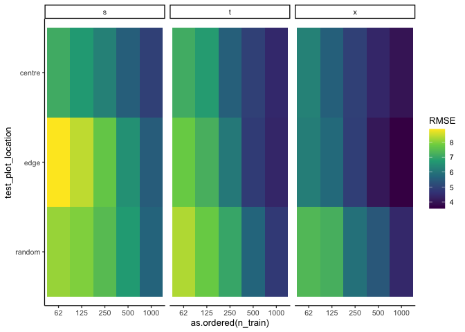
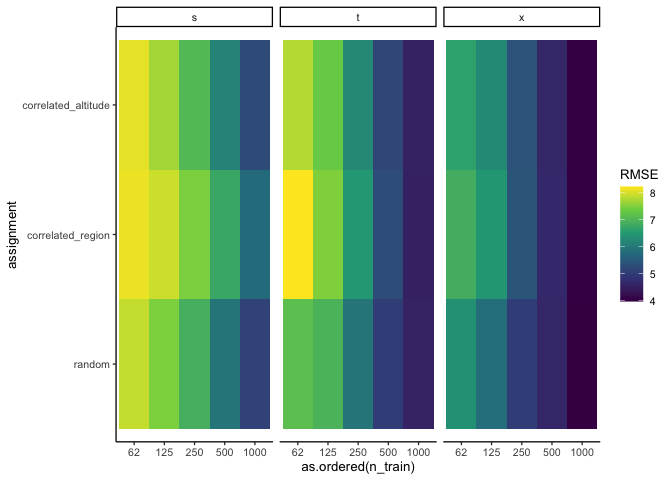
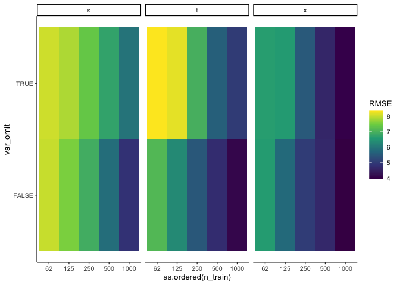
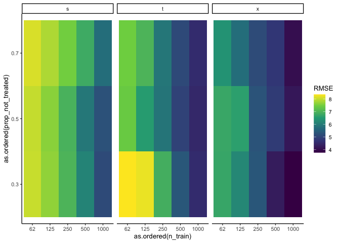

Explore interaction effects
================
eleanorjackson
05 April, 2024

``` r
library("tidyverse")
library("here")
library("patchwork")
```

``` r
results <- readRDS(here("data", "derived", "results.rds")) %>% 
  filter(restrict_confounder == FALSE)
```

``` r
results %>% 
  group_by(n_train, test_plot_location, learner) %>% 
  summarise(RMSE = mean(rmse)) %>% 
  ggplot(aes(as.ordered(n_train), test_plot_location, fill = RMSE)) +
  geom_tile() +
  facet_grid(~ learner, scales = "free_x", space = "free_x") +
  scale_fill_viridis_c()
```

<!-- -->

``` r
results %>% 
  group_by(n_train, assignment, learner) %>% 
  summarise(RMSE = mean(rmse)) %>% 
  ggplot(aes(as.ordered(n_train), assignment, fill = RMSE)) +
  geom_tile() +
  facet_grid(~ learner, scales = "free_x", space = "free_x") +
  scale_fill_viridis_c()
```

<!-- -->

``` r
results %>% 
  group_by(n_train, var_omit, learner) %>% 
  summarise(RMSE = mean(rmse)) %>% 
  ggplot(aes(as.ordered(n_train), var_omit, fill = RMSE)) +
  geom_tile() +
  facet_grid(~ learner, scales = "free_x", space = "free_x") +
  scale_fill_viridis_c()
```

<!-- -->

``` r
results %>% 
  group_by(n_train, prop_not_treated, learner) %>% 
  summarise(RMSE = mean(rmse)) %>% 
  ggplot(aes(as.ordered(n_train), as.ordered(prop_not_treated), fill = RMSE)) +
  geom_tile() +
  facet_grid(~ learner, scales = "free_x", space = "free_x") +
  scale_fill_viridis_c()
```

<!-- -->
