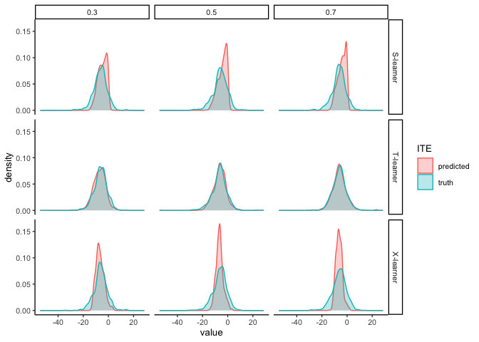

ITE density plots
================
eleanorjackson
06 August, 2024

``` r
library("tidyverse")
library("here")
library("patchwork")
```

``` r
models_out <- readRDS(here("data", "derived", "all_runs.rds")) %>%
  filter(restrict_confounder == FALSE) %>%
  mutate(
    learner = recode_factor(
    learner,
    s = "S-learner",
    t = "T-learner",
    x = "X-learner",
    .ordered = TRUE
  ),
  var_omit = factor(var_omit, levels = c("TRUE", "FALSE"))
  )
```

``` r
plot_data <- models_out %>% 
  filter(assignment == "random") %>% 
  filter(n_train == 1000) %>% 
  filter(var_omit == FALSE) %>% 
  filter(test_plot_location == "random") %>% 
  unnest(df_out)
```

``` r
plot_data %>% 
  rename(predicted = cate_pred,
         truth = cate_real) %>% 
  pivot_longer(cols = c(predicted, truth),
               names_to = "ITE") %>% 
  ggplot(aes(x = value, fill = ITE, colour = ITE)) +
  geom_density(alpha = 0.3) +
  facet_grid(learner ~ prop_not_treated)
```

<!-- -->
