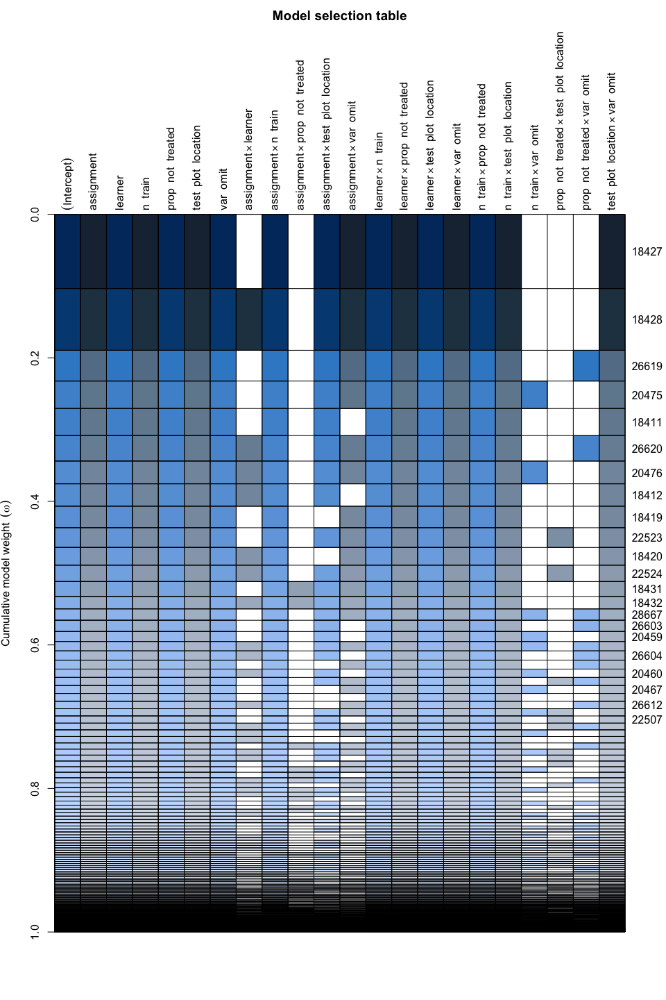

Interaction importance
================
eleanorjackson
14 August, 2024

We need a way to look at interactions so that we can pull out the
important ones and visualise them.

- How to specify and visualise importance of interactions in a RF model?
  - then, if we find Z1:Z2 is an important interaction
  - then we can facet our plots in these ways?
- <https://recipes.tidymodels.org/reference/step_interact.html>
- <https://www.nature.com/articles/s41598-023-30313-8>
  - *Interpretable statistical models, such as generalized additive
    models (GAMs), can offer utility in this regard. However, GAMs do
    not necessarily “find” interactions. They instead test the validity
    of explicitly modeled hypothetical interactions. This frequently
    requires exhaustive model selection to identify and verify critical
    interactions driving model behavior. This can be particularly
    challenging with a large numbers of smoothing parameters, with
    highly interactive input parameters, when statistical power is
    limited, or when smoothing in higher dimensions (however, see
    Discussion for more on the utility of GAMs).*
- maybe just try doing a glm & dredge with MuMIn?

``` r
library("tidyverse")
library("here")
library("patchwork")
library("MuMIn")
```

``` r
results <- 
  readRDS(here("data", "derived", "results.rds")) %>% 
  filter(restrict_confounder == FALSE)
```

``` r
global_mod <- 
  glm(rmse ~ (assignment + prop_not_treated + 
      test_plot_location + n_train + var_omit + learner)^2,
      data = results,
      na.action = "na.fail")
```

``` r
dredge_out <- 
  MuMIn::dredge(global_mod,
              fixed = c("learner", "assignment", "prop_not_treated", 
                        "test_plot_location", "n_train", "var_omit"))
```

    ## Fixed terms are "learner", "assignment", "prop_not_treated", "test_plot_location", "n_train", "var_omit" and "(Intercept)"

``` r
plot(dredge_out)
```

<!-- -->

In this plot, rows are different models and columns are terms.

``` r
dredge_out[1:10,]
```

    ## Global model call: glm(formula = rmse ~ (assignment + prop_not_treated + test_plot_location + 
    ##     n_train + var_omit + learner)^2, data = results, na.action = "na.fail")
    ## ---
    ## Model selection table 
    ##       (Int) ass lrn     n_trn prp_not_trt tst_plt_lct var_omt ass:lrn ass:n_trn
    ## 18427 7.783   +   + -0.003833      0.1940           +       +                 +
    ## 18428 7.764   +   + -0.003833      0.1940           +       +       +         +
    ## 26619 7.754   +   + -0.003833      0.2508           +       +                 +
    ## 20475 7.778   +   + -0.003822      0.1940           +       +                 +
    ## 18411 7.721   +   + -0.003833      0.1940           +       +                 +
    ## 26620 7.736   +   + -0.003833      0.2508           +       +       +         +
    ## 20476 7.760   +   + -0.003822      0.1940           +       +       +         +
    ## 18412 7.702   +   + -0.003833      0.1940           +       +       +         +
    ## 18419 7.805   +   + -0.003833      0.1940           +       +                 +
    ## 22523 7.800   +   + -0.003833      0.1594           +       +                 +
    ##       ass:tst_plt_lct ass:var_omt lrn:n_trn lrn:prp_not_trt lrn:tst_plt_lct
    ## 18427               +           +         +               +               +
    ## 18428               +           +         +               +               +
    ## 26619               +           +         +               +               +
    ## 20475               +           +         +               +               +
    ## 18411               +                     +               +               +
    ## 26620               +           +         +               +               +
    ## 20476               +           +         +               +               +
    ## 18412               +                     +               +               +
    ## 18419                           +         +               +               +
    ## 22523               +           +         +               +               +
    ##       lrn:var_omt n_trn:prp_not_trt n_trn:tst_plt_lct n_trn:var_omt
    ## 18427           +          0.002154                 +              
    ## 18428           +          0.002154                 +              
    ## 26619           +          0.002154                 +              
    ## 20475           +          0.002154                 +             +
    ## 18411           +          0.002154                 +              
    ## 26620           +          0.002154                 +              
    ## 20476           +          0.002154                 +             +
    ## 18412           +          0.002154                 +              
    ## 18419           +          0.002154                 +              
    ## 22523           +          0.002154                 +              
    ##       prp_not_trt:tst_plt_lct prp_not_trt:var_omt tst_plt_lct:var_omt df
    ## 18427                                                               + 34
    ## 18428                                                               + 38
    ## 26619                                           +                   + 35
    ## 20475                                                               + 35
    ## 18411                                                               + 32
    ## 26620                                           +                   + 39
    ## 20476                                                               + 39
    ## 18412                                                               + 36
    ## 18419                                                               + 30
    ## 22523                       +                                       + 36
    ##          logLik    AICc delta weight
    ## 18427 -6250.468 12569.5  0.00  0.223
    ## 18428 -6246.582 12569.9  0.37  0.185
    ## 26619 -6250.332 12571.3  1.76  0.092
    ## 20475 -6250.447 12571.5  1.99  0.082
    ## 18411 -6253.510 12571.5  2.02  0.081
    ## 26620 -6246.446 12571.7  2.14  0.076
    ## 20476 -6246.561 12571.9  2.37  0.068
    ## 18412 -6249.630 12571.9  2.40  0.067
    ## 18419 -6255.774 12572.0  2.48  0.065
    ## 22523 -6249.760 12572.2  2.66  0.059
    ## Models ranked by AICc(x)
