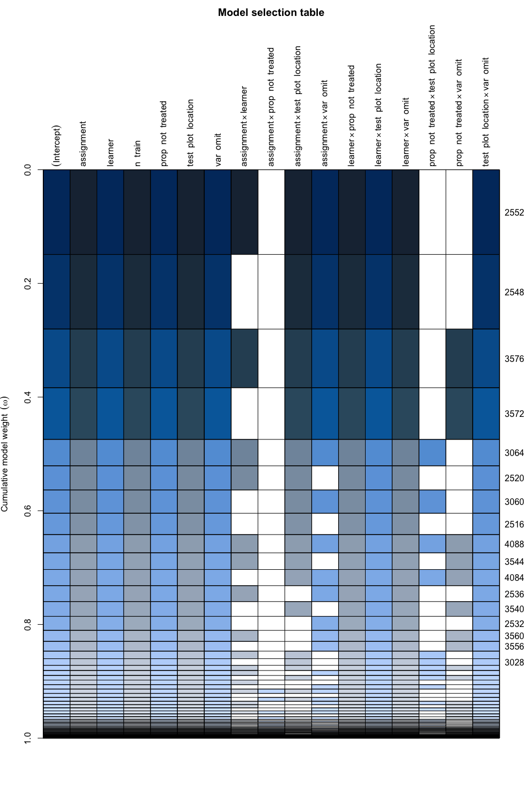

Interaction importance
================
eleanorjackson
19 August, 2024

We need a way to look at interactions so that we can pull out the
important ones and visualise them.

- How to specify and visualise importance of interactions in a RF model?
  - then, if we find Z1:Z2 is an important interaction
  - then we can facet our plots in these ways?
- <https://recipes.tidymodels.org/reference/step_interact.html>
- <https://www.nature.com/articles/s41598-023-30313-8>
  - *Interpretable statistical models, such as generalized additive
    models (GAMs), can offer utility in this regard. However, GAMs do
    not necessarily “find” interactions. They instead test the validity
    of explicitly modeled hypothetical interactions. This frequently
    requires exhaustive model selection to identify and verify critical
    interactions driving model behavior. This can be particularly
    challenging with a large numbers of smoothing parameters, with
    highly interactive input parameters, when statistical power is
    limited, or when smoothing in higher dimensions (however, see
    Discussion for more on the utility of GAMs).*
- maybe just try doing a glm & dredge with MuMIn?

``` r
library("tidyverse")
library("here")
library("patchwork")
library("MuMIn")
library("DHARMa")
library("jtools")
library("effects")
```

``` r
results <- 
  readRDS(here("data", "derived", "results.rds")) %>% 
  filter(restrict_confounder == FALSE) %>% 
  mutate(n_train = as.ordered(n_train),
         prop_not_treated = as.ordered(prop_not_treated))
```

``` r
global_mod <- 
  glm(rmse ~ n_train + (assignment + prop_not_treated + 
      test_plot_location + var_omit + learner)^2,
      data = results,
      na.action = "na.fail")
```

Removed `n_train` interactions as they don’t seem to be important.

``` r
dredge_out <- 
  MuMIn::dredge(global_mod,
              fixed = c("learner", "test_plot_location", "n_train", "var_omit"))
```

    ## Fixed terms are "learner", "test_plot_location", "n_train", "var_omit" and "(Intercept)"

Removed `prop_not_treated` and `assignment` from the list of fixed
terms, as the RF thought they weren’t very important - don’t force them
into the model.

``` r
plot(dredge_out)
```

<!-- -->

In this plot, rows are different models and columns are terms.

``` r
dredge_out[1:10,]
```

    ## Global model call: glm(formula = rmse ~ n_train + (assignment + prop_not_treated + 
    ##     test_plot_location + var_omit + learner)^2, data = results, 
    ##     na.action = "na.fail")
    ## ---
    ## Model selection table 
    ##      (Int) ass lrn n_trn prp_not_trt tst_plt_lct var_omt ass:lrn
    ## 2552 6.793   +   +     +           +           +       +       +
    ## 2548 6.812   +   +     +           +           +       +        
    ## 3576 6.793   +   +     +           +           +       +       +
    ## 3572 6.812   +   +     +           +           +       +        
    ## 3064 6.793   +   +     +           +           +       +       +
    ## 2520 6.731   +   +     +           +           +       +       +
    ## 3060 6.812   +   +     +           +           +       +        
    ## 2516 6.750   +   +     +           +           +       +        
    ## 4088 6.793   +   +     +           +           +       +       +
    ## 3544 6.731   +   +     +           +           +       +       +
    ##      ass:tst_plt_lct ass:var_omt lrn:prp_not_trt lrn:tst_plt_lct lrn:var_omt
    ## 2552               +           +               +               +           +
    ## 2548               +           +               +               +           +
    ## 3576               +           +               +               +           +
    ## 3572               +           +               +               +           +
    ## 3064               +           +               +               +           +
    ## 2520               +                           +               +           +
    ## 3060               +           +               +               +           +
    ## 2516               +                           +               +           +
    ## 4088               +           +               +               +           +
    ## 3544               +                           +               +           +
    ##      prp_not_trt:tst_plt_lct prp_not_trt:var_omt tst_plt_lct:var_omt df
    ## 2552                                                               + 37
    ## 2548                                                               + 33
    ## 3576                                           +                   + 39
    ## 3572                                           +                   + 35
    ## 3064                       +                                       + 41
    ## 2520                                                               + 35
    ## 3060                       +                                       + 37
    ## 2516                                                               + 31
    ## 4088                       +                   +                   + 43
    ## 3544                                           +                   + 37
    ##         logLik    AICc delta weight
    ## 2552 -6090.033 12254.8  0.00  0.212
    ## 2548 -6094.231 12255.0  0.25  0.187
    ## 3576 -6088.363 12255.5  0.74  0.147
    ## 3572 -6092.564 12255.8  0.99  0.129
    ## 3064 -6087.119 12257.1  2.33  0.066
    ## 2520 -6093.326 12257.3  2.51  0.060
    ## 3060 -6091.323 12257.3  2.58  0.058
    ## 2516 -6097.518 12257.5  2.76  0.053
    ## 4088 -6085.446 12257.8  3.07  0.046
    ## 3544 -6091.658 12258.0  3.25  0.042
    ## Models ranked by AICc(x)

Check fit of the best model:

``` r
best_mod <- 
  get.models(dredge_out, subset = 1)[[1]]

simulateResiduals(best_mod, n = 200, plot = T, integerResponse = F)
```

<!-- -->

    ## Object of Class DHARMa with simulated residuals based on 200 simulations with refit = FALSE . See ?DHARMa::simulateResiduals for help. 
    ##  
    ## Scaled residual values: 0.355 0.09 0.315 0.36 0.3 0.455 0.16 0.34 0.06 0.145 0.53 0.035 0.26 0.42 0.28 0.345 0.41 0.31 0.255 0.52 ...

The fit is bad.

Get nice summary output:

``` r
lm(best_mod$formula, data = results, 
    na.action = "na.fail") -> best_mod_lm

jtools::summ(best_mod_lm)
```

<table class="table table-striped table-hover table-condensed table-responsive" style="width: auto !important; margin-left: auto; margin-right: auto;">
<tbody>
<tr>
<td style="text-align:left;font-weight: bold;">
Observations
</td>
<td style="text-align:right;">
4050
</td>
</tr>
<tr>
<td style="text-align:left;font-weight: bold;">
Dependent variable
</td>
<td style="text-align:right;">
rmse
</td>
</tr>
<tr>
<td style="text-align:left;font-weight: bold;">
Type
</td>
<td style="text-align:right;">
OLS linear regression
</td>
</tr>
</tbody>
</table>
<table class="table table-striped table-hover table-condensed table-responsive" style="width: auto !important; margin-left: auto; margin-right: auto;">
<tbody>
<tr>
<td style="text-align:left;font-weight: bold;">
F(35,4014)
</td>
<td style="text-align:right;">
196.86
</td>
</tr>
<tr>
<td style="text-align:left;font-weight: bold;">
R²
</td>
<td style="text-align:right;">
0.63
</td>
</tr>
<tr>
<td style="text-align:left;font-weight: bold;">
Adj. R²
</td>
<td style="text-align:right;">
0.63
</td>
</tr>
</tbody>
</table>
<table class="table table-striped table-hover table-condensed table-responsive" style="width: auto !important; margin-left: auto; margin-right: auto;border-bottom: 0;">
<thead>
<tr>
<th style="text-align:left;">
</th>
<th style="text-align:right;">
Est.
</th>
<th style="text-align:right;">
S.E.
</th>
<th style="text-align:right;">
t val.
</th>
<th style="text-align:right;">
p
</th>
</tr>
</thead>
<tbody>
<tr>
<td style="text-align:left;font-weight: bold;">
(Intercept)
</td>
<td style="text-align:right;">
6.79
</td>
<td style="text-align:right;">
0.09
</td>
<td style="text-align:right;">
77.55
</td>
<td style="text-align:right;">
0.00
</td>
</tr>
<tr>
<td style="text-align:left;font-weight: bold;">
assignmentcorrelated_region
</td>
<td style="text-align:right;">
0.51
</td>
<td style="text-align:right;">
0.10
</td>
<td style="text-align:right;">
4.94
</td>
<td style="text-align:right;">
0.00
</td>
</tr>
<tr>
<td style="text-align:left;font-weight: bold;">
assignmentcorrelated_altitude
</td>
<td style="text-align:right;">
0.11
</td>
<td style="text-align:right;">
0.10
</td>
<td style="text-align:right;">
1.03
</td>
<td style="text-align:right;">
0.31
</td>
</tr>
<tr>
<td style="text-align:left;font-weight: bold;">
prop_not_treated.L
</td>
<td style="text-align:right;">
0.29
</td>
<td style="text-align:right;">
0.05
</td>
<td style="text-align:right;">
5.64
</td>
<td style="text-align:right;">
0.00
</td>
</tr>
<tr>
<td style="text-align:left;font-weight: bold;">
prop_not_treated.Q
</td>
<td style="text-align:right;">
0.20
</td>
<td style="text-align:right;">
0.05
</td>
<td style="text-align:right;">
3.86
</td>
<td style="text-align:right;">
0.00
</td>
</tr>
<tr>
<td style="text-align:left;font-weight: bold;">
learnert
</td>
<td style="text-align:right;">
-0.84
</td>
<td style="text-align:right;">
0.10
</td>
<td style="text-align:right;">
-8.18
</td>
<td style="text-align:right;">
0.00
</td>
</tr>
<tr>
<td style="text-align:left;font-weight: bold;">
learnerx
</td>
<td style="text-align:right;">
-0.91
</td>
<td style="text-align:right;">
0.10
</td>
<td style="text-align:right;">
-8.84
</td>
<td style="text-align:right;">
0.00
</td>
</tr>
<tr>
<td style="text-align:left;font-weight: bold;">
n_train.L
</td>
<td style="text-align:right;">
-2.32
</td>
<td style="text-align:right;">
0.04
</td>
<td style="text-align:right;">
-60.51
</td>
<td style="text-align:right;">
0.00
</td>
</tr>
<tr>
<td style="text-align:left;font-weight: bold;">
n_train.Q
</td>
<td style="text-align:right;">
-0.17
</td>
<td style="text-align:right;">
0.04
</td>
<td style="text-align:right;">
-4.33
</td>
<td style="text-align:right;">
0.00
</td>
</tr>
<tr>
<td style="text-align:left;font-weight: bold;">
n_train.C
</td>
<td style="text-align:right;">
0.18
</td>
<td style="text-align:right;">
0.04
</td>
<td style="text-align:right;">
4.62
</td>
<td style="text-align:right;">
0.00
</td>
</tr>
<tr>
<td style="text-align:left;font-weight: bold;">
n_train^4
</td>
<td style="text-align:right;">
-0.04
</td>
<td style="text-align:right;">
0.04
</td>
<td style="text-align:right;">
-0.95
</td>
<td style="text-align:right;">
0.34
</td>
</tr>
<tr>
<td style="text-align:left;font-weight: bold;">
test_plot_locationedge
</td>
<td style="text-align:right;">
0.10
</td>
<td style="text-align:right;">
0.10
</td>
<td style="text-align:right;">
0.98
</td>
<td style="text-align:right;">
0.33
</td>
</tr>
<tr>
<td style="text-align:left;font-weight: bold;">
test_plot_locationcentre
</td>
<td style="text-align:right;">
-1.16
</td>
<td style="text-align:right;">
0.10
</td>
<td style="text-align:right;">
-11.26
</td>
<td style="text-align:right;">
0.00
</td>
</tr>
<tr>
<td style="text-align:left;font-weight: bold;">
var_omitTRUE
</td>
<td style="text-align:right;">
0.26
</td>
<td style="text-align:right;">
0.09
</td>
<td style="text-align:right;">
2.84
</td>
<td style="text-align:right;">
0.00
</td>
</tr>
<tr>
<td style="text-align:left;font-weight: bold;">
assignmentcorrelated_region:learnert
</td>
<td style="text-align:right;">
-0.08
</td>
<td style="text-align:right;">
0.10
</td>
<td style="text-align:right;">
-0.81
</td>
<td style="text-align:right;">
0.42
</td>
</tr>
<tr>
<td style="text-align:left;font-weight: bold;">
assignmentcorrelated_altitude:learnert
</td>
<td style="text-align:right;">
0.10
</td>
<td style="text-align:right;">
0.10
</td>
<td style="text-align:right;">
0.98
</td>
<td style="text-align:right;">
0.33
</td>
</tr>
<tr>
<td style="text-align:left;font-weight: bold;">
assignmentcorrelated_region:learnerx
</td>
<td style="text-align:right;">
-0.22
</td>
<td style="text-align:right;">
0.10
</td>
<td style="text-align:right;">
-2.16
</td>
<td style="text-align:right;">
0.03
</td>
</tr>
<tr>
<td style="text-align:left;font-weight: bold;">
assignmentcorrelated_altitude:learnerx
</td>
<td style="text-align:right;">
0.04
</td>
<td style="text-align:right;">
0.10
</td>
<td style="text-align:right;">
0.37
</td>
<td style="text-align:right;">
0.71
</td>
</tr>
<tr>
<td style="text-align:left;font-weight: bold;">
assignmentcorrelated_region:test_plot_locationedge
</td>
<td style="text-align:right;">
0.07
</td>
<td style="text-align:right;">
0.10
</td>
<td style="text-align:right;">
0.67
</td>
<td style="text-align:right;">
0.50
</td>
</tr>
<tr>
<td style="text-align:left;font-weight: bold;">
assignmentcorrelated_altitude:test_plot_locationedge
</td>
<td style="text-align:right;">
0.00
</td>
<td style="text-align:right;">
0.10
</td>
<td style="text-align:right;">
0.03
</td>
<td style="text-align:right;">
0.97
</td>
</tr>
<tr>
<td style="text-align:left;font-weight: bold;">
assignmentcorrelated_region:test_plot_locationcentre
</td>
<td style="text-align:right;">
-0.24
</td>
<td style="text-align:right;">
0.10
</td>
<td style="text-align:right;">
-2.30
</td>
<td style="text-align:right;">
0.02
</td>
</tr>
<tr>
<td style="text-align:left;font-weight: bold;">
assignmentcorrelated_altitude:test_plot_locationcentre
</td>
<td style="text-align:right;">
-0.04
</td>
<td style="text-align:right;">
0.10
</td>
<td style="text-align:right;">
-0.36
</td>
<td style="text-align:right;">
0.72
</td>
</tr>
<tr>
<td style="text-align:left;font-weight: bold;">
assignmentcorrelated_region:var_omitTRUE
</td>
<td style="text-align:right;">
0.19
</td>
<td style="text-align:right;">
0.08
</td>
<td style="text-align:right;">
2.25
</td>
<td style="text-align:right;">
0.02
</td>
</tr>
<tr>
<td style="text-align:left;font-weight: bold;">
assignmentcorrelated_altitude:var_omitTRUE
</td>
<td style="text-align:right;">
0.18
</td>
<td style="text-align:right;">
0.08
</td>
<td style="text-align:right;">
2.18
</td>
<td style="text-align:right;">
0.03
</td>
</tr>
<tr>
<td style="text-align:left;font-weight: bold;">
prop_not_treated.L:learnert
</td>
<td style="text-align:right;">
-0.76
</td>
<td style="text-align:right;">
0.07
</td>
<td style="text-align:right;">
-10.47
</td>
<td style="text-align:right;">
0.00
</td>
</tr>
<tr>
<td style="text-align:left;font-weight: bold;">
prop_not_treated.Q:learnert
</td>
<td style="text-align:right;">
0.20
</td>
<td style="text-align:right;">
0.07
</td>
<td style="text-align:right;">
2.68
</td>
<td style="text-align:right;">
0.01
</td>
</tr>
<tr>
<td style="text-align:left;font-weight: bold;">
prop_not_treated.L:learnerx
</td>
<td style="text-align:right;">
-0.32
</td>
<td style="text-align:right;">
0.07
</td>
<td style="text-align:right;">
-4.44
</td>
<td style="text-align:right;">
0.00
</td>
</tr>
<tr>
<td style="text-align:left;font-weight: bold;">
prop_not_treated.Q:learnerx
</td>
<td style="text-align:right;">
-0.44
</td>
<td style="text-align:right;">
0.07
</td>
<td style="text-align:right;">
-6.07
</td>
<td style="text-align:right;">
0.00
</td>
</tr>
<tr>
<td style="text-align:left;font-weight: bold;">
learnert:test_plot_locationedge
</td>
<td style="text-align:right;">
-0.87
</td>
<td style="text-align:right;">
0.10
</td>
<td style="text-align:right;">
-8.46
</td>
<td style="text-align:right;">
0.00
</td>
</tr>
<tr>
<td style="text-align:left;font-weight: bold;">
learnerx:test_plot_locationedge
</td>
<td style="text-align:right;">
-1.39
</td>
<td style="text-align:right;">
0.10
</td>
<td style="text-align:right;">
-13.53
</td>
<td style="text-align:right;">
0.00
</td>
</tr>
<tr>
<td style="text-align:left;font-weight: bold;">
learnert:test_plot_locationcentre
</td>
<td style="text-align:right;">
0.14
</td>
<td style="text-align:right;">
0.10
</td>
<td style="text-align:right;">
1.32
</td>
<td style="text-align:right;">
0.19
</td>
</tr>
<tr>
<td style="text-align:left;font-weight: bold;">
learnerx:test_plot_locationcentre
</td>
<td style="text-align:right;">
0.03
</td>
<td style="text-align:right;">
0.10
</td>
<td style="text-align:right;">
0.26
</td>
<td style="text-align:right;">
0.80
</td>
</tr>
<tr>
<td style="text-align:left;font-weight: bold;">
learnert:var_omitTRUE
</td>
<td style="text-align:right;">
0.70
</td>
<td style="text-align:right;">
0.08
</td>
<td style="text-align:right;">
8.36
</td>
<td style="text-align:right;">
0.00
</td>
</tr>
<tr>
<td style="text-align:left;font-weight: bold;">
learnerx:var_omitTRUE
</td>
<td style="text-align:right;">
-0.29
</td>
<td style="text-align:right;">
0.08
</td>
<td style="text-align:right;">
-3.48
</td>
<td style="text-align:right;">
0.00
</td>
</tr>
<tr>
<td style="text-align:left;font-weight: bold;">
test_plot_locationedge:var_omitTRUE
</td>
<td style="text-align:right;">
0.20
</td>
<td style="text-align:right;">
0.08
</td>
<td style="text-align:right;">
2.38
</td>
<td style="text-align:right;">
0.02
</td>
</tr>
<tr>
<td style="text-align:left;font-weight: bold;">
test_plot_locationcentre:var_omitTRUE
</td>
<td style="text-align:right;">
0.36
</td>
<td style="text-align:right;">
0.08
</td>
<td style="text-align:right;">
4.33
</td>
<td style="text-align:right;">
0.00
</td>
</tr>
</tbody>
<tfoot>
<tr>
<td style="padding: 0; " colspan="100%">
<sup></sup> Standard errors: OLS
</td>
</tr>
</tfoot>
</table>

Look at interactions:

``` r
plot(effects::allEffects(best_mod_lm))
```

<!-- -->

We are not sure rmse is useful on its own actually, because:

- Using the rmse, we lose information about whether predictions are
  consistently over or underestimated. We just get a single value for
  the whole distribution of ITE predictions for each training dataset.
- The error is not normally distributed, and can be skewed.

So, we thought about comparing the distributions of the errors from each
training dataset, rather than the rmse to characterise them. Our next
question – how should we compare distributions? Multiple parameters are
required to characterise distributions, and their spread, central
tendency etc. We are interested in the actual values along their range
and how they are distributed.

There seems to be 2 options for clustering:

- Identifying multiple features to describe error distribution per test
  sample
  - but what features should we cluster?
  - mean, min, max? median, quartiles?
    <https://www.westga.edu/academics/research/vrc/assets/docs/describing_distributions_with_numbers_notes.pdf>
  - What about [natural jenks optimal
    values](https://medium.com/analytics-vidhya/jenks-natural-breaks-best-range-finder-algorithm-8d1907192051)
    too? E.g., tell r to identify k jenks breaks, and return the values
    of those? Or another kind of interval?
- Visual assessment of divergence
  - Use Kullback-Leibler divergence as a pair-wise dissimilarity measure
    to characterise differences in error distributions.
  - Then visualise to see clusters
- Other ways?
  - [Wasserstein K-means for clustering probability
    distributions](https://arxiv.org/abs/2209.06975)
  - other measures
    e.g. <https://www.lix.polytechnique.fr/~nielsen/entropy-16-03273.pdf>
