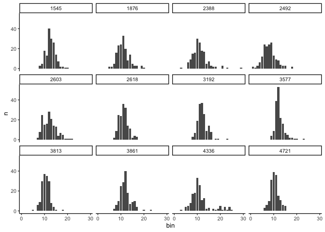
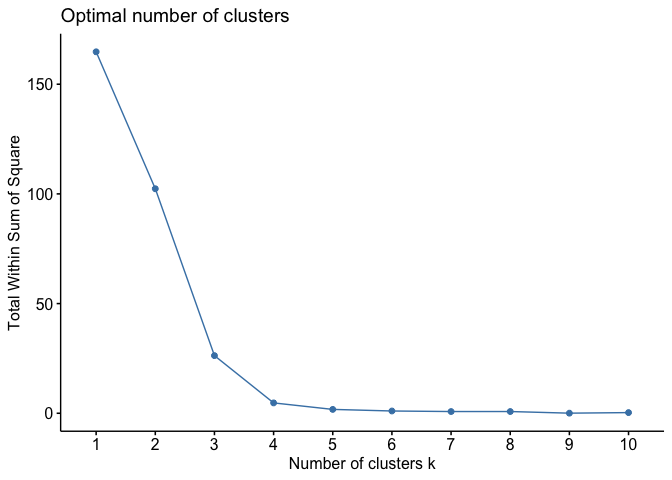
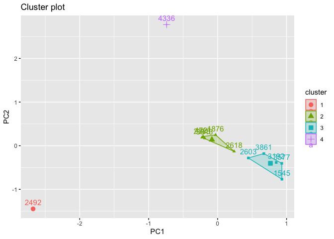
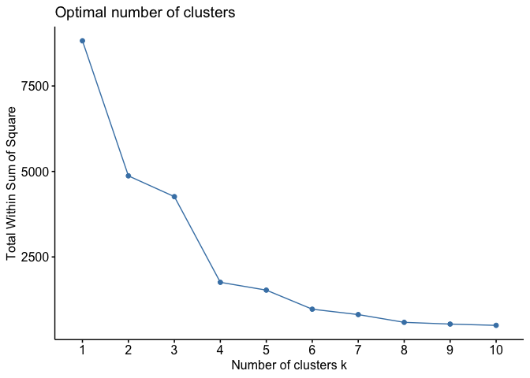
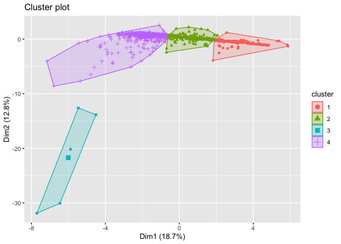
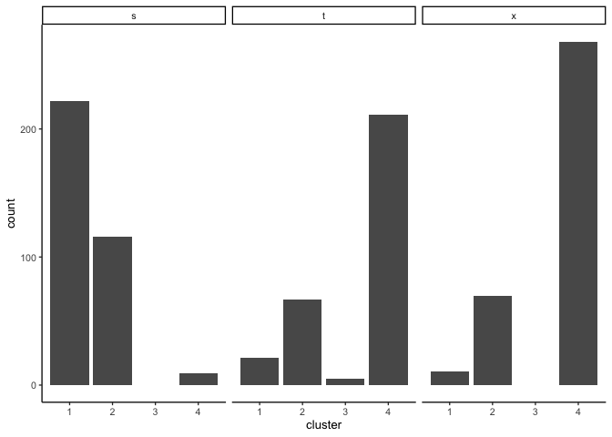
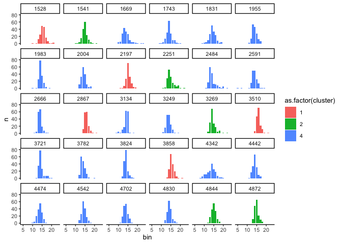

Clustering models by their error distributions
================
eleanorjackson
21 August, 2024

``` r
library("tidyverse")
library("here")
library("patchwork")
library("cluster")
library("factoextra")

set.seed(123)
```

We think that we are losing information by focusing on the RMSE. We just
get a single value for the whole distribution of ITE predictions for
each training dataset. The error is not normally distributed, and can be
skewed.

So, can we compare the distributions of the errors from each training
dataset, rather than using the RMSE to characterise them?

Here, I’m going to try characterising the distributions using bins i.e.
comparing the distributions based on how many values are within certain
ranges (bins). Then, we can turn that into a matrix and use the counts
per bin to cluster on.

Following [this
post](https://medium.com/@zullinira23/implementation-of-principal-component-analysis-pca-on-k-means-clustering-in-r-794f03ec15f)
on implementing PCA on k-means clustering in R.

``` r
all_runs <-
  readRDS(here::here("data", "derived", "all_runs.rds")) %>% 
  filter(restrict_confounder == FALSE) 
```

## Test with sample of 12 models

``` r
sample <-
  all_runs %>% 
  sample_n(12) %>% 
  unnest(df_out)
```

``` r
sample <-
  sample %>% 
  rowwise() %>% 
  mutate(error = cate_pred - cate_real) 
```

``` r
test_bins <- 
  sample %>% 
  select(run_id, error) %>% 
  mutate(bin = cut(error, 
                   breaks = seq(
                     min(sample$error), 
                     max(sample$error), 
                     length.out = 30), 
                   labels = FALSE,
                   include.lowest = TRUE)) %>% 
  group_by(run_id, bin) %>% 
  summarise(n = n()) 
```

    ## `summarise()` has grouped output by 'run_id'. You can override using the
    ## `.groups` argument.

``` r
test_bins %>% 
  ggplot(aes(x = bin, y = n)) +
  geom_col() +
  facet_wrap(~run_id)
```

<!-- -->

``` r
matrix_test <- 
  test_bins %>% 
  pivot_wider(id_cols = run_id,
              names_from = bin,
              values_from = n) %>% 
  column_to_rownames("run_id") %>% 
  mutate(across(everything(), \(x) replace_na(x, 0)))

glimpse(matrix_test)
```

    ## Rows: 12
    ## Columns: 26
    ## $ `8`  <int> 3, 16, 15, 24, 8, 9, 3, 0, 9, 6, 17, 10
    ## $ `9`  <int> 5, 23, 16, 26, 25, 25, 7, 4, 30, 10, 18, 31
    ## $ `10` <int> 18, 24, 30, 13, 15, 24, 19, 9, 37, 25, 33, 39
    ## $ `11` <int> 13, 33, 26, 9, 16, 36, 36, 39, 35, 29, 26, 36
    ## $ `12` <int> 40, 20, 18, 8, 28, 32, 37, 53, 30, 40, 11, 15
    ## $ `13` <int> 30, 8, 17, 4, 21, 14, 26, 22, 8, 18, 13, 11
    ## $ `14` <int> 26, 14, 5, 3, 14, 11, 9, 16, 4, 7, 2, 6
    ## $ `15` <int> 14, 5, 7, 3, 13, 2, 14, 7, 1, 9, 3, 5
    ## $ `16` <int> 7, 3, 3, 0, 4, 4, 8, 5, 0, 10, 0, 0
    ## $ `17` <int> 2, 3, 2, 0, 7, 3, 0, 2, 0, 4, 2, 0
    ## $ `18` <int> 2, 0, 2, 2, 5, 0, 1, 2, 1, 0, 1, 0
    ## $ `19` <int> 1, 3, 0, 0, 1, 0, 1, 1, 0, 0, 2, 0
    ## $ `20` <int> 1, 1, 0, 0, 1, 0, 0, 1, 0, 1, 5, 0
    ## $ `5`  <int> 0, 2, 0, 12, 0, 0, 0, 0, 1, 0, 4, 0
    ## $ `6`  <int> 0, 2, 6, 24, 0, 0, 0, 0, 0, 0, 5, 3
    ## $ `7`  <int> 0, 5, 9, 22, 2, 2, 0, 0, 6, 2, 8, 6
    ## $ `3`  <int> 0, 0, 1, 3, 0, 0, 0, 0, 0, 0, 1, 0
    ## $ `21` <int> 0, 0, 3, 0, 1, 0, 0, 0, 0, 0, 1, 0
    ## $ `23` <int> 0, 0, 1, 0, 0, 0, 1, 1, 0, 1, 1, 0
    ## $ `29` <int> 0, 0, 1, 0, 0, 0, 0, 0, 0, 0, 0, 0
    ## $ `1`  <int> 0, 0, 0, 2, 0, 0, 0, 0, 0, 0, 0, 0
    ## $ `2`  <int> 0, 0, 0, 1, 0, 0, 0, 0, 0, 0, 0, 0
    ## $ `4`  <int> 0, 0, 0, 6, 0, 0, 0, 0, 0, 0, 0, 0
    ## $ `22` <int> 0, 0, 0, 0, 1, 0, 0, 0, 0, 0, 4, 0
    ## $ `24` <int> 0, 0, 0, 0, 0, 0, 0, 0, 0, 0, 4, 0
    ## $ `25` <int> 0, 0, 0, 0, 0, 0, 0, 0, 0, 0, 1, 0

``` r
pca_test <- prcomp(matrix_test, 
                   center = TRUE,
                   scale = TRUE)

summary(pca_test)
```

    ## Importance of components:
    ##                           PC1    PC2    PC3     PC4     PC5     PC6    PC7
    ## Standard deviation     3.1469 2.2531 1.9397 1.59359 1.41502 0.92147 0.8609
    ## Proportion of Variance 0.3809 0.1953 0.1447 0.09767 0.07701 0.03266 0.0285
    ## Cumulative Proportion  0.3809 0.5761 0.7208 0.81853 0.89554 0.92820 0.9567
    ##                            PC8     PC9    PC10    PC11      PC12
    ## Standard deviation     0.76225 0.61994 0.33462 0.22016 2.969e-16
    ## Proportion of Variance 0.02235 0.01478 0.00431 0.00186 0.000e+00
    ## Cumulative Proportion  0.97905 0.99383 0.99814 1.00000 1.000e+00

``` r
# take PCA1 and PCA2
matrix_test_transform <- as.data.frame(-pca_test$x[,1:2])
```

``` r
fviz_nbclust(matrix_test_transform, kmeans, method = 'wss')
```

<!-- -->

``` r
kmeans(matrix_test_transform, 4) -> kmeans_test

fviz_cluster(kmeans_test, data = matrix_test_transform)
```

<!-- -->

## More data

Takes forever when I use the full dataset (4,050 runs), so for now just
doing 1,000.

``` r
all_runs_errors <-
  all_runs %>% 
  sample_n(1000) %>% 
  unnest(df_out) %>% 
  rowwise() %>% 
  mutate(error = cate_pred - cate_real) 
```

``` r
all_runs_errors %>% 
  select(run_id, error) %>% 
  mutate(bin = cut(error, 
                   breaks = seq(min(all_runs_errors$error), 
                                max(all_runs_errors$error), 
                                length.out = 30), 
                   labels = FALSE,
                   include.lowest = TRUE)) %>% 
  group_by(run_id, bin) %>% 
  summarise(n = n()) -> all_runs_bins
```

    ## `summarise()` has grouped output by 'run_id'. You can override using the
    ## `.groups` argument.

``` r
matrix <- 
  all_runs_bins %>% 
  pivot_wider(id_cols = run_id,
              names_from = bin,
              values_from = n) %>% 
  column_to_rownames("run_id") %>% 
  mutate(across(everything(), \(x) replace_na(x, 0)))
```

``` r
pca <- prcomp(matrix, center = TRUE, scale = TRUE)
summary(pca)
```

    ## Importance of components:
    ##                           PC1    PC2    PC3    PC4     PC5     PC6     PC7
    ## Standard deviation     2.2886 1.8952 1.8020 1.4626 1.22268 1.11263 1.04426
    ## Proportion of Variance 0.1871 0.1283 0.1160 0.0764 0.05339 0.04421 0.03895
    ## Cumulative Proportion  0.1871 0.3153 0.4313 0.5077 0.56111 0.60532 0.64427
    ##                            PC8     PC9   PC10    PC11    PC12   PC13    PC14
    ## Standard deviation     1.02453 1.00484 0.9828 0.95918 0.88991 0.8791 0.82928
    ## Proportion of Variance 0.03749 0.03606 0.0345 0.03286 0.02828 0.0276 0.02456
    ## Cumulative Proportion  0.68176 0.71782 0.7523 0.78517 0.81346 0.8411 0.86562
    ##                           PC15    PC16    PC17    PC18    PC19    PC20    PC21
    ## Standard deviation     0.71467 0.66213 0.62898 0.61545 0.61042 0.59114 0.55135
    ## Proportion of Variance 0.01824 0.01566 0.01413 0.01353 0.01331 0.01248 0.01086
    ## Cumulative Proportion  0.88386 0.89952 0.91365 0.92718 0.94048 0.95296 0.96382
    ##                           PC22    PC23    PC24    PC25    PC26    PC27
    ## Standard deviation     0.50875 0.45232 0.39891 0.37927 0.36053 0.34154
    ## Proportion of Variance 0.00924 0.00731 0.00568 0.00514 0.00464 0.00417
    ## Cumulative Proportion  0.97306 0.98037 0.98605 0.99119 0.99583 1.00000
    ##                             PC28
    ## Standard deviation     1.045e-15
    ## Proportion of Variance 0.000e+00
    ## Cumulative Proportion  1.000e+00

``` r
matrix_transform <- as.data.frame(-pca$x[,1:2])
```

``` r
fviz_nbclust(matrix_transform, kmeans, method = 'wss')
```

<!-- -->

``` r
kmeans(matrix_transform, 4) -> clusters

fviz_cluster(clusters, 
             data = matrix,
             geom = "point")
```

<!-- -->

``` r
clusters$cluster %>% 
  as_tibble(rownames = "run_id") %>%  
  mutate(run_id = as.integer(run_id)) %>% 
  rename(cluster = value) %>% 
  left_join(all_runs) -> all_runs_c
```

    ## Joining with `by = join_by(run_id)`

``` r
all_runs_c %>% 
  ggplot(aes(x = cluster)) +
  geom_bar() +
  facet_wrap(~learner)
```

<!-- -->

``` r
clusters$cluster %>% 
  as_tibble(rownames = "run_id") %>%  
  mutate(run_id = as.integer(run_id)) %>% 
  rename(cluster = value) %>% 
  left_join(all_runs_bins)-> all_runs_b
```

    ## Joining with `by = join_by(run_id)`

``` r
glimpse(all_runs_b)
```

    ## Rows: 8,456
    ## Columns: 4
    ## $ run_id  <int> 1358, 1358, 1358, 1358, 1358, 1358, 1358, 1358, 1359, 1359, 13…
    ## $ cluster <int> 1, 1, 1, 1, 1, 1, 1, 1, 1, 1, 1, 1, 1, 1, 1, 1, 1, 1, 1, 1, 1,…
    ## $ bin     <int> 12, 13, 14, 15, 16, 17, 18, 19, 12, 13, 14, 15, 16, 17, 18, 19…
    ## $ n       <int> 2, 9, 23, 43, 39, 25, 13, 8, 1, 9, 28, 51, 37, 22, 10, 3, 1, 9…

``` r
all_runs_b %>% 
  mutate(run_id = as.factor(run_id)) %>% 
  filter(run_id %in% sample(levels(run_id), 30)) %>% 
  ggplot(aes(x = bin, y = n, fill = as.factor(cluster))) +
  geom_col() +
  facet_wrap(~run_id)
```

<!-- -->
