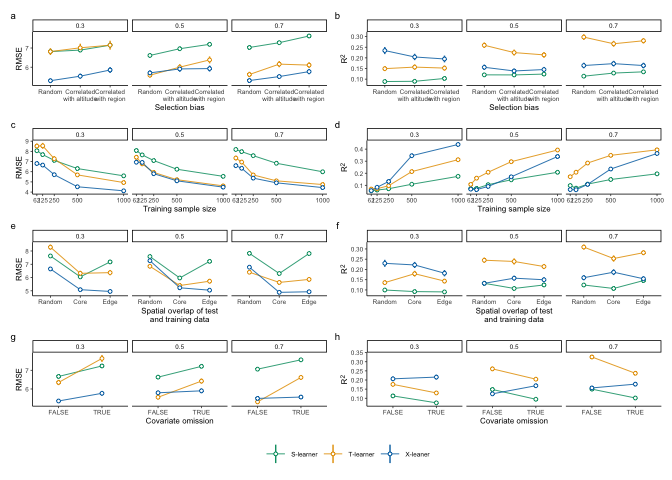

Treatment imbalance interations
================
user
27 November, 2025

Make figure 1 but facet by treatment imbalance to look for interactions.

``` r
library("tidyverse")
library("here")
library("patchwork")
library("yardstick")
library("ggtext")

set.seed(123)
```

``` r
results <- readRDS(here("data", "derived", "results.rds")) %>%
  mutate(
    assignment = recode_factor(
    assignment,
    random = "Random",
    correlated_altitude = "Correlated\nwith altitude",
    correlated_region = "Correlated\nwith region",
    .ordered = TRUE
    ),
    test_plot_location = recode_factor(
      test_plot_location,
      stratified = "Random",
      core = "Core",
      edge = "Edge",
      .ordered = TRUE
    ),
    learner = recode_factor(
      learner,
      s = "S-learner",
      t = "T-learner",
      x = "X-leaner",
      .ordered = TRUE
    ))
```

``` r
# make function -----------------------------------------------------------

plot_rmse <- function(data,
                      y_var, y_lab,
                      x_var, x_lab,
                      x_breaks = wavier(),
                      x_cont = FALSE) {
  if (x_cont == TRUE) {
    data %>%
      ggplot(aes(x = x_var, y = y_var, colour = learner)) +
      stat_summary(fun = mean,
                   geom = "line",
                   linewidth = 0.3) +
      stat_summary(
        geom = "pointrange",
        size = 0.25,
        fill = "white",
        shape = 21,
        stroke = 0.5,
        linewidth = 0.5
      ) +
      scale_colour_manual(values = c("#009E73", "#E69F00", "#0072B2")) +
      scale_x_continuous(breaks = x_breaks) +
      xlab(x_lab) +
      ylab(y_lab) +
      theme_classic(base_size = 6) +
      theme(axis.title.y = element_markdown(),
            legend.title = element_blank()) +
      facet_wrap(~prop_not_treated)

  } else if (x_cont == FALSE) {
    data %>%
      ggplot(aes(x = x_var, y = y_var, colour = learner, group = learner)) +
      stat_summary(fun = mean,
                   geom = "line",
                   linewidth = 0.3) +
      stat_summary(
        geom = "pointrange",
        size = 0.25,
        fill = "white",
        shape = 21,
        stroke = 0.5,
        linewidth = 0.5
      ) +
      scale_colour_manual(values = c("#009E73", "#E69F00", "#0072B2")) +
      xlab(x_lab) +
      ylab(y_lab) +
      theme_classic(base_size = 6) +
      theme(axis.title.y = element_markdown(),
            legend.title = element_blank()) +
      facet_wrap(~prop_not_treated)
  }

}
```

``` r
# make plots --------------------------------------------------------------

plot_rmse(data = results,
          y_var = results$rmse,
          y_lab = "RMSE",
          x_var = results$assignment,
          x_lab = "Selection bias") +


  plot_rmse(data = results,
            y_var = results$rsq,
            y_lab = "R<sup>2</sup>",
            x_var = results$assignment,
            x_lab = "Selection bias") +

plot_rmse(data = results,
          y_var = results$rmse,
          y_lab = "RMSE",
          x_var = results$n_train,
          x_lab = "Training sample size",
          x_breaks = c(0, 62, 125, 250, 500, 1000),
          x_cont = TRUE) +

  plot_rmse(data = results,
            y_var = results$rsq,
            y_lab = "R<sup>2</sup>",
            x_var = results$n_train,
            x_lab = "Training sample size",
            x_breaks = c(0, 62, 125, 250, 500, 1000),
            x_cont = TRUE) +

  plot_rmse(data = results,
            y_var = results$rmse,
            y_lab = "RMSE",
            x_var = results$test_plot_location,
            x_lab = "Spatial overlap of test\nand training data") +

  plot_rmse(data = results,
            y_var = results$rsq,
            y_lab = "R<sup>2</sup>",
            x_var = results$test_plot_location,
            x_lab = "Spatial overlap of test\nand training data") +

  plot_rmse(data = results,
            y_var = results$rmse,
            y_lab = "RMSE",
            x_var = results$var_omit,
            x_lab = "Covariate omission") +

  plot_rmse(data = results,
            y_var = results$rsq,
            y_lab = "R<sup>2</sup>",
            x_var = results$var_omit,
            x_lab = "Covariate omission") +

  plot_layout(guides = "collect", ncol = 2) +
  plot_annotation(tag_levels = "a") &
  theme(legend.position = "bottom")
```

<!-- -->
