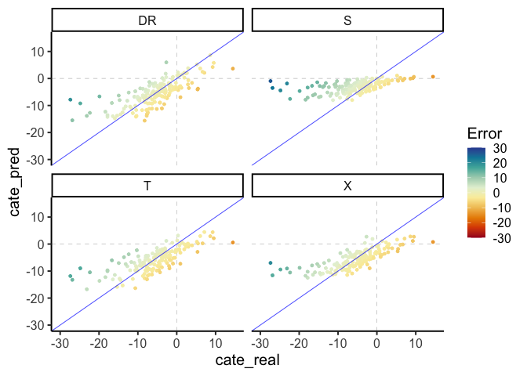

Test output of new DR learner function
================
eleanorjackson
03 July, 2026

``` r
library("tidyverse")
```

    ## ── Attaching core tidyverse packages ──────────────────────── tidyverse 2.0.0 ──
    ## ✔ dplyr     1.1.2     ✔ readr     2.1.4
    ## ✔ forcats   1.0.0     ✔ stringr   1.5.0
    ## ✔ ggplot2   3.5.0     ✔ tibble    3.2.1
    ## ✔ lubridate 1.9.2     ✔ tidyr     1.3.0
    ## ✔ purrr     1.0.2     
    ## ── Conflicts ────────────────────────────────────────── tidyverse_conflicts() ──
    ## ✖ dplyr::filter() masks stats::filter()
    ## ✖ dplyr::lag()    masks stats::lag()
    ## ℹ Use the conflicted package (<http://conflicted.r-lib.org/>) to force all conflicts to become errors

``` r
library("here")
```

    ## here() starts at /Users/user/Library/CloudStorage/OneDrive-Nexus365/tree

``` r
library("patchwork")
library("ggtext")
```

``` r
all_runs <-
  readRDS(here::here("data", "derived", "all_runs_test.rds"))
```

``` r
best_run <- 
  all_runs %>% 
  filter(assignment == "random", 
         prop_not_treated == 0.5,
         n_train == 1000,
         var_omit == FALSE,
         test_plot_location == "stratified")
```

``` r
plot_dat <- 
  best_run %>%
    unnest(df_out) %>%
    mutate(Error = cate_pred - cate_real) %>%
    mutate(learner = str_to_upper(learner)) %>% 
  select(learner, cate_pred, cate_real, Error)
```

``` r
plot_dat %>%
    ggplot(aes(x = cate_real, y = cate_pred, colour = Error)) +
    geom_hline(yintercept = 0, colour = "grey",
               linetype = 2, linewidth = 0.25) +
    geom_vline(xintercept = 0, colour = "grey",
               linetype = 2, linewidth = 0.25) +
    geom_point(size = 1) +
    geom_abline(intercept = 0, slope = 1, colour = "blue", linewidth = 0.25) +
    scale_colour_gradientn(
      colours = colorspace::divergingx_hcl(n = 10, palette = "RdYlBu"),
      limits = c(-30, 30)) +
    xlim(-30, 15) +
    ylim(-30, 15) +
  facet_wrap(~learner)
```

<!-- -->
