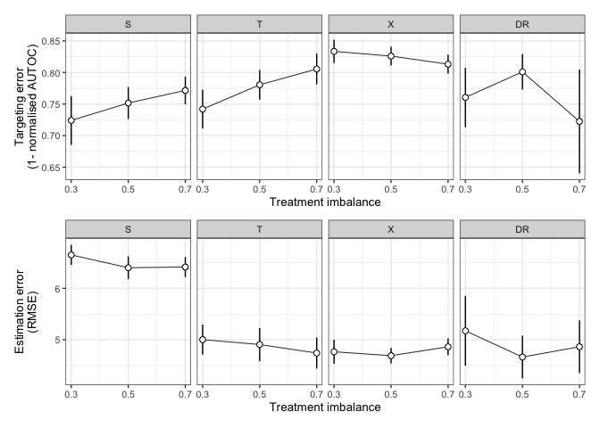

Treat assign
================
eleanorjackson
06 July, 2026

``` r
library("tidyverse")
```

    ## ── Attaching core tidyverse packages ──────────────────────── tidyverse 2.0.0 ──
    ## ✔ dplyr     1.1.2     ✔ readr     2.1.4
    ## ✔ forcats   1.0.0     ✔ stringr   1.5.0
    ## ✔ ggplot2   3.5.0     ✔ tibble    3.2.1
    ## ✔ lubridate 1.9.2     ✔ tidyr     1.3.0
    ## ✔ purrr     1.0.2     
    ## ── Conflicts ────────────────────────────────────────── tidyverse_conflicts() ──
    ## ✖ dplyr::filter() masks stats::filter()
    ## ✖ dplyr::lag()    masks stats::lag()
    ## ℹ Use the conflicted package (<http://conflicted.r-lib.org/>) to force all conflicts to become errors

``` r
library("here")
```

    ## here() starts at /Users/user/Library/CloudStorage/OneDrive-Nexus365/tree

``` r
library("patchwork")
```

``` r
results <- 
  readRDS(here::here("data", "derived", "results.rds")) %>% 
  filter(n_train == 1000, 
         assignment == "random", 
         test_plot_location == "stratified",
         var_omit == "none") %>% 
  mutate( learner = recode_factor(
      learner,
      s = "S",
      t = "T",
      x = "X",
      dr = "DR",
      .ordered = TRUE
    ))
```

``` r
mean_sd <- function(x) {
  data.frame(
    y = mean(x, na.rm = TRUE),
    ymin = mean(x, na.rm = TRUE) - sd(x, na.rm = TRUE),
    ymax = mean(x, na.rm = TRUE) + sd(x, na.rm = TRUE)
  )
}
```

``` r
results %>%
      ggplot(aes(x = prop_not_treated, y = autoc)) +
      stat_summary(fun.data = mean_sd,
                   geom = "line",
                   linewidth = 0.3) +
      stat_summary(
        fun.data = mean_sd,
        geom = "pointrange",
        size = 0.5,
        fill = "white",
        shape = 21,
        stroke = 0.5,
        linewidth = 0.5
      ) +
      scale_x_continuous(breaks = c(0.3, 0.5, 0.7)) +
  labs(y = "Targeting error\n(1- normalised AUTOC)",
       x = "Treatment imbalance") +
      theme_bw(base_size = 10) +
  facet_grid(~learner) +
  results %>%
      ggplot(aes(x = prop_not_treated, y = rmse)) +
      stat_summary(fun.data = mean_sd,
                   geom = "line",
                   linewidth = 0.3) +
      stat_summary(
        fun.data = mean_sd,
        geom = "pointrange",
        size = 0.5,
        fill = "white",
        shape = 21,
        stroke = 0.5,
        linewidth = 0.5
      ) +
      scale_x_continuous(breaks = c(0.3, 0.5, 0.7))  +
  labs(y = "Estimation error\n(RMSE)",
       x = "Treatment imbalance") +
      theme_bw(base_size = 10) +
  facet_grid(~learner) +
  plot_layout(ncol =1)
```

<!-- -->
