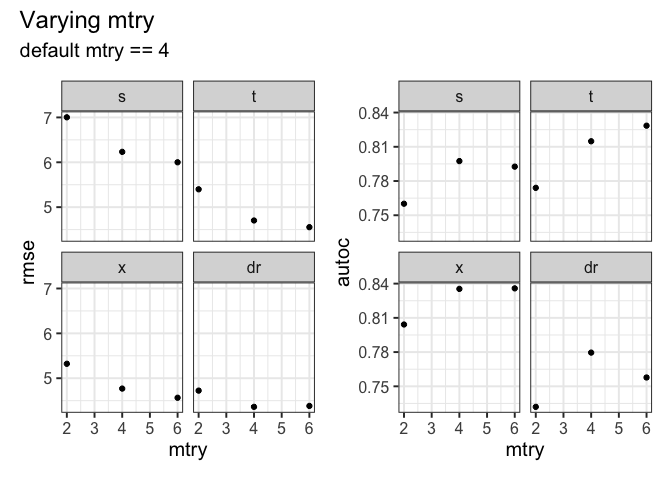
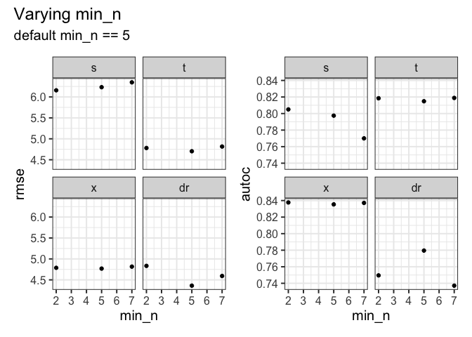

Hyperparameter sensitivity
================
eleanorjackson
07 July, 2026

``` r
library("tidyverse")
```

    ## ── Attaching core tidyverse packages ──────────────────────── tidyverse 2.0.0 ──
    ## ✔ dplyr     1.1.2     ✔ readr     2.1.4
    ## ✔ forcats   1.0.0     ✔ stringr   1.5.0
    ## ✔ ggplot2   3.5.0     ✔ tibble    3.2.1
    ## ✔ lubridate 1.9.2     ✔ tidyr     1.3.0
    ## ✔ purrr     1.0.2     
    ## ── Conflicts ────────────────────────────────────────── tidyverse_conflicts() ──
    ## ✖ dplyr::filter() masks stats::filter()
    ## ✖ dplyr::lag()    masks stats::lag()
    ## ℹ Use the conflicted package (<http://conflicted.r-lib.org/>) to force all conflicts to become errors

``` r
library("ranger")
library("tune")
library("here")
```

    ## here() starts at /Users/user/Library/CloudStorage/OneDrive-Nexus365/tree

``` r
library("patchwork")
```

``` r
function_dir <- list.files(here::here("code", "functions"),
                           full.names = TRUE)

sapply(function_dir, source)
```

    ##         /Users/user/Library/CloudStorage/OneDrive-Nexus365/tree/code/functions/assign-treatment.R
    ## value   ?                                                                                        
    ## visible FALSE                                                                                    
    ##         /Users/user/Library/CloudStorage/OneDrive-Nexus365/tree/code/functions/autoc.R
    ## value   ?                                                                             
    ## visible FALSE                                                                         
    ##         /Users/user/Library/CloudStorage/OneDrive-Nexus365/tree/code/functions/fit-metalearner.R
    ## value   ?                                                                                       
    ## visible FALSE                                                                                   
    ##         /Users/user/Library/CloudStorage/OneDrive-Nexus365/tree/code/functions/morans-i.R
    ## value   ?                                                                                
    ## visible FALSE                                                                            
    ##         /Users/user/Library/CloudStorage/OneDrive-Nexus365/tree/code/functions/qini-coef.R
    ## value   ?                                                                                 
    ## visible FALSE                                                                             
    ##         /Users/user/Library/CloudStorage/OneDrive-Nexus365/tree/code/functions/sample-data.R
    ## value   ?                                                                                   
    ## visible FALSE

``` r
clean_data <-
  readRDS(here::here("data", "derived", "ForManSims_RCP0_same_time_clim_squ.rds"))
```

Varying mtry and min_n, 1 value above and one below our defaults.

Keeping treatment conditions at “best” values.

``` r
keys <- expand.grid(
  assignment = "random",
  prop_not_treated = 0.5,
  n_train = 1000,
  learner = c("s", "t", "x", "dr"),
  var_omit = "none",
  test_plot_location = "stratified",
  trees = 500,
  mtry = c(2, 4, 6),   
  min_n = c(2, 5, 7),         
  num_threads = 1,
  dr_folds = 2,
  trim = 0.01,
  return_model = FALSE
) %>%
  mutate(run_id = row_number())
```

``` r
# assign treatments -------------------------------------------------------

purrr::map(
  .f = assign_treatment,
  .x = as.vector(keys$assignment),
  seed = 20641,
  df_clean = clean_data) -> assigned_data

keys %>%
  mutate(df_assigned = assigned_data) -> keys
```

``` r
# sample training data ----------------------------------------------------

purrr::pmap(list(df_assigned = keys$df_assigned,
                 prop_not_treated = keys$prop_not_treated,
                 n_train = keys$n_train),
            seed = 20641,
            sample_data) -> sample_out

keys %>%
  mutate(df_train = sample_out) -> keys
```

``` r
# fit metalearners --------------------------------------------------------

purrr::pmap(
  list(
    df_train = keys$df_train,
    df_assigned = keys$df_assigned,
    learner = keys$learner,
    var_omit = keys$var_omit,
    test_plot_location = keys$test_plot_location,
    seed = keys$run_id,
    trees = keys$trees,
    mtry = keys$mtry,
    min_n = keys$min_n,
    num_threads = keys$num_threads,
    dr_folds = keys$dr_folds,
    trim = keys$trim,
    return_model = keys$return_model
  ),
  fit_metalearner
) -> model_out

keys %>%
  mutate(df_out = model_out) -> keys
```

``` r
# RMSE --------------------------------------------------------------------

keys <- keys %>%
  mutate(rmse = purrr::map(
    .x = df_out,
    .f = ~ yardstick::rmse_vec(truth = .x$cate_real,
                               estimate = .x$cate_pred)
  )) %>%
  unnest(rmse)
```

``` r
# AUTOC -------------------------------------------------------------------

keys <- keys %>%
  mutate(autoc = purrr::map(
    .x = df_out,
    .f = ~ autoc_norm_vec(truth = .x$cate_real,
                     estimate = .x$cate_pred)
  )) %>%
  unnest(autoc) %>%
  mutate(autoc = 1 - autoc)
```

## Figures

``` r
mean_sd <- function(x) {
  data.frame(
    y = mean(x, na.rm = TRUE),
    ymin = mean(x, na.rm = TRUE) - sd(x, na.rm = TRUE),
    ymax = mean(x, na.rm = TRUE) + sd(x, na.rm = TRUE)
  )
}
```

``` r
keys %>% 
  filter(min_n == 5) %>% 
  ggplot(aes(x = mtry, y = rmse)) +
  geom_point() +
  facet_wrap(~learner) +
  keys %>% 
  filter(min_n == 5) %>% 
  ggplot(aes(x = mtry, y = autoc)) +
  geom_point() +
  facet_wrap(~learner) +
  plot_annotation(title = "Varying mtry",
                  subtitle = "default mtry == 4")
```

<!-- -->

``` r
keys %>% 
  filter(mtry == 4) %>% 
  ggplot(aes(x = min_n, y = rmse)) +
  geom_point() +
  facet_wrap(~learner) +
  keys %>% 
  filter(mtry == 4) %>% 
  ggplot(aes(x = min_n, y = autoc)) +
  geom_point() +
  facet_wrap(~learner) +
  plot_annotation(title = "Varying min_n",
                  subtitle = "default min_n == 5")
```

<!-- -->
